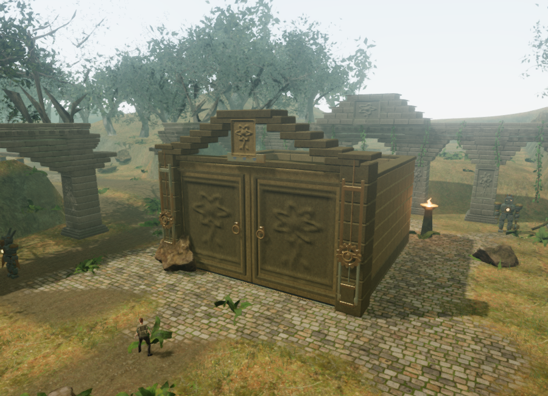
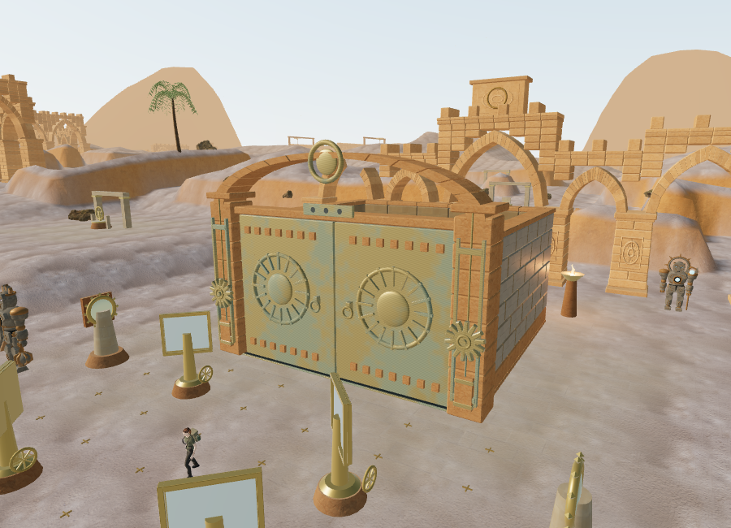
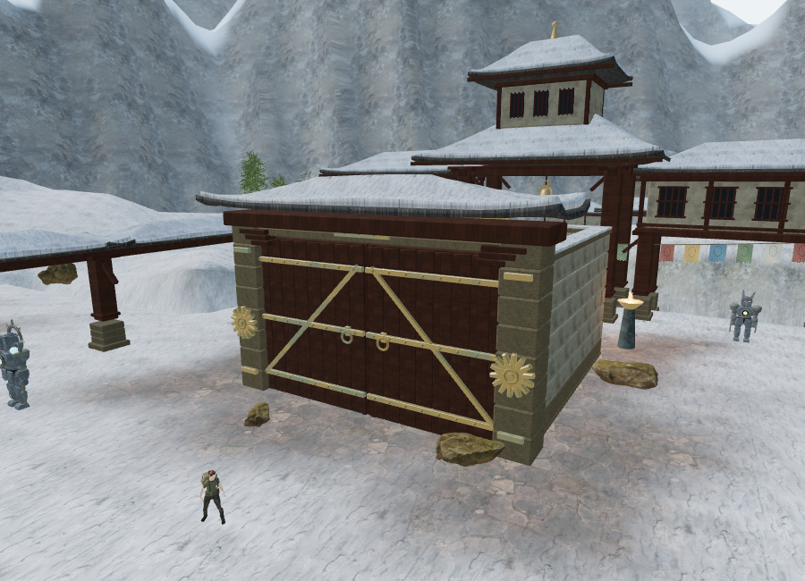
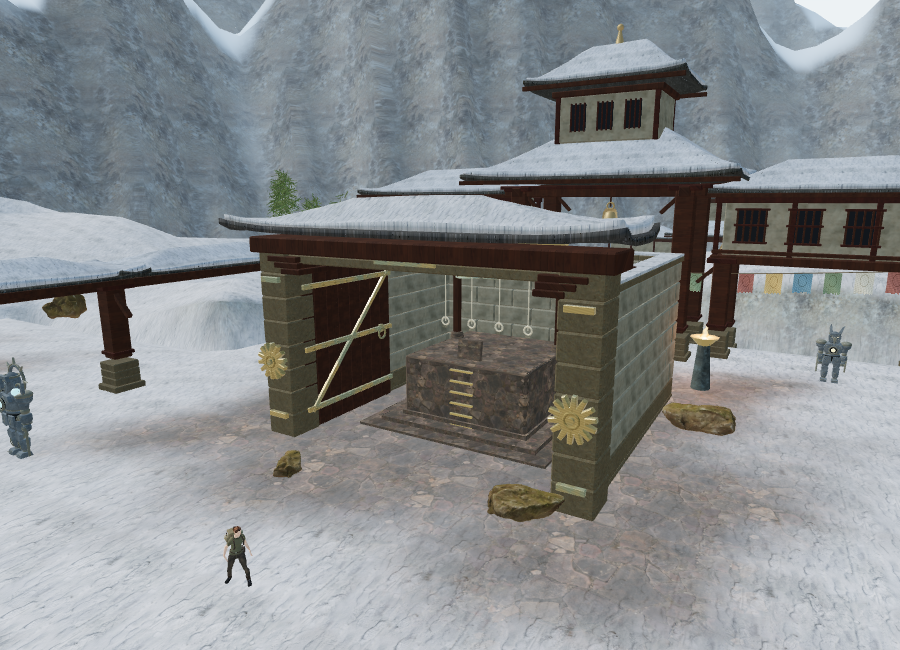
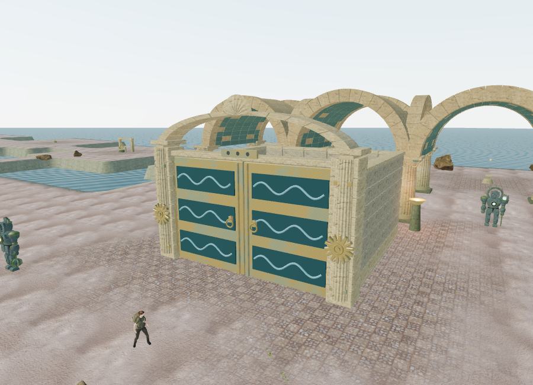
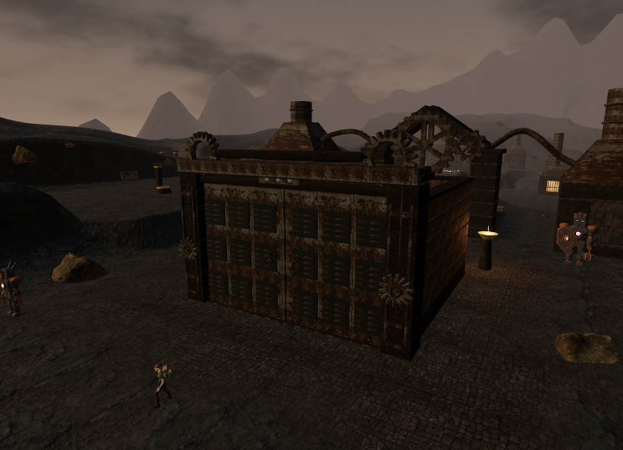
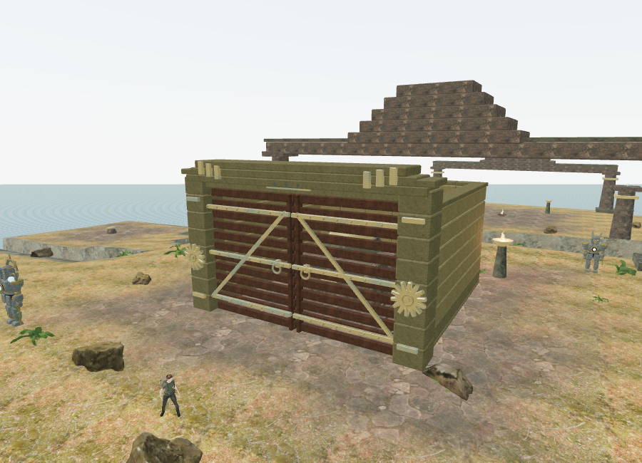
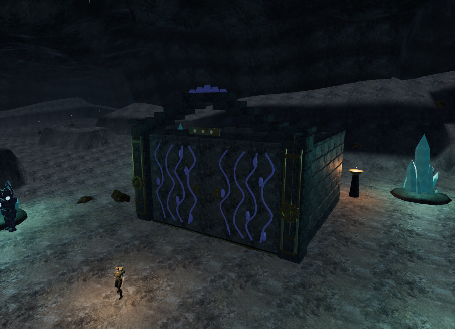
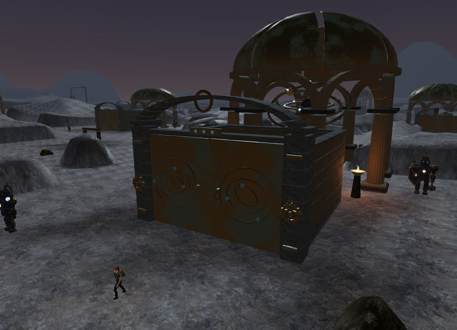
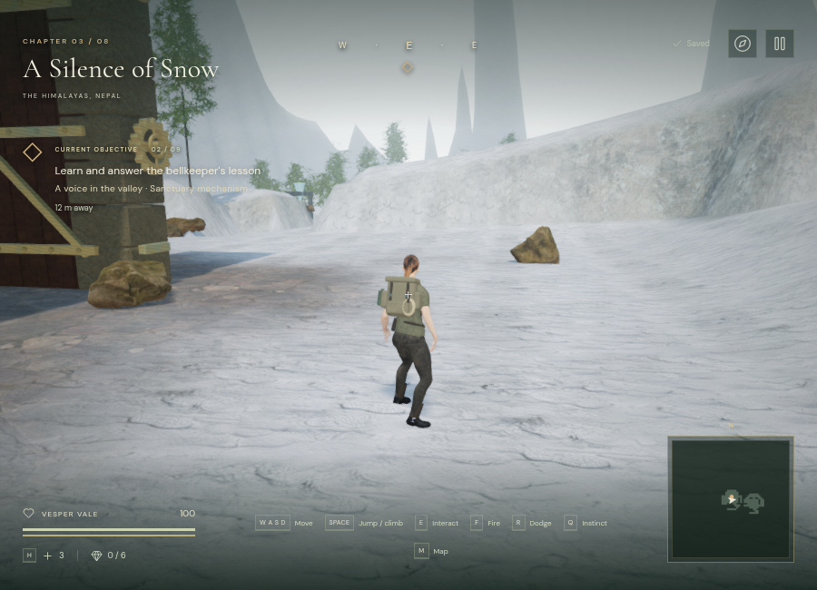

# Sanctuary gates

The 69 field gates now use eight regional door and crown designs. Each preserves the existing three-station progression and chamber footprint. Coursed masonry, footings, coping stones, supported headers, drive axles and three restoration seals replace the previous flat walls and gold grille.

The subsequent [cloud-city gate art pass](sky-gate-art.md) replaces the sky gates' initial construction with fitted stone, recessed niches, framed timber screens, detailed bronze hinges and a corbelled wind crest. Its notes contain the newer images, source costs and integration evidence.

| Chapter | Construction | Opening |
| --- | --- | --- |
| Jungle | Carved stone panels and a corbelled crown | Slabs descend into a framed floor slot |
| Desert | Solar bronze relief and a shallow sandstone arch | Shutters descend with rising counterweights |
| Mountain | Strapped timber planks beneath a snow-covered canopy | Paired leaves swing inward |
| Flooded palace | Bronze sluice panels, blue wave inlays and a fluted arch | Paired leaves swing inward |
| Volcano | Riveted pressure panels, recessed vents and a geared header | Shutters descend into the floor |
| Cliffside city | Fitted stone, framed timber screens, bronze straps and a wind crest | Paired leaves swing inward |
| Crystal archive | Veined stone panels, mineral inlays and an angular crown | Slabs descend into the floor |
| Eclipse | Bronze orbital relief beneath a shallow stone arch | Paired leaves swing inward |

The doors open over several seconds. Gear rims, hubs and spokes rotate together; counterweights rise opposite the descending shutters. A small dust or snow effect appears near the moving threshold. Nearby decorative details hide beyond 100 m and return inside 90 m; the structural silhouette and collision remain. Materials are shared within each chapter and static meshes are batched by material. This addition uses existing local textures and original geometry; it adds no external assets or recordings.

Each jamb has a positional drive source, for **138 sources across the campaign**. Timber doors use rope/wood creaks and the other doors use a low mechanical texture. Activity follows door motion; locked and restored doors are silent. The sources use the existing HRTF, obstruction filtering and shared 12-voice environmental budget, with linear attenuation from **2 to 34 m**. A restrained spatial stop cue marks the end of travel. The existing quiet chapter and objective arrangements continue beneath these effects.

Movement bounds track both leaves through their inward rotation and track the actual top of descending shutters. A small character clearance closes the seam between the paired leaves. At full opening, the leaves fit inside the side-wall collision footprint. Camera surfaces retain each moving parent through geometry batching, so they follow the same motion and leave the open passage clear.

Testing also found that an obstacle with height zero could still block lower terrain. Movement now ignores zero-height obstacles, matching their disabled state. This matters when a fully retracted gate spans ground slightly below its center.

The existing `field`, `stage` and `completed` save fields determine restoration. No new save schema is needed: partially restored seals remain partial, and completed doors load already open without replaying motion sounds.

## Verification

Automated coverage checks all 69 gate thresholds, the eight regional panel types, finite geometry and retained camera parents, transformed door corners throughout opening, moving collision tops, paused updates, one-time stop cues, partial seals, silent resting sources and existing-save restoration. The original eight counterweight chambers still solve through actual walking, gripping and swept stone movement in the test fixtures.

A native browser E press completed `field-1-2` after an assisted setup with the first two stations restored. The third station was present in the local-storage save immediately. Fixed-step gate updates then produced moving source activity of 1, full opening, a clear threshold, and resting activity of 0. This verifies the input and saved transition; it is not a real-time playthrough.

An isolated offline Web Audio render used the actual timber-drive source definition, the same audio buffer and start phase for each distance, a constant 0.18 output gain, and two-channel RMS sampling from seconds 1–3. Each source reported HRTF, linear falloff, a 2 m near radius and a 34 m outer radius.

| Distance | RMS signal |
| --- | --- |
| 2 m | 0.00129502 |
| 8 m | 0.00105220 |
| 18 m | 0.00064751 |
| 28 m | 0.00024282 |
| 35 m | 0 |

These are signal measurements, not subjective loudness ratings or calibrated speaker measurements. The exact half signal at 18 m is consistent with the midpoint of the 2–34 m linear range.

All **194 tests** and the production build pass. The added small-gear regression traces every tooth valley and detects the broken rim produced by applying the forge generator's fixed tooth depth to a tiny radius. Scaling a complete profile preserves the hub and rim. A relief-bound assertion also keeps the jungle carving inside its moving leaf.

The actual eight chapter scenes rendered with linked shaders and no reported asset errors. Assisted browser checks found clear sampled thresholds at all **69 gates**, clear front sound paths at all **138 drive sources**, and at least one accessible sampled approach to each of the **456 original non-guardian features**. All **77 desert controls** and **40 mountain controls** remained accessible, with clear paths from the 77 solar emitters and 32 bells. These checks do not constitute full traversal playthroughs.

The following 900 × 650 views use the same gate-relative camera offset. Counts include all submitted work in the scene's rendering passes. Desert, mountain, palace, volcano and cliffside views preceded the final small drive-rim adjustment; final jungle, crystal and eclipse views include it.

| View | Submitted triangles | Calls |
| --- | ---: | ---: |
| Jungle, Performance | 621,266 | 200 |
| Desert, Performance | 836,948 | 467 |
| Mountain, Performance | 361,914 | 153 |
| Palace, Performance | 271,000 | 112 |
| Volcano, Performance | 341,212 | 261 |
| Cliffside, Performance | 431,924 | 186 |
| Crystal, Performance | 165,294 | 97 |
| Eclipse, Performance | 795,518 | 656 |
| Mountain, open, High | 1,524,035 | 690 |
| Jungle, High | 3,206,963 | 859 |

The matching older Performance jungle view submitted 550,475 triangles and 159 calls. The additional gate detail increases that view's workload; these counts do not establish supported hardware frame rates. Chromium used ANGLE/SwiftShader software rendering.

The production gameplay check (`index-CQ6q5mK4.js`) loaded the native mountain field save in High quality with no development hook. Normal keyboard movement changed the position from `(84, 127, height 0)` to `(84.07709708533439, 126.98470295925905, height 0)` and recorded **9.717 active seconds**. All 12 requested snow, timber, plaster and roof textures loaded with HTTP 200. A fresh load restored the exact position, time, stage 1 and three completed field IDs in the pause panel. A required wood texture was held until focus moved to the development tab, keeping expedition time paused during the reload check.

Development and production consoles contained no warnings or errors. Both test origins were cleared afterward and High quality restored. A final copy edit aligned the field instructions with descending or inward-swinging gates. Its six campaign checks and build passed; the resulting `index-C5I9ThsF.js` launcher and `game-DMeHLLvf.js` module loaded successfully, with empty test progress, High quality and no development hook. The release build retains the existing Three.js chunk-size advisory. The first jungle automation wait expected nine gates instead of eight and expired; inspection showed the chapter had loaded correctly. No launch failure was found.

Approximately one-hour chapter pacing, sustained device performance and graphics comparable to a modern AAA title remain open requirements.
