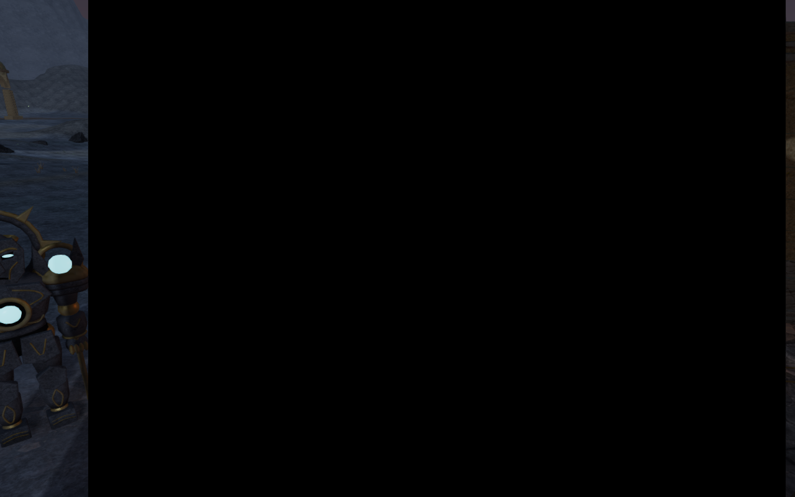
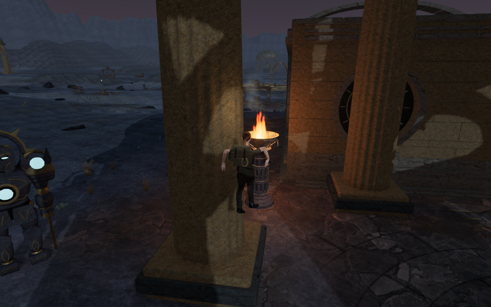
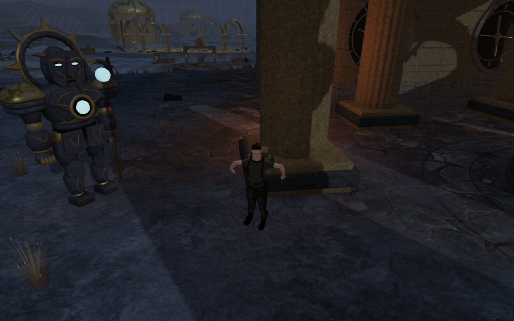
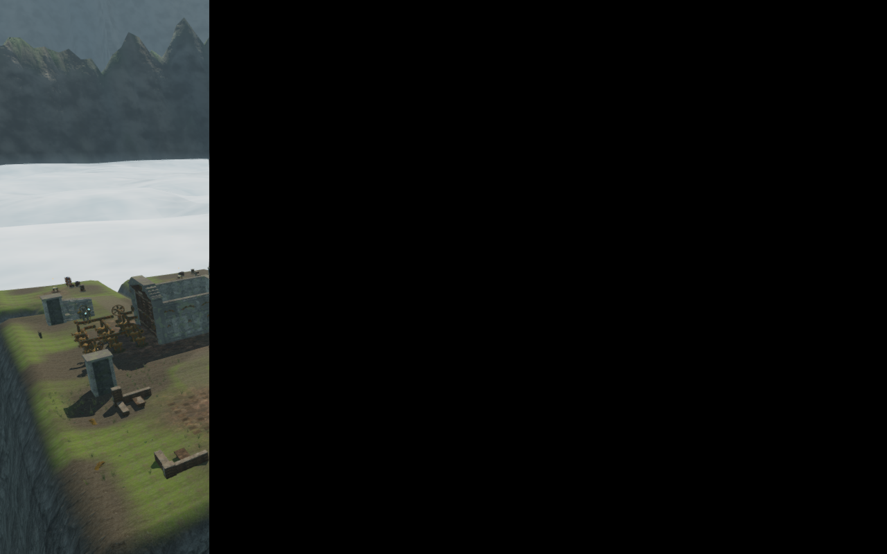
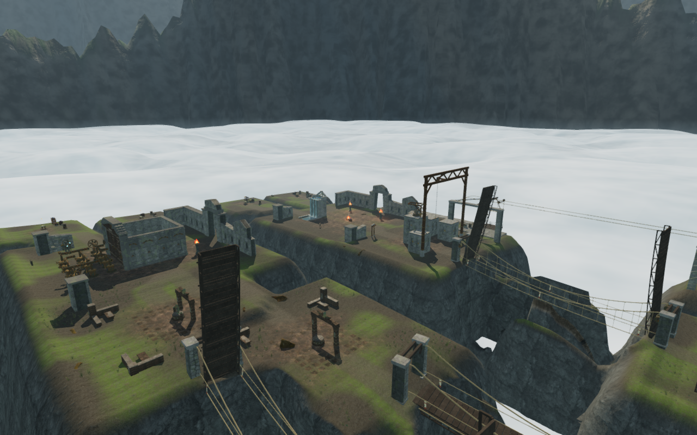
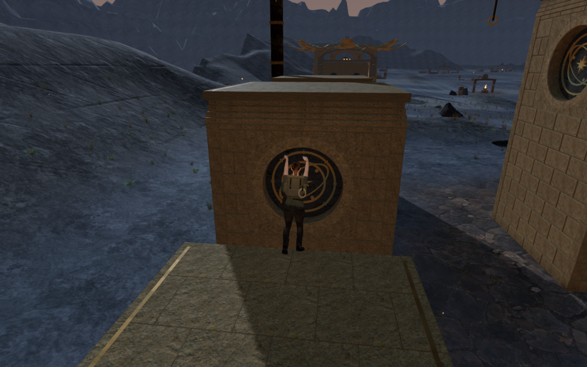
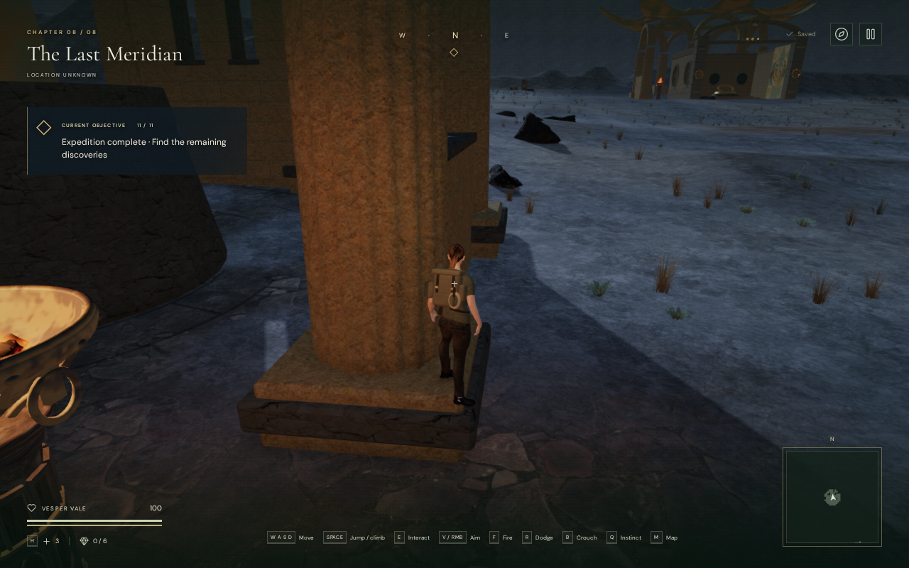
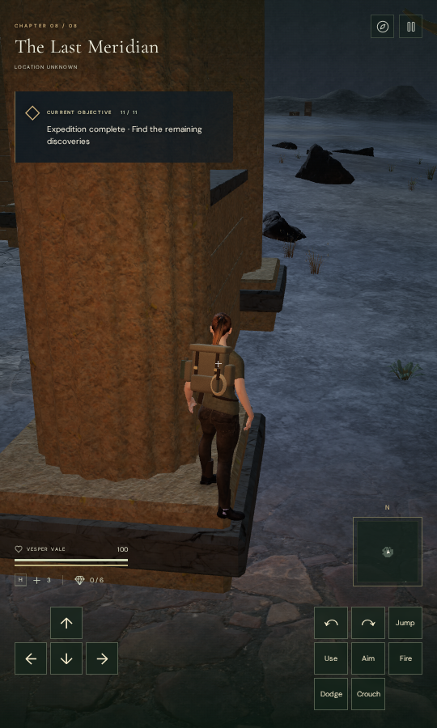

# Finite flame and sailcloth shading

The rectangular black regions found during the [shaft-footing review](observatory-shaft-footing.md)
are repaired at their shader sources. Bloom remains enabled. The generic flame
material now bounds its vertical UV input before evaluating fractional powers;
the courier sailcloth now bounds the base of its dampness power. These changes
retain the objects, glow, cloth pattern, movement and positioned sounds.

## Reproduction and diagnosis

An ordinary first jump onto an observatory column base, followed by a second
jump, reproduces the earlier affected body view. The player, camera and chosen
angles exactly match the preceding capture. At 1280 × 800, 896,802 pixels are
exactly black: 87.5783% of the image. The raw drawing buffer, canvas PNG and
browser compositor screenshot all contain the region. Finishing GPU work does
not clear it. Shader programs link successfully and the GL error is zero.



The pre-bloom HDR input contains twelve NaN colour components across four
pixels. Bloom spreads those invalid values into much larger regions. Bypassing
bloom clears the rectangle, but hiding one particular flame in the
Cartographer's Orrery also clears the invalid input while leaving bloom active.
Hiding terrain, particles or other flames does not clear that input.

The flame shader evaluates `pow(1.0-y,0.72)` and `pow(1.0-y,0.6)`. A negative
base is outside their valid domain under the [GLSL ES specification](https://registry.khronos.org/OpenGL/specs/es/3.2/GLSL_ES_Specification_3.20.html).
Interpolated UVs at covered multisample
edges can extend beyond a card's bounds; the source isolation and controlled
UV tests below support this explanation. Transparent edge fragments still
need finite colour values. Bounding `y` to `[0,1]` prevents the invalid powers.



The corrected view has zero exactly black pixels in all three repeated raw
frames. All twelve measured HDR stages—input, bright extraction and ten blur
targets—contain finite values. HDR energy remains: the input maximum is
4.9297 and the bright extraction maximum is 3.5313.

The other affected body view is also replayed through normal jumping,
crouching and backward movement. Its player position, camera and angles match
the preceding record. All twelve targets are finite; its three frames have
29 ordinary black pixels, or 0.002832%, with no large rectangle. That view's
bright extraction is zero because no visible sample exceeds its brightness
threshold; a zero bright target is not itself a failure.



## The wider sky-city case

The cross-chapter observer check exposes a second failure in a distant
sky-city view. Its near view is clear. At 146 m from the selected existing
fire source, the High HDR input has 36 invalid components and the Medium
input has nine; 76.3281% of the final image is black.



Material isolation clears the invalid input only when the courier's woven
sailcloth is hidden. Its dampness expression is `pow(1.-clothUv.y,5.)`.
GLSL's power function also needs a nonnegative base for this expression;
an integer-valued exponent does not make the negative-base invocation valid.
The repair uses `pow(max(0.,1.-clothUv.y),5.)`. The same near/far High/Medium
views then have finite HDR input, zero GL errors, linked shaders and zero
exactly black pixels. The sail remains present.



## Actual GPU regressions

Two reusable browser helpers render the actual production material factories
into 80 × 80 half-float HDR targets with two samples. They test UV ranges
`[-0.02,1.02]` and `[-0.125,1.125]`, and construct deliberately unbounded
controls by restoring the failing expression. The tests inspect rendered
values rather than duplicating the shader formula in JavaScript.

| Material | Guarded edge cases | Invalid control components | Valid-interior comparison |
| --- | --- | --- | --- |
| Generic flame, four times/world seeds | All four finite; HDR maximum 4.2422 | 480, 1,920, 1,920, 480 | All four RGBA half-float buffers identical |
| Courier sailcloth, both sides | All four finite | 438, 1,770, 438, 1,770 | Both RGBA half-float buffers identical |

All these renders return zero GL errors, including the intentionally invalid
controls. A successful compile or clear error flag therefore cannot replace
checking the HDR values. The helpers restore the renderer's target, clear
colour, alpha and automatic-clear state, and dispose their owned geometry,
materials, lights and targets.

With a running development game, the helpers can be invoked from the browser
console:

```js
const { inspectFireDomain } = await import('/scripts/inspect-fire-domain-browser.js');
const { inspectCourierClothDomain } = await import('/scripts/inspect-courier-cloth-domain-browser.js');
const renderer = __vesper.game.renderer;
const fire = inspectFireDomain(renderer);
const cloth = inspectCourierClothDomain(renderer);
console.assert(fire.guarded.every(r => r.nonfinite === 0 && r.error === 0));
console.assert(cloth.guarded.every(r => r.nonfinite === 0 && r.error === 0));
console.assert(fire.control.every(r => r.nonfinite > 0));
console.assert(cloth.control.every(r => r.nonfinite > 0));
```

These helpers deliberately render invalid controls and are diagnostic tools;
they are not included in the production application bundle.

## Route and chapter scope

Both complete Meridian climbing loops retain all 74 recorded movement,
camera, look, elevation, traversal and field-progress states from the preceding
shaft-footing milestone. Health stays 100 and opacity stays one across 5,008
camera updates. Every captured HDR input is finite, including all eight
previously affected loop views.



The chapter review checks four observer frames in each of the eight actual
worlds: High/Medium at 6 m and 146 m from a selected existing flame. All 32
final samples have finite pre-bloom input, zero GL errors, linked programs
and no reproduced rectangular artifact. No flame is forced visible. Chapters without a
generic flame use their existing camp flame. These are fixed observer samples;
they do not constitute a complete chapter playthrough or world geometry audit.
The far observer can lie beyond the playable terrain or outside a cave's
enclosure, with normal foreground occlusion. These samples establish finite
rendering at those views, not acceptable player-camera composition.

The Jungle result comes from the completed portion of an initial job that
subsequently stopped on the helper's incorrect assumption that the desert
must contain a generic flame. The corrected desert check passes separately.
The original volcano/sky job correctly fails on the sky artifact; the repaired
sky passes separately. Neither failed job is presented as a clean group pass.

All 41 focused tests pass, covering rendering profiles, camps, braziers,
carried fire, explorer visibility, observatory mechanisms and courier
construction, motion, sound-source attachment and persistence. The production
build succeeds with the existing large-chunk advisory. No new full campaign
test-suite run is claimed.

Production keyboard/High at 1280 × 800 and portrait touch/Low at 540 × 900
pass native Forward/Jump input, crouching and backward departure to soil.
Both retain the earned base height of about 0.866 m, chosen view and complete
stored state across two reloads. The older unsupported shaft save recovers
1.50 m away on soil, retains progress and survives two further reloads.
Health remains 100. Built asset names match the new bundle, the development
hook is absent, and neither view has horizontal overflow or application errors.
Each device retains three ReadPixels driver diagnostics and no other warnings.





All 74 loop captures, 32 final chapter samples and twelve native views are
reviewed in contact sheets. The published comparison, body, loop and native
witnesses are also reviewed at full size. All eight WebPs retain their source
dimensions and every decoded RGBA pixel. The loop images have at most 0.0758%
exactly black pixels; the HDR measurements distinguish the repaired fault
from ordinary dark details.

Costly tests, builds, GPU runs and image conversion run serially on the shared
nine-of-sixteen CPU set at reduced priority, with at most two test workers
and one browser. All verification workers and browsers are released. Both
temporary servers are stopped, both ports are closed, and a host inspection
that includes browser descendants confirms no remaining project workload.

## Limits

These browser measurements use ANGLE over Mesa Vulkan with llvmpipe
(LLVM 20.1.2), a software renderer. The reproduced game context has
antialiasing enabled, no preserved drawing buffer and a maximum of four
samples; its composer uses two-sample half-float targets. The invalid-control
counts are observations on this renderer. Other drivers can return different
results for an undefined power invocation.

ReadPixels driver stall diagnostics are retained in the browser reports;
they also occur in healthy views and do not identify the fault. The diagnosis
uses the actual invalid HDR values, material isolation, guarded replay and
deliberately broken shader controls.

VA-74 is fixed for the reproduced flame and sailcloth cases. These checks do
not establish consumer GPU performance, cross-browser acceptance, the entire
playable world's geometry or layout, subjective sound quality, commercial AAA
graphics or a human playthrough duration. The broader visual, layout, contact
and listening/device audit remains open. There is no minimum chapter duration
under the current acceptance target.
