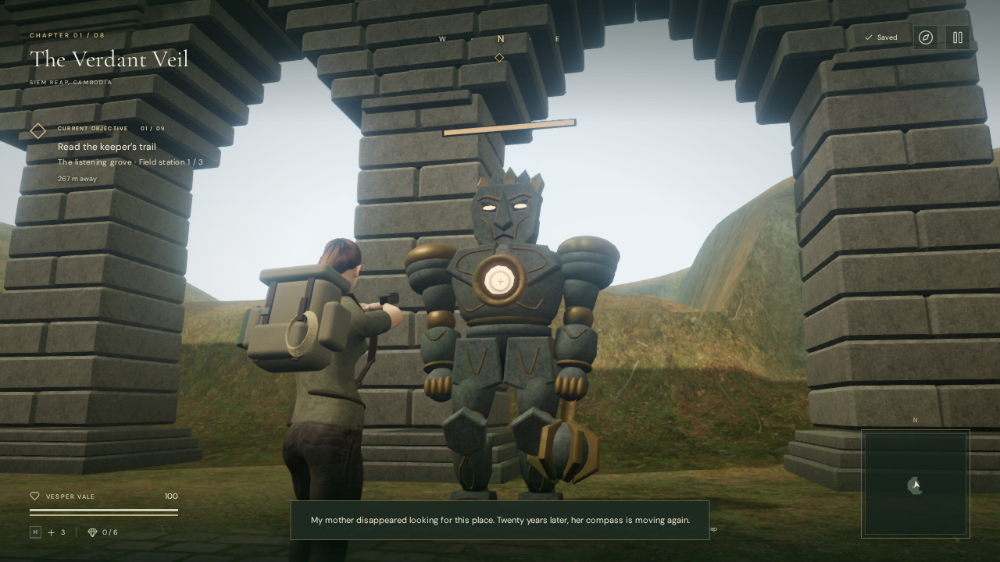
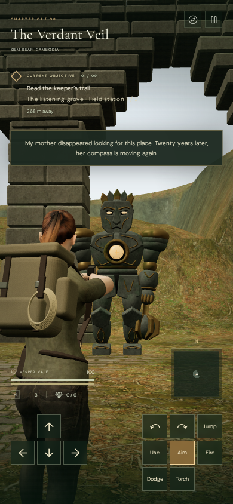

# Shoulder aiming and guardian combat

All eight chapters now offer deliberate shoulder aiming. Hold the right mouse
button, toggle **V**, or tap **Aim** on touch. Fire with **F**, a locked left
click, or **Fire**. Releasing aim retains the existing directional assistance.

The camera moves closer and narrows from 58 to 46 degrees. The explorer keeps
facing her aim while moving at 2.6 m/s; holding Sprint does not speed up this
stance. Her arms and pistol follow elevation. The lateral camera offset reduces
in portrait view to keep her in frame. Both the lateral shift and camera arm
respect architecture and terrain.

Aim with the mouse, drag the world on touch, or use **Z/C** and **I/K** for
horizontal and vertical keyboard adjustment. Touch Aim stays toggled so that
other fingers can move, look, and fire independently. Pause, interaction,
carrying, swimming, climbing, and dodging release aim. Drawing the pistol puts
out a carried torch. Aiming itself is transient; defeated guardians retain their
existing independent local-storage records.

## Shots and feedback

An aimed shot first follows the center of the camera view, then traces from the
pistol to that point. It hits the posed guardian's actual armor triangles within
45 metres; looking beside or above a guardian can miss. A closer guardian can
intercept the shot. Solid architecture, raised gates, ground and cavern ceilings
block it. The body-to-muzzle segment also prevents firing from a barrel that
has clipped through a wall.

The reticle changes color over a target. A white hit mark confirms damage; a
blue diamond and **SHIELDED** indicate the keeper's frontal protection. Its
existing recovery and flanking rules still determine damage. **MUZZLE BLOCKED**
means the camera can see past cover that still blocks the pistol. Short traces
fade in simulation time, freeze while paused, and dispose their geometry and
material afterward. Impact cues use the existing positional effects system;
chapter music and the existing encounter cue continue unchanged.

The guardian armor uses rigid bone weights. A CPU cache groups original
triangles by bone, rejects small armor bounds, then evaluates surviving faces
with the skin's own vertex transform. It supports both indexed and non-indexed
geometry and both visible detail tiers. No simplified damage model is substituted
for the rendered armor. The cache uses weak geometry keys and never uploads
additional meshes or buffers to the GPU.

Browser review also exposed a cavern guardian inside a mineral bed. Mineral
placement now reserves 5.2 metres around authored guardian spawn coordinates,
removing three clusters from their approaches. The cavern retains 33 clusters and 42 mineral/drip sources;
guardian IDs, chapter goals and saves are preserved.

## Verification

All **331 automated tests pass**, and the final production build passes with the
existing Three.js chunk-size advisory. Automated checks cover misses, elevation, range, nearer enemies, low cover,
moving gates, body/muzzle obstruction, shields and saved defeats, independent
aim inputs, release conditions, camera obstruction and portrait offset, trace
disposal, and the delivered explorer's arm lengths and grip alignment.

The optimized query matches the original skinned triangle query in 648 sampled
checks: four archetypes, two detail tiers, three animation states, nine rays and
three material meshes. A separate aimed-fire case covers a ray ending on a
triangle edge. These samples do not prove exact behavior at every possible pose.

Native V/F checks in selected encounters passed in all eight chapters. Shots
missed when aimed aside, damaged wardens/hunters/sentries, and respected frontal
shield protection. All eight Performance views and the High jungle view rendered
with linked shaders. A half-second strafe traveled 1.3 metres with Sprint held,
retaining aim and full stamina. Escape/continue and independent right/left mouse
buttons released or retained aim as intended.

At 390 × 844, touch Aim, Fire and look dragging passed. Releasing Fire or the
look finger preserved the separate held forward input. The adjusted shoulder
offset kept the explorer visible. Completed development checks reported no
JavaScript errors, warnings or failed assets.

The final selected-view reticle queries took median 1.3–7.4 ms across 20 samples
per chapter on a Radeon 780M system, while other automated work was running.
These are query timings, not frame-rate measurements or a controlled comparison.
The geometric equivalence tests establish what the optimization preserves.

In the final production build, a prepared resumed save isolated one warden.
Native V, I/C camera controls and five F shots defeated it while its normal AI
remained active. Vesper finished with 82 health. The saved defeat and health
survived reload; toggled aiming released after pause/continue. The development
hook was absent and no JavaScript errors, warnings or failed assets were
reported. Checked bundles: `index-WijXwHkC.js`, `game-B2xzE6Xq.js`,
`three-BFm0_K5S.js` and `index-n9zm2e6h.css`.

Reusable development fixtures are in
[`verify-aiming-browser.js`](../scripts/verify-aiming-browser.js). They supply
positions and sight alignment and stop the animation loop. Native input checks
using them verify controls and interactions, not unassisted encounter balance or
chapter duration.

The current character, environment art and effects remain below modern AAA
quality. Full encounter balancing, broader device testing, final listening review
and approximately one-hour chapter pacing remain outstanding.
