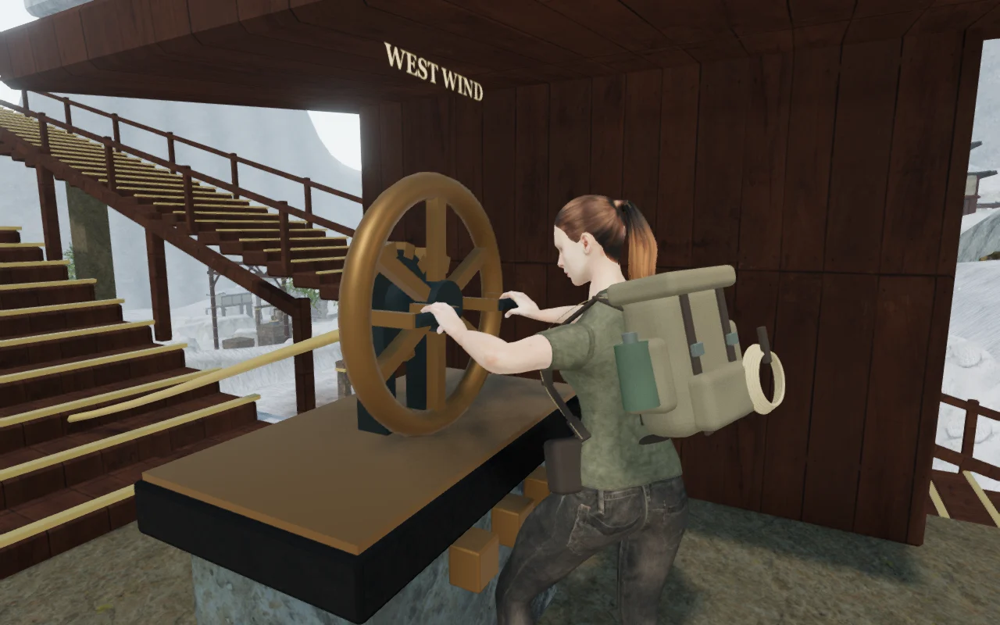
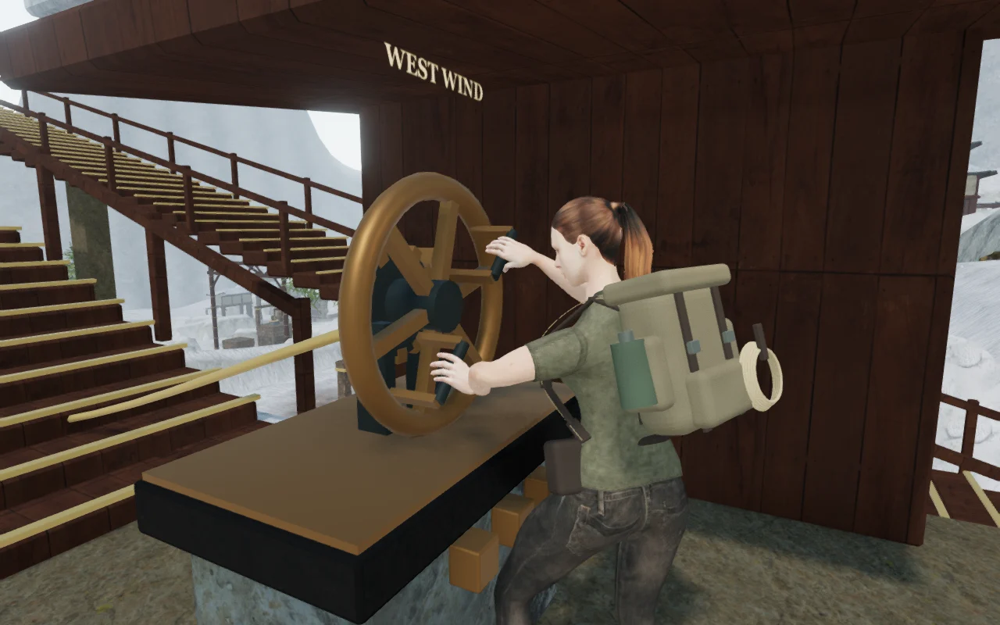
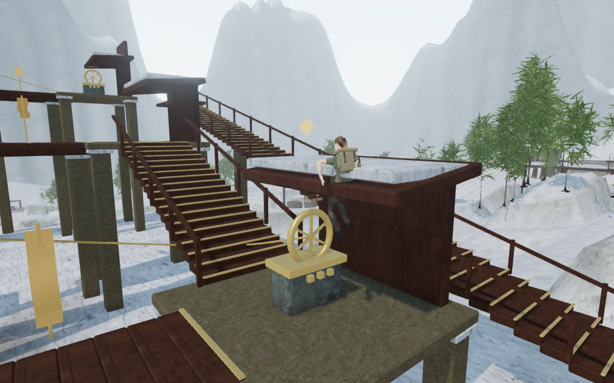
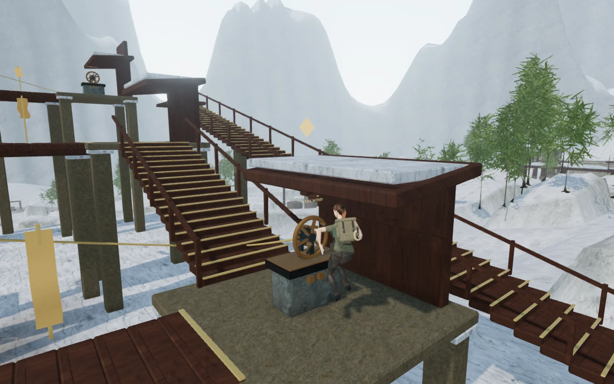

# Shutter wheel contact and roof clearance

The Room of Wind now gives Vesper a physical wheel operation. She steps into
position, reaches for two grips, closes her fingers, turns the wheel, then lets
go before its ratchet return. Each shutter’s three persistent catches still
control its wind walk, with the last shutter opening the return route.

Use **E / Use** from the front of a sheltered landing. Alignment follows a
checked, supported approach instead of passing through an obstacle or across
a gap. A nearby operation takes about 1.75 seconds: the catch seats at
1.15 seconds, followed by release and return. A longer approach extends the
alignment phase. Movement or Jump interrupts the action immediately; a catch
already seated remains saved. An unfinished catch springs back. The wheel
holds both hands during the interaction, so aiming and crouching resume after
release or cancellation.

The hardware has two 38 mm grips, a supported spindle, a twelve-tooth ratchet
and retaining pawl. The handwheel makes a quarter turn per catch and returns
while the ratchet holds the louvers. Dark iron fittings, a bronze rim and a
stone cap replace the previous bright slab and unsupported wheel axle.
The local machinery source sounds during the pull, with a quieter return,
and retains its distance falloff and saved mix settings. Pause freezes the
operation and silences the six shutter-house emitters.

## Roof clearance

Standing jumps previously passed upward through the windbreak roof. The
controller now checks the rising capsule against the shutter house's roofs,
beams and decks. Roof bounds come from the built, tilted timber geometry.
Contact stops the upward velocity and gravity returns the player to the
landing. Exposed crossings retain their existing jump arc.

In the matched browser probe, the visible character's highest vertex was
0.971 m above the roof underside in the previous release. The corrected jump
keeps it 0.143 m below that underside. This is one measured view; separate
movement tests raycast the actual roof mesh at all six landings and verify
jump recovery at 100 health. Conservative box bounds cover the pitched timber;
this is not a replacement for every chapter's collision system.

## Verification

All **551 automated tests pass**, including the complete three-tier route,
ordered catch saves, clear approaches, interruption after the catch seats,
hand availability, all six roof clearances and the exposed jump arc.

The delivered skinned character was checked through all nine catches. Across
162 sampled poses, the deepest measured grip penetration is 1.04 mm and the
largest minimum contact gap during the pull is 2.47 mm, within the existing
2 mm penetration / 4 mm contact tolerances. Arm and finger bone lengths and
all bone scales remain unchanged. The base animation resumes after release.
These measurements use the delivered mesh, independently of the hand solver.

A continuous assisted route crosses all three wind walks, operates all nine
catches, and returns down the eastern stair at **100 health**. It uses normal
movement, guardians, hazards and following-camera updates after a single
entrance setup. Its 67.35 simulated seconds are not a human pacing estimate.
The browser reports the crosswind music task on the walk, a live local drive
voice during the pull, and no shutter voices while paused.

A distance-only render of the actual sound buffers measures half amplitude at
the midpoint and silence beyond each emitter's range:

| Source | Near distance / RMS | Midpoint distance / RMS | Beyond range / RMS |
| --- | --- | --- | --- |
| Wind | 2 m / 0.114487 | 15.5 m / 0.057243 | 30 m / 0 |
| Drive | 2 m / 0.219077 | 11.5 m / 0.109538 | 22 m / 0 |

High, Medium and Low shaders link. The final wide return view submits the
following whole-scene rendering work, including surrounding monastery objects:

| Quality | Calls | Submitted triangles |
| --- | ---: | ---: |
| High | 1,041 | 1,612,074 |
| Medium | 643 | 911,295 |
| Low | 348 | 489,878 |

These are rendering counts, not frame-rate measurements. Changing chapters
disposes all **117 tracked geometries, 19 materials and eight textures** exactly
once and removes all six local emitters. The route and visual checks report
no browser errors, warnings or failed HTTP responses.

Twelve production-browser scenarios pass across two runs of the same build.
A test-only button selector was corrected before the last four scenarios; the
application and build were unchanged. The checks cover:

- A single seated catch persisting without completing its field action.
- Movement cancelling an unfinished turn without damage.
- Pause and reload during an unfinished turn.
- Keyboard ascent of the southern stair.
- Expected eight-health recovery from walking into a broken span.
- Muted portrait touch movement and jump, route-map display and saved landing.
- A jump beneath a roof landing back at its control without damage.
- Pause and reload after the catch seats but before the release finishes.
- Muted portrait touch **Use** seating a catch and releasing the wheel.
- Completing the chamber shutter and opening the return crossing.
- An older completed mission restoring its closed shutters.
- An older airborne save recovering to a supported entrance.

Each scenario starts from a prepared chapter save and compares the persisted
record after reload, excluding the last-played timestamp. The production build
has no development hook. The browser records no errors, warnings or failed
HTTP responses. Its loaded assets match the built files:
`index-CRJdTZQn.js`, `game-4W9Qs-lN.js`, `three-tE7OVaVC.js` and
`index-DYq9hjRy.css`. The build retains Vite's existing large-chunk advisory.

All added geometry, materials and animation code are original project work.
Existing credited character and environment assets are reused. No external
assets or dependencies were introduced. Images are captures of the running
game converted to WebP.

This improves one physical interaction and fixes a reproduced traversal defect.
It does not establish modern AAA graphics, one-hour chapter pacing, subjective
sound quality or performance across consumer browsers and GPUs. The full
acceptance target remains in [production status](production-status.md).
