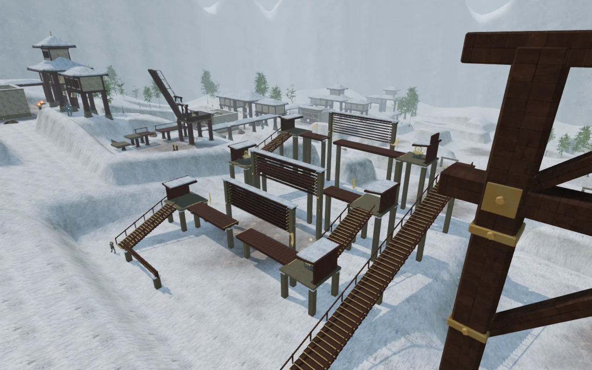
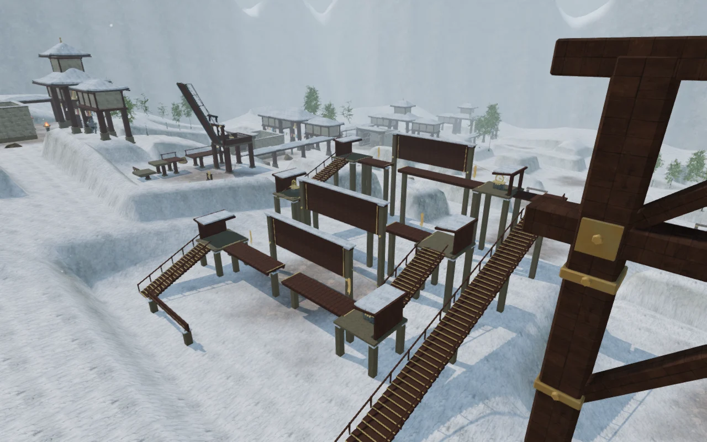
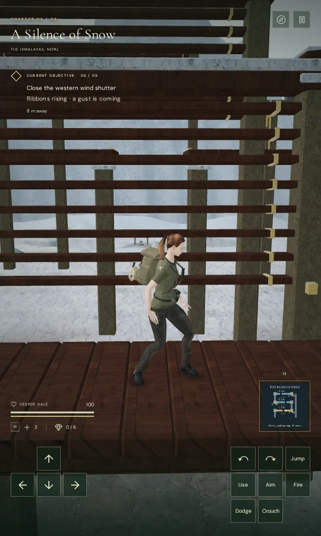
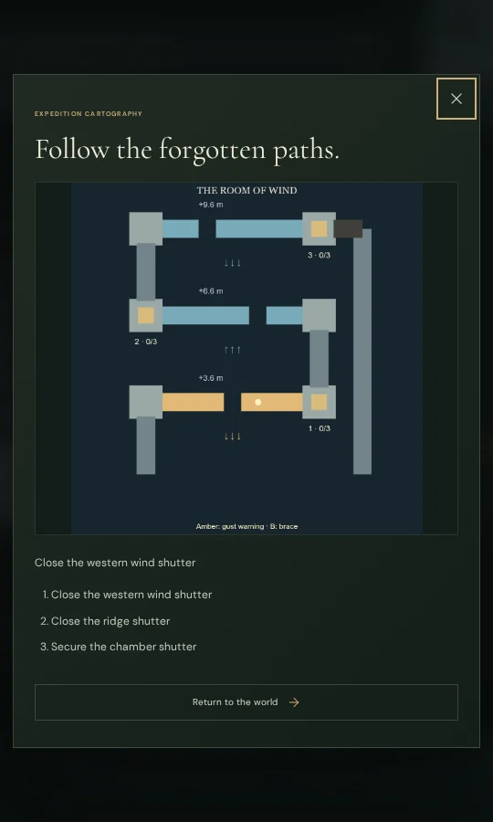

# The Room of Wind

The sixth field mission in **A Silence of Snow** now crosses a connected
shutter house. Three scattered controls, including one repeated cable course,
are replaced by three elevated wind walks with different breaks, sheltered
landings and an eastern service stair.

Climb the southern stair to the first walk at 3.6 m. Rising ribbons warn of a
crosswind. **B / Crouch** braces Vesper against it; stand again before using
**Space / Jump** at a broken span. The east stair reaches the second walk at
6.6 m, and the west stair reaches the final walk at 9.6 m. The second wind blows
from the opposite side; the third changes direction between pulses, after the
previous gust has faded. The three breaks occupy different positions.

At each sheltered control, use **E / Use** to seat one of three catches. Its
0.9-second turn moves the handwheel and linked louvers. Moving out of reach or
leaving the landing cancels the unfinished catch. Every seated catch reduces
that shutter's wind by one third; the third catch completes its existing field
action. Closing the chamber shutter lowers a short bridge to the eastern
return stair. The world mechanism and its sanctuary gate use the same field
progress as the original mission.

**M** shows the walks, real gaps, stairs, control numbers, seated catches and
wind direction. Amber marks a warning. Visual ribbons, the map and HUD prompts
support muted play. A missed crossing costs eight health and returns to the
last fully secured shutter, or the southern entrance before the first shutter.

## Construction and persistence

Original timber treads, masonry supports, handrails, roofed windbreaks, bronze
wheelwork, cables and 24 hinged louver boards form the structure. Six hanging
ribbons deform with the same gust state used by movement and audio. The final
return leaf lowers over 0.45 seconds and supports walking once seated.
Elevated slabs and supports participate in movement, camera and sound
obstruction at their own heights. The open space below the walks remains traversable.

A local foundation blends the existing field clearing into a level floor, and
its walkable cells include the stairs and landings. Decorative rock placement
reserves this working area. The chapter retains all three field actions for the
sector. Comparing the map to the previous milestone found 650 changed terrain
samples out of 60,025, within x = 147–201.25 m and z = 208.25–260.75 m. The
largest change is 7.10 m on the former enclosing bank. All 51 other feature
positions and footing heights, four water definitions and enemy definitions
match the previous mountain map. The seven other chapter maps are identical.
Across the campaign there are now 21 repeated cable courses and 67 station
traps; this mission supplies its own three wind hazards instead of a station
trap and one of those cable courses.

Each fully seated catch saves to the mountain chapter's local-storage record.
An interrupted turn restores its last catch, and pause freezes the current
turn and gust in memory. Fixed supported positions reload where they were
saved. Airborne saves return to the last secured control or the entrance.
Older saves that completed a shutter's field action receive all its catches;
older completed missions receive the closed shutters and open return route.
The other chapters store no shutter-house state.
A release regression caught the general loader discarding an older airborne
height before chapter recovery ran; this hook now validates the saved elevation
directly before accepting a supported arrival.

## Sound and verification

Three wind emitters sit at the visible louver openings. Three quieter machinery
emitters sit at the handwheel drives. They use the existing wind and hoist
buffers, HRTF positioning, linear distance falloff, occlusion filtering and
saved mix controls. Closing a catch reduces its wind voice along with the
physical gust. Machinery sounds only during a turn, and all six sources stop
on pause. The mountain score suppresses its melodic motif during an exposed
crosswind passage, leaving its quiet supporting tones.

All **548 automated tests pass**, including ordered catch persistence, legacy
save restoration, cancellation, pause, warning/reversal timing, bracing, all
three broken crossings, the full return stair, missed-jump recovery and
obstruction at platform height. The remaining 21 cable routes retain their
movement, artwork and hand-grip checks. The production build succeeds with
Vite's existing large-chunk advisory.

A continuous assisted browser route starts once at the southern entrance,
crosses all three walks, closes all three shutters and returns down the eastern
stair at **100 health**. It uses normal character movement, guardians, hazards
and following-camera updates, with supplied directions and jump timing. The
reusable helper is [`verify-shutter-house-browser.js`](../scripts/verify-shutter-house-browser.js).
This took about 65 simulated seconds; it is not a human completion-time estimate.
The correction to the third walk's reversal was checked again through this
complete route.

The running browser reported the crosswind music task and live wind voices on
the exposed walk, a machinery voice during a catch turn and no shutter voices
on pause. A distance-only render of the actual buffers measured the following:

| Source | Near distance / RMS | Midpoint distance / RMS | Beyond range / RMS |
| --- | --- | --- | --- |
| Wind | 2 m / 0.114061 | 15.5 m / 0.057031 | 30 m / 0 |
| Drive | 2 m / 0.218914 | 11.5 m / 0.109457 | 22 m / 0 |

That verifies half amplitude at the midpoint and silence beyond range. It does
not establish subjective sound quality. High, Medium and Low shaders all link.
The final wide return view submits the following whole-scene work across the
rendering passes:

| Quality | Calls | Submitted triangles |
| --- | ---: | ---: |
| High | 1,041 | 1,593,078 |
| Medium | 646 | 900,627 |
| Low | 345 | 481,550 |

These counts are not frame-rate measurements. The view includes surrounding
monastery structures. Changing chapters disposes all **117 tracked geometries,
13 materials and eight textures** exactly once and removes all six emitters.
The assisted run has no browser errors, warnings or failed HTTP responses.
A final map review moved control labels below their landings so the stair
shapes cannot cover the catch counts.

Nine production-browser cases pass against the final build, with the development
hook absent. Each case begins from a prepared chapter save, exercises keyboard
or touch controls, then compares the persisted chapter record after reload
(excluding its last-played timestamp):

- Seat one catch without completing its field action.
- Leave the control during an unfinished turn; cancel without losing health.
- Pause during a turn and reload its last seated catch.
- Walk up the southern stair to the first 3.6 m landing.
- Walk into a broken span and recover with the expected eight-health cost.
- Cross the first gap using simultaneous touch movement and jump while muted;
  open the route map in a 540 × 900 portrait viewport without horizontal overflow.
- Seat the chamber shutter's last three catches and complete the mission.
- Load an older completed mission without the new shutter state.
- Load an older airborne position over a broken span and recover to the entrance
  at 100 health, retaining that supported position after another reload.

The harness aims the camera with a touch-look gesture before directional input;
it does not set live character positions through a development hook. No browser
errors, warnings or failed HTTP responses were recorded. Loaded asset names
match the final build: `index-DKO-TE7Y.js`, `game-BvYHXWN3.js`,
`three-BdA7gFwm.js` and `index-DYq9hjRy.css`.

The assets are original project geometry and writing, reusing the credited
monastery materials and existing original sound synthesis. No external assets
or dependencies were introduced. Images are actual game captures converted to
WebP. The handwheel animates without a new synchronized hand-contact pose.

This adds a distinct physical objective and traversal sequence. The assisted
route supplies navigation and jump timing; it does not measure a blind human
playthrough, chapter difficulty or approximately one-hour chapter pacing.
Modern AAA graphics, human pacing, subjective listening and broad browser/GPU
coverage remain open production requirements.
