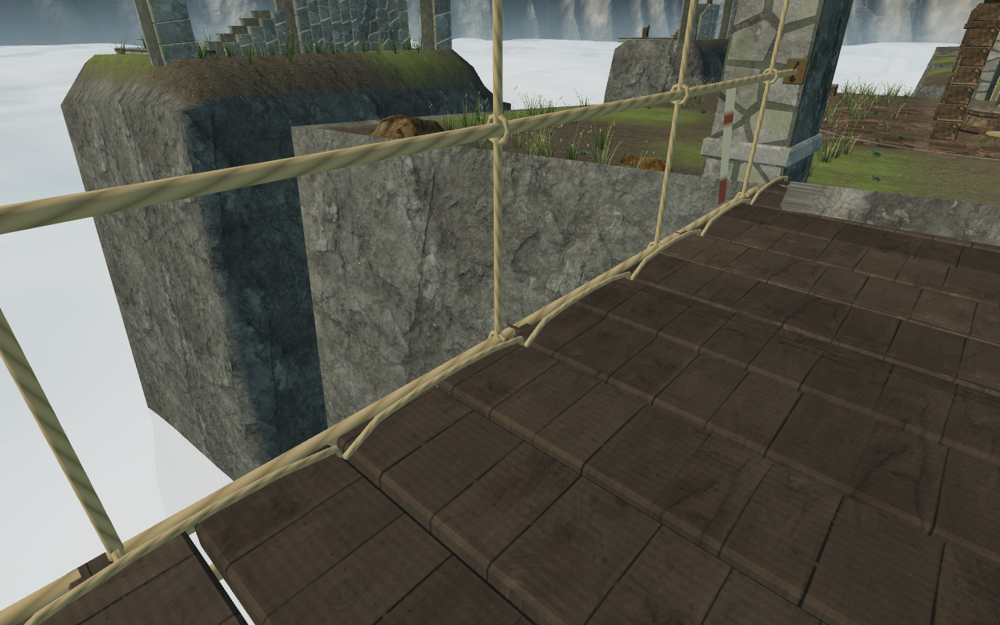
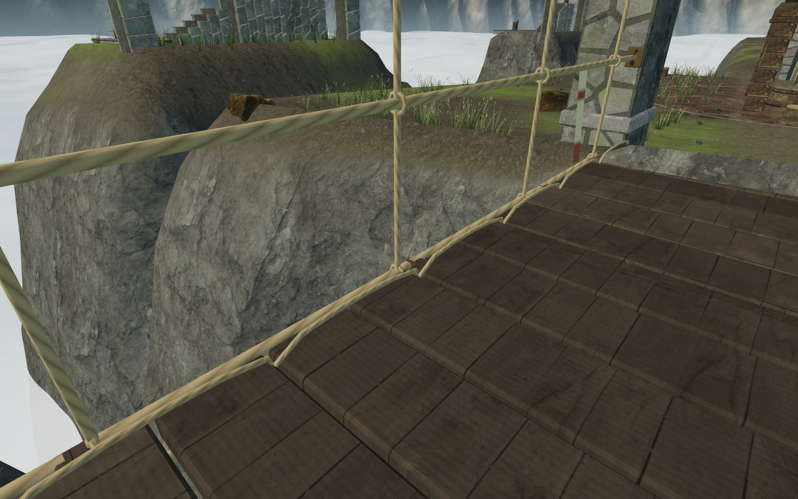
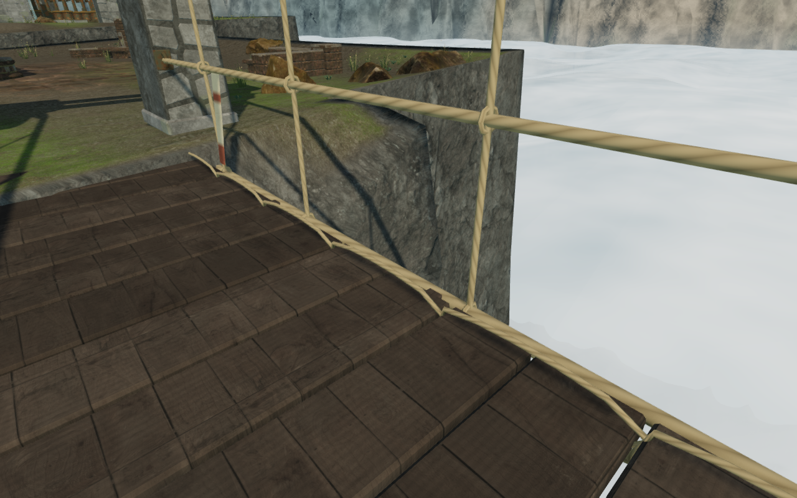
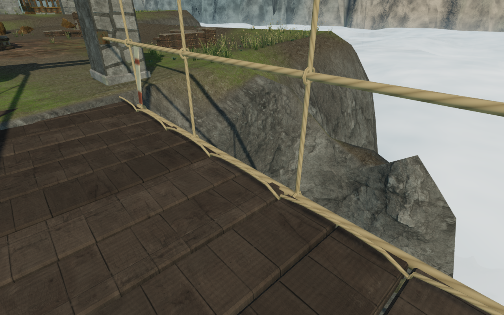

# Rounded rock shoulders on the cloud terraces

The sky chapter's banks now descend through wider, uneven rocky shoulders beside
the walking terraces. The previous bank term removed 19.7 m at the first coarse
sample 1.75 m outside a walking cell, which left square caps and nearly vertical
faces beside bridge landings. The new term removes less than 2 m there, varies its
width with seeded broad noise, and gradually joins the deep ravine beyond 26 m.
The existing erosion, layered rock material, bridge excavations and cloud bank
remain integrated.

The first landing, Low quality, before and after at the same supported viewpoint:

The upper landing, High quality, before and after:

## Ground and placement

`src/sky-banks.js` supplies the new sky-only bank profile. It changes 105,759
refined terrain vertices outside the walking grid, with a largest rise of 31.28 m.
The existing erosion can also lower some of those vertices by up to 0.221 m relative
to the previous surface. This is a substantial reshaping of the visible cliff
shoulders, while the recorded **93,632 walking-grid vertices**, **4,779 working-pad
samples**, **18 complete bridge records** and **three reservoir records** retain
their shipped values exactly. Regression digests were recorded from `d4bf68e`
before the change. Deep-bank values remain unchanged beyond the shoulder blend.

The terrain retains its 81 chunks and 476,288 triangles. It remains a heightfield:
there are no new overhangs, and the authored route grid still influences the larger
island outlines. Bridge cuts retain the crossing gaps and their existing approach
elevations.

The broader ground supports more of the existing alpine planting. The regenerated
layout places **12,375 plants** in 376 batches: 4,533 green bunchgrasses, 5,085 dry
mixed grasses and 2,757 cushion plants. The same placement rules reserve paths,
bridge approaches, working areas, water, rocks, discovery stances and the doors'
complete motion envelopes. No external art, audio or dependency was introduced.

## Verification

All **704 automated tests** pass with concurrency limited to four. Four new
regressions check the shallow varied cap, retained deep ravine, complete walking
vertex digest, working-pad digest and bridge/reservoir metadata. Existing terrain
checks retain shared-edge heights and normals, deterministic erosion and matching
mesh/query coordinates. The production build passes with its existing large-chunk
advisory.

The [bank-view helper](../scripts/inspect-sky-banks-browser.js) establishes
bridge-supported observer positions, checks actual deck support and camera space,
and looks back at both sides of every landing. All **78 matched bank views** were
reviewed: 72 High views and six Low views. The **92 court, ground installation,
discovery and Low wall views** were also reviewed after reshaping. These are
assisted art-review cameras with disposable deployed bridges.

Both fresh and restored-gate vegetation layouts pass **3,019,248 root probes per
layout** against the actual delivered terrain vertex/index buffers. No floating
roots or detected machinery/door-envelope overlaps occur; the highest root is
1.00 cm below the rendered ground. Plant matrices match exactly after reloading
with all nine gates restored. All observed shaders link.

All nine thresholds, 59 feature approaches, 18 discovery working positions,
119 wind controls and 260 wind-source fronts retain clear access. The 119 local
movement legs arrive in 10,125 simulated frames. All 18 gate-drive sources retain
an audible walking approach.

The repeated continuous opening journey records **564.3 m** in 8,374 simulated
frames through the delivered controller. Climbs, the rope swing, cable return,
both first-sector bridges, both winches and the return to arrival pass. The three
field controls complete through their real interaction method. Health stays at
100, the largest frame step is 0.841 m, and all 63 route captures were reviewed.
Steering is assisted; guardian AI and combat are not advanced, and the counterweight
puzzle remains unsolved.

All **36 bidirectional crossings of the 18 spans** also pass through the current
crosswind-enabled player controller, totaling 1,666.6 m in 23,724 simulated frames.
Recorded wind reaches 2.3 m/s, health stays at 100 and no frame step exceeds 1 m.
All 36 arrival captures were reviewed. These cases start at each bank in disposable
restored-field states; they do not establish continuous completion of later sectors.
The 54 bank-route searches also reach their targets. Their reusable inspection
helper now aims at each station's working side rather than its occupied pedestal
centre.

Native production verification covers exterior and opened-threshold movement on
keyboard High at 1280 × 800 and touch Low at 540 × 900. All four cases and eight
complete-store reload comparisons pass, apart from last-played timestamps. Their
eight captures were reviewed, health remains 100 and no camera adjustment is
needed. Current production bundles load without a development handle or browser
errors/warnings. Threshold fixtures restore field work beforehand; those cases
verify walking and persistence rather than native completion of that work.

## Workload and sound

At the same bank observers, whole-scene submissions are:

| View | Previous: calls / triangles | Rounded shoulders: calls / triangles |
| --- | ---: | ---: |
| First landing, Low | 110 / 564,734 | 111 / 578,508 |
| Middle landing, Low | 479 / 1,146,712 | 478 / 1,148,302 |
| Upper landing, High | 403 / 1,736,733 | 419 / 1,805,725 |

The terrain triangle count is unchanged; regenerated vegetation and rock placement
alter visible scene submissions. These verification-browser observations do not
establish consumer-hardware frame rates. Documentation images are lossless WebP
conversions of game captures, verified for decoded pixel identity.

The opening route retains loaded positional hoist and bridge-wind voices, each
matching its distance, activity and obstruction gain. During the same quiet wind
phase, distances of 2.38, 10.35 and 18.34 m produce gains of 0.0384, 0.0330 and
0.0271. The chapter remains `sky`, the bridge selects the `crosswind` objective,
and its sampled score bar contains only pad and bass events. Audio content is
unchanged; these observations verify playback and reactive mixing rather than
subjective listening quality.

The [playable-world audit](visual-audit.md) remains open. Broad bare court shoulders,
repeated field/discovery footprints, later continuous routes and the other
chapters' landscape composition still need review. This milestone does not
establish AAA graphics or completion of the broader visual target.
