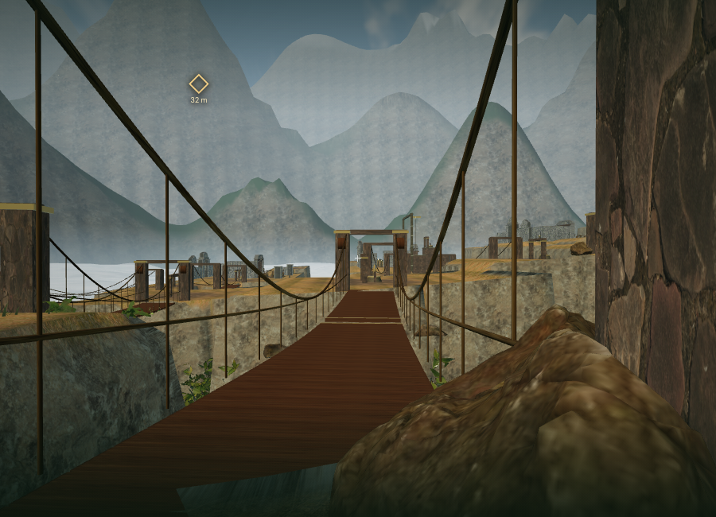
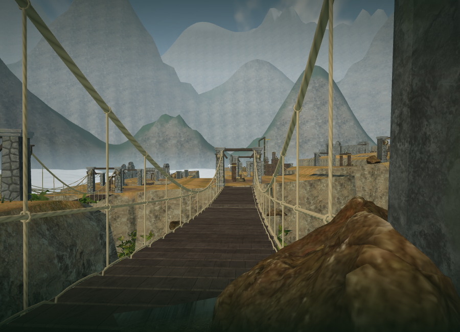
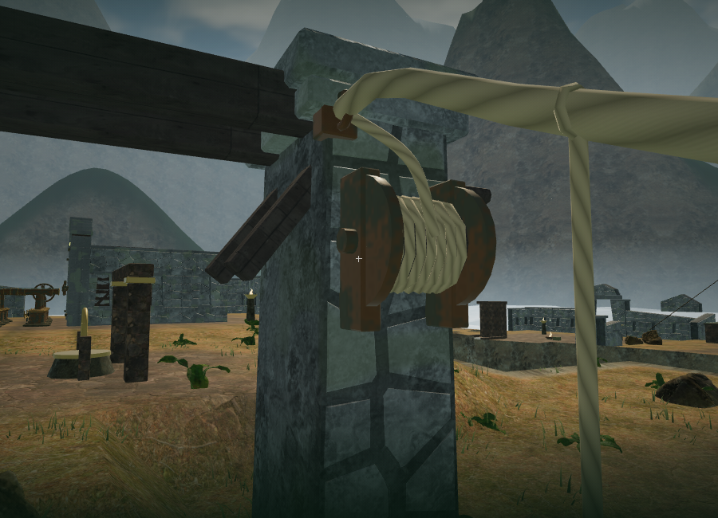
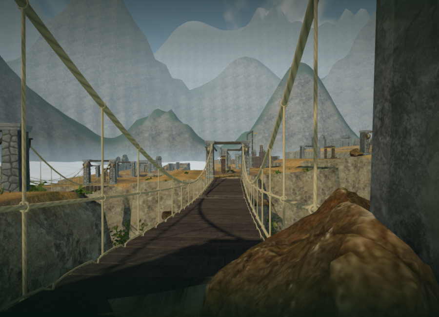
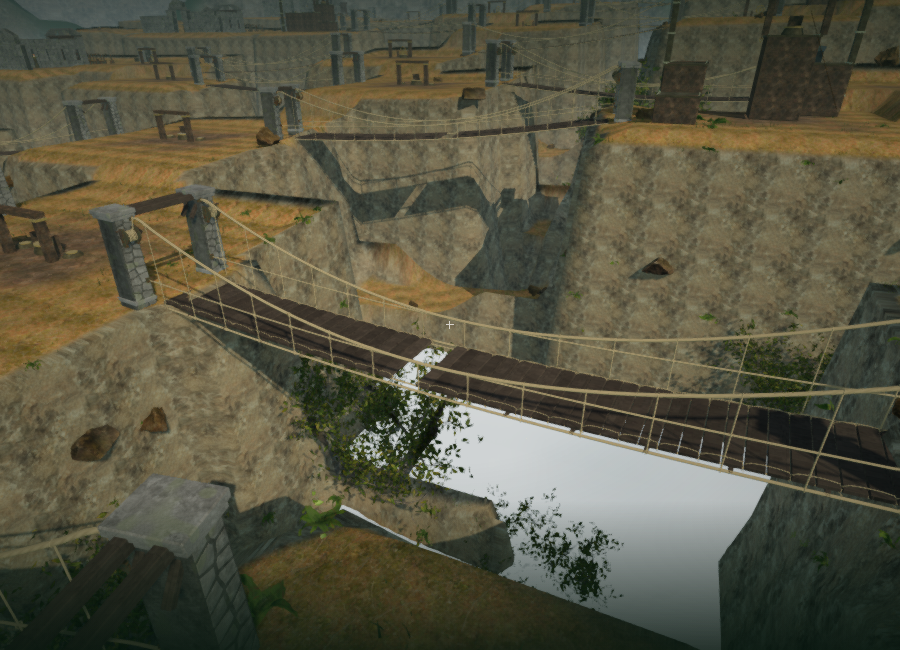

# Cloud-city bridge construction

The eighteen suspension crossings now use fitted-granite anchor piers, supported timber headers and bronze cable sockets. Each bank has two cable drums with fixed cheeks, a wound barrel, an axle and a turning handle. Their rotation follows the existing deck deployment. Shallow packed backing closes joints visible from the sides of the narrow piers.

Deck boards have beveled edges, varied weathering, physical-scale wood coordinates and flat walking faces. Lashings bind adjacent boards to their moving carrying ropes. Transverse bearers rest over a permanent rope cradle when the deck is down. Hanger knots connect the cradle, handline and main suspension cable. Brighter boards retain the visual cue around the existing jump gaps.

The paired deck halves retain the established folding motion, saved winch requirements, support heights, missing-board gaps and safety tether. This is a more complete construction model; it does not simulate a flexible suspension bridge or rope tension.

## Materials and sound

The new geometry and fibre/timber shaders in `src/sky-bridge-art.js` are original project code. Granite reuses the local cloud-city rock maps and weathering. Timber reuses the monastery wood maps, and the fittings reuse the wind machinery's bronze shader. Rope strand and fibre shading is procedural, with derivative-based fading for distant detail. No new external art, recordings or music were downloaded.

Each span retains its wind and central rope source and adds four localized bank-drum sources: 108 registered bridge sources in total. The drum cues use the original rope synthesis, HRTF positioning, obstruction filtering and a linear 2–22 m fade, at gain 0.14 before the shared mix. They follow deployment and become silent at rest. All bridge sounds share the existing twelve-loop voice limit with the surrounding world. The quiet cloud-city score and persisted music/ambience/effects controls remain in place.

Fine deck lashings have a 48 m range; bank hardware and hanger knots have an 85 m range measured from the span centre. The main deck, anchor structures and carrying cables retain their structural draw groups. These policies reduce rendering work without disabling movement or camera collision.

## Rendered evidence and verification

The original bridge at the matched Low camera:

The finished Low view:

The bank's rope connections and cable drum:

The same approach and a view across the deployed span in High quality:

The eighteen bridges contain 378 mesh objects and 690,696 triangles across their static, moving and detail groups. The matched Low front view submitted 535 calls and 1,022,109 triangles across the scene, compared with 508 calls and 880,892 triangles before this pass. These are selected 900 × 650 ANGLE/SwiftShader workload measurements, not consumer-hardware frame rates. The repeatable viewpoints are in `scripts/inspect-sky-bridge-art-browser.js`.

The High approach submitted 1,686 calls / 3,862,544 triangles; the High span view submitted 1,723 / 4,200,725. All observed shaders linked. The counts include surrounding landscape, vegetation, machinery and rendering passes.

All 259 tests passed, and the production build passed with the existing large Three.js chunk advisory. New coverage checks closed, outward-facing beveled boards with flat walking faces; physically scaled rope coordinates; continuous side-view pier backing; retained GPU attributes after batching; geometry and detail budgets; rotating drums; source placement, distance falloff and silence at rest. The existing eighteen-span physics, missing-board recovery, moving camera surfaces and saved arrival tests remain passing.

The complete browser world retained all 59 sampled feature approaches and all 54 bank paths. All 36 bidirectional bridge crossings completed through character physics with zero falls. These checks use assisted positioning and scripted input; they do not establish human chapter duration or unassisted difficulty.

All 72 new drum sources had clear standing and sound-line positions on their approach sides. A native E press restored `field-2-0` and immediately saved it. After 0.25 simulated seconds the linked bridge was 0.34623 open, its drums had turned by ±6.52629 radians, and their activity was 1. The live sky/winch mix selected six voices out of twelve, with default mix 32/80/75. Two unobstructed drum voices at 3.958 m and 7.272 m reported gains 0.12629 and 0.10310, matching the configured linear distance fade. At full deployment, all four linked drive activities were zero and their active voices had retired.

The final High production build accepted native E at the fixed-bank winch and W to walk. A paused reload restored the exact saved position `(119, 120.50000000000001, height 0)`, stage 2, `field-2-0`, route version 1, health 100 and 147.87240000003578 recorded active seconds. No asset requests failed, the development hook was absent, and the production console reported no warnings or errors. The software-rendered input check was slow and moved only 0.3 m; it does not establish sustained responsiveness or hardware performance.

Switching to the crystal chapter released all 379 bridge/tether geometries, five materials and six textures. No bridge records, tether, registered bridge sources or old voice references remained. Development and production test saves were cleared and both launchers returned to High quality. The development console also reported no warnings or errors.

The original campaign goal remains open. Modern AAA graphics, consumer-hardware frame rates, subjective sound evaluation and approximately one-hour chapter pacing have not been established. See [production status](production-status.md).
