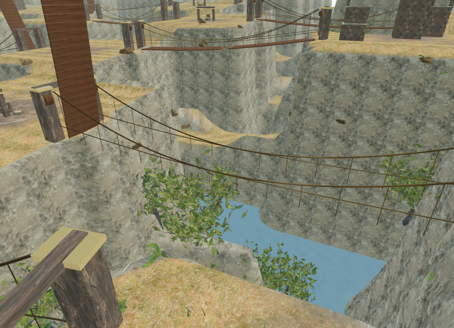
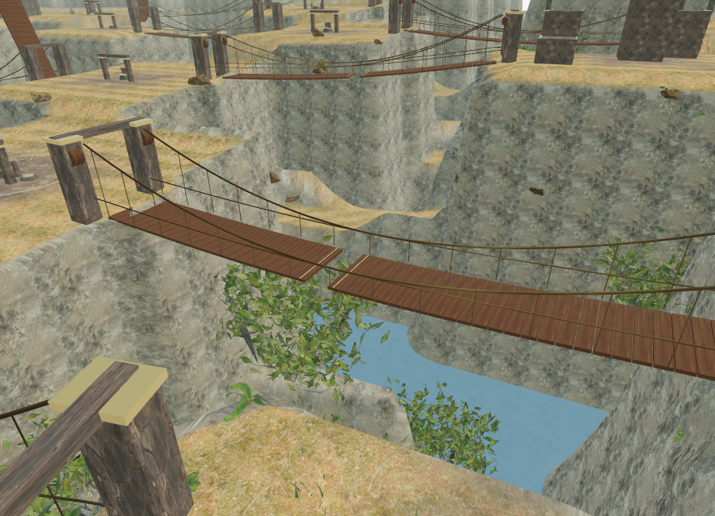
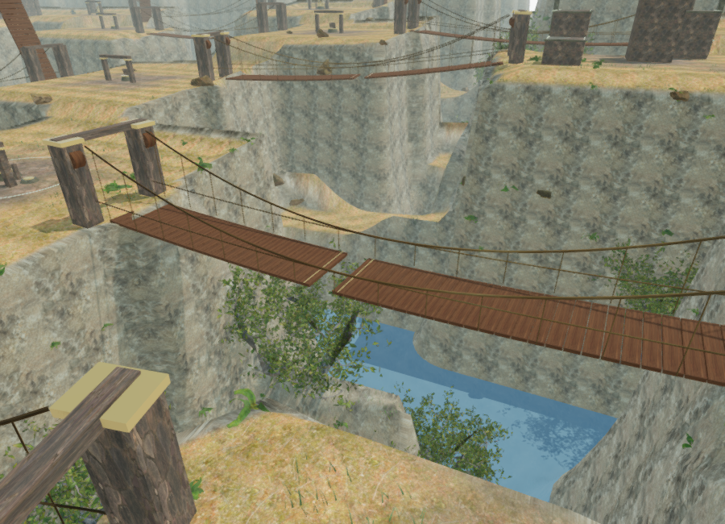
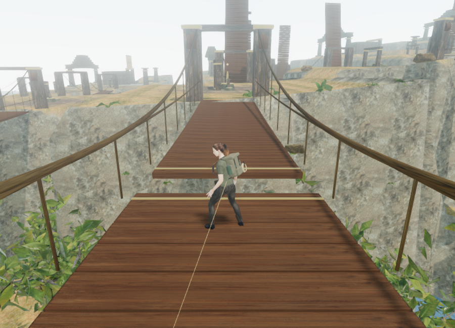

# Cloud-city crossings and responsive sound

The subsequent [bridge construction pass](sky-bridge-art.md) replaces the original primitive anchors and decking, adds rope fittings and rotating bank drums, and gives those drums localized sound. Its source counts and rendered costs supersede the historical measurements below.

Where Eagles Sleep now has an authored route between ten alternating cliff courts, with twenty-seven ordered field stations and eighteen physical suspension bridges. The crossings replace the previous decorative terraces. Each pair of spans connects three stations between successive courts; solid causeways connect the shared banks to the sanctuaries. Existing mechanism, discovery, camp, guardian, and field-action identifiers remain intact.

The bridges span approximately 41–42 metres over ravines cut 24 metres below their sagging decks. Their bank joins retain the original foundation height. Paired plank decks fold up from the anchors until the linked winch or route anchor is restored. Cargo and survey crossings are already deployed. Completing the sector's three stations still opens its sanctuary gate.

The first pair has continuous decking. Subsequent pairs have one missing-board gap per span, increasing to two in the last four sectors. Each gap is approximately 1.6 metres wide, with brighter plank edges. The rendered boards, camera surfaces, folded barriers, and walking support use the same span and gap definitions. Raised deck halves block the explorer until deployment finishes.

A visible tether runs from the last bridge bank's handline to the explorer's waist. Missing a jump returns the explorer to that bank, spends a small amount of stamina, and preserves objective progress. Bridge jumps use the existing Space / Jump control. The field guide and nearby prompts explain the winches, gaps, and tether.

## Sound and lighting

Each span registers wind and rope-creak sources at its centre: **36 sources** share the existing **12-voice** spatial budget. Rope activity rises during deployment and while the explorer is on the bridge; a low, slowly varying baseline remains between interactions. Creaking uses modulated, inharmonic low tones and filtered friction noise with a soft pulse envelope. The existing loop preparation normalizes level and blends the loop boundary.

The rope emitter uses a 3–25 m linear distance fade and HRTF direction. Wind uses 3–55 m. Both retain the engine's obstruction filtering, distance prioritization, and persisted mix controls. The sky chapter keeps its quiet 60 BPM flute arrangement, with objective-specific voicing and quieter reading/puzzle modes. Default music, ambience, and effects levels remain 32/80/75.

A live isolated rope voice, with activity fixed at 1 and occlusion disabled to measure distance alone, reported:

| Listener distance | Effective voice gain | State |
| --- | --- | --- |
| 2 m | 0.18000 | Active |
| 8 m | 0.13909 | Active |
| 16 m | 0.07364 | Active |
| 24 m | 0.00818 | Active |
| 26 m | — | Retired |

The panner reported HRTF, linear falloff, and the configured 3/25 m radii. These gains are before the overall mix. An assisted call through the interaction handler completed `field-2-0`, moved its bridge from 0 to 0.34623 open after 0.25 simulated seconds, and raised creak activity to 0.95184. After deployment settled, activity returned to 0.35184. The next span remained folded throughout.

A cooler analytical daylight sky now supplies the visible sky and filtered environment lighting. The chapter no longer uses the jungle panorama. Decks and ropes reuse existing local monastery wood and bark textures; no new external assets were downloaded.

The subsequent [cloud-city atmosphere pass](cloud-city-atmosphere.md) adds layered mountain ranges, animated high clouds and a displaced valley cloud bank, with revised direct and fill light. Its route checks retain these bridge and bank crossings.

## Rendered views

These are actual 900 × 650 browser renders with the HUD hidden. The first three share a camera overlooking the first span in the third sector.






The selected deployed view submitted **523,621 triangles / 301 calls** in Performance quality and **3,355,118 / 1,456** in High across the rendering passes. The closer High crossing view submitted **2,367,887 / 1,868**. There are 1,822 camera surfaces in this chapter, including moving planks captured before geometry batching. Decorative bridge details have an 85 m draw range. These workload observations do not establish a supported frame rate; the High cost still needs optimization and hardware measurement.

## Persistence

`routeVersion: 1` identifies the new sky layout. Loading an older sky save preserves objectives, discoveries, inventory, elapsed time, and completion, while moving its obsolete position and checkpoint once to the current sector's safe bank. Other chapters do not undergo this migration.

A grounded save on a supported deck retains its exact position and height above the ravine. Loading an airborne save or one above missing boards resumes at the nearer secure bank. Neither case grants field progress.

Browser checks restored a deployed bridge position of `(147.21303885820933, 121.56482171438266)` with a saved height of `23.99936540544326` above terrain, retaining stage 2, its winch action, and 30 seconds of recorded time. A save above the gap resumed at the expected far bank `(181.06160190298445, 124.64196380936222)`, height 0. An older-layout save moved to `(84, 126)` and retained its field action, discovered page, stage, and elapsed time.

## Verification and limits

All **150 tests** pass, including six new sky tests for route construction, bank support, gap jumps in both directions, failed-crossing recovery, linked deployment, dynamic camera collision, rendered plank alignment, supported/airborne saves, migration, and cleanup outside the sky chapter. Existing terrain and water tests caught cuts overlapping shared departure pads; those connections now remain solid causeways.

Assisted checks in the complete browser world verified:

- All 18 spans crossed in both directions through character physics at the 4.6 m/s carrying speed, with timed jumps and zero falls.
- All 54 bank approach legs found routes on non-excavated ground and completed through character physics with full scene obstacles, without stalling.
- All 59 sampled non-guardian feature approaches were clear, including elevated mechanisms and climbing entries/summits.
- All 76 shader programs observed after Low/High rendering linked with empty logs.
- Loading the flooded palace removed every sky bridge, tether, terrain span, and registered bridge source, with no asset errors.

These are assisted route and state checks, not ordinary-control chapter playthroughs. Enemy pressure, player route-finding, jump readability, subjective sound quality on different devices, and full chapter pacing still require playtesting.

The production build passes with the existing Three.js chunk-size advisory. It opened the sky briefing at zero recorded time in High quality, loaded the three reused wood maps with HTTP 200 and their expected byte counts, and exposed no development hook. Native keyboard input changed the saved position from `(84, 56, height 0)` to `(84.08119208001735, 55.98376158399653, height 0)`. Pause recorded **7.499099999964237 active seconds**. A reload held the wood-color request while focus moved to another tab; preparation then opened paused and restored that exact position and elapsed time. Development and production console checks reported no warnings or errors. Test saves were cleared from both origins and High quality restored.

Chromium uses ANGLE/SwiftShader software rendering in this environment. The short production input check moved only a small distance and does not establish sustained responsiveness. The remaining repeated sanctuary forms and bridge geometry are still prototype art. Modern AAA visual quality is unmet, approximately one-hour chapter pacing is unverified, and the original production goal remains open.

Development review helper:

```js
const review = await import("/scripts/verify-sky-bridges-browser.js");
review.inspectSkyBridges(__vesper.game);
review.inspectSkyBanks(__vesper.game);
review.crossSkyBridges(__vesper.game); // assisted simulation; restores progress
review.skyBridgeView(__vesper.game, 4); // changes the observer/camera without saving
```
