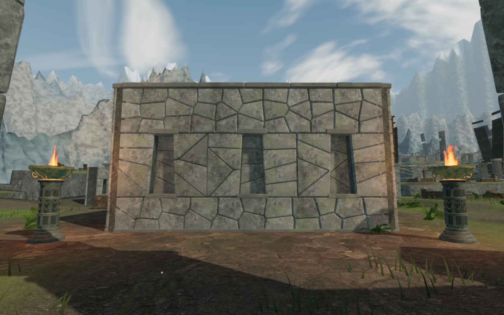
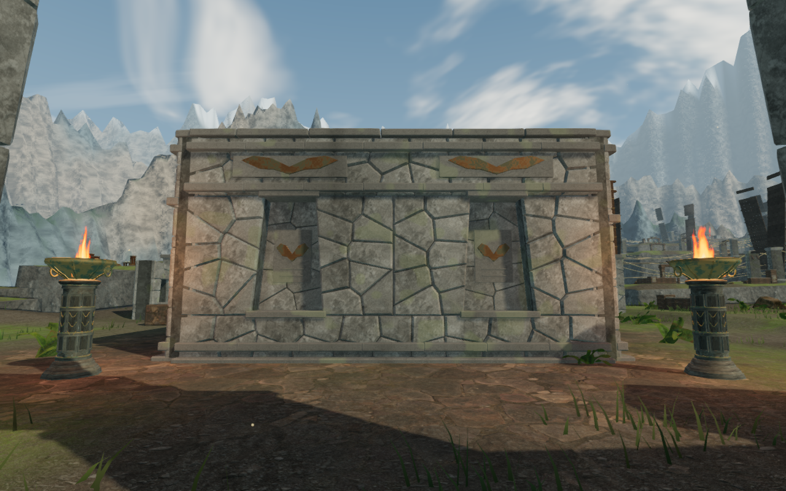
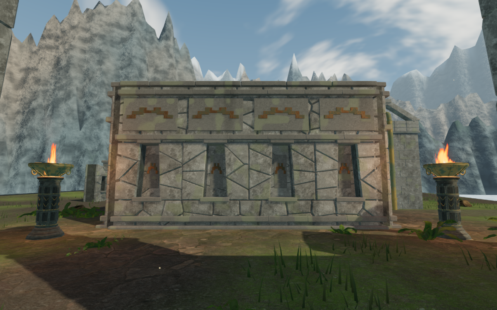
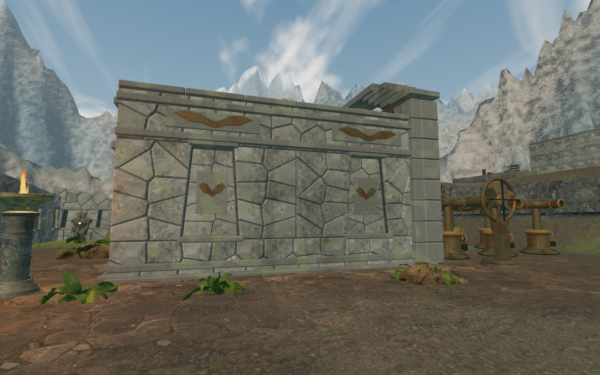

# Cloud-citadel chamber walls

The nine sky mechanism chambers now vary their outer walls between paired tall
recesses, three tapered bays and four lower bays. Jointed stone bands, supported
inset tablets and stone-backed bronze bird, crosswind and terrace reliefs give
all 27 faces more depth and a clearer regional identity. The existing wind-screen
doors and crowns remain part of the composition.

The wall arrangements contain 81 recesses and 162 bronze reliefs. They use original
project geometry in `src/sky-chamber-walls.js` and the fitted-stone generator in
`src/sky-gate-art.js`. The wall and trim reuse the existing rock and temple maps;
the reliefs use the existing weathered wind bronze. There are no new external
assets, recordings or dependencies.

The previous rear face:

The same camera with paired tall recesses and a bird frieze:

Four lower bays on the last chamber:

The middle chamber's side wall in Low quality, with its timber doors folded open
behind the wall:

## Construction and clearance

The bands stay within the established 0.85 m wall collision half-width. Full
1.6 m footings extend below a conservative sample of the rendered terrain grid.
The outer camera envelope covers the bands while retaining its previous interior
edge. The moving door transforms, control positions and restoration IDs retain
their behavior.

An open-state Low review exposed timber showing through a wider blind bay. The
front half of each side wall now has shallower backing outside the folded leaf
and rear brace. The inset tablet follows that backing. The remaining bays retain
their deeper recesses. The exterior does not expose the folded door through the
sealed niche.

Geometry tests check all 27 assembled faces: 243 rays beside inset carvings,
405 rays beneath the footing footprint, 27 outer camera probes and 729 exterior
rays with all nine gates fully open. The open-state probes require the first
visible surface to belong to the fixed wall, rather than a folded leaf. The
existing hinge, timber-fastener, saved restoration and campaign gate tests also
pass.

## Verification

All **697 automated tests** pass, and the production build succeeds. The build
retains its existing large-chunk advisory.

The final browser review contains 42 ground-level wall/interior views, including
all 27 exterior faces, nine opened interiors, three Low opened side views and
three halfway-open interiors. Another 18 views cover the first, middle and last
gates at five opening amounts and three closer rear details. All 60 final
observer captures were reviewed; shaders link and no browser errors or warnings
were reported. The opening views use disposable assisted states.

All nine open thresholds, 59 feature approaches, 18 discovery working positions,
119 wind controls and 260 wind-source fronts remain clear. All 119 assisted local
wind-control legs arrive, totaling 10,125 movement frames. All 18 gate-drive sources
retain a clear walking position with an unobstructed line of sight. These checks
do not complete the wind puzzles or step guardian combat.

At the identical first-chamber side camera, the High view submits 734 calls and
1,962,440 triangles, compared with 734 calls and 1,933,648 triangles before the
change. Low submits 277 calls and 698,369 triangles, compared with 277 calls and
691,165 triangles. The face geometry is merged into the existing gate material
batches. These are renderer workload observations in the verification browser,
not consumer-hardware frame-rate measurements.

The live sky soundscape loads `ridge-wind-0` from clear ground at 10.898 m, with
voice gain 0.620846. Valid walking positions at 14.098 m and 21.412 m have unblocked
distance-gain values of 0.584119 and 0.500186; the latter position is obstructed
and subject to the existing additional filtering and attenuation. Only the first
position was measured in live playback during this pass. The sky/climb music
state is retained, alongside the existing chapter score and quieter crosswind
arrangement. No audio was replaced; these checks establish integration and
attenuation behavior, not subjective listening quality.

The final production build passes four native movement cases: exterior and
open-threshold routes using keyboard High at 1280 × 800 and touch Low at
540 × 900. Each case walks forward and back, producing eight reviewed views and
eight full-store reload comparisons that match apart from last-played timestamps.
Health remains 100, all four current production bundles load, the development
hook is absent, and there are no browser errors or warnings. The threshold
fixtures have their field work restored beforehand; the input check verifies
walking through the opening, rather than completion of that field work.

The broader [visual audit](visual-audit.md) remains open. Shared chamber footprints,
sparse surrounding ground, other raised instruments and continuous routes still
need composition review. This pass does not establish AAA graphics, human play
pacing or completion of the campaign.
