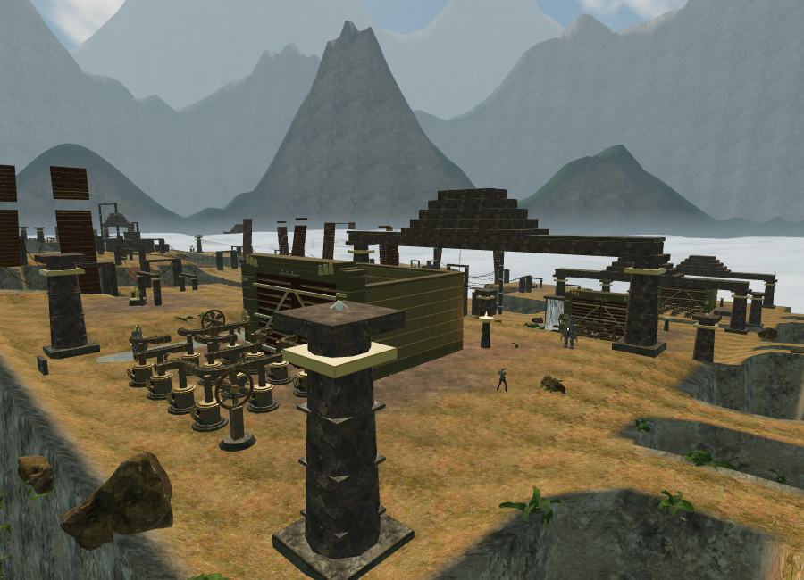
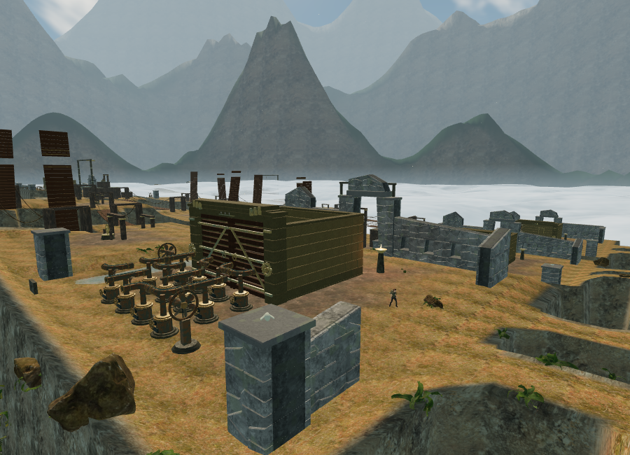
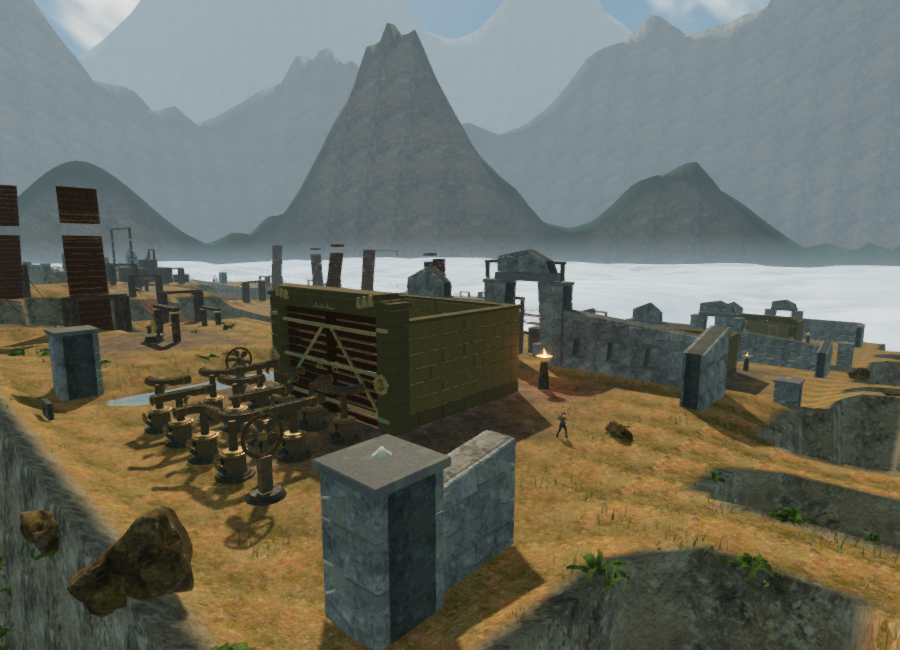
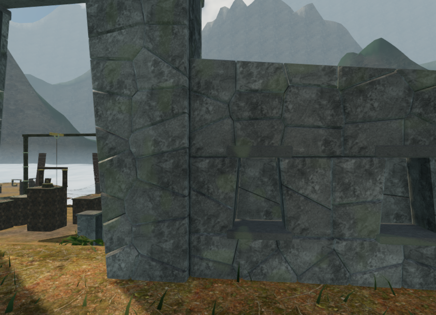

# Cloud-city citadels

This page records the original citadel milestone. The later
[masonry support correction](citadel-supports.md) fits upper towers to damaged
wall tops and levels intact coping; that page has current counts and comparisons.

The cloud-city chapter replaces its original round pillars, long lintels and stacked pyramids with fitted stone court walls, trapezoidal gateways, recessed niches and broken upper masonry. Ten plans vary gateway height, the taller side, surviving wings and wall damage. These are original fantasy ruins inspired by Andean masonry, not a reconstruction of a historical site.

`src/sky-masonry.js` partitions convex wall sections into deterministic irregular stone cells. Each stone has a closed back, beveled edges, physical texture coordinates and a slightly crowned face. Narrow recessed joints separate the fitted surfaces; packed stone behind them prevents daylight leaking through solid walls. Niches have tapered reveals, lintels, projecting sills and recessed masonry backs. Structural geometry batches by material within each court.

`src/sky-architecture.js` uses the existing locally bundled rock and temple maps with restrained color variation, streaking and lichen. No new external assets were downloaded. The sky, mountain ranges and cloud bank are documented in [cloud-city atmosphere notes](cloud-city-atmosphere.md).

The new buildings leave the central gateways and the east/west court axis open. Separate side wings leave room for the diagonal discovery paths. Camera bounds are captured before batching, while movement and sound obstruction use the structural footprints. Birds and their positional emitters share explicit perches on the new forward caps.

## Rendered comparison

The original court in Low quality:

The same court and camera with the new architecture, also in Low quality:

The new court in High quality:

A High-quality close-up of fitted stones, niche reveals and the gateway:

The ten courts contain 4,047 stones and caps totaling 174,952 source triangles, batched into twenty meshes using two shared materials. `scripts/inspect-sky-architecture-browser.js` reproduces the cameras at 900 × 650. The refreshed wide Low view submitted 702 calls and 1,245,843 triangles; High submitted 1,871 calls and 4,495,759 triangles across rendering passes. An earlier High capture submitted 2,667 calls and 7,549,260 triangles; active encounters, machinery state and detail visibility affect these counts. The checked close-up submitted 380 calls / 723,578 triangles in Low and 1,253 calls / 3,475,535 triangles in High. All shaders linked. These are rendering-work observations from ANGLE/SwiftShader, not hardware frame rates. The wide view includes several other courts and extensive machinery; the workload remains substantial.

## Verification

The full suite passed all 253 automated tests. After the final perch adjustment, all seven affected architecture and audio checks passed. The final production build succeeds with the existing large Three.js chunk advisory. New checks cover deterministic polygon partitions, physical joints, finite closed stone solids, ten distinct plans, feature and gateway clearance, camera obstruction, niche depth, supported bird models with matching emitters, and state cleanup outside the sky chapter. A rendered slit above the niche lintels was fixed; ray samples across every northern wall now verify continuous backing through the reveals and header bands. The final browser verified that all ten bird bodies rest 0.18 m above their cap surfaces, with matching emitter positions.

The final browser world retained all 119 dry and clear wind controls, all 260 clear sound fronts and all 119 local routes with swimming updates included. All 54 bank approach legs and 36 bidirectional bridge crossings completed. All ten bird models and registered source coordinates match their new perch coordinates. Native E changed the second engine's first casting from mask 9 to 3, saved its move count and started the hand-grip state. The checked development views had no console warnings or errors.

All eighteen discovery routes also passed swept path searches through the actual movement obstacles. These started on clear ground in each court and ended at the side discovery; they are assisted connectivity checks, not full unassisted playthroughs.

A live sound check selected six loop voices from 375 registered sky sources, including the nearby perched bird, within the twelve-voice cap. The mix retained 32% music, 80% ambience and 75% effects. Switching to crystal disposed twenty citadel geometries, both materials and all six material textures, and cleared all citadel records, perches, bird models, bird sources and bird voices.

The final High production build loaded `index-BxrWbDwq.js`, `game-X2NxnkiA.js`, `three-eUiOk3Oc.js` and `index-EpzmVKat.css`. Native E advanced the second engine's first casting from mask 6 to 12 and its move count from two to three. Native W changed the saved position to `(79.34010494295333, 122.91148200010106, height 0)`. Pause recorded 221.05590000003576 accumulated active seconds and 100 health. All asset requests succeeded and the development hook was absent.

Reloading while a rock-texture request was held and focus moved to the development tab opened the release paused. It restored that exact position, health, time, stage, field actions and both wind-engine records. Development and production console checks had no warnings or errors. Temporary verification saves were cleared from both origins, and both returned to their title screens with empty chapter records and High quality selected.

These changes improve the chapter's architectural identity. They do not establish AAA art quality, a supported hardware frame rate or one-hour chapter pacing. Those requirements remain open in [production status](production-status.md).
