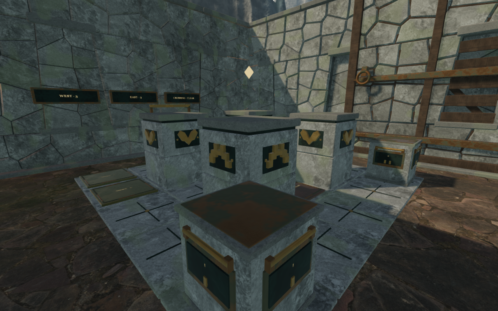
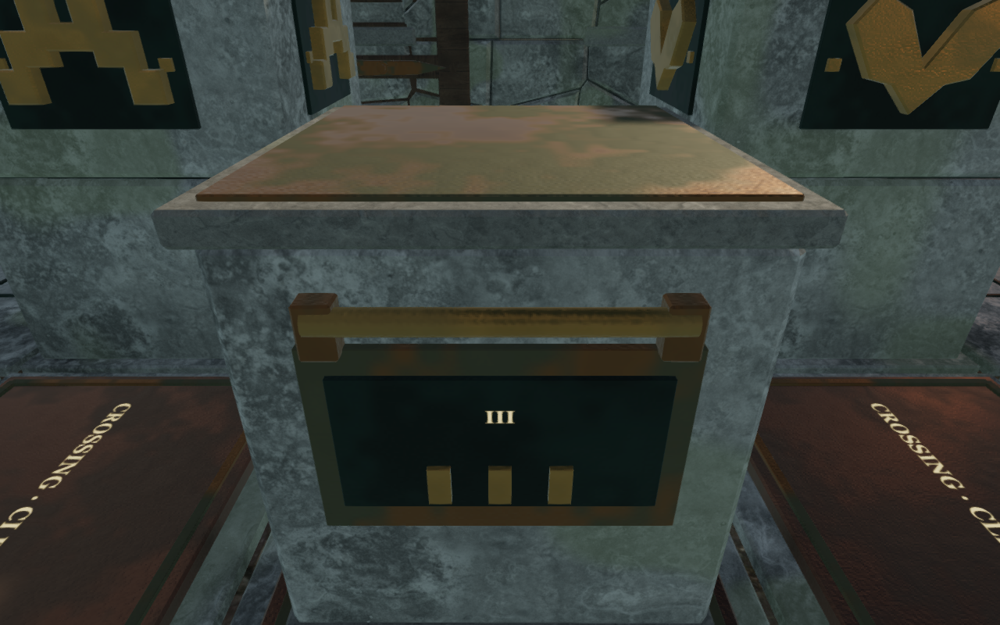
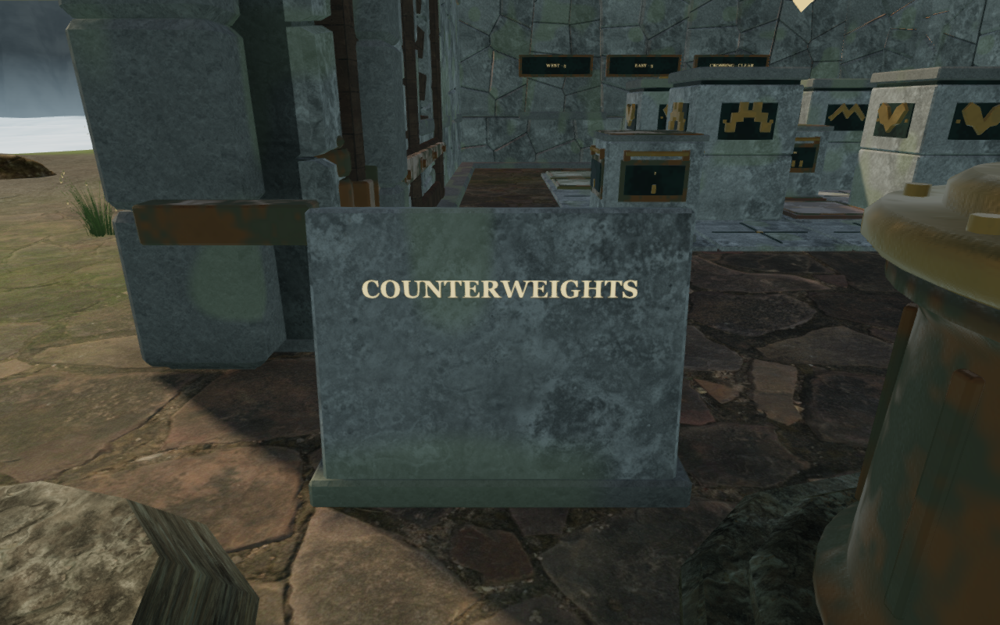
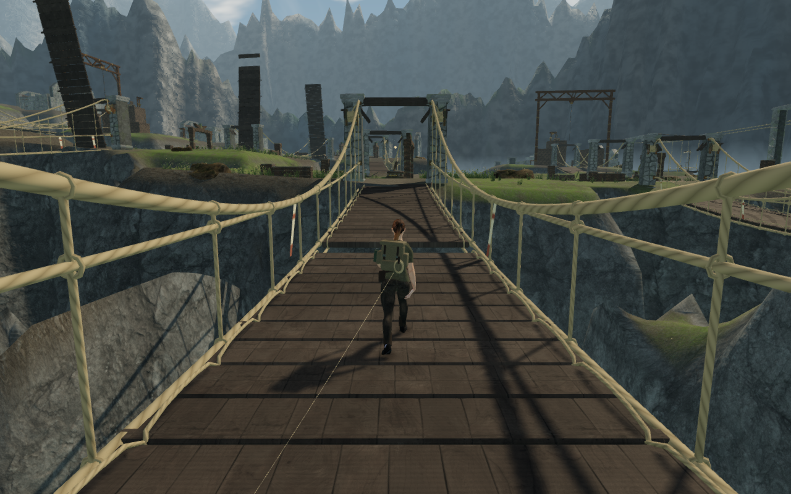

# Cloud counterweights and the carrying route

The later [regional counterweight pass](regional-counterweights.md) moves this
construction into the shared `src/counterweight-art.js` builder and dresses the
other seven chapters. The following notes and images retain this milestone's
publication-time evidence.

The first sanctuary in Where Eagles Sleep now uses dressed granite stones,
weathered bronze caps, fitted grab rails and mounted weight marks. Its fixed
pillars have two masonry courses with packed backing, and its receivers have
framed metal plates. The paving has narrow inset tracks and small bronze rivets.
Rear receiver labels sit on backed plaques. The kit uses the same stone and
metal treatments as the surrounding cloud citadel.

The entrance inscription previously faced a wind-channel pedestal, obscuring
its lettering from the approach. It now stands in the left aisle on a seated
stone base, with a clear reading position. Its lettering follows the slab's
tilt. A finite solid prevents walking through the tablet. Reset returns Vesper
to supported ground beside it, within reading range.

## Placement and movement

`src/sky-counterweight-art.js` supplies the cloud-only construction. The
five-by-five board, 1.6 m tile spacing, initial stone positions, fixed-wall cells,
receiver rules, hand targets and settled-move save schema retain their delivered
values. WEST and EAST still each require three measures, and CROSSING must stay
clear. The other seven chapters retain their existing counterweight art.

Movable fittings stay within 0.635 m of the stone centre and below its original
1.32 m height. Shoes sit on the 6 cm paving. Each stone's solid geometry is
merged into five material batches; its four labels remain attached to the moving
body. Receiver frames and lettering move with their pressure plates when loaded.
Packed backing closes the joints between the fixed pillars' courses and caps.

Small fixed pillars, moving stones and the inscription now register explicit
camera surfaces. Moving camera bounds follow each stone's current transform,
including during a slide. Walking uses the existing stone and wall collision
records; the inscription adds a bounded obstacle at its new location.

## Verification

All **707 automated tests** pass with concurrency limited to four. Three new
regressions check physical backing for all 23 labels before and after pressure
plate depression, movable fitting bounds and retained patina attributes, and
moving camera bounds plus safe tablet reset. The existing tests solve all eight
chambers through walking, gripping and swept stone movement. The production
build passes with its existing large-chunk advisory.

The continuous assisted journey begins with the opening field work already
earned. It walks to and reads the inscription, solves the chamber with **14
settled moves**, turns the first wind engine **12 times**, recovers the next
sector's lifting weight, crosses both damaged spans while carrying it, reads the
survey, delivers the weight and turns the second wind engine **15 times**. Both
wind engines activate through their normal controls, reaching sanctuary stage 2.

The controller records **467.06 m in 7,821 simulated frames**. Health stays at
100, wind reaches 1.27 m/s, and the largest recorded frame movement is 0.163 m.
There are no recorded steps over 1 m. No position or progress assignments occur
after route startup. The route's **116 captures** were reviewed and all observed
shaders link, with no browser errors or warnings. Steering is assisted; guardian
AI and combat are not advanced. This is not an unassisted chapter playthrough.

The reusable [route helper](../scripts/inspect-sky-route-browser.js) now advances
individual stone moves through the actual grip controller. Its span steering
accounts for the existing 4.6 m/s carrying speed, so the requested 4 m/s crossing
is not inadvertently reduced a second time. That correction changes inspection
input, not the game's carrying speed.

The [stationary observer helper](../scripts/inspect-sky-counterweights-browser.js)
checks supported feet and clear camera space. All **40 observer views** were
reviewed: 24 High views across fresh, partial and solved states, and 16 Low views
across fresh and solved states. Their disposable loaded progress is art-review
setup, not evidence of completing those moves. Whole-frame submissions at the
same entrance corner are:

| State | High: calls / triangles | Low: calls / triangles |
| --- | ---: | ---: |
| Fresh | 682 / 2,234,850 | 212 / 690,003 |
| Solved | 677 / 2,261,162 | 213 / 697,475 |

These counters describe this verification browser's rendering workload and do
not establish consumer-hardware frame rates.

Native production checks cover keyboard High at 1280 × 800 and touch Low at
540 × 900. Each input format grips and pulls the central stone through two settled
moves, releases it, and separately opens and closes the inscription. Their four
settled captures were reviewed. Pausing and reloading
retains the complete stored state apart from last-played timestamps. The two
stone cases also make one 75-degree arrival-camera correction; a second reload
retains that corrected camera exactly. The tablet cases need no correction.
Current production bundles load without a development handle, horizontal page
overflow, browser errors or warnings. These checks start from disposable saved
working positions; they do not reproduce the entire route with native input.

Stone friction, plate effects and quiet lifting/reading arrangements retain
their existing audio behavior. Audio implementation and content are unchanged;
this pass does not add a listening review or new distance-gain measurements.
Prior [cloud-route audio observations](sky-first-route.md) remain documented.

The four documentation images are actual game captures converted losslessly
to WebP, with decoded pixel identity verified. Exported saves, browser profiles,
raw traces and unselected captures remain in ignored local staging. Asset
attribution is retained in [the credits](asset-credits.md).

The [playable-world audit](visual-audit.md) remains open. Repeated court and field
footprints, sparse wider surroundings, the other chamber interiors and later
continuous routes still need review. This milestone does not establish AAA
graphics, human chapter pacing or completion of the broader visual target.
