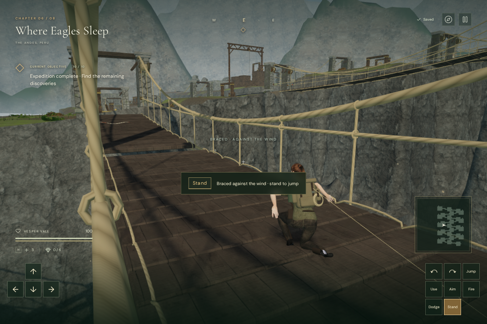
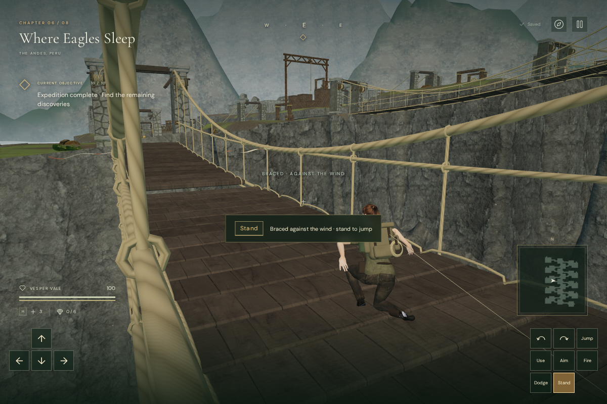
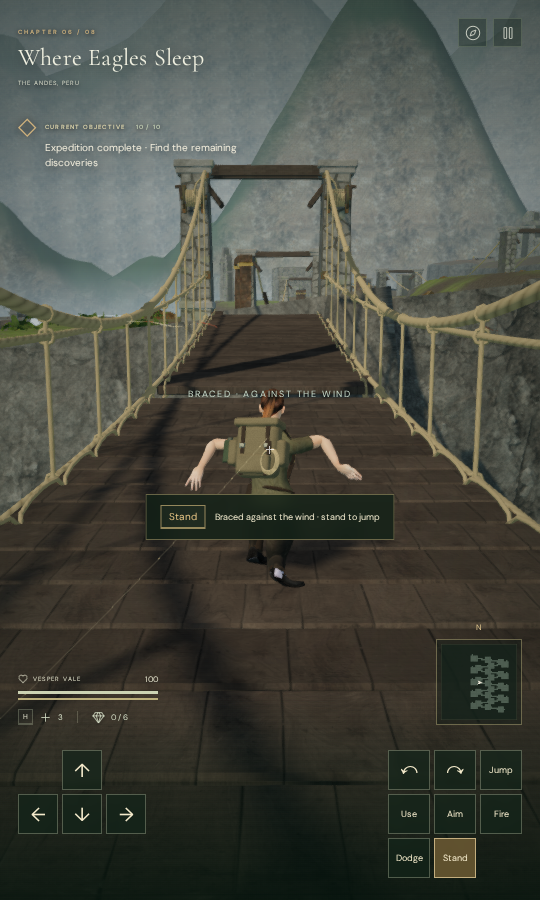

# Crosswinds over the cloud city

The eighteen suspension crossings in **Where Eagles Sleep** now have physical
crosswinds. Watch the striped cloth tied to their handlines: it rises before
a gust and trails in the direction the wind will push. Press **B / Crouch** to
brace, or steer against the wind while walking. Jumping returns Vesper to
standing, so watch the streamers and countersteer across missing boards.

The early crossings use gentle sustained gusts. Later sectors introduce
reversals and shorter alternating pulses. Every pulse has a 1.8-second warning
and each pattern has calm intervals. A player can continue through a gust;
there is no mandatory stop or timer to inflate crossing duration. The opening
pair retains its continuous decking, and the later spans retain their existing
one- and two-gap layouts.

Wind contributes lateral velocity through the ordinary body collision checks.
It fades at the sheltered ends, affects jumping bodies above the deck and
stops below the crossing. Crouching reduces drift to 3.5 percent of its standing
value. Carrying a component prevents crouching, so its crossing requires
steering or timing. The existing tether returns a missed crossing to the last
bank without losing discoveries or granting progress. The deck itself retains
its fixed sag and folding behavior; this pass does not simulate cable tension.

Vesper raises her arms for balance during a gust when her hands are free. The
HUD identifies bracing, and touch prompts use Crouch/Stand labels. The chapter
briefing and field guide explain the controls. Pausing freezes gusts, streamers
and movement. Supported deck saves retain their position; airborne arrivals
still recover at a secure bank. Wind phases restart with a calm opening when
loading a chapter; no new persistent save fields are required.

## Sound and artwork

The existing positional wind loop rises with the warning and gust envelope.
It retains HRTF panning, linear distance falloff, obstruction filtering and the
shared twelve-voice limit. The eighteen bridges still register 108 total sound
sources; this change adds none. The cloud-city score keeps its existing harmony
and bass during a crossing, leaving out the flute melody so the warning wind
has more space. Normal objective music resumes off the bridge, and persisted
mix controls continue to apply.

Six tapered, striped streamers are tied to each bridge’s fixed handlines. Their
vertices and normals update together, including the geometry used for shadows.
The 108 ribbons add **4,320 triangles in eighteen meshes**, sharing one original
woven-cloth material, with a 110 m visibility range measured from each span’s
centre. The roots remain fixed while the tips lift and reverse. No external
asset, recording or dependency was added; existing bridge assets retain their
[credits](asset-credits.md).

## Verification

All **427 automated tests pass**, including five added checks for warning
timing/patterns, bracing and shelter, both-direction crossings with carried
cargo, attached streamers and positional-source activity, and the restrained
crossing score. The original bridge checks still cover winch deployment,
camera surfaces, support heights, gap jumps, safety recovery and save migration.

The complete browser world passed **36 native-input crossings**, one in each
direction on every span, with gap jumps and 100 health. These used supplied
headings and stepped simulation; they are assisted checks rather than human
playthrough or duration evidence. The stationary bracing check stayed on the
deck, drifting 0.17136 m in eleven simulated seconds; its standing counterpart
was caught by the tether. Neither lost health.

Six presentation checks covered calm, forward and reverse gusts in High and
Performance quality, with linked shaders and no failed assets or console
warnings/errors. The braced stance retained one planted boot at 1.22–1.35 mm
clearance, while the companion boot kept its roughly 3 cm idle lift. None of
the inspected sole vertices penetrated the deck.

Portrait touch at 540 × 900 activated bracing with matching Stand labels and
no horizontal overflow. A held native touch Jump stood Vesper up and started
an airborne arc. Pause preserved the player position, gust state and streamer
vertices, and silenced the bridge wind activity.

At peak activity, an isolated live wind voice measured gain **0.32 at 3 m**,
**0.16 at 29 m**, and no voice at 56 m. Its panner reported HRTF and linear
falloff, and its score task was `crosswind`. These gains precede the overall
mix and do not establish subjective loudness. Changing chapter released the
eighteen streamer geometries and their shared material once, with no remaining
bridge, crosswind or sound-source references.

The production build passes with the existing large-chunk advisory. Its assets
are `index-Dl-KBBz-.js`, `game-D3BR2nW_.js`, `three-CJb2rOZj.js` and
`index-DYq9hjRy.css`.

Four High-quality production cases passed native input and exact whole-save
reload comparisons, excluding last-played timestamps:

| Starting save | Native input and result |
| --- | --- |
| Supported third-sector bridge position | B braces through a real-time gust; pause/reload preserves the settled position |
| The same supported crossing, muted at 540 × 900 | Touch Crouch braces; reload retains position and mute setting |
| Airborne above missing boards | Arrival recovers at the secure bank; keyboard movement and crouching work |
| Obsolete sky route version and position | Migration preserves field progress and discoveries at the current-sector bank; native movement works |

All retained stage 2, its restored field action, the discovered journal page
and 100 health. The production build exposed no development hook and reported
no failed assets or console warnings/errors.

These additions give the cloud city a distinct traversal condition. Human
chapter pacing, encounter balancing, subjective listening, broad browser/GPU
coverage and AAA graphics remain unfinished requirements.
