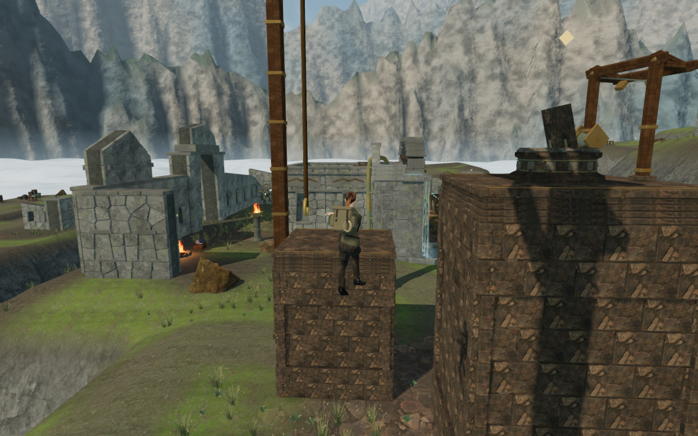
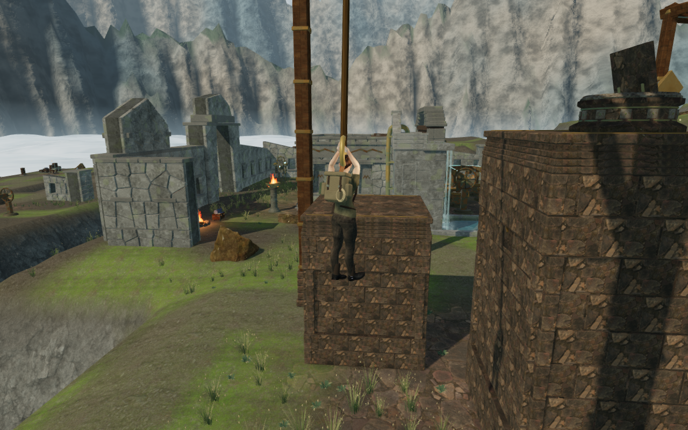
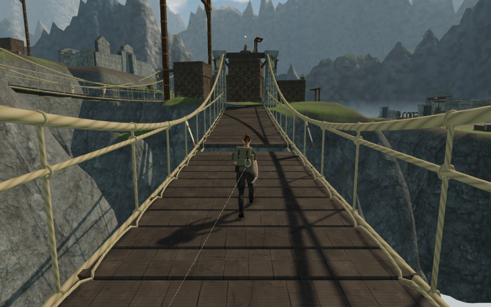

# Eagle route and continuous rope catches

The fourth sector of Where Eagles Sleep has two climbing crossings, a leeward
survey and two damaged suspension bridges before its wind engine. Following
this route exposed an abrupt rope catch: each crossing moved the explorer's
controller root by about **1.268 m in one frame**, onto the rope's swing plane.
The body also acquired its hanging lift immediately. The old checks completed
the routes but did not check that transition's frame-to-frame travel.

Catching now retains the earned first position and rope angle. A **0.28 s**
transition draws the explorer and rope into the hanging pose. The visual lift
follows that transition, and the hands reach toward the actual moving grip.
Normal pendulum movement resumes after the catch. Character bone lengths and
scales are unchanged.

The initial path and each subsequent movement are checked against ground and
solids at intervals no greater than 8 cm. A solid between the explorer and the
hanging position rejects the catch; a blocked movement releases the rope.
Releasing during the transition uses the current catch velocity and clears its
pending state. Reset clears it too. The safe-release cue waits until the catch
has finished. The catch is transient; saves retain the existing secure-ledge
recovery rather than attempting to restore an airborne transition.

## Route verification

All **719 tests pass**, and the production build succeeds with its existing
large-bundle advisory. The regression completes all **21 climbing, rope and
return-cable courses across eight chapters**, now requiring every catching,
swinging and release frame to move less than 0.4 m at a 60 Hz controller step.
Two new tests exercise an off-plane catch, early release and cleanup, and a
solid crossing the reach path that the old endpoint-only check admitted.

The continuous assisted browser journey starts from the preceding sector's
earned save. It completes both eagle climbs, their rope swings and return
cables, the survey, both damaged spans and **26 legal physical wind turns**.
It activates the fourth engine through its tablet and reaches stage 4 with
full health. No player-position or objective-completion assignments occur
after startup.

The final run records **466.370 m in 7,988 controller frames**, with no stuck
frames, no steps over 1 m and a largest step of 0.360802 m. Both catches retain
a zero-distance first step and finish over 17 subsequent frames; their largest
catching step is 0.133554 m. All **126 captures** were reviewed, including five
reach phases for each rope. Shaders link and browser errors and warnings are
empty. Steering is assisted, and guardian AI and combat are not advanced in
this route inspection.

The [route helper](../scripts/inspect-sky-route-browser.js) accepts a selected
course instead of always using the opening climb. It chooses a supported
reading position with the walking planner's corner clearance, and uses a
mantle approach within the existing reach of the longer odd-sector courses.
These changes correct inspection steering; they do not relocate the courses
or alter gameplay reach.

## Native controls and persistence

Eight production cases use keyboard High at 1280 × 800 and touch Low at
540 × 900. Each input format catches and releases both ropes onto the far
ledge, and separately completes each summit objective. These cases start from
earned route saves with a chosen camera heading. Touch jumping is held through
controller frames. All 16 playing views and their 16 paused/reload captures
were reviewed.

Pausing and reloading retains the complete stored state apart from last-played
timestamps, without an arrival-camera correction in these eight cases.
Resuming and pausing again confirms that the actual controller's feet retain
the saved landing within 5 cm, with health, field objectives, wind state and
counterweights unchanged. Four additional keyboard/touch cases pause while
catching, reload to the earned second ledge, verify its actual supported
position and then retain an exact second reload apart from timestamps.
Their eight paused/recovery captures were also reviewed. Production bundles
match the current build, with no development handle, horizontal overflow,
browser errors or warnings.

Rope effects, positioned environmental sources and the quiet sky arrangements
retain their existing synthesis and recordings. No audio content or mix rules
changed. The earlier [cloud-route audio measurements](sky-first-route.md)
remain documented; this pass adds no subjective listening assessment.

## Remaining observations

The first summit's continuous approach leaves a timber support across
the camera, hiding the explorer with an arm of about 0.400 m. A settled view
from the same earned feet and heading has a clear 5.330 m arm in both High and
Low. The second cable approach also brings a support across the foreground.
This movement-dependent framing still needs investigation; the rope repair
does not close it.

An instantaneous automated touch Jump tap also failed to release reliably in
the Low rope case; holding the press through two frames succeeds. Jump input
queuing needs its own review. Later sectors, repeated courtyard layouts,
terrain composition and the other chamber interiors remain open in the
[world audit](visual-audit.md).

The four documentation images are actual game captures, converted losslessly
to WebP with decoded RGBA identity checked. Raw traces, exported saves, browser
profiles and other captures stay in ignored local staging. Existing asset
attribution is retained in [the credits](asset-credits.md).
