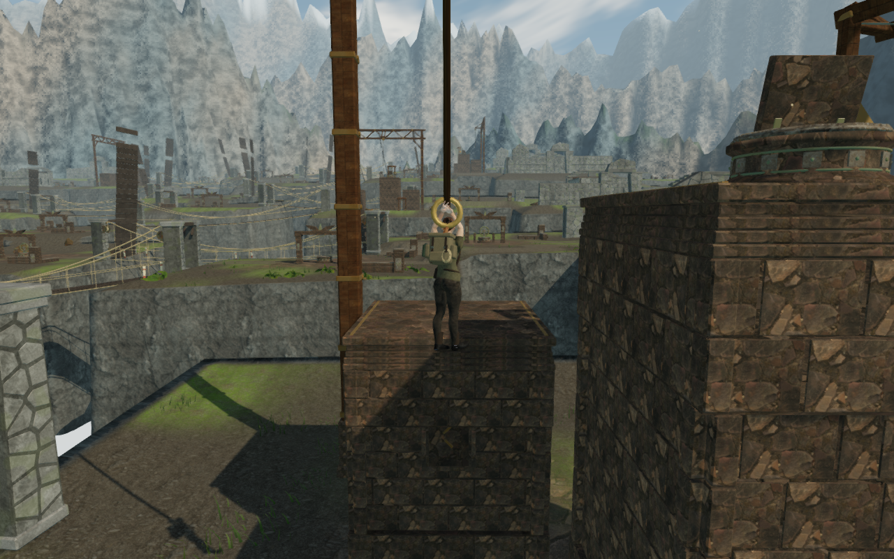
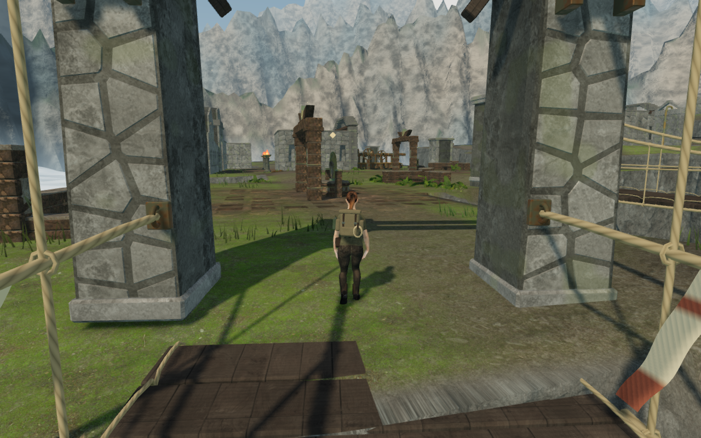
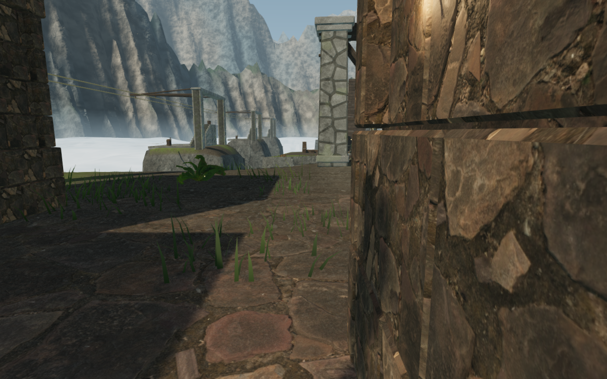
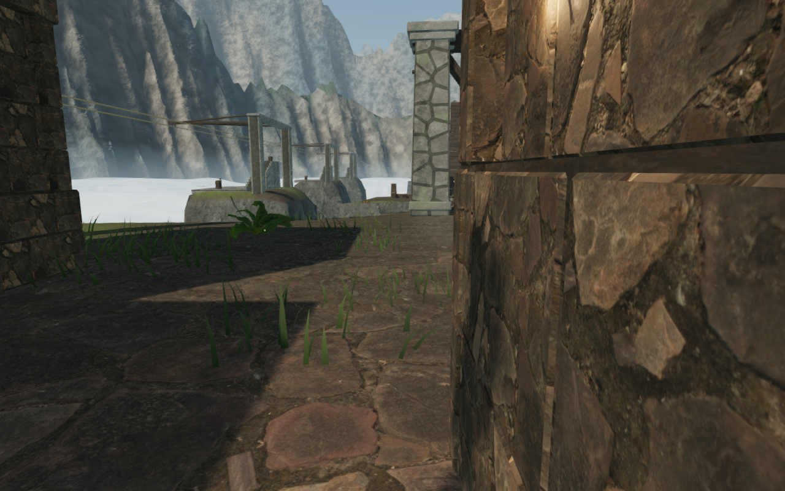

# Cloud-citadel approach and climbing-pier joints

The sky chapter now has a traversal-aware continuation of the
[initial court route survey](initial-court-routes.md). A continuous assisted
run starts at arrival, climbs the first lookout, jumps the gap, catches and
releases the rope, reaches the summit control, uses its return cable, operates
both winches, crosses both suspension bridges and reaches the first wind-court
tablet. It returns across both bridges to the arrival position. Field work uses
the actual interaction method and preserves its prerequisites.

The final High run records **562.4 m** of measured character travel: **314.3 m
outward and 248.1 m returning**, in 8,348 simulated 60 Hz frames. All three first
sector field objectives complete through their real controls; health stays at
100. The largest per-frame movement is 0.841 m and no frame exceeds 1 m. The
final grounded feet are within 1.5 cm of arrival, with no active climb, rope or
cable ride. Wind remains enabled and reaches the opening bridges' 0.65 peak.

The helper [inspect-sky-route-browser.js](../scripts/inspect-sky-route-browser.js)
uses the delivered character controller, support surfaces, rope prediction,
follow camera, bridge deployment and gusts. Ground and elevated path searches
assist steering; local movement sequences operate climbing and return travel.
It does not teleport between route waypoints, assign completed field IDs, solve
the wind engine, or advance guardian AI and combat. The opening sector has no
active guardians. The first wind tablet remains locked while the counterweight
puzzle is unsolved. Reaching it does not establish a complete mission playthrough.

## Joint repair

A close follow-camera view beside the lookout exposed daylight through a
horizontal wall-course joint. The narrow uniform backing was inset about
14.5 cm behind the wider outer courses. The coping also had unbacked outer
joints: an initial grazing-ray diagnostic missed solid bearing in **2,750 of
3,360 samples** across the 105 climbing piers.

The shared construction now fits up to three closed backing blocks behind each
pier's wider foot/head courses and recessed middle. A continuous inset bed also
backs the stepped coping. The visible mortar lines and regional profiles remain;
the walking tops, traversal plans, physical obstacles and full camera envelopes
retain their dimensions. The lower joint in the recorded view now has bearing
behind its outer end.

The final geometry check traces **9,192 grazing rays** through the actual merged
meshes: 5,832 at wall joints and 3,360 at coping joints, with no missed bearing at the
sampled offsets. Existing checks retain exact flat walking tops, finite geometry,
the per-course 180,000-vertex ceiling, bounded static batches and the anchor's
rope-sweep clearance. All 695 tests and the production build pass.

## Render, persistence and sound checks

The review covers all **63 final High route captures**, plus **84 close observer
views**: the first pier's coping and final pier's lower wall joint at every one
of the 21 courses, in High and Low. Their corner cameras pass the world
clearance check. Those close observers use a placed camera for geometry inspection; they are separate from the continuous follow-camera
route. Shaders link and the browser reports no errors or warnings.

Native production checks cover keyboard at 1280 × 800 in High and touch at
540 × 900 in Low. They mantle the first pier, operate the summit control and
both winches, and confirm that the unsolved counterweights keep the first wind
tablet locked. Ten cases retain health 100 and restore their complete saved
store exactly apart from timestamps. The 20 interaction/reload captures are
reviewed. These cases load the production bundles without a development handle.

Actual route audio observations confirm a running sky soundscape, a loaded
positional hoist voice during the rope swing and five loaded first-bridge wind
observations. With the same full gust activity, moving from 13.70 m to 5.68 m
from the wind emitter raises its recorded gain from 0.254 to 0.304. During a
quiet phase, moving from 2.38 m to 10.35 m and 18.34 m lowers gain from 0.0384 to
0.0330 and 0.0271. All six observations agree with the configured distance,
activity and occlusion gains. Crossing selects the `crosswind` objective and
its sampled bar contains only the existing quiet pad and bass events. These
checks verify loaded playback and reactive mixing; they do not establish
subjective audio quality or an uninterrupted listening review.

Raw traces, exported saves, browser profiles and unselected captures stay in
ignored local staging. The four images above are intentional captures of the
running game, converted losslessly to WebP. Later sectors, chamber interiors,
other continuous routes, repeated stone forms and sparse ground remain within
the [open playable-world audit](visual-audit.md). This pass does not establish
AAA graphics, human chapter pacing or completion of that broader target.
