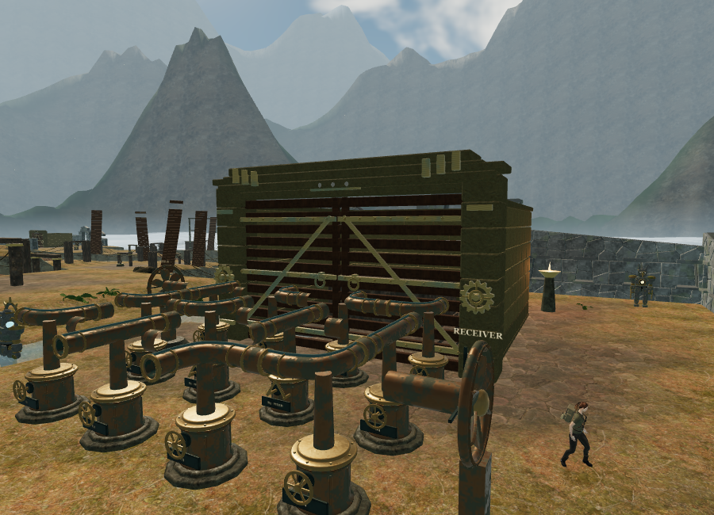
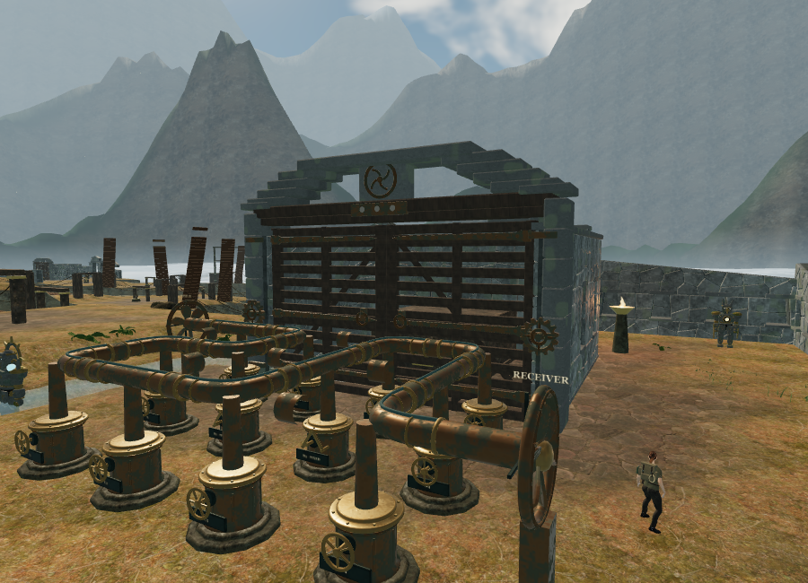
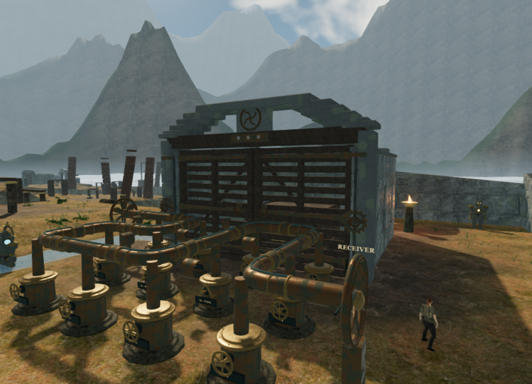
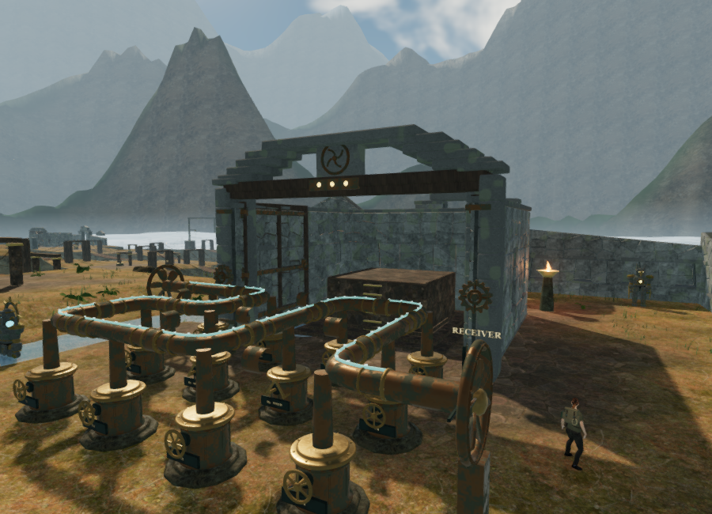
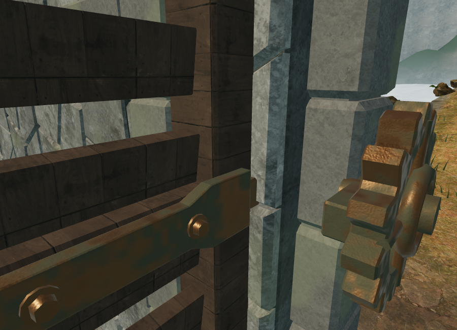

# Cloud-city wind-screen gates

The sky chapter's nine mechanism chambers now use fitted stone walls, recessed niches, timber lintels and a corbelled crown that matches the surrounding citadels. Paired timber screens have pitched laths, framed panels, diagonal braces, tapered bronze straps, washers, bolts and wooden pegs. Bronze wind emblems mark the headers.

The L-shaped jambs expose the hinge recess while retaining the established chamber footprint. Fixed and moving hinge barrels share the door axis, with a clear bore around the pin. Recessed backing closes the masonry joints. Crossrails sit beneath the hinge straps so every bolt has timber behind it; brace ends meet the outer frame and have bronze shoes.

The construction is original geometry in `src/sky-gate-art.js`, using the repository's fitted-stone generator and existing local rock, temple and timber maps. The fittings use the wind machinery's bronze shader. Timber coordinates and metal surface coordinates stay attached to their parts through batching and door rotation. No new external assets or recordings were downloaded.

Three restored field stations still open the paired leaves inward. Their moving collision and camera bounds, restoration seals, saved field state and drive behavior use the existing gate system. The drive sources retain directional HRTF audio, linear attenuation from 2 to 34 m, obstruction filtering and the shared twelve-voice loop budget. They follow opening motion and become silent at rest, beneath the existing quiet chapter and objective score.

## Rendered views

The previous gate, in Low quality:

The new gate at the same camera, in Low quality:

The new gate in High quality:

The leaves opened into their wall recesses, in High quality:

A closer view of the timber, strap and drive fitting:

The nine gates contain 153 mesh objects and 354,268 triangles, counting the three instances of each gate's restoration seals. Geometry batches within the static frame, moving leaves and nearby detail groups. The final Low front view submitted 599 calls / 1,248,528 triangles; its close-up submitted 160 calls / 586,870 triangles. The High closed front view submitted 2,331 calls / 7,397,049 triangles across rendering passes, and the open view submitted 2,007 calls / 6,033,786 triangles. All shaders linked. These measurements include surrounding machinery and landscape at the 900 × 650 camera supplied by `scripts/inspect-sky-gates-browser.js`. State, detail visibility and shadow coverage affect these counts. They are ANGLE/SwiftShader workload observations, not consumer-hardware frame rates.

## Verification

The full suite passed all 255 tests. After the final timber-support and jamb-backing adjustments, all eight affected gate tests passed, including all 69 campaign thresholds and saved restoration. New coverage checks continuous niche backing, actual niche recess, a clear hinge pin bore, outward-facing mirrored straps, retained shader attributes after batching, timber behind the strap bolts and open hardware contained within the side-wall footprint. The final production build succeeds with the existing large Three.js chunk advisory.

In the final browser world, all nine restored thresholds and 59 original feature approaches passed. All 119 wind controls remained clear and dry, all 260 wind-source fronts remained clear, all 119 local movement routes passed with swimming updates included, and all 54 bank approaches and 36 bidirectional bridge crossings passed.

Three of the earlier five-metre gate-source probes intersect existing wind-collector posts. That obstruction correctly muffles the source. All eighteen drives have a clear, dry standing position 0.5 m in front of the emitter, before those posts. No obstacle or emitter was moved to bypass the filtering check.

A native E press completed `field-1-2` after a setup with the first two stations restored. The third field ID appeared in local storage immediately. A 0.2 s gate update produced opening amount 0.3, leaf rotations of ±0.339292 radians and drive activity 1. The live mix selected seven of the twelve available loop voices, with both gate drives fully loaded and unobstructed. The nearer drive, at 1.868 m, had gain 0.28; the opposite drive, at 13.134 m, had gain 0.18258, consistent with its linear distance model. At full opening, the threshold was clear and both drive activities returned to zero. This was an assisted transition and audio integration check, not a full unassisted playthrough.

The final High production build accepted native E to complete the third field delivery and W to walk. A paused reload restored the exact position, solved wind-engine record, stage, three field IDs, active time and health. No assets failed, the development hook was absent, and the browser reported no console warnings or errors.

Switching from the sky chapter to crystal disposed all 162 gate geometries, six materials, nine textures and nine instance buffers. The replacement chapter had its eight crystal gate panels and machine drive sources, with no references to the previous chapter's gate sources or active voices. Temporary development and preview saves were cleared, both launchers returned to High quality, and the browser console remained free of warnings and errors.

Broader campaign graphics, hardware performance, subjective listening quality and approximately one-hour chapter pacing remain open requirements in [production status](production-status.md).
