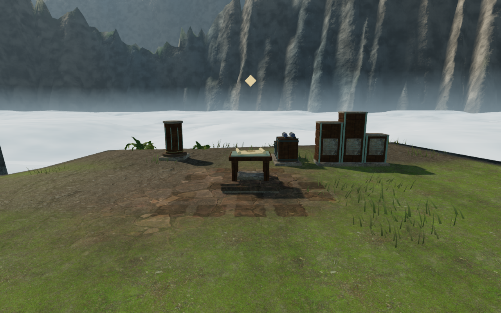
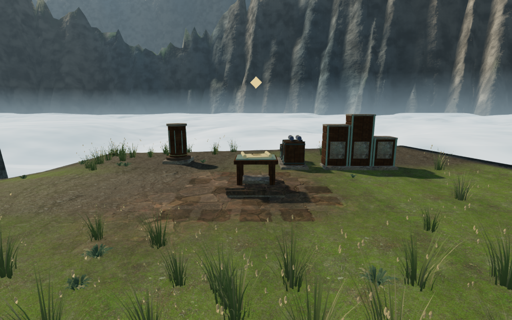
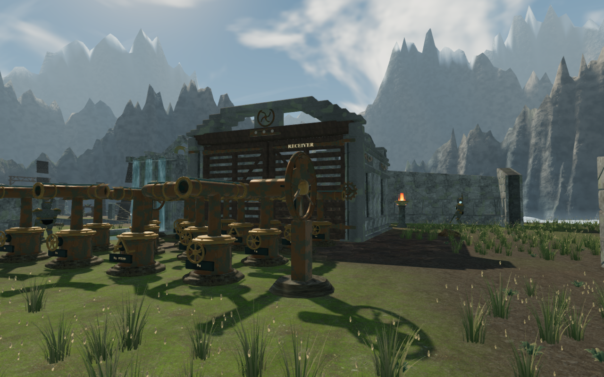
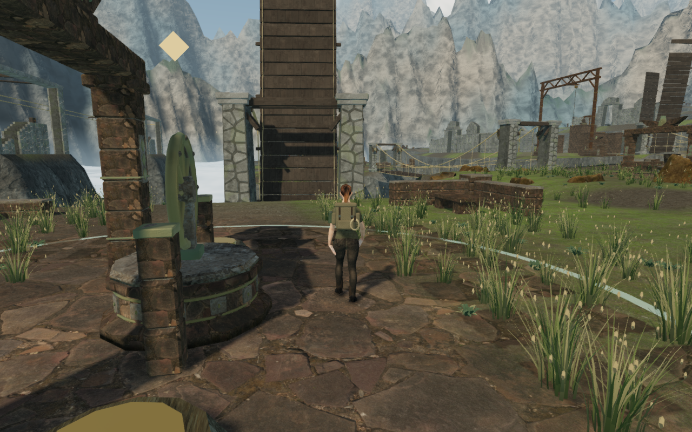

# Alpine ground cover on the cloud terraces

The sky chapter now uses original bunchgrasses and low cushion plants in place
of the shared sparse grass, jungle ferns and broadleaf shrubs. Irregular patches
of green and dry-gold foliage give the open terrace ground more texture around
the wind courts, field installations and courier chart stops. Folded leaves,
small solid seed heads, subdued color variation and gentle wind motion distinguish
this vegetation from the jungle's understory.

The previous chart-stop view:

The same camera with the alpine plants:

The upper wind court:

The ordinary follow camera approaching the first winch:

## Construction and placement

`src/sky-meadow.js` creates two bunchgrass specimens and a compact rosette.
The grasses use 1,056, 416 and 152 triangles across their three detail tiers;
the cushion plant uses 768, 288 and 96. Lower tiers retain a subset of the same
leaves, tips and seed heads. The sky chapter places **10,766 plants**: 3,993 green
grass specimens, 4,326 dry mixed specimens and 2,447 cushion plants, in 364 spatial
batches. Each batch uses distance detail, quality-dependent ranges and the existing
coverage crossfade. Wind phases follow the planted location; the roots remain fixed.

Placement reserves the complete leaning reach, including wind displacement.
Paths, bridge approaches, water, machinery, discovery furnishings, collection
stances, existing boulders and the chamber doors' full motion areas remain clear.
Each specimen's roots from all three tiers fit beneath both the movement height
field and the rendered terrain triangles. Plants spanning a sharp shelf or losing
too much exposed height are rejected. The small cushion plants use a shallower
burial allowance than tall grass.

The layout uses a separate seed and draws each candidate's parameters before
applying exclusions. Adding a reservation therefore removes affected plants
without shuffling retained plants elsewhere. Quality switches select detail tiers
without moving plants. Reloading a disposable save with all nine sanctuary gates
restored produces exactly the same plant matrices as a fresh sky chapter.

The original geometry, vertex colors and wind shader require no new images,
recordings, external models or dependencies. The sky chapter also stops requesting
the five fern/shrub model files used by its previous vegetation. Other chapters
retain their existing vegetation. The documentation images are lossless WebP
conversions of actual game captures, checked for decoded pixel identity.

## Verification

All **700 automated tests** pass with test concurrency limited to four, and the
production build succeeds with its existing large-chunk advisory. New tests check
finite geometry and wind bounds, actual roots against independently raycast terrain,
complete vegetation reach near working areas, stable placement, quality changes,
distance culling and identical color/depth wind deformation.

The reusable [browser inspection helper](../scripts/inspect-sky-meadow-browser.js)
traces **2,624,940 root probes per loaded layout** against the actual delivered
terrain vertex/index buffers. Both the fresh and restored-gate layouts have no
floating roots or detected equipment/door-envelope overlaps. The highest root
lies 1.00 cm below the visible ground; the largest burial among those probes is
43.2% of its specimen's scaled height. All compiled shaders link.

The final observer review contains **92 views**: 20 front/rear main-court views,
44 front/rear views of the 22 ground field installations, 18 discovery settings,
three Low court views, four Low field views and three Low chamber-side views.
All were reviewed. The assisted local checks retain clear access to all nine
thresholds, 59 feature approaches, 18 discovery working positions, 119 wind
controls and 260 wind-source fronts. All 119 local movement legs arrive,
totaling 10,125 simulated frames; all 18 gate-drive sources retain an audible
walking approach. These observers and local checks use disposable assisted states.

The continuous opening-route check repeats the
[climb, rope and bridge journey](sky-first-route.md) through the delivered controller.
It records **562.4 m** of character travel in 8,348 simulated frames, completes the
three first-sector field controls through their real interaction method, and
returns within 1.5 cm of arrival with health 100. Its largest frame step is 0.841 m;
there are no steps over 1 m. All 63 final route captures were reviewed. Steering
is assisted, guardian combat is not advanced, and the counterweight puzzle remains
unsolved. This is route coverage rather than a complete mission playthrough.

Native production verification covers exterior and opened-threshold movement on
keyboard High at 1280 × 800 and touch Low at 540 × 900. All four cases pass, their
eight captures were reviewed, and all eight complete-store reload comparisons match
apart from last-played timestamps. Health stays at 100 and no camera adjustment is
needed. The current production bundles load without a development handle; the
browser reports no errors or warnings. Threshold fixtures restore field work
beforehand, so those cases establish movement and persistence rather than native
completion of that work.

## Rendering workload and sound

At identical observer cameras, the renderer submits:

| View | Before: calls / triangles | Meadow: calls / triangles |
| --- | ---: | ---: |
| Arrival court, High | 557 / 2,234,211 | 587 / 2,892,819 |
| Upper court, High | 2,617 / 7,604,101 | 2,640 / 8,177,819 |
| Upper court, Low | 1,098 / 2,645,052 | 1,112 / 2,780,707 |
| First chamber side, Low | 260 / 693,228 | 250 / 679,167 |

The denser foliage increases triangle workload in the open views; removal of the
shared fern/shrub batches lowers some views' call counts. These observations are
from the verification browser and do not establish a consumer-hardware frame rate.

Live route observations retain a running sky soundscape, a loaded positional hoist
voice during the rope swing and five loaded bridge-wind observations. Each recorded
gain matches the configured distance, activity and obstruction calculation. During
the same quiet wind phase, moving from 2.38 m to 10.35 m and 18.34 m lowers gain from
0.0384 to 0.0330 and 0.0271. The bridge selects the `crosswind` objective; its sampled
score bar contains only pad and bass events. Audio content is unchanged. These checks
establish playback and reactive mixing, rather than subjective listening quality.

The [playable-world audit](visual-audit.md) remains open. Some court shoulders are
still broad and bare, and repeated chamber, field and discovery footprints remain
visible. Later continuous routes and the other chapters' landscape composition
need further review. This milestone does not establish AAA graphics or completion
of the broader visual target.
