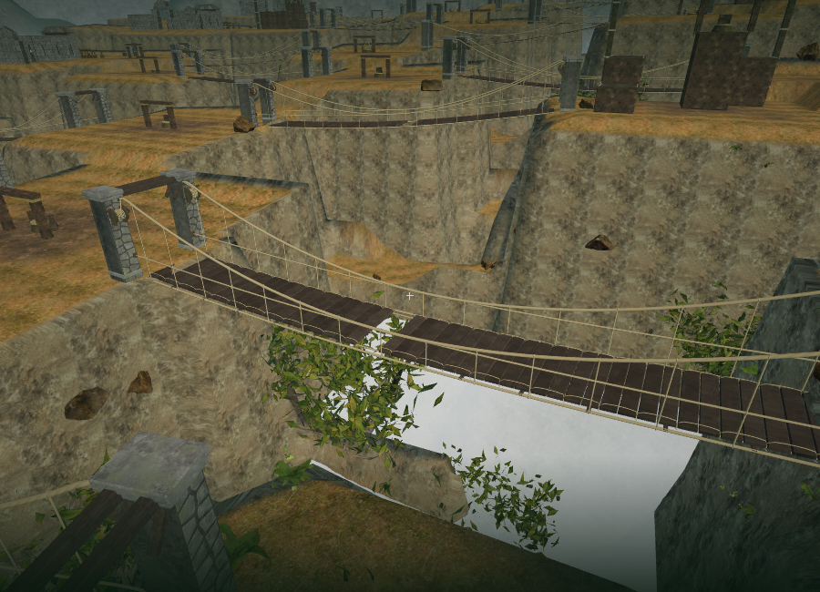
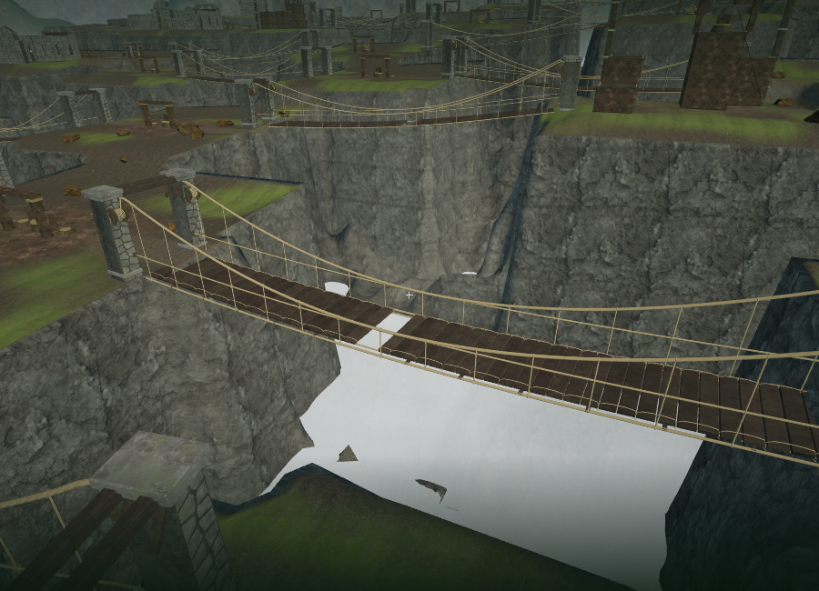
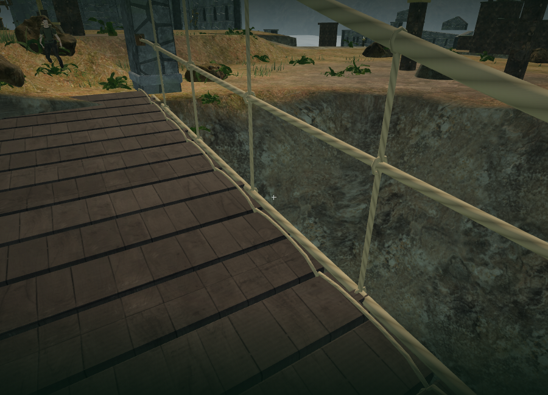
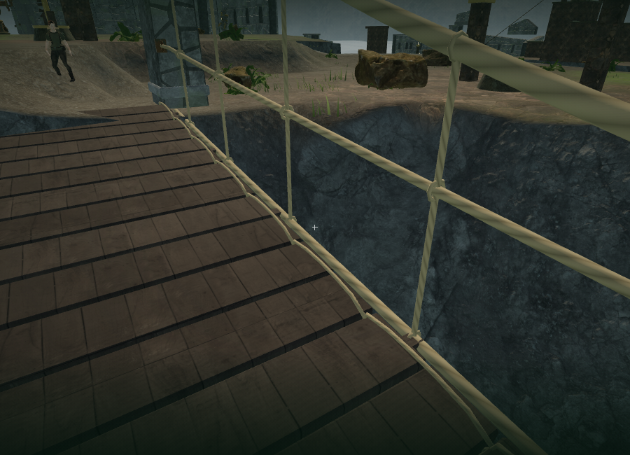
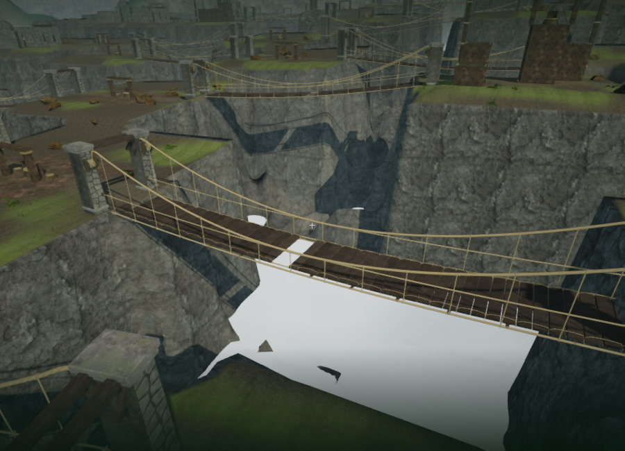

# Cloud-city banks and ravines

The playable cloud-city terrain now has eroded rock ribs, shelves and smaller broken edges below its walking surfaces. Seeded displacement only removes material, is bounded to 5.6 m, and fades out before reaching the upper banks. The original foundation sampler remains authoritative wherever erosion is zero, so refinement does not introduce floating-point height drift at bridge joins or objective foundations. Reservoir and bridge metadata retain their original heights.

The sky chapter uses a 0.875 m terrain grid, with 476,288 triangles across the existing 81 chunks. Other chapters retain their 1.75 m grid. Mesh vertices and character ground queries use the same refined profile; shared chunk borders use identical heights, normals and material coordinates.

Rock Face 03 replaces the smoother cliff texture in this chapter. Triplanar color, normal and roughness maps use a larger physical scale and a second sampled scale to break repetition. Broad tonal variation, subtle bed joints and darker seepage add weathering. Forest Ground 04, muted moss and worn route centers replace the old leaf-covered upper surfaces. The exposed-depth attribute also keeps rocky shelves from receiving the upper-bank soil treatment. These maps are already bundled and credited in [asset credits](asset-credits.md); no new external assets were downloaded.

Exposed terraces now use low scrub, ferns and grass. The old randomly placed trees were rooted outside the navigable grid, often in the sheer ravine walls, and are omitted in this chapter. Scattered vegetation and rocks must pass a local footprint and exposed-depth check before placement. This removes unsupported cliff growth while retaining low vegetation on suitable banks. Worn path centers, five-metre bridge approach margins and the existing machinery clearances remain free of scattered planting.

The distance-sensitive birds, water, wind, bridge and machinery sources and quiet adaptive score remain integrated. Terrain continues to participate in the common line-of-sight predicate used for sound obstruction. This pass changes terrain and placement; it introduces no new recordings or music.

## Rendered evidence

Matched views use `scripts/inspect-sky-terrain-browser.js`. They are assisted art-review cameras with deployed bridges and a fixed scene time, not live playthrough captures.

The previous ravine and the finished Low view:

The previous bank and the finished close-up:

The finished ravine in High quality:

| Matched Low camera | Previous draw calls / triangles | Finished draw calls / triangles |
| --- | ---: | ---: |
| Ravine | 512 / 1,135,169 | 448 / 1,167,141 |
| Cliff | 242 / 755,525 | 195 / 624,546 |

These are whole-scene workload measurements at 900 × 650 in ANGLE/SwiftShader. The High ravine view submitted 1,423 calls and 3,831,085 triangles. All observed Low and High shaders linked. The denser terrain increases geometry work, while omitting unsupported vegetation reduces other submissions. These measurements do not establish supported hardware frame rates.

## Verification

All 263 tests passed with four test files running concurrently. The eight affected terrain and ground-cover tests passed again after the final bridge planting margins. New checks cover deterministic downward-only erosion, exact protected foundation heights, substantial exposed relief, stable reservoir and bridge metadata, shared chunk edges, normalized normals, material coordinates and supported planting away from routes and bridge approaches. The release build passed with the existing large Three.js chunk advisory.

The full browser scene retained all 59 sampled feature approaches and 54 bank paths. All 36 bidirectional crossings completed through character physics with zero falls. These use assisted positions and scripted input and do not establish human chapter duration or unassisted difficulty.

All 119 wind controls remained clear and dry, their 119 local walks completed without swimming, and all 260 checked nearby wind-source listening paths remained unobstructed. The 108 registered bridge sources remain integrated with the distance-sensitive soundscape.

The final High production build accepted native E to restore `field-2-0` and W to walk. A paused reload restored the exact position `(119, 120.50000000000001, height 0)`, stage 2, field progress, route version 1, health 100 and 134.40029999995232 recorded active seconds. Settings matched exactly, including music/ambience/effects at 32/80/75. No asset requests failed and the development hook was absent. The native input check moved 0.3 m in a slow software-rendered session; it does not establish sustained responsiveness or hardware performance.

Switching to the crystal chapter disposed all 81 sky terrain geometries, one material and eleven textures. No previous terrain geometry, material, sound-source object or voice reference remained. The next chapter had no sky geology profile or material variant and its observed shaders linked. The development and release consoles reported no warnings or errors. Test-created saves were cleared on both origins and both launchers returned to High quality.

## Limits

The terrain remains a heightfield and cannot produce overhangs or caves. Upper-bank outlines still reflect the authored route grid. Geometry is denser and has no distance-dependent terrain tessellation. Selected software-rendered views do not establish consumer-hardware performance. Human chapter duration, broader listening evaluation and modern AAA visual quality remain open requirements in [production status](production-status.md).
