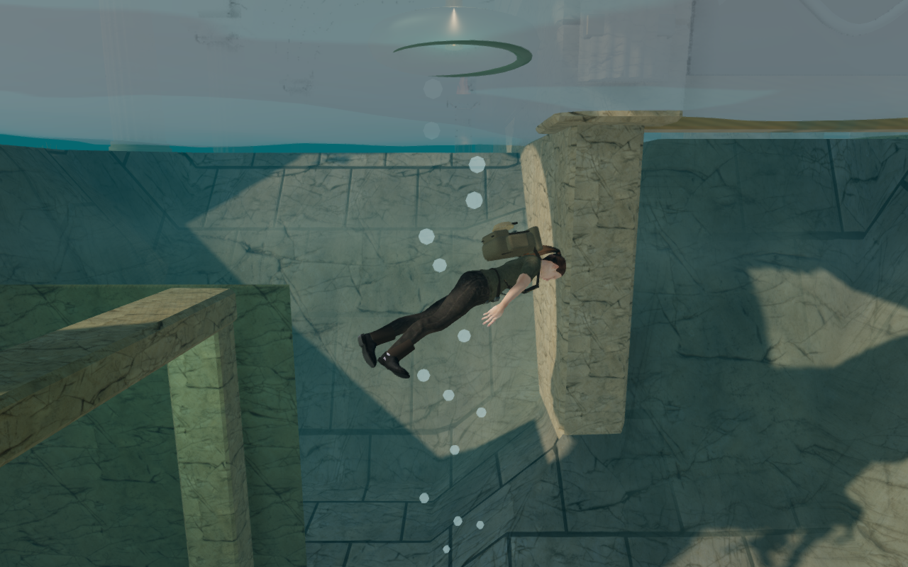
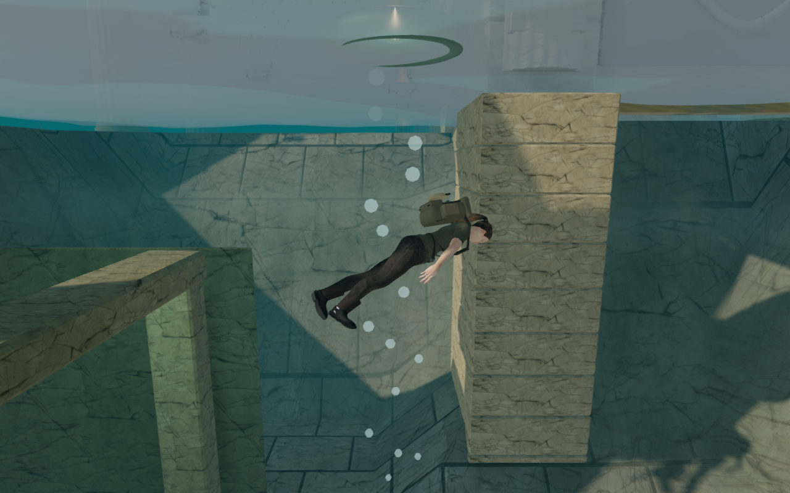

# Foundations beneath the coastal sluices

The Drowned Kingdom's nine sluice gates now rest on fitted masonry footings.
Their old foundations sampled the ground along the wall centres, leaving
unsupported edges where the sounding wells slope downward. The wider front
posts also extended beyond those thin foundations. Diving exposed stone that
ended in open water.

The revised construction samples the whole footprint, including terrain-grid
crossings, and buries its bedding beneath the lowest sampled ground. Alternating
stone courses sit around a continuous recessed core. Three wall footings and
two post footings support each gate, for 45 foundations across the chapter.
The post foundations have matching movement and camera collision; their wider
front faces now stop a diver as well as the camera.

## Actual game comparison

These 1280 × 800 High-quality canvases show the same harbor well, camera,
water level and actor pose. The before version uses the sluice construction
from published commit `e126233`; both versions include that commit's corrected
underwater surface. The canvases omit the HTML HUD and CSS vignette. Lossless
WebP conversion preserves the captured pixels.

| Before | Revised |
| --- | --- |
|  |  |

Twenty before/after pairs cover all five sounding wells, full and drained, on
High and Low. The supporting geometry remains present on both settings.
Masonry textures, lighting, underwater atmosphere and animation still have
visible limitations; this is a structural artwork correction.

## Contact and playable verification

All 491 automated tests passed in 126.5 seconds, including gate construction
and restored thresholds across all 69 campaign gates. The production build
passed in 4.66 seconds with Vite's existing large-chunk advisory.

Across 1,125 sampled footing positions, the old stone first appeared above the
physical terrain at 224 positions; another 36 rays missed it entirely. The
revised foundations contact the terrain at every position. A separate browser
check compared the stone directly against rendered terrain triangles and found
no gaps or missing surfaces at the same 1,125 positions. The automated regression
also checks camera and movement collision at the exposed submerged posts.

Ten assisted archive dives recovered all five records before and after drainage,
then surfaced at full health. The full assisted memorial route crossed both air
bells, opened the emergency gates, recovered the roll and returned at full
health. All nine restored sluice thresholds and the inspected approaches to
mechanisms, field stations, camps and discoveries remain accessible. Assisted
routes use the actual movement and collision methods, with prepared entry
positions; they do not establish blind exploration time.

The final release bundles passed native keyboard and muted portrait touch
swimming, turning, diving, archive recovery and reload checks. Both runs retained
their record and full health, returned at the surface and continued swimming.
Saved data was compared in full except the last-played timestamp and the arrival
position, which was checked separately against the existing collision-recovery
rule. A separate save placed inside a new footing moved 0.75 metres onto clear
ground, restored at the surface with its recovered record, and allowed another
0.89 metres of native swimming. The release exposes no development test hook;
the checks reported no errors, warnings, failed assets or horizontal overflow.

The 18 gate machinery sources retained clear outward sound paths. Bubble audio
measured half amplitude midway through its distance falloff and silence at its
17-metre cutoff; underwater filtering and restoration passed at 22,050 and
48,000 Hz. These checks verify behavior, not subjective mix or music quality.
Leaving the coastal chapter released all 162 counted gate geometries. The
following jungle scene compiled with no coastal footings. The final comparison
and route checks reported no browser errors, warnings or failed assets.

## Rendering cost

A High-quality Radeon 780M run used a fixed harbor dive camera at 1280 × 800,
pixel ratio 1, with the actual game loop running. Four three-second samples used
before/after/after/before ordering, after warming each version. The mean of each
version's two sample means was:

| Measurement | Before | Revised |
| --- | ---: | ---: |
| GPU rendering time | 12.921 ms | 13.544 ms |
| Frame interval | 33.768 ms | 33.935 ms |

Mean GPU time increased by 4.8% in this view. The full coastal gate geometry grew
from 171,072 to 209,332 triangles. Existing material batches absorb the new
masonry: the matched harbor canvas uses 556 draw calls in both versions, with
1,053,098 versus 1,067,318 submitted triangles across its passes. No new textures
or materials were added. The timing samples had no disjoint GPU queries;
frame intervals varied, and these measurements do not establish general device
performance.

Modern AAA graphics, approximately one hour of human play per chapter, subjective
sound/music review and wider browser/device acceptance remain unfinished. See
[production status](production-status.md) and [asset credits](asset-credits.md).
