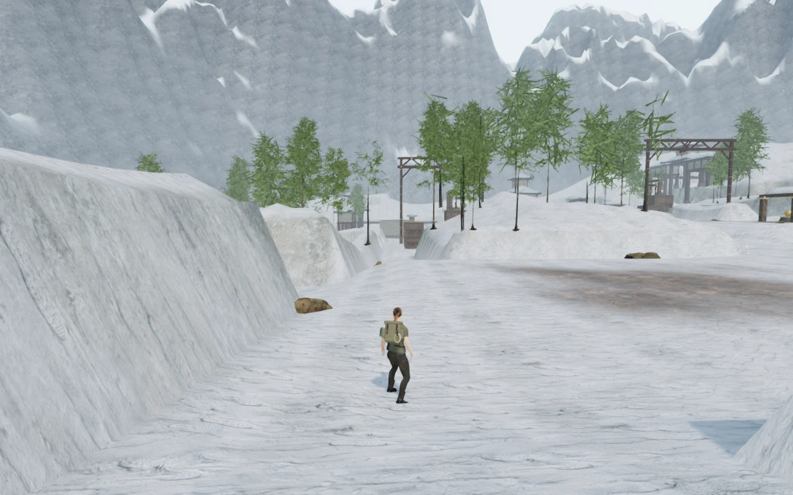
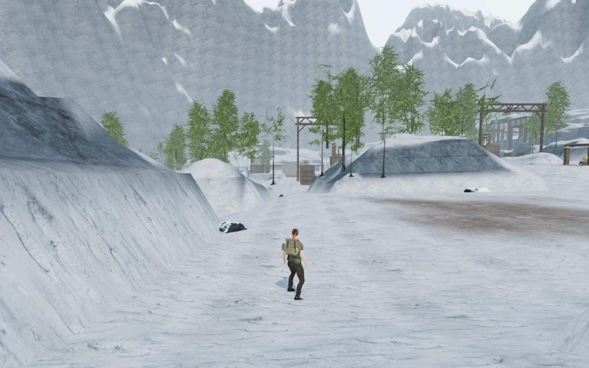
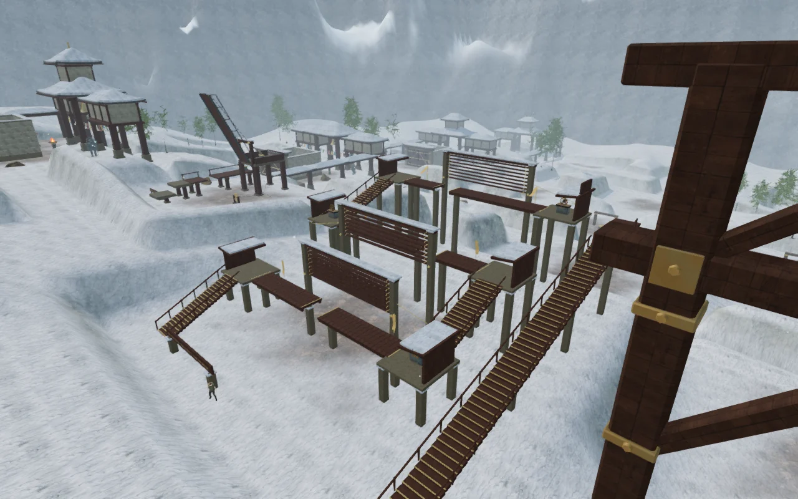
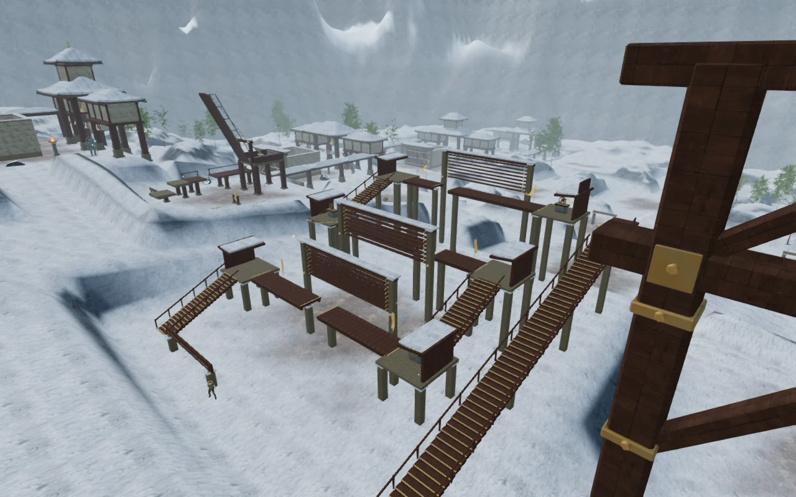

# Snow shoulders and exposed mountain rock

The nearby terrain in **A Silence of Snow** now has uneven snow shoulders,
broken rock ledges and darker exposed faces. The earlier steep, nearly uniform
rise made the paths read as corridors between repeated white banks. Loose rocks
now share the cooler alpine stone color and collect snow on upward-facing parts.

| Previous mountain path | Revised mountain path |
| --- | --- |
|  |  |

## Terrain and foundations

The new heightfield varies the bank width, crest and tilted ledges using warped
noise. Of the 60,025 terrain samples, 27,270 change, with a largest absolute
height difference of about 7.17 m. Open walking-cell vertices remain untouched;
their bilinear interiors and boundaries keep their previous movement heights.

Monastery footings, field pads, ice/water edges, the frozen stair, the bell hoist
and the wind house have protected foundations. Unit checks cover those areas,
all walking cells, deterministic rebuilding and shared chunk positions/normals.
Browser snapshots independently confirm that water definitions, objective
placements, obstacle data and distant mountain geometry match the previous build.

The terrain still contains 119,072 triangles. Its 64,009 chunk vertices gain one
floating-point rock-exposure attribute, totaling 256,036 bytes of additional
vertex data. The retained original heights and exposure grid add another
480,200 bytes of CPU arrays. These terrain additions total about 719 KiB on the
CPU side, with the new attribute also uploaded to the GPU, before renderer
and object overhead. This does not measure all vegetation or driver allocations.

The shader varies snow coverage by slope and broad patches, softens the snow
normal map, and adds filtered rock seams. Existing snow, stone and rock maps
supply the textures; no new maps or dependencies are installed. Boulder materials
are cloned for this chapter, preserving the other chapters' surfaces. Source
attribution is retained in [asset credits](asset-credits.md).

The revised surface supports **109 of 350 candidate loose rocks**, compared with
100 before. The remaining candidates are excluded for clearance or inadequate
support. A browser check evaluates 4,022 underside probes on the delivered rock
meshes; all lie below both the bilinear movement surface and the visible terrain
triangles, with the highest probe approximately 2.41 cm below the surface.
Every placed rock also passes the working-space clearance check.

| Previous wind-house surroundings | Revised wind-house surroundings |
| --- | --- |
|  |  |

## Rendering measurements

Five matched High-quality captures at 1280 × 800 use the same cameras, player
positions and scene time. Total scene counts change as rocks are accepted and
vegetation elevations follow the new ground; the terrain topology stays constant.

| View | Calls before → after | Triangles before → after |
| --- | ---: | ---: |
| First trail | 961 → 965 | 2,024,616 → 2,032,048 |
| Eastern court | 591 → 593 | 1,060,560 → 1,064,792 |
| Wind house | 903 → 907 | 1,545,785 → 1,558,985 |
| Frozen stair | 1,037 → 1,039 | 1,680,817 → 1,689,617 |
| Bell hoist | 1,559 → 1,561 | 2,785,884 → 2,794,500 |

A separate live-loop terrain comparison uses the first trail, Chromium with
ANGLE/Vulkan on a Radeon 780M, 1280 × 800 and pixel ratio 1. Each quality runs
old/new/new/old terrain geometry and materials, settling for 1.3 seconds and
sampling for approximately 4.2 seconds per case. Revised vegetation and boulders
are shared by both cases; this isolates the terrain change rather than measuring
the entire previous scene. GPU queries report no disjoint events.

| Quality | Previous terrain, mean GPU ms | Revised terrain, mean GPU ms | Difference in pair mean |
| --- | ---: | ---: | ---: |
| High | 18.319, 18.230 | 17.112, 17.448 | −1.00 ms |
| Low | 10.253, 10.393 | 9.271, 9.302 | −1.04 ms |

Mean High frame intervals range from 26.575–27.511 ms before and
25.849–26.537 ms after. Low ranges from 16.666–16.935 ms before and
16.732–16.814 ms after. These short samples describe this view and device;
they do not establish a general frame-rate improvement or supported-device target.

## Play and lifetime checks

All **554 automated tests** and the production build pass. Vite retains its
existing bundle-size advisory. The complete assisted wind-house route crosses
three gaps, seats nine catches and returns down the eastern stair at full health.
Its 67.35 simulated seconds do not measure human chapter pacing. A separate
assisted frozen-stair movement check releases both locks, traverses the three
ledge/gap jumps, hauls the flight into place, reaches the six-metre upper marker
and returns to the lower court at full health. These assisted checks are distinct
from the normal-loop production input/reload checks.

High, Medium and Low shaders link successfully. The nearby wind and drive voices,
objective music changes and pause behavior pass. Offline wind amplitudes measure
0.118491 RMS at 2 m, 0.059246 at 15.5 m and zero at 30 m; the drive measures
0.219035 at 2 m, 0.109517 at 11.5 m and zero at 22 m. These demonstrate the expected
half-amplitude midpoint and silence beyond range, not subjective mix quality.

On changing chapters, all tracked terrain, rock, range and wind-house resources
are disposed exactly once: 298 geometries, 125 materials and 28 textures. Both
mountain shells and all six wind-house sources are removed.

The final production build passes five input/map/reload scenarios: shutter
interactions at 1280 × 800, 540 × 900, 360 × 800 and 960 × 540, plus hauling and
restoring the frozen stair. These use ordinary keyboard/touch input and the
normal game loop. Chapter saves match after reload apart from the visit timestamp.
A separate entrance check confirms distant objective guidance. No browser errors,
warnings or failed HTTP responses were recorded; loaded assets match the built
bundles and the development control hook is absent.

The environment still has conspicuous procedural shapes and repeated buildings
and trees. Modern AAA graphics, approximately one-hour chapters, subjective
listening and broader device acceptance remain open requirements.
