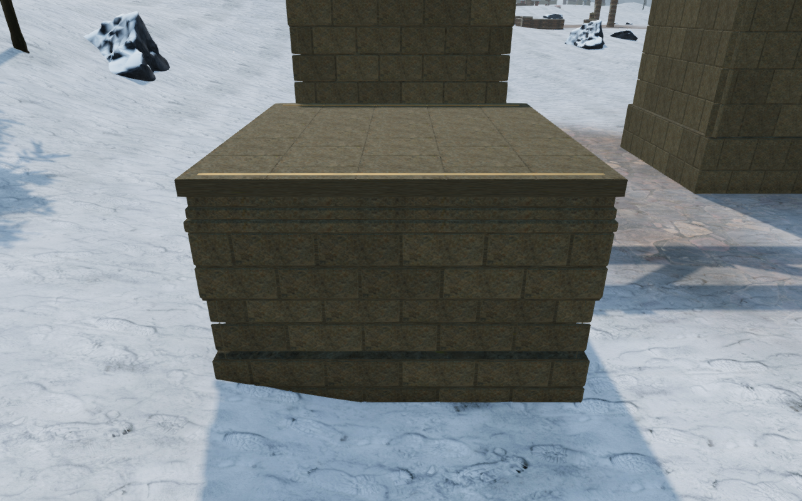
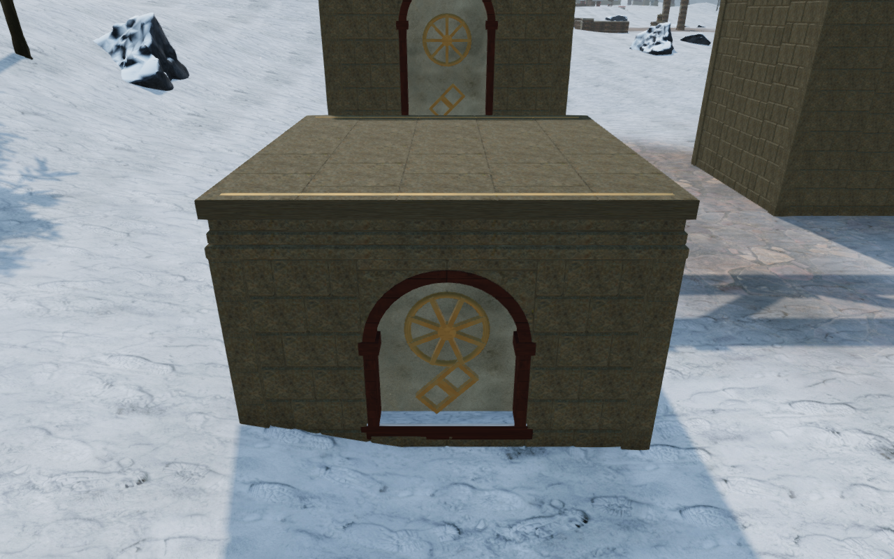
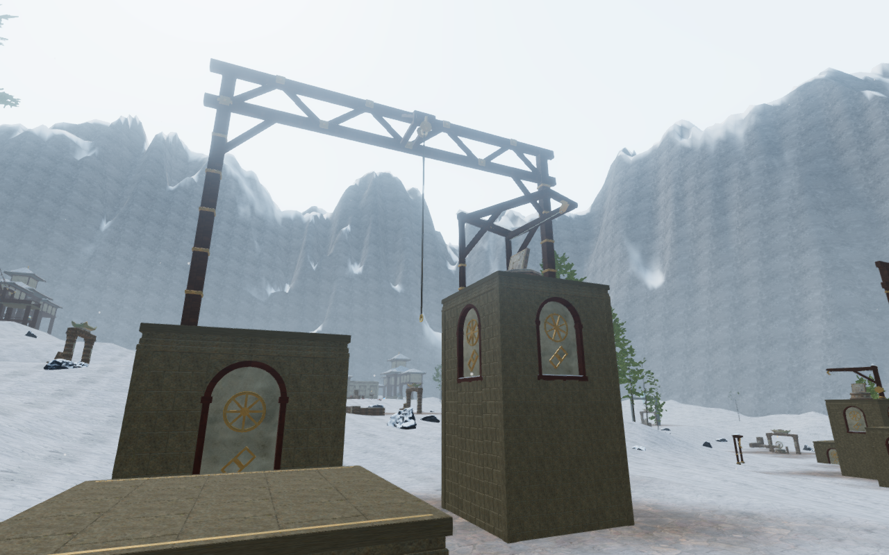

# Mountain climbing piers

The mountain's twenty climbing piers now have eighty arched monastery bays.
Closed whitewash panels, oxide-colored timber borders, eight-spoke bronze
wheels and paired lozenges replace the plain wall grid and small generic
tablets. Shallow snow rests on the fitted sills. These materials connect the
four climbing courses with the surrounding monastery galleries and bells.

Bonded stone wings and dressed corners have continuous backing and a buried
full bearing bed. The timber arches overlap their whitewash backs; the bronze
ornament intersects the panels and the snow overlaps its sill. The construction
stays inside the existing climbing and camera solids. Standing roofs, coping,
bronze landing markers, rope mounts, terminal frames and return cables retain
their geometry, heights and later construction seeds. The artwork uses original
project geometry and existing credited stone, timber, plaster, snow and bronze
materials; [asset attribution](asset-credits.md) is preserved.

The final stone facing keeps its full detail. Indexing exact duplicate vertex
records reduces the four courses' fixed/detail buffers from 174,780–175,872
records to 109,355–110,179. A construction comparison expands every indexed
triangle and verifies all 8,439,528 position, normal, UV, color and material
components against the same unindexed geometry byte for byte. Different
normals, colors and signed zero remain separate. Triangles and material batches
are preserved; complete courses use 139,665–140,489 vertex records within the
existing 180,000 limit. These counts do not establish a hardware frame rate.

All 802 campaign checks across 122 files pass without failures, cancellations
or skips, including the sixteen climbing construction, contact, camera and
positioned sound-source checks. The production build passes with its existing
bundle-size advisory. Browser sampling covers 8,820 roof points, 2,420 underside
points and 720 panel centers. Every sample meets construction. The largest roof
difference is 5.002 mm at a paving joint; the highest sampled underside is
209.999 mm below queried ground. Another 9,680 points cover the arched faces,
including near their curved edges, without gaps. Sampled surfaces sit
54.993–280.002 mm behind the outer pier face.

All 84 High construction views, eight Low views and 36 comparison views are
reviewed. The 32 matched external face observers retain exact camera positions
and targets. Some observers have foreground masonry or terrain; they do not
establish every possible walking view. The wider mountain/coastal baseline
also completes six loops across 13,798 controller updates, with all 206
captures reviewed.

The four final assisted mountain loops complete their walking approaches,
mantles, jumps, swinging ropes, summits, animated cable descents and ground
returns. Health remains 100 and camera opacity remains full across 6,544
updates. Recorded movement, camera poses and traversal states match the
preceding mountain routes exactly; rendering counts change with the new art.
All 109 final route images are reviewed. Each loop uses one supported starting
placement and a completed-expedition fixture without advancing enemy AI or combat.

Keyboard/High and portrait touch/Low production cases climb the first 2.8 m
roof, crouch and look, then descend to ground through native input. Health,
progress, explored cells and complete-store reloads remain stable apart from
chapter timestamps, with no arrival-camera corrections. Loaded bundles match
the final build, with no development hook, browser errors, warnings, failed
resources or horizontal overflow. All fourteen native captures are reviewed.

These lossless High images preserve the captured pixels. The first pair shares
its camera position and target; the course image is a separate construction
observer. The five-pier arrangement still repeats. Broader campaign visual
coverage, sparse landscapes, discovery composition, subjective sound/music
review and browser/device acceptance remain open. Positioned hoist sources and
the quiet climbing arrangement retain their existing movement and distance behavior.
