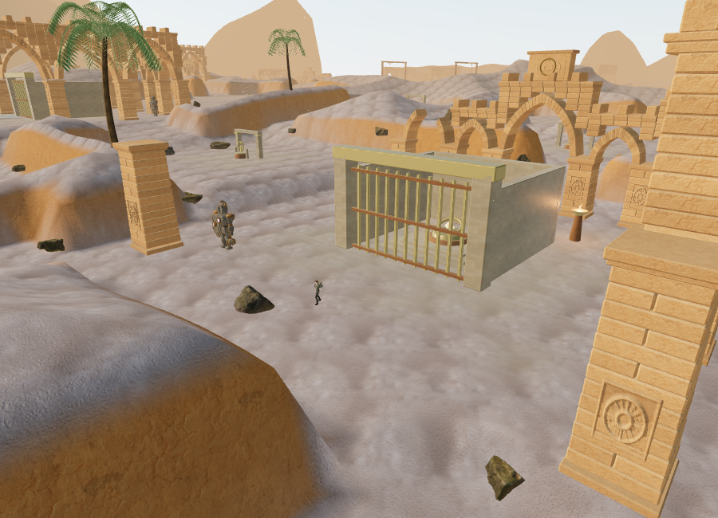
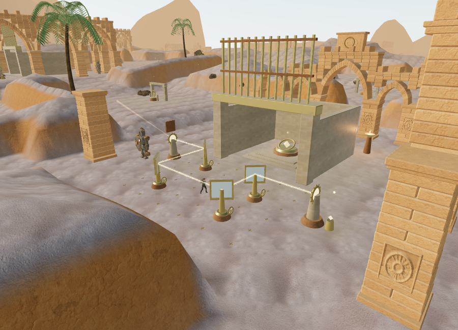
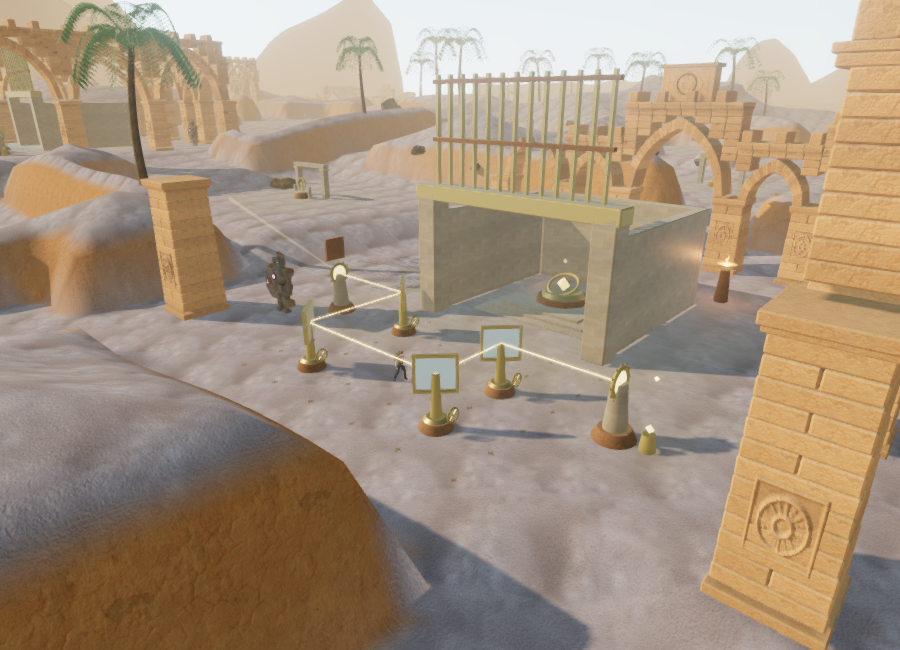
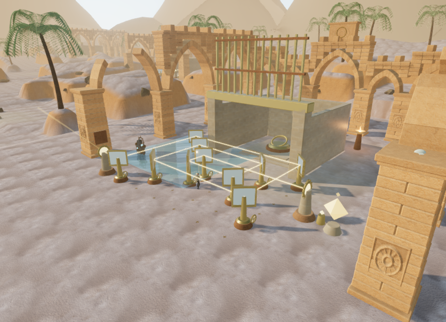
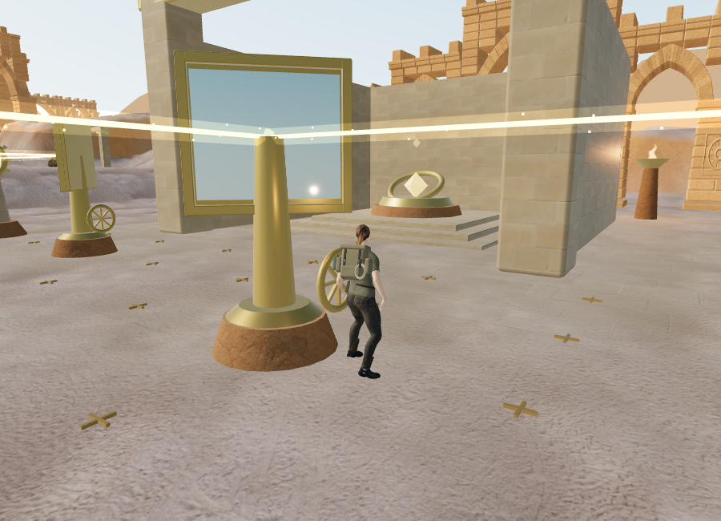
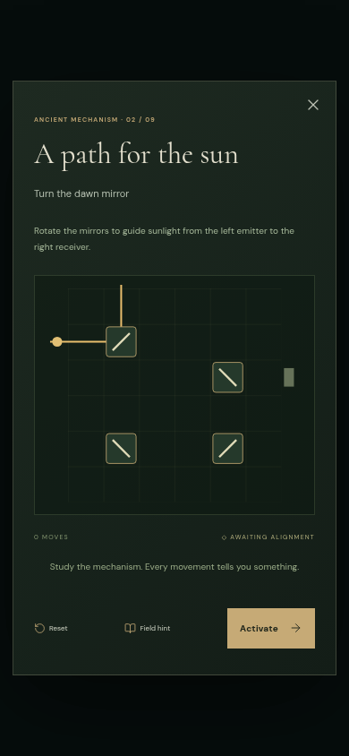
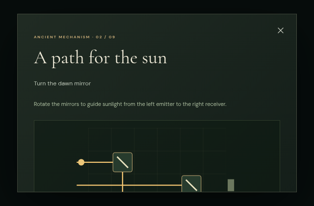

# Beneath the Sands: physical sunlight circuits

The desert's nine mechanisms now have separate authored optical routes in their forecourts. **68 bronze-mounted mirrors** replace the two repeating diagram layouts: the courts contain 4, 4, 6, 6, 8, 10, 10, 10, and 10 mirrors. Each circuit has a western collector, numbered handwheels, visible reflected light, and an eastern receiver. The optics obey the mirror reflection law; beam crossings transmit light without changing its direction.

Complete the sector's field actions to uncover its collector. The first sector also requires its existing counterweight chamber. Walk to a handwheel and press **E / Use** to rotate the mirror through 90 degrees. Light stops at a turning mirror until it settles, and missed rays stop at solid architecture or rising terrain. Approach the receiver's small control and press Use once it lights up to advance the chapter. The sanctuary tablet explains the process and offers the same mirrors as an optional diagram.

Every turn or diagram reset saves `solar[stage] = { values, moves }` in the existing `vesper-expedition-v1` local-storage record. World and diagram controls share that state. Normalization accepts only exact binary arrays for the nine authored layouts, rejects malformed records, and bounds the move count. Other chapters ignore these values. Completed sectors in older saves restore lit optics from their existing main stage even if they have no solar record.

## Sound and music

Each mirror bearing has a positional machinery source, and each receiver has a harmonic source: **77 emitters**, competing with nearby environment sounds within the existing **12-voice limit**. Bearings rise during motion and return to activity 0.04 at rest. Receiver activity rises from 0.15 to 1 when illuminated. Locked courts have zero activity. Sources sit beside the accessible controls, clear of their supporting pedestals.

The sources use HRTF panning, linear distance falloff, smoothed gain changes, and obstruction filtering. Bearings fade across **1.5–14 m** and receivers across **2–18 m**. The desert retains its sparse **54 BPM plucked arrangement**, objective-specific voicing, and reduced music during puzzle/reading panels. The default saved music/ambience/effects mix is **32/80/75**, with master volume 45. Existing birds, wind, fire, and water continue to use their own spatial sources.

With a running browser AudioContext, isolated sources produced the following effective voice gains. Activity was fixed at 1 and obstruction disabled to measure distance alone. These diagnostics are before the overall mix; they are not recorded loudness or subjective listening measurements.

| Source | Distance | Effective gain |
| --- | --- | --- |
| Bearing | 1 m | 0.200 |
| Bearing | 5 m | 0.144 |
| Bearing | 10 m | 0.064 |
| Bearing | 13 m | 0.016 |
| Bearing | 15 m | Retired |
| Receiver | 2 m | 0.1200 |
| Receiver | 6 m | 0.0900 |
| Receiver | 12 m | 0.0450 |
| Receiver | 17 m | 0.0075 |
| Receiver | 19 m | Retired |

Both panners reported HRTF and the configured linear model. A browser state check found zero activity in every locked court, four settled bearings at 0.04, and the current illuminated receiver at 1. Broader listening and device evaluation remain necessary.

## Browser views and rendering

These are actual browser renders. World views hide the HUD; diagram views retain the real controls. The first three use the same 900 × 650 review camera. The last court image uses assisted completion to illuminate its ten-mirror route.

Static fittings batch across each court; reflectors, handwheels, shutters, and control markers retain their movable parents. The chapter has **3,853 captured camera surfaces**. Optical details hide beyond 125 m and return within 115 m; supporting movement collision remains. Light paths share instanced core/halo meshes and combine straight grid steps into continuous segments. The 48-segment pool exceeds the longest possible tested path of 35 steps even before that combination. Silvered surfaces use environment reflections; they do not capture planar mirror views.

The selected final Performance view submitted **782,990 triangles / 424 calls**; High submitted **2,775,807 / 1,225** across its passes. These are workload counts, not supported hardware frame rates. The software renderer sometimes took several seconds per frame. Optical animation now uses actual elapsed time so the beam catches up to a saved turn even on a slow frame; player physics retains its bounded timestep.

## Verification

All **176 automated tests** and the production build pass. Ten added tests cover every layout, reflection direction, all **4,512 binary configurations**, bounded and independent saves, field/counterweight locking, control clearance, moving camera surfaces, interrupted beams, terrain/cover clipping, source activity, old-save restoration, chapter cleanup, real-time optical animation during a paused frame, and reserved working areas. Each authored layout has exactly one winning orientation and uses every mirror.

Assisted browser checks found clear sampled positions around all **77 controls**, approaches to all **59 original non-guardian features**, and all **77 emitter fronts**. All 77 computed local routes completed through the actual character physics at carrying speed, with field gates opened for the check. None of the 350 desert rock placements occupied a reserved optical court. These checks do not establish full chapter navigation or pacing.

With field work and counterweights supplied by the development harness, calls through the real interaction handler solved all nine world circuits and advanced the saved stage to 9. Their required turn counts were 2, 2, 4, 3, 5, 6, 6, 3, and 5. A separate native E check turned the nearby fourth mirror from partial `[1, 1, 0, 1]` to `[1, 1, 0, 0]`, saved move 2, and lit the receiver after two rendered frames. Reload restored those values, the exact player position, and active time without asset errors. Real diagram clicks also preserved a partial state, rejected an incomplete route, and advanced a valid one. Portrait 390 × 844 and landscape 640 × 420 layouts had no horizontal overflow; the short landscape panel scrolls vertically.

Low and High shader programs linked. Loading the flooded palace cleared solar sites, emitters, and controls and selected its water theme without asset errors. Both development and production consoles had no warnings or errors.

The High production build (`index-Odtp-uve.js`) loaded all six sandstone maps with HTTP 200 and had no development hook. Native keyboard movement changed the saved position from `(371, 224, height 0)` to `(371.0180787043064, 224.07834105199447, height 0)`. Pause recorded **3.541599999964237 active seconds**. Reloading with a required texture held until focus moved to another tab restored that exact position and time in the pause panel. Both test origins were cleared afterward and High quality restored.

Chromium used ANGLE/SwiftShader. These assisted checks and short keyboard movements do not demonstrate sustained performance, encounter balance, or one-hour chapter pacing. Repeated architecture, simple terrain forms, adapted character art, and current lighting still fall below modern AAA production quality. The original production goal remains open.

Development review helpers are in `scripts/verify-solar-browser.js`: `inspectSolar(game)` checks sampled access and shader links, `walkSolarCourts(game)` runs assisted local character routes without saving, and `solarView(game, stage)` moves the review observer and camera.
