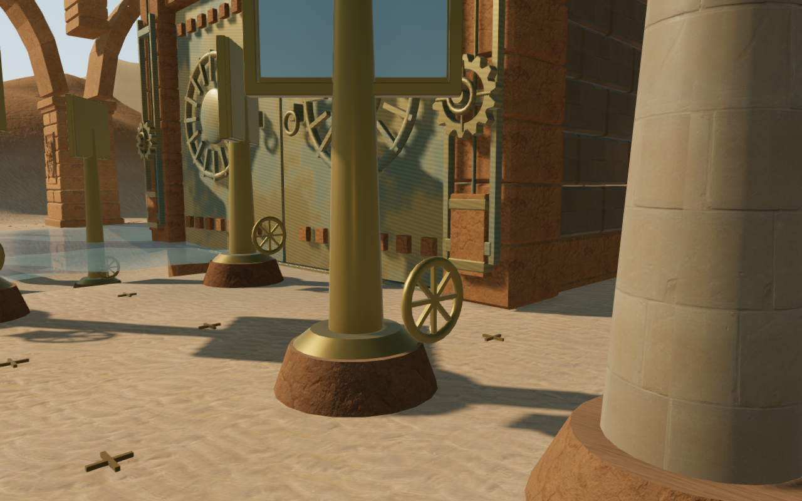
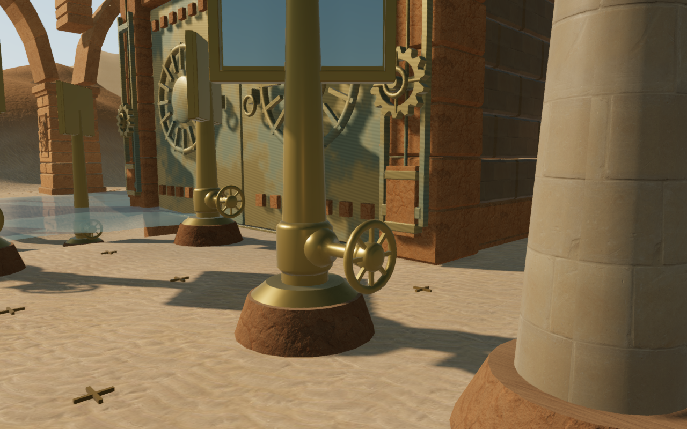
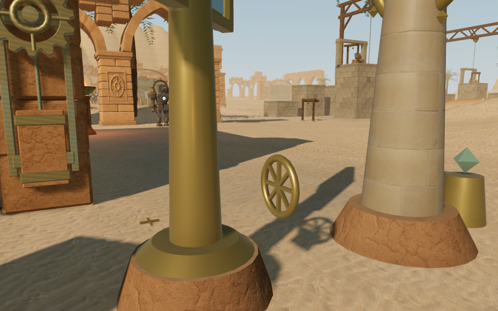
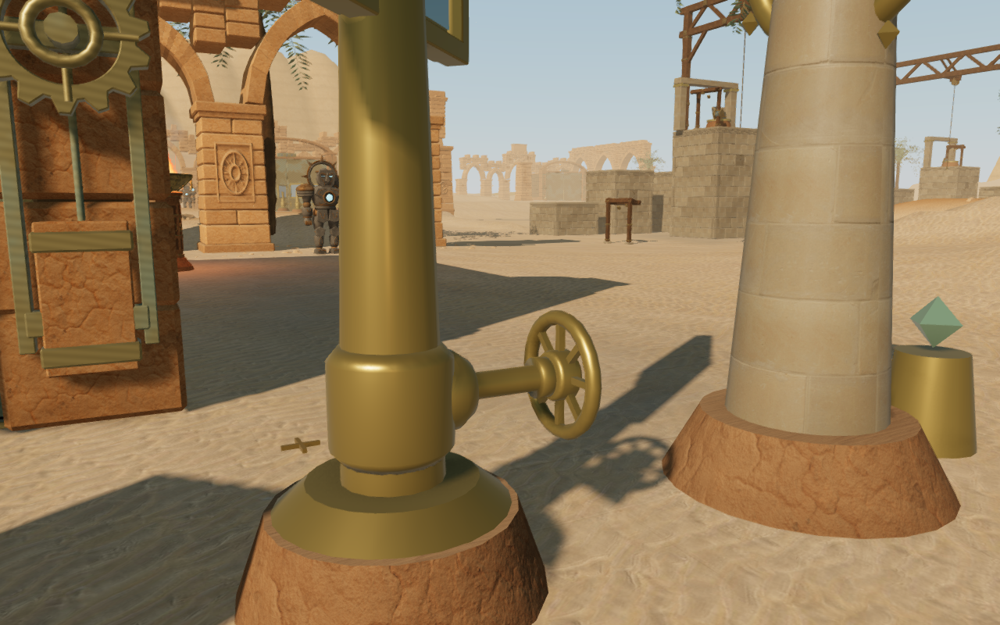

# Mounted solar handwheels

All 68 desert mirror handwheels now connect to their stands through cast bearing
housings and horizontal axles. A profiled hub encloses each wheel's spoke center
and turns with it. Previously, the rims and spokes had no connection to the
vertical mirror spindles, leaving a visible air gap.

## Comparison

These matched High graphics views show the last instrument in solar chamber 5.
They are actual game captures, converted losslessly to WebP.

## Construction and checks

The new profiles use the existing bronze material. The fixed casting and axle
join the chamber's existing static bronze batch, while the hub joins the wheel's
moving spoke batch. Each mount adds 1,104 triangles, or 75,072 across the desert
chapter. The change introduces no new material or texture. These are geometry
counts, not hardware frame-rate measurements.

A regression test checks the actual batched world geometry at seven positions
between each spindle and wheel, for four wheel angles on all 68 mirrors. It also
checks that the wheel center and axle direction stay fixed. The existing solar
tests cover controls, beam paths, turning, saves, camera bounds and bearing audio.

Browser checks retained 77 clear control positions, 59 original feature approaches
and 77 clear sound-source paths. All 77 assisted routes through the solar courts
reached their destinations using movement physics. This is route verification,
not a human playthrough. The visual review covers one instrument in each of the
nine chambers, three oblique views at chamber 5, Balanced and Performance views
of that instrument, and its moving and settled mirror states. Two additional
oblique views show chamber 6's instrument, which another mirror obscured in the
initial angle: 17 updated views in total. All shaders linked without browser
errors or warnings.

All 603 automated tests passed in 231.35 seconds. The production build passed in
5.82 seconds with the existing bundle-size advisory. In the production browser,
keyboard E and touch Use each changed only the intended mirror and saved one
turn. Keyboard walking traveled 6.41 m; portrait two-finger movement and crouching
traveled 1.01 m. Both runs also accepted camera orbit input. Inputs were held
across rendered frames, since short wall-clock holds could end before sufficient
frames ran in this environment.

These checks used a disposable post-combat fixture with the two nearby guardians
already defeated. Health stayed at 100. Paused reloads restored the exact saved
state apart from the save timestamp, including the partial mirror puzzle,
position, progress, active time, defeated guardians and mix settings. The muted
portrait run had no horizontal overflow. Both runs used the current built assets,
without a development hook, failed requests, browser errors or warnings. They
verify local control use and persistence, not combat or a full chapter playthrough.

The native-input setup also exposed a separate camera limitation: resuming beside
the last mirror in chamber 5 can put the camera close behind the handwheel or
the adjacent receiver column. The view needs orbiting or movement into the aisle.
This is tracked as VA-09 for a follow-up on control approaches and restored camera
orientation; repairing the wheel mounts does not resolve that issue.

This repairs VA-04 in the [visual audit](visual-audit.md). The broader world
review remains open. No audio assets, source positions, attenuation rules or
music arrangements change in this repair; there is no new subjective listening
claim.
