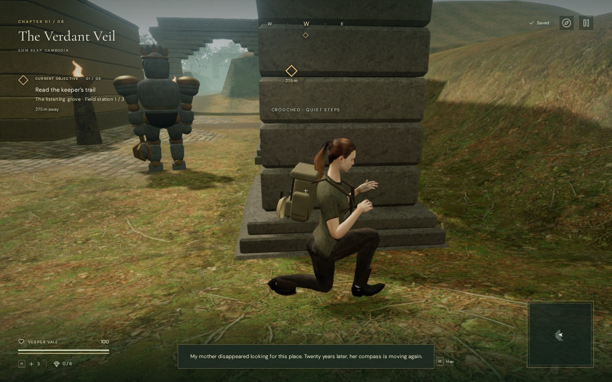
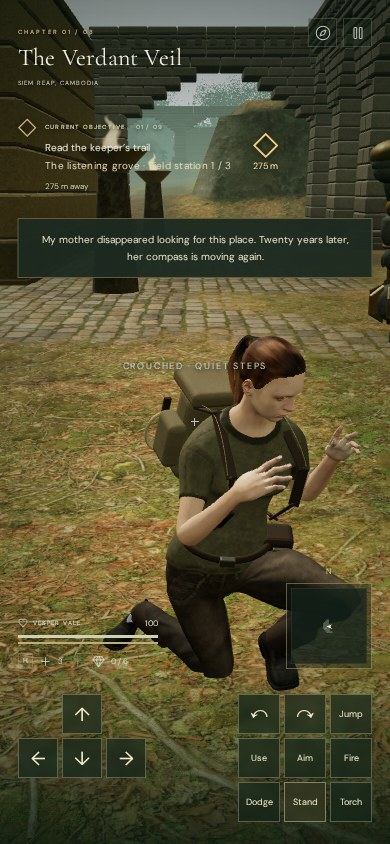

# Quiet approaches and guardian awareness

Guardians now follow [regional watch routes](guardian-patrols.md), with pauses,
moving sight lines and resumed patrols after investigation. The verification
below records the earlier stationary-post stealth milestone; the linked notes
cover the current patrol behavior and its repeated checks.

All eight chapters now support crouched movement and directional guardian perception. Press **B** or **Crouch** on touch to lower Vesper into a bent-leg stance and move at 2.2 metres per second. Aiming, firing, jumping, dodging, swimming and actions that occupy both hands release the stance. The camera lowers smoothly, the boots remain fitted to their supports, and the pistol grip follows the body while standing to fire.

Guardians face their preceding approach and slowly scan around that direction. Their unalerted sight spans approximately 140 degrees, widening during combat. Crouching reduces sight range and slows recognition. A solid wall can conceal the lower head; walking directly into a guardian still exposes the player. A lit torch expands recognition range and removes the crouch recognition benefit.

An amber meter shows growing suspicion, with an arrow toward the most threatening guardian. Full recognition changes the indicator to **DETECTED**. A guardian that hears movement investigates its recorded origin, searches there and eventually returns to its post. The stored origin does not follow unseen player movement. Attacks still require visual contact and their existing warning windows.

The character's actual foot contacts produce hearing events as well as audible footsteps. Muting audio does not disable enemy hearing. The simulation's maximum unoccluded hearing distances are 3 m for crouched steps, 11 m for ordinary travel, 20 m for sprinting, 16 m for a hard landing, 14 m for a dodge, and 36 m for gunfire. Cover reduces those ranges to 45%. Events expire after 0.6 seconds and the queue is capped at 16. These are gameplay hearing ranges; the audible effects retain their own spatial falloff.

Crouched footsteps use 30% of the ordinary footstep peak-envelope setting. Suspicion and full detection have restrained sounds positioned at the guardian. Investigation retains the current chapter/objective arrangement; confirmed combat engages the existing danger arrangement. Pause freezes perception and movement. Crouch and transient sound events clear when loading a chapter; existing position, health, discoveries and defeats keep their saved state.

## Verification

- **350 automated tests passed**, including directional sight, low cover, slower recognition, torch exposure, quiet rear approaches, noise origins, reduced hearing through cover, bounded searching, pause, stance transitions and all eight spawn layouts. Delivered-mesh checks cover grounded soles, unchanged bone lengths, stance release and the pistol grip throughout the transition to standing.
- An assisted browser check exercised a **6.6 m crouched route with live guardians in each of the eight chapters**. Every selected route remained undetected and ended at 100 health. Front approaches produced suspicion while crouched and detection after standing. No guardians were removed for these checks. These prepared local approaches do not establish that every encounter can be bypassed or that a whole chapter can be completed unseen.
- The final jungle pass recorded five actual footstep events, with the last crouched event retaining its 3 m hearing radius. A native missed shot produced investigation; moving the player away left the remembered sound position unchanged. The music remained in exploration during investigation and switched to danger during confirmed detection. Pausing froze position and awareness; a chapter change cleared crouch and the noise queue.
- A Web Audio offline render used the actual footstep generator and noise buffer with a fixed source offset. Ordinary-step RMS was 0.006492 at 2 m, 0.003246 at 21 m and zero at 41 m. Crouched-step RMS was 0.002110, 0.001055 and zero at the same distances. Both measured half amplitude at the falloff midpoint. This measures one generated signal, not subjective sound quality.
- The 390 × 844 touch check covered toggling crouch while holding movement, preserving the movement finger when releasing the toggle, and releasing movement independently. The final suspicion area cleared the temporary story toast; the vitals cleared the action buttons. High and Performance views rendered with linked shaders, with no captured console errors, warnings or failed assets.
- The final production build served `index-CAbTY1Vt.js`, `game-CB8hrByo.js`, `three-ByVpHOu1.js` and `index-DYq9hjRy.css`, with the development hook absent. Native B, camera-turn and movement input traveled 3.092 m, then pause and reload restored the exact saved position and 100 health. Crouch reset on reload; B entered it again and V transitioned to shoulder aim. No console errors, warnings or failed assets were captured. The build reported only the existing large-chunk advisory.

## Scope and remaining limits

This is a prototype stealth system. Crouching lowers the visible pose and sight target; it retains the existing movement clearance and does not add crawl tunnels. Solid collision cover affects sight; individual leaves and grass do not provide a camouflage system. Investigation reuses the guardian navigator, with local scanning and return behavior. Hearing currently models player footsteps, landings, dodges, splashes and shots, rather than every machine in the world.

The checks use prepared positions and assisted simulation steps except where native production input is stated. They do not establish full encounter balance, human playthrough difficulty, approximately one hour per chapter, broad browser/device performance, or AAA graphics. The original graphics, pacing and subjective mix targets remain open.

No new external models, animations, textures or recordings were introduced. The crouch pose, perception logic and interface are original project code; existing character and sound attribution remains in [asset credits](asset-credits.md). Temporary saves, profiles, captures and logs remain excluded under `local/staging/`. The reusable browser helper is [verify-stealth-browser.js](../scripts/verify-stealth-browser.js).
