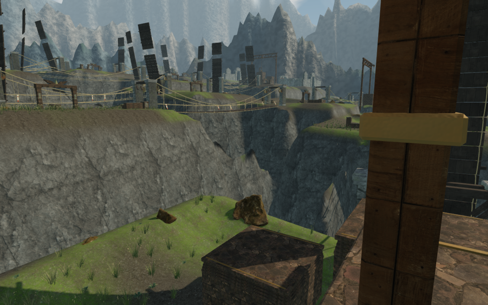
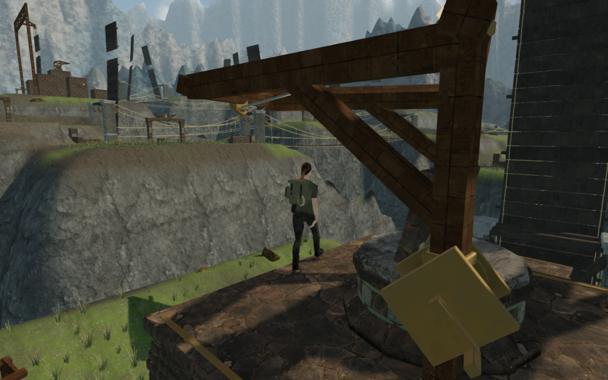
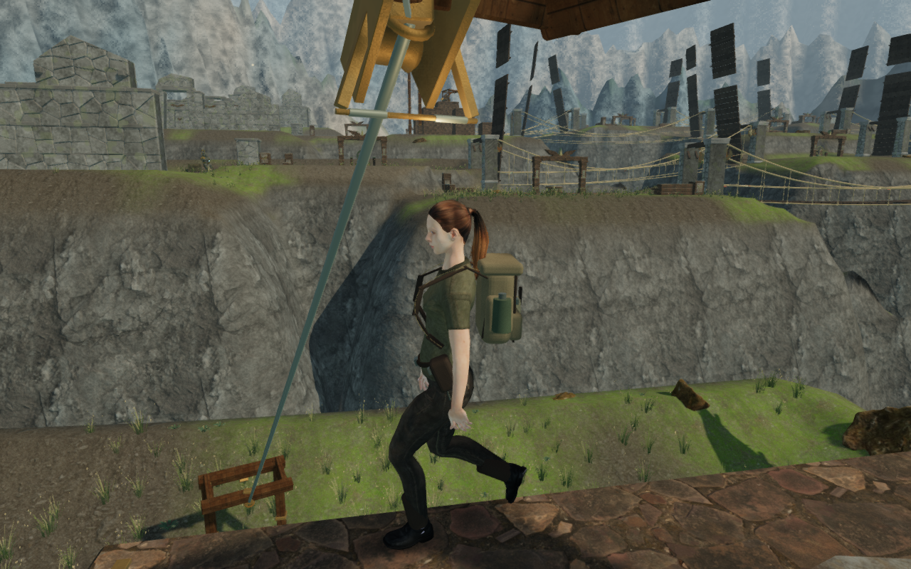
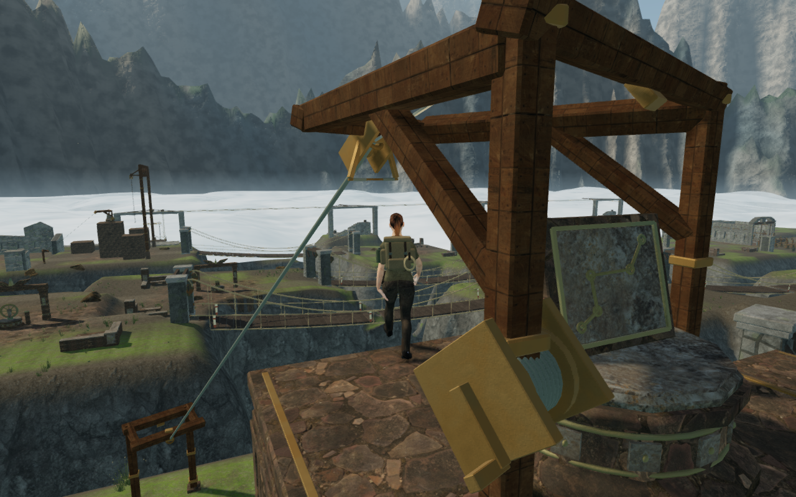

# Summit cable frames and working views

Upper return-cable posts crowded the reading and boarding edge of the eagle
summits. Their replacement frames sit farther back on the supported platform,
with wider post spacing, thicker splayed arms and diagonal braces ending at the
arms' midpoints. The explorer remains visible in the reproduced continuous
approaches. The cable anchors, trolley grips, boarding points and exit points
retain their locations.

The winch and its lead follow the relocated upper post. Its positioned emitter
is derived from the winch's new world position. The terminal identification
plates now meet their rear beams instead of hanging below them with a visible
gap. Existing chapter materials, trolley animation, save format, sounds and
music are retained.

## Diagnosis and comparison correction

The [earlier eagle-route record](sky-eagle-route.md) measured a 0.400 m camera
arm at the first reading approach and a 0.341 m arm at the second cable approach.
A later clear observer view was initially described as using the same feet and
heading. That heading comparison was incorrect: game startup corrected the
saved camera and mutated the shared fixture before the observer read its angle.
The first clear comparison used yaw 1.579 radians; the continuous approach used
2.103 radians after normalization.

Tracing the original camera at its original feet and angle shows that the
first view settles at approximately 0.624 m after five seconds, and the second
at 0.566 m. The return-cable posts obstruct the desired arms. These are real
frame placement problems; the clear startup orbit did not establish that the
follow camera would recover at the original heading. An unobstructed ray to the
chest alone also does not establish useful framing: the close-camera fade can
make the explorer disappear while a nearby post dominates the image.

The final continuous route reaches the first reading position with a 5.482 m
arm. Its first boarding approach has a 2.407 m arm and a visible explorer; the
second boarding approach has a 5.262 m arm. These are moving-route observations,
with slightly different earned feet and headings after navigation around the
relocated posts. They are not identical-position before/after comparisons.

## Verification

- All 724 tests pass; the production build succeeds with the existing large
  chunk advisory.
- A geometry regression rotates five observed reading/boarding feet and angles
  through all 21 climbing courses. All 105 views recover beyond 5.2 m within
  sixty camera updates at 1/60 s, retain solid clearance and have clear rays
  through the rendered course geometry. This test covers climbing construction,
  rather than every other structure or terrain surface in the complete scenes.
- Rays through all four corners of each upper post's stone footplate meet the
  actual summit top, covering 168 corners across the 42 upper posts.
- All 42 High/Low observer views of the upper frames across eight chapters
  were reviewed. These use assigned observer positions and restored station
  states, rather than earned playthroughs. Every relocated winch emitter matches
  the rendered winch's world position. The existing mechanical falloff, motion
  gating and themed music remain in use; this pass adds no subjective listening
  assessment.
- The final continuous assisted eagle route covers 466.616 m over 7,988 player
  updates, with a largest step of 0.361 m and no steps over one metre. It completes
  both climbs, swings, cable returns, the survey, both damaged spans and 26 legal
  wind turns, activating the fourth engine and reaching the next sector with
  health 100. All 126 captures were reviewed. It uses the delivered controller
  and camera, with scripted steering; enemy AI and combat are not advanced.

- Four production cases use native keyboard input at 1280 × 800 in High and
  native touch input at 540 × 900 in Low, covering both eagle summits. They load
  previously earned summit saves, retain the original saved headings, restore
  the tablet, board the trolley and land at the expected exit with health 100.
  The second summit includes a walk around its pedestal. Full localStorage
  reloads match apart from `lastPlayed`; after resuming, actual saved feet remain
  within 5 cm and progress and health remain intact. All 24 reading, boarding,
  landing, paused and reloaded views were reviewed. The cases load the current
  production bundles without a development game handle or page overflow.

The three new documentation images are actual game captures converted
losslessly to WebP, with decoded RGBA identity checked. Existing asset
attribution remains in [the credits](asset-credits.md).

This resolves the reproduced support obstruction. Other camera compositions,
later routes, repeated courtyard layouts, terrain shoulders and remaining
chamber interiors still need the [broader visual review](visual-audit.md).
These checks do not establish human playthrough duration, consumer hardware
performance, subjective sound quality or AAA graphics.
