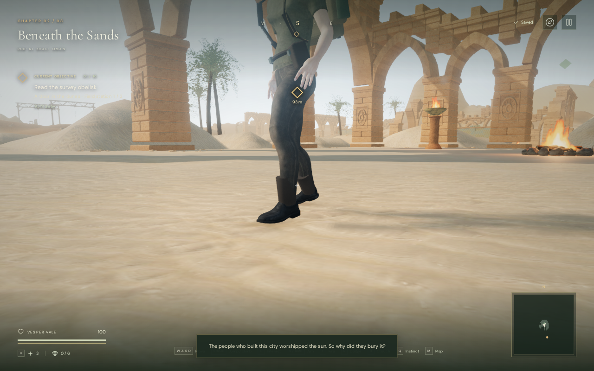
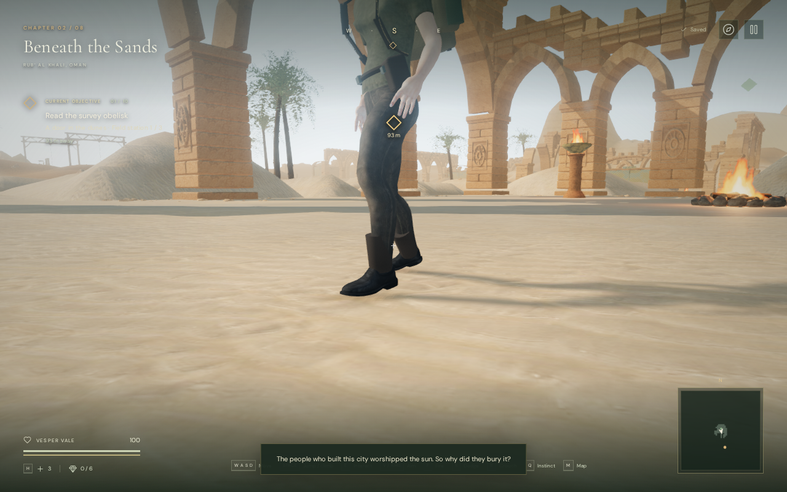
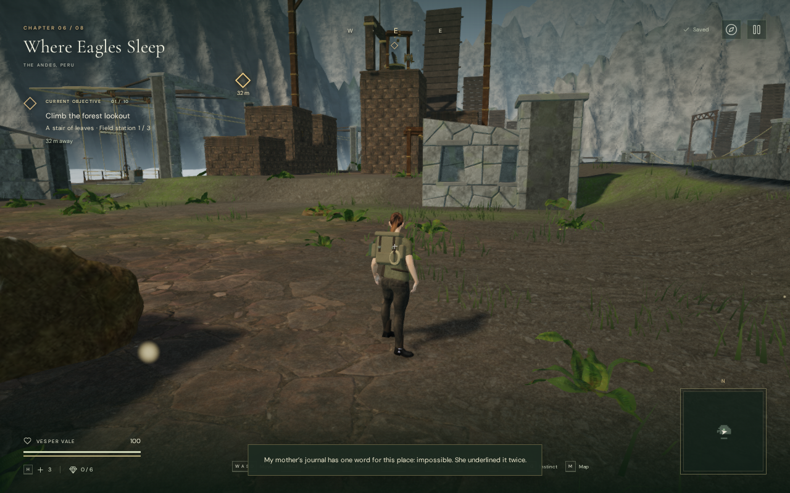
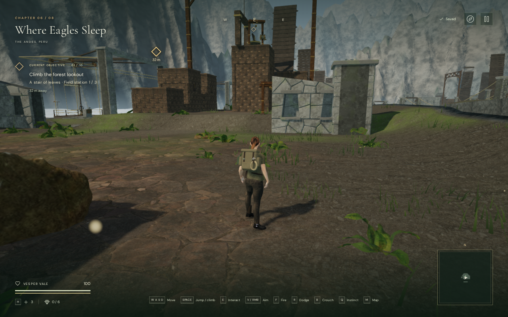

# Directional shadow contact and stability

Outdoor sun shadows now sit closer to the explorer, masonry and other grounded
objects. High quality uses a 4096 × 4096 map for cleaner edges; Balanced retains
2048 × 2048. The projection follows travel in whole texel steps, reducing the
subpixel drift caused by continuously moving the light's shadow camera.

## In-game views

These High-quality Chromium views use matching camera and player positions.
The baseline restores the settings from `95e2675`; revised views use the new
bias, resolution and stabilized projection. They are assisted inspection
captures; transient particles and interface messages can differ. The WebP
images preserve the capture pixels without retouching.

| Desert, before | Desert, revised |
| --- | --- |
|  |  |

| Cloud city, before | Cloud city, revised |
| --- | --- |
|  |  |

## Projection and controlled measurements

The previous depth bias of -0.0008 represented 23.96 cm over the 299.5-metre
depth range, alongside a 15 cm surface-normal offset. The depth offset is now
expressed as 2.4 cm, with normal offsets of 3.5 cm at High resolution and 4.5 cm
at Balanced resolution. These offsets still suppress self-shadow artifacts;
they cannot make every receiver exact.

The orthographic window keeps its 110-metre width and height. Its center moves
by at most half a texel to align world coordinates with the shadow raster.
Light position, direction and the sky's sun direction remain unchanged.
New projection checks cover 3,000 positions across five sun directions, three
resolutions, horizontal movement and elevation changes. Consecutive projected
world points differ by integer texel steps within numerical tolerance.

A separate GPU fixture used a one-metre-tall block on a flat shadow-receiving
plane, the desert sun direction, PCF soft shadows and a 1024-pixel view spanning
six metres. Sampling the center of its cast shadow at the 50% darkness threshold
found an approximately 20 cm gap beyond the block's footprint with the old
settings, versus 2–3 cm with the revised High and Balanced settings. Image
sampling resolves roughly 6 mm per pixel; these are fixture measurements,
not a bound on separation across arbitrary game geometry.

Four light translations from 0.1 to 0.4 texel changed 11,870–13,674 pixels per
baseline frame. The stabilized fixture changed zero pixels at either revised
resolution. This isolates projection drift: animated plants, moving characters,
camera movement and changing illumination still alter a real scene's image.

## Rendering cost and lifetime

High's RGBA8 shadow texture grows from 16 to 64 MiB, and the depth buffer also
grows to four times its previous pixel count. Driver allocation overhead was
not measured. Texture size is capped by the reported device limit. Switching
to Performance releases the allocated sun-shadow map; the cavern continues to
render without one. Maps also release on quality changes and chapter exit.

The following isolated AMD Radeon 780M / ANGLE Vulkan benchmark used a fixed
camera at each chapter's starting area, 1280 × 800 and pixel ratio 1. Each
quality ran four four-second samples in before/after/after/before order with
1.5-second warm-ups. Both versions use the live game loop; each runs its own
atmosphere update, and only the revised version stabilizes the projection.

| Chapter / setting | GPU mean before / revised | Change | GPU samples before / revised |
| --- | ---: | ---: | ---: |
| Desert / High | 12.676 / 13.764 ms | +8.6% | 340 / 306 |
| Desert / Balanced | 9.741 / 9.703 ms | -0.4% | 409 / 395 |
| Jungle / High | 26.237 / 27.437 ms | +4.6% | 187 / 164 |
| Jungle / Balanced | 22.670 / 23.237 ms | +2.5% | 218 / 198 |

Means are weighted by sample count. The larger High map has a measurable cost.
The Balanced jungle baseline means ranged from 21.916 to 23.527 ms, exceeding
its before/after difference. Animation, render workload and frame scheduling
also varied, so these figures do not establish a general device or frame-rate
guarantee. No GPU disjoint events, browser errors or warnings occurred.

## Game verification and limits

All 473 automated tests passed in 125.1 seconds. The release build passed in
3.88 seconds, with Vite's advisory for bundles larger than 500 kB.

Forty-eight browser views covered all eight chapters: paired High wide/close
views and revised Balanced/Performance views. All shaders linked, expected map
sizes allocated, and no browser errors or warnings occurred. Fourteen of the
sixteen High comparison pairs retained their submitted triangle and draw-call
counts. Each jungle pair submitted 608 more triangles and one extra call.
The small projection-window shift also changes the shadow-culling boundary.

A native keyboard walk, stop, jump and landing finished at 100 health. All 136
recorded frames preserved the integer raster step, with maximum numerical
error below 0.00000001 texel. A raised desert terrace and a snow slope also
rendered. High → Balanced → Performance → High transitions used 4096 → 2048 →
no map → 4096, disposing old maps once. Leaving the desert and snow chapters
released each remaining map; the cavern allocated none.

The built game passed a 4.408-metre keyboard sprint at High and a muted portrait
two-finger move/crouch over 1.045 metres at Performance. Both finished at 100
health and retained exact local saves on reload, excluding last-played times.
The normal interface exposed no development hook, loaded the exact new JS/CSS
bundles, and produced no horizontal overflow, failed assets or browser warnings
or errors.

This remains a single local directional-shadow map. Finite texel resolution,
soft-filter width, remaining bias, animated foliage and the edge of the shadow
volume can still produce visible limitations. The [ambient boot contact](explorer-contact.md)
continues to supply localized shading where appropriate. AAA graphics remain
unmet; human chapter pacing, subjective listening and broader browser/device
coverage remain open in the [production audit](production-status.md).
