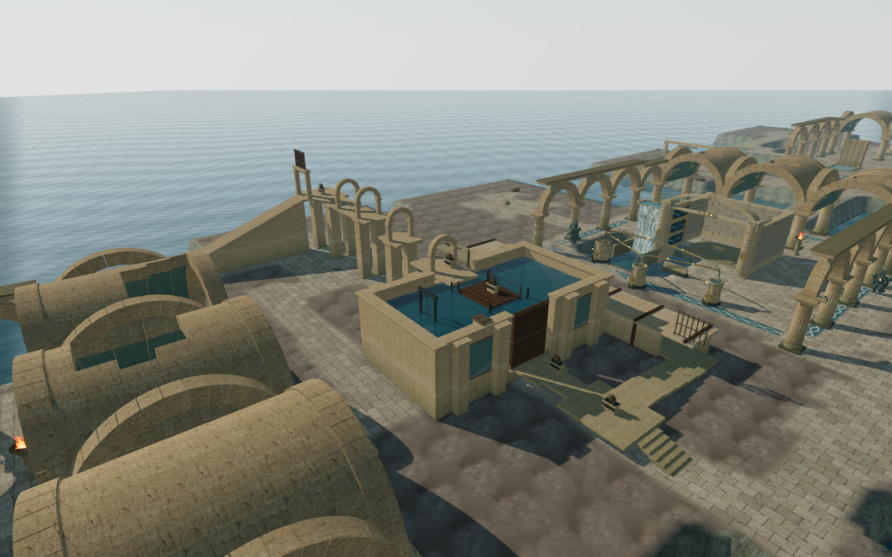
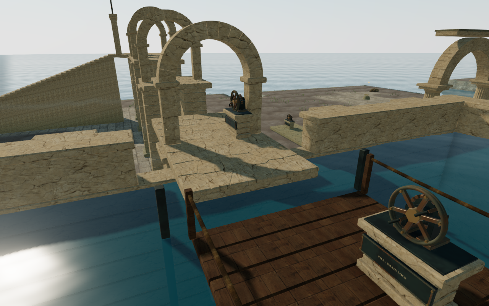

# The Sunken Arcade

The Drowned Kingdom's sixth field mission now connects its three winches through
a covered inspection passage, a flood lock and a broken upper arcade. It replaces
the three isolated stations while retaining the chapter's ordered objectives and
sanctuary puzzle.

Enter by the east stair and tension the entry cable. The inspection grille rises,
opening a short descent into the covered gallery. Its far handwheel raises the
counterweight. Return to the lower dock, jump onto the pontoon and turn its
**Fill / Drain** wheel. A watertight shutter seals the low boarding aperture before
the inlet starts filling. The water rises 5.6 metres over twelve simulation
seconds, carrying the floating deck to the upper landing. Jump west, cross two
broken galleries, and release the final gate. A permanent return stair leads back
to the coastal path and the sanctuary.

The wheels on the lower dock and upper landing call the pontoon back. A player
who falls into the lock can swim beside either open side of the platform and use
**Jump** toward it to climb aboard, including while the water is changing level.
The front and back rope rails are closed. Diving remains optional; the inspection
passage has standing headroom. **M** shows the route, current water percentage,
platform, field stations and gates. The same actions are available through the
touch controls.

## Motion, persistence and sound

Handwheel operations align the character across supported ground, reach the two
grips, turn the wheel and release it. Movement cancels an unfinished catch. Field
progress is committed only at a seated catch, with the normal objective order
and reach checks. Collision follows the pontoon, boarding shutter and raised
grilles; fixed walls and roofs also obstruct sight and the camera.

The coastal save records the water level, target level and last earned fixed
landing. Reloading while swimming, airborne or riding a moving pontoon returns
to that landing. A partially filled lock resumes toward its saved target. Old
completed missions restore with the lock filled and exit open; legacy ground
positions inside the new basin recover above the water. Saved data stays in the
existing browser localStorage slot. No server or account is required.

Eight positional emitters cover the six handwheels, inlet and moving platform.
Mechanical voices play while their associated wheel, gate, counterweight or
platform moves. The inlet's sound follows the changing water impact height.
Pausing freezes the machinery and removes its active voices. The existing quiet
coastal score uses the winch arrangement during a handwheel operation and the
climbing arrangement while following this route.

The construction uses original stonework, segmented arches, blue plaster insets,
bronze fittings, timber, flotation tanks and rope rails. Its materials reuse the
credited palace, stone, monastery wood and bark maps. Terrain wetness now sizes
its shader arrays to the actual number of coastal basins, including this lock.
The foundation reserves space against decorative rocks and ground cover.

## Verification

The full automated suite passed **583 tests**. After the final arch bearing
adjustment, all **14 focused flood-lock tests** passed, including the added
support-footprint check. These cover progression, filling and drainage, pause,
turn cancellation, platform calls, collisions, swimming exits, malformed and
legacy saves, and serialization through the game's shared save writer. The
production build succeeds; Vite retains its existing large-chunk advisory.

Six native production action/reload scenarios passed: entry winch, cancellation
by movement, inspection counterweight, saving during a flood, resuming a partial
flood, and the upper winch through touch input. Each retained 100 health and
preserved its serialized position and route state across reload (excluding the
last-played timestamp). A separate 540 × 900 portrait check verified the route
map, readable recovery instructions, absence of horizontal overflow, and access
to the return button. These checks use the built game with its development
inspection hook absent. Browser runs reported no errors, warnings or failed
HTTP responses.

An assisted browser traversal uses the normal movement controller, guardians,
hazards and camera after one initial entrance placement. It completes the first
winch, inspection passage, second winch, return to the dock, pontoon jump and
fill, upper landing, both elevated jumps, final winch and return stair with
**100 health**. It does not reposition the player along that route. The reusable
movement helper is `scripts/verify-arcade-lock-browser.js`.

Separate water recovery fixtures passed at low, intermediate and full water
levels, including a descending pontoon. Twelve rendered views cover the wide
court, raised platform, inspection passage and upper gallery on High, Medium and
Low at 1280 × 800. All sampled shaders link. The wide view recorded 1,225 / 624 /
348 draws and 2,032,887 / 1,000,807 / 568,972 triangles respectively; those counts
include the surrounding scene and rendering passes.

An offline stereo rendering of the actual inlet buffer through the distance
panner measured RMS 0.143335 at 2 m, 0.071667 at 16 m and zero at 31 m. This checks
the configured linear attenuation, not subjective audio quality. Active inlet
and platform voices were observed during filling, and neither remained active
while paused. Changing chapters disposed all 89 observed route geometries,
17 materials and 18 textures exactly once and removed the route emitters.

These are automated and assisted checks. They do not establish human chapter
completion time, an hour of play per chapter, consumer-device frame rates or AAA
graphics quality. The broader eight-hour pacing and graphics targets still need
further content, art development and human playtesting.
