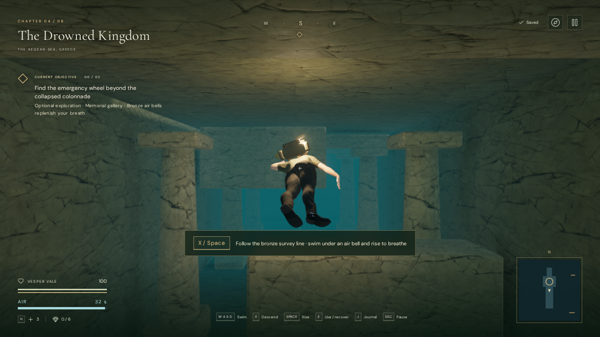
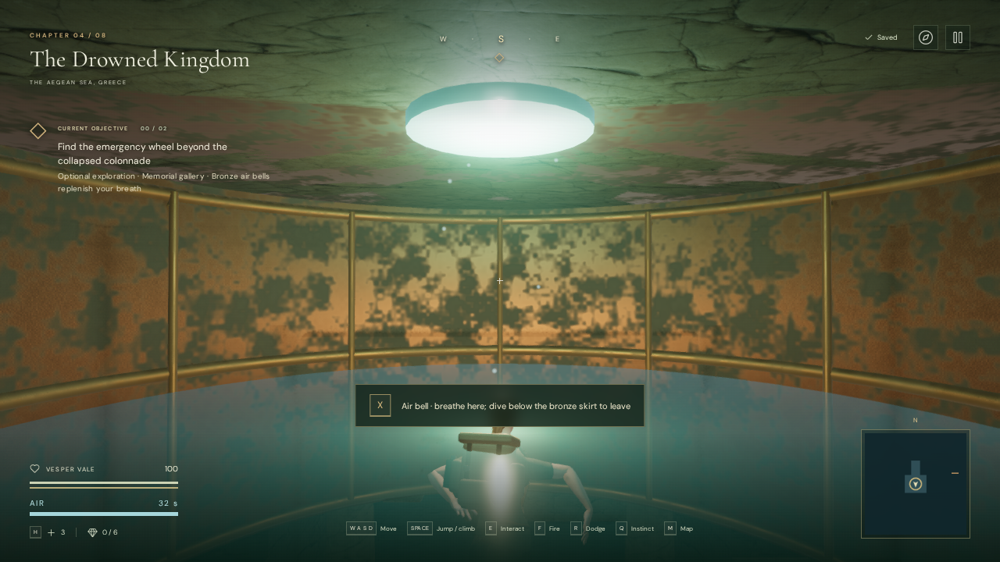

# The submerged memorial gallery

A passage in the western bank of the harbor's first sounding well now leads
beneath the Drowned Kingdom's courtyard. This optional route adds two bronze
air bells, a collapsed colonnade with alternating high and low openings, an
emergency gate wheel, and a memorial record: **The names of the living**.
Turning the wheel opens both the memorial and an eastern return passage.
The copper roll adds the tidekeepers' evacuation account to the field journal.

This is an authored side route within chapter four. It adds enclosed swimming
and a different exploration goal; it does not establish an hour of chapter
content or modern AAA graphics.

## Playing and saving

1. Enter the first sounding well, identified by its bronze float and bubble
   trail. Descend and look for the broken opening in its western bank.
2. Follow the bronze survey line. Use **WASD** to swim, **X** to descend, and
   **Space** to rise. Release both vertical controls to hold depth. Touch has
   **Dive**, **Rise**, movement and camera buttons.
3. Swim below each air bell's bronze skirt, move inside, and rise to breathe.
   The air reserve holds 32 gameplay seconds. The final ten seconds warn you to
   return to a bell. In enclosed rooms, exhausting air causes damage while
   retaining vertical control, so an automatic ascent cannot pin you to a roof.
4. Pass above and below the collapsed masonry to reach the second air bell.
   Find the emergency wheel just outside it and use **E / Use**. Allow the short
   reach and turn to finish; movement or Dive/Rise lets go. Recover the
   copper roll beyond the opened archive gate, breathe again, and use the
   eastern return passage to reach the well.
5. **M / Map** shows discovered interior rooms and the bronze air bells.
   **J / Field journal**, also available from Pause, preserves the recovered
   record. Reading and the map pause gameplay.

The last bell where the explorer breathed becomes the gallery reload anchor.
Reloading inside returns there with full air. Before reaching any bell, reloading
returns to the well's open surface. Gates, discovered rooms and the record save
independently of the five sounding records and the main hydraulic objectives.
Leaving the gallery resumes the usual surface save behavior. Death and the
pause menu's **Return to last checkpoint** retain the chapter's existing camp
checkpoint behavior.

## Construction and sound

The original terrain heightfield continues to support the palace above.
Separate interior volumes describe the floors, ceilings and passage boundaries.
Only intersecting terrain and ocean triangles are clipped away; interpolated
UVs, normals and material coordinates remain on the original triangles. Color,
contact occlusion and shadow passes therefore use the same openings. The sea
plane no longer crosses the buried rooms. After the hydraulic system lowers
water by 1.8 metres, the gallery follows the well level while each pressurized
air bell retains its own lower surface.

The interior uses the existing attributed palace stone textures and original
procedural bronze materials, with stone columns, broken lintels, ribs, rivets,
votive slabs and a floor survey line. Submerged lighting uses the explorer's
lamp and fixed lamps at the entrance, bells and memorial. The explorer changes
from a horizontal stroke to treading water inside a bell. These assets and poses
remain prototype art; no new third-party downloads are required. Existing
licenses and provenance remain in [asset credits](asset-credits.md).

Visible condensation in each bell has a positioned drip voice. It uses HRTF
panning and linear falloff between 1.2 and 18 metres. Bronze skirts obstruct and
filter the sound above their rims; the low opening remains acoustically clear.
Each moving gate has a drive voice at its fixed pinion, with falloff between
1.5 and 20 metres. Activity follows the eased gate motion and becomes zero at rest
and on pause. These sources share the existing twelve-voice environmental budget.

The water chapter's sparse diving arrangement continues throughout the gallery,
including breathing inside the bells. Immersion filtering follows whether the
explorer is underwater. Independent saved music, ambience and effects levels
remain available in Settings. These changes verify spatial and state behavior;
subjective listening and mix evaluation remain open.

## Verification

The initial gallery release passed **298 tests**, and its production build passed
with the existing large Three.js chunk advisory. New regressions cover the
complete route, both gates, breath recovery, ceiling and skirt collision,
underwater descent with exhausted air, safe reload anchors, strict save
normalization, terrain clipping, source-triangle interpolation, the clipped sea's
sound-landmark compatibility, and gate/occlusion state. Gallery construction
also avoids interpreting the previous chapter's player as a new visited room.

Assisted browser movement completed the route, recovered the roll and returned
to the surface at 100 health both before and after 1.8-metre drainage. The checks
use the real chapter's movement and collision methods with supplied waypoints.
They also retained all 36 hydraulic control approaches, 27 pump listening paths,
36 local control walks and attached handle anchors. These are assisted functional
checks, not blind human playthroughs or pacing measurements.

A separate **High production** check used native X, D, S and E input in the
normal animation loop to leave the second bell and operate the emergency wheel.
Escape saved the dive. Reloading restored the second bell's safe position,
opened gates, discovered rooms, other chapter state, 93 health, settings and
exactly 13.91109999999772 recorded gameplay seconds. The check simulated lost
focus during startup to pause immediately. Save metadata timestamps can refresh;
the underwater position intentionally returns to the breathing anchor. The
production hook was absent, assets loaded successfully, and the browser reported
no console errors or warnings. A separate recovered-record fixture in the final
release displayed Vesper’s corrected journal attribution. The gallery map displayed the correct interior
legend and omitted the surface objective-distance label.

At 844 × 390, native touch Dive submerged the explorer and changed Jump to Rise;
held Rise returned to the bell surface with all 32 seconds of air. Releasing
controls cleared their held state. At 390 × 844, the recovered journal record
remained readable in its scrollable dialog with no horizontal page overflow.
These are desktop Chromium touch emulation checks, not physical phone tests.

Same-buffer offline renders through the actual drip voice produced RMS
0.0014453316 at 1.2 m, 0.0007226657 at 9.6 m, and zero at 18 m. The live first-bell
mix selected two environmental voices, including the unobstructed drip at gain
0.2, and reported the water biome's `dive` task. At that release, both gate sources
followed their animated centers and had zero activity on pause and after reaching
their stops.

The browser used Chromium 148 with ANGLE Vulkan on the Radeon 780M. All linked
programs in the four final High views passed their link checks. The scenes still
submit substantial geometry across color, shadow and contact-occlusion passes;
these observations do not establish supported-device frame rates.

| High view, 1280 × 720 | Submitted calls | Submitted triangles |
| --- | ---: | ---: |
| Well entrance | 784 | 1,439,774 |
| First air bell | 1,819 | 3,070,639 |
| Collapsed colonnade | 1,586 | 2,650,352 |
| Memorial | 1,467 | 2,473,850 |

Changing to the crystal chapter released all 47 inspected geometries (including
the cut sea), nine materials and six unique textures associated with the gallery
and its shared surfaces. It retained no gallery state, gallery emitters or old
gallery voices. Shared textures may receive multiple disposal notifications;
the resource check counts each texture once. Verification used disposable
browser contexts, which were closed after the checks.

The release bundles are `index-c_eeiMGj.js`, `game-Dr1hFTSr.js`,
`three-DhbJ4463.js` and `index-BdgvWVky.css`. The development-only assisted route
and view helpers are in [verify-gallery-browser.js](../scripts/verify-gallery-browser.js).
Run them only with disposable test progress. Full acceptance requirements and
remaining content, art, device and listening work remain in
[production status](production-status.md).

A later [gallery rendering pass](gallery-rendering.md) culls the hidden exterior
while retaining the full shadow casters and original images. Its measurements
supersede the rendering counts above; route behavior and art remain the same.

The subsequent [gate machinery revision](gallery-machinery.md) retracts the
gates below their floors so they no longer protrude through the courtyard above.
It adds fixed guides, rack-and-pinion drives, connected pressure lines and
stationary drive emitters. That report contains the latest route, reload and
automated verification for the revised machinery.

The [wheel interaction pass](gallery-wheel.md) adds fitted hand contacts and a
visible reach, turn and release. It also checks the approach for obstructions,
retains oxygen use, supports movement cancellation and freezes both the action
and gate travel on pause. Only a completed turn saves the open-gate state.
