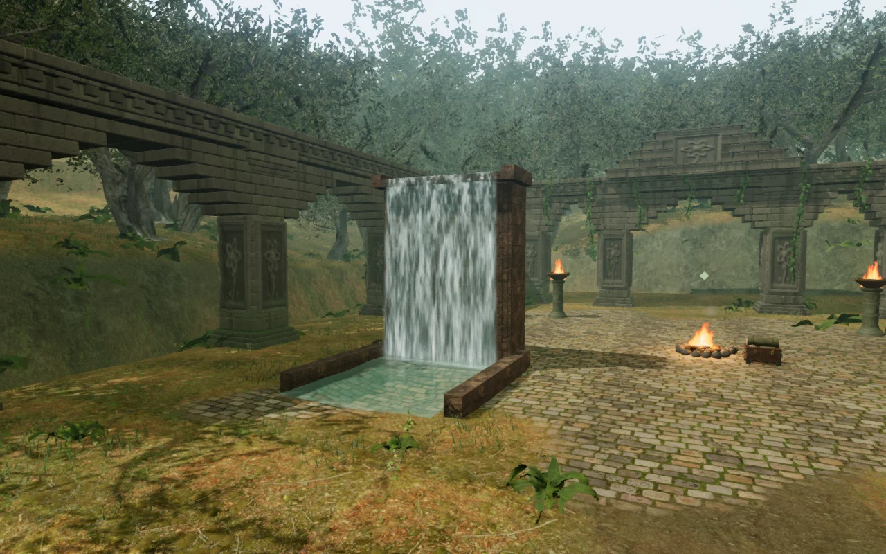
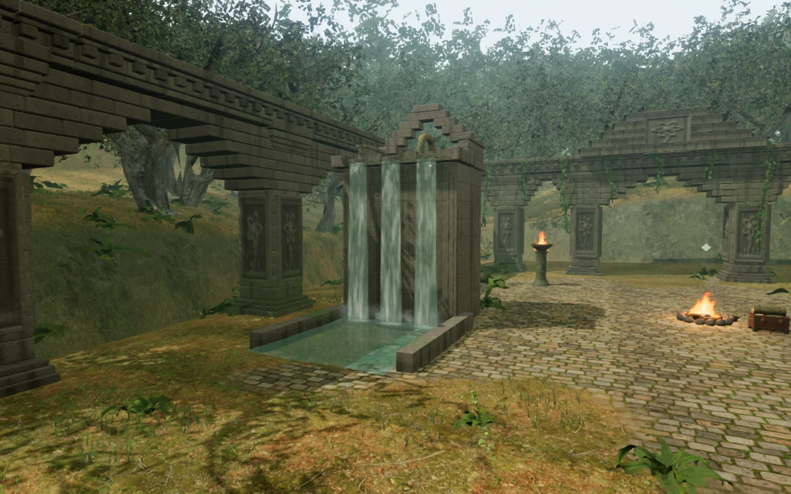
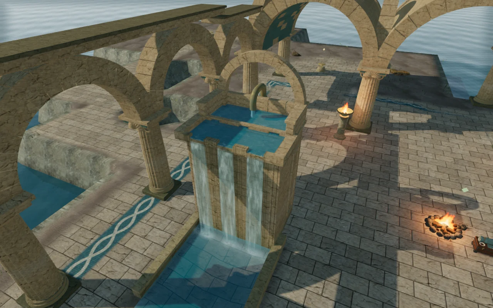
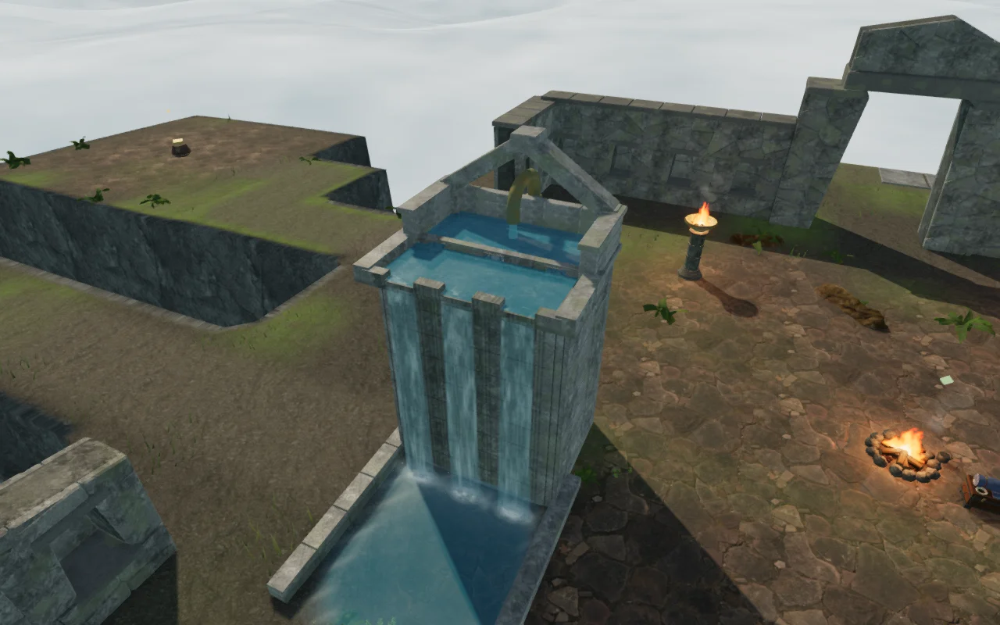
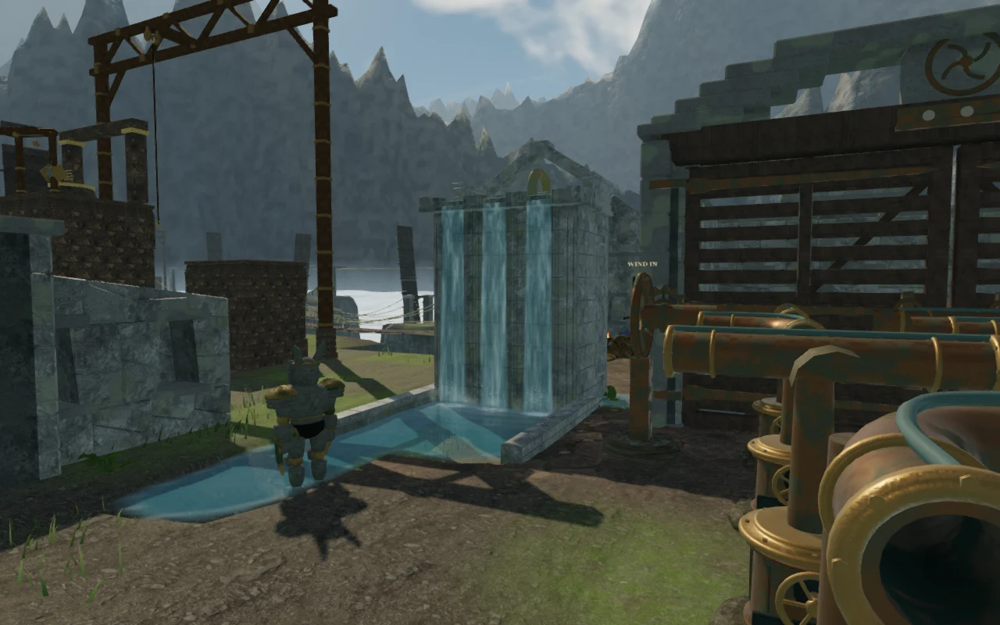
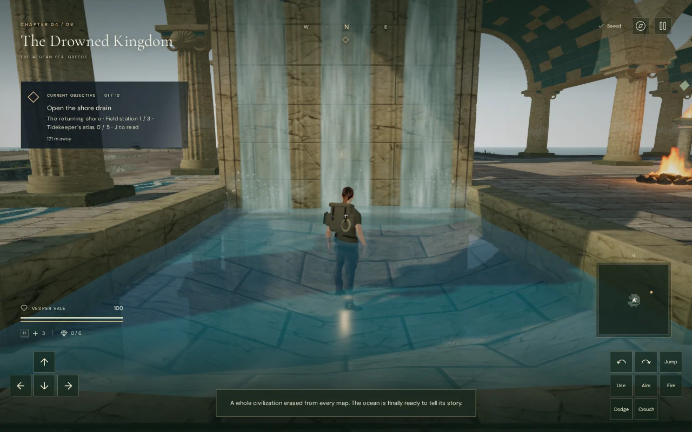

# Supplied cascades

The nine waterfalls in the jungle, drowned palace and cloud city now have
visible water supplies, deeper masonry supports and three separate spill
channels. This advances VA-03 in the [visual audit](visual-audit.md). The
receiving areas still need work: some pool boundaries look angular, especially
around the cloud-city mechanism courts. VA-03 remains open.

## Construction and flow

Each cascade moves three metres west, away from the cipher drums and wind
controls. A bronze riser emerges from the ground, clamps to the rear masonry,
and curves into an open nozzle above a header reservoir. The pipe has inner
walls and a rim around its open end. A short falling jet reaches the water.
Three open ports feed the lower trough, whose raised crests separate three
lower spill notches.

The jungle uses a corbelled crown and its temple stone; the palace uses a round
arch and its existing limestone; the cloud city uses a triangular crown and
its fitted-granite material. The service faces have recessed panel borders.
The supports and basin banks extend below a conservative terrain bound across
their full footprints. Their camera bounds also reach those buried foundations.

The falling streams respond to scene lighting, with varying roughness, fine
surface disturbance, accelerating streaks and three groups of impact foam and
spray. Header water, feed ports and the nozzle jet animate alongside the falls.
The rain garden retains its existing continuous wheel feed; the separated
cascade material is specific to these three-channel structures.

These are animated approximations. The buried supply is suggested by the
visible pipe; an underground circulation network is not simulated.

## Browser views

The entrance comparison below follows the waterfall's relocation. Both views
use High graphics and the same relative camera offset and animation time; the
updated world camera is three metres farther west. The explorer is hidden.
They are actual browser renders, not concept artwork.

Before:

After:

The palace header has an arched crown, a visible nozzle and open feed ports:

The cloud-city header reuses the surrounding granite:

The remaining receiving-area issue is visible here. The darker water and wider
shallow-edge fade reduce the pale surface, but do not resolve the angular pool
outline. This needs further terrain and basin construction work:

## Verification

The automated suite passes all **609 tests**, including terrain, water motion,
nearby puzzle foundations, rain-garden flow and the cascade geometry. The
production build succeeds with Vite's existing large-chunk advisory.

The browser checks sample 3,267 points under the nine cascades' footing
footprints, with at least 18 cm of burial. Actual character movement completes
54 local route legs around the water, banks and service faces; 13 legs include
swimming. The neighboring courts retain all 50 jungle cipher approaches,
36 coastal hydraulic controls and 119 wind controls. The hydraulic and wind
circulation helpers also complete 36 and 119 route legs respectively.

The final visual review covers 69 assisted renders: 36 views around all nine
cascades, 30 High/Low, animation-time, completed-state and submerged views, and
three additional views checking the corrected bloom artifact. The main review
hides the explorer; the quality and close-view passes also hide guardians to
expose the stonework. These views exercise the materials and camera bounds.
Curtains, impact foam, spray and the waterfall sound remain attached to the
water level as the shared reservoirs drain. Source-to-listener paths at the
front of all nine falls remain clear.

The real Web Audio HRTF voice graph was rendered with the same recording and
loop offset at three distances, independently of competing emitters:

| Distance | Measured RMS amplitude | Relative to near field |
| --- | ---: | ---: |
| 6 m | 0.025172 | 1.000 |
| 38 m | 0.012586 | 0.500 |
| 71 m | 0 | 0 |

The existing 6–70 m linear attenuation, recording, voice selection, occlusion
and quiet chapter/objective scores remain in use. These measurements verify
signal behavior; they do not establish subjective listening quality.

A side-view review caught a normal-gradient instability in the new material: the
HDR bloom pass spread it into a black region across part of the screen. Bounding
the perturbation at unit-normal scale removes the artifact at both reproduced
angles while retaining bloom. These cameras were clear of collision; the issue
was rendering, not an obstructed observer.

Six production cases use the real begin/resume interface and native keyboard
or portrait touch input, with High and Low graphics respectively. Each moves
into the entrance basin and back out, saving and reloading after each leg. All
12 reload comparisons preserve the complete normalized save, including camera,
position, health and progress, apart from timestamps. Health stays at 100.
The muted touch cases fit a 540 × 900 viewport without horizontal overflow.
The production pages load the current built assets, expose no development game
handle, and report no browser errors, warnings or failed requests.

Production keyboard view after wading into the palace entrance basin:

The reusable development helper is
[verify-cascade-browser.js](../scripts/verify-cascade-browser.js). Assisted
placements and short input checks do not establish a full human playthrough,
consumer-device performance or completion of the broader visual audit.

## Assets

The header reservoir, crown, riser and lit cascade shader are original project
code. They reuse the credited stone maps, procedural bronze, hydraulic jet
material and local waterfall recording. No external asset or dependency was
added. See [asset credits](asset-credits.md).
