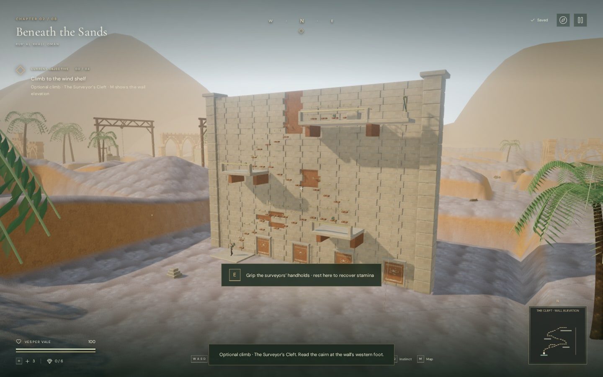
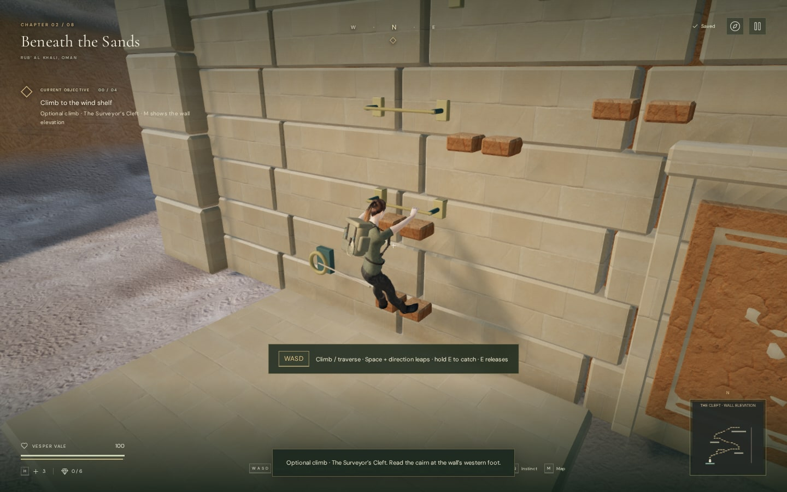

# The Surveyor’s Cleft

The later [ruined survey house update](cleft-masonry.md) adds buttresses,
rear galleries and revised masonry around the preserved climbing route.
The images and validation below describe the original traversal milestone.

The desert chapter has an optional climb east of its western survey station.
The quarry face contains 37 handholds, a branch around the first broken span,
three upper rest terraces and a summit writing desk. Recovering the surveyors’
last bearing adds an original journal entry; the eastern return line lowers the
explorer to the sand. Chapter mechanisms and existing discoveries retain their
positions and progress.



## Playing

Read the cairn at the western foot of the wall. Use **E / Use** near the first
bronze bar to grip it. While hanging, directions follow the face of the wall:
Up climbs, Down descends, and Left / Right traverse. Turning the camera does not
change those directions. Hold a direction to continue between connected grips.
The [climbing camera](quarry-camera.md) faces the wall when you take a grip.
Look controls stay around nearby holds; step onto a terrace to look all the
way around.

The upper fork bypasses the first broken span. Longer transfers require a
direction and **Space / Jump**, followed by holding **E / Use** to catch the far
handhold. The catch window starts after 62% of the 0.95-second transfer. Missing
it, running out of stamina, or using E while hanging starts a belay recovery.

Beside a terrace, release movement and press Jump to step onto it. Stamina
recovers through the existing standing movement system. The climb consumes two
stamina points per second while hanging, four while moving, and ten at leap
takeoff. Each new rest terrace saves. Open **M** for a front elevation showing
the grips, broken links, terraces and return line. Touch movement, Jump and Use
support the same sequence, including holding Use with another finger.



## Persistence and recovery

The optional record lives in `levels.sands.cleft`, independently of chapter
stage, field actions, mechanisms and relic completion. It stores discovery,
highest terrace and record recovery. The in-memory belay anchor is the last
terrace actually stood on or gripped from; it can be lower than the highest
terrace discovered.

Saving during a climb, leap, recovery or return descent writes a supported
terrace position. Reloading returns there through the existing supported-arrival
system. Transient grip, input, pose and animation progress are not serialized.
Pausing keeps the current pose and freezes movement; its save still targets the
terrace. Death, checkpoint return and chapter changes release the climbing state.
Older saves without this record receive an empty optional-climb state.

## Implementation

- `cleft-rules.js` defines the graph, directions, safe deck support, collision,
  sight obstruction and normalized save data. The map addition runs after the
  seeded campaign features. Terrain flattening covers the new site and a path
  joins the existing western survey route.
- `cleft.js` handles reaching, climbing, leaps, catches, mounting, belay recovery
  and the return descent. Transfers query world collision; an obstructed move
  recovers to the anchor. A 1 cm contact tolerance prevents floating-point error
  from treating feet resting on a terrace as inside its floor.
- `cleft-art.js` builds and batches the wall, foot supports, 38 mm bronze grips,
  measuring niches, balconies, writing desk and return line. A visible tether
  follows the explorer while climbing. Camera surfaces are captured before
  batching. Existing desert PBR maps and original geometry are reused.
- `cleft-pose.js` fits the delivered character’s palms and fingers to the bars
  and inclined return rope, using the existing cylinder grip solver. Moving
  reaches alternate hands; the leap releases them before the catch.
- `cleft-map.js` draws a front elevation for the local map and full map. The
  journal and HUD explain the optional objective and preserve the record.

The draft comes from the visible central fracture; rope motion comes from the
upper return anchor, and grip sounds originate at the touched hold. The existing
HRTF positioning, distance attenuation, quiet-voice culling, obstruction filter
and mixer controls apply. Climbing selects the desert score’s traversal accent;
resting selects its quieter survey context. Pausing disables return-line motion
noise. This adds no new recording dependencies.

## Validation and limits

All **364 tests** and `npm run build` passed for this milestone. Ten added tests
cover the directional graph and bypass, supported arrivals,
wall and balcony collision, the complete ascent and descent, record uniqueness,
save normalization, pause/recovery, attack exclusion, old-save relocation and
chapter-state reset. Independent checks against the delivered skinned mesh
measure palm/finger contact while hanging and at four points down the inclined
return rope, without changing limb lengths or scales.

Assisted browser checks use native keyboard events with manual simulation steps
and active guardians. They also exercise a native multi-touch jump and catch,
input release, the elevation map, clear access from the western path, all graph
transfers against world collision, pause/recovery, both graphics settings and
chapter cleanup. These checks establish behavior, not an unassisted human
playthrough or consumer-hardware performance.

The production browser loaded an isolated prepared save on the first upper
terrace, gripped with native E, and climbed with native W. Stamina dropped to
94.1; pausing during the climb saved the terrace at `{x:209, z:219.2, height:6}`.
Reload restored that supported position and the recovered record, allowed
regripping, and displayed the record in the journal. Health remained 100; the
development hook was absent. The tested build used `index-B2SjFXUA.js`,
`game-Dhyreepi.js`, `three-BQ7rJjuU.js` and `index-DYq9hjRy.css`. Browser checks
reported no application errors, failed assets or shader link failures. The build
retains the existing advisory about large JavaScript chunks.

For a read-only clearance inspection in the development browser, load the desert
chapter and run:

```js
const { inspectCleftClearance } =
  await import("/scripts/inspect-cleft-browser.js");
inspectCleftClearance(__vesper.game);
```

This checks the generated world, including campaign obstacles, without moving
the player or changing the save. `blocked` and `approach` should both be empty.

The draft probe measured unoccluded gain 0.0336 at 3 m and 0.021 at 12 m.
At 24 m it fell below the existing 0.006 quiet-voice cutoff and was culled; it
remained absent at 32 m, beyond its 27 m range. The measured overview submitted
529,432 triangles / 283 draws on Performance and 1,675,031 triangles / 742 draws
on High. Those are rendering workloads, not frame rates. Chapter change disposed
all seven observed cleft geometries and five materials and cleared its live state.

This remains a prototype traversal scene. It does not establish the requested
one-hour chapter pacing or AAA visual quality. The repeated masonry, animation
transitions, belay behavior, wider device coverage and subjective sound/mix
quality still need production work and human playtesting.
