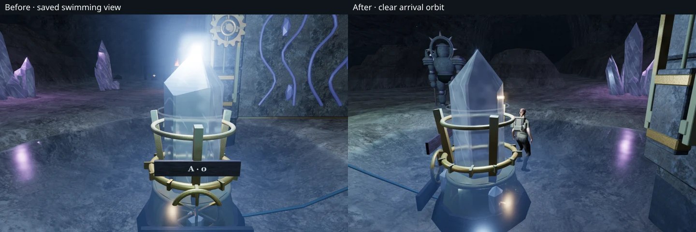
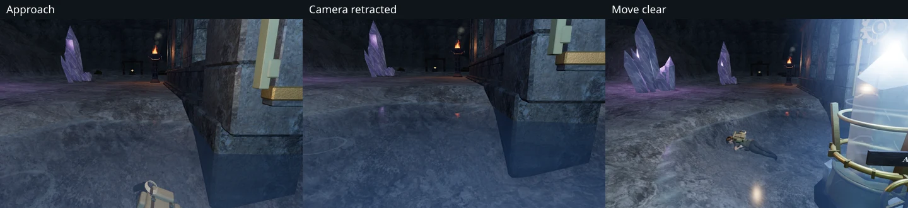

# Camera clearance beside submerged instruments

Swimming back toward the last crystal court's instrument could leave the camera
behind the crystal, hiding the explorer and the bank. The saved example placed
the camera target about 5 mm outside the instrument's solid bounds but inside
its 28 cm camera margin. The collision query treated that expanded margin as
being inside the prop and ignored the obstruction. Rays against the visible
crystal confirmed that it lay between the camera and the target.

The query now distinguishes an actual solid from its camera margin. A target
in the margin can look outward or along its edge, but an arm directed through
the solid retracts immediately. A target genuinely inside a prop retains the
existing outward escape behavior.

When the arm retracts fully, the view keeps the player's chosen heading and
pitch. The final 60 cm blend into that direction so lateral retraction cannot
end in a sudden turn. The existing explorer/equipment fade makes room for this
close view; moving away restores the full third-person orbit. Saved arrivals
use the same collision boundary and select a clear nearby orbit when necessary.

## Verification

All **638 tests** pass, and the production build succeeds with the existing
large-chunk advisory. Two new regressions check the margin/solid distinction,
continuous approach and retreat, outward escape, arrival recovery, and smooth
heading/pitch behavior through a collapsed arm in all quadrants.

Eight assisted pool paths cover all four crystal pools at High and Low. Each
path enters the water, approaches the instrument, waits, moves sideways, and
returns to the bank. Across **3,040 sampled movement frames**, rays against the
actual crystals find no obstruction between camera and target; the unpadded
collision query also remains clear. Chosen yaw and pitch stay fixed, health
stays at 100, and every path ends on land with full character visibility and a
camera arm longer than 5.2 m. All 58 captured views were reviewed.

Eight further approach/retreat checks cover the shared camera in every chapter.
Their 1,480 sampled frames preserve chosen angles and health, and all recover
the normal orbit. Another 48 reviewed views cover these paths and the related
states: shoulder aiming and a registered hit, crouching, scope exit, reflection
capture and the carried torch at full, partial and zero character visibility.
The torch retains its attached light, animation clock and active positioned
fire voice while the character fades. Reflection capture temporarily restores
the full character and then restores the requested fade.

Four native production cases exercise keyboard/High and touch/portrait Low at
the affected bank and saved swimming position. All eight movement legs retain
health 100. Their eight reloads preserve every normalized save field apart from
timestamps and five camera-only obstruction corrections. Independent scene
checks reproduce every correction: the old arm lengths range from 0 to 3.59 m,
and the selected clear orbits range from 5.29 to 5.34 m. The other camera angles
persist exactly. The twelve native captures were reviewed, including the close
swimming view and recovery onto dry ground.

The native fixtures mark encounters defeated to isolate camera and input
behavior. The production page has no development hook, overflow, failed
requests, browser errors or warnings. Its verified bundles are
`game-BTCZYMvz.js`, `index-CJcP1LPM.js` and `three-BhCjE66g.js`.

The [reusable pool movement helper](../scripts/inspect-swimming-camera-browser.js)
uses ordinary player and camera updates with prepared positions. It does not
step enemy AI or establish a chapter playthrough. Raw captures, exported test
progress and logs remain in ignored local staging. No new external assets are
introduced; existing [attribution](asset-credits.md) is retained.

This resolves VA-18. The broader [world audit](visual-audit.md) remains open.
This camera repair does not establish completion of the remaining terrain,
composition or route review.
