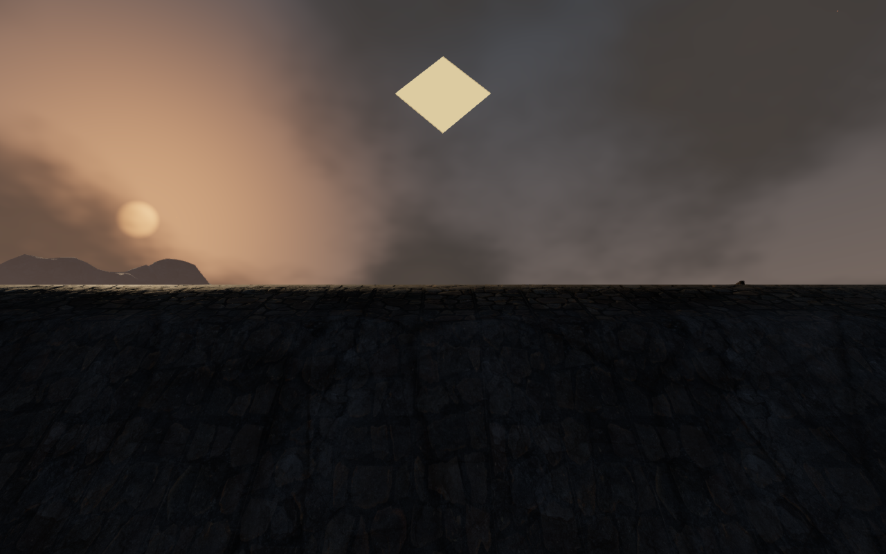
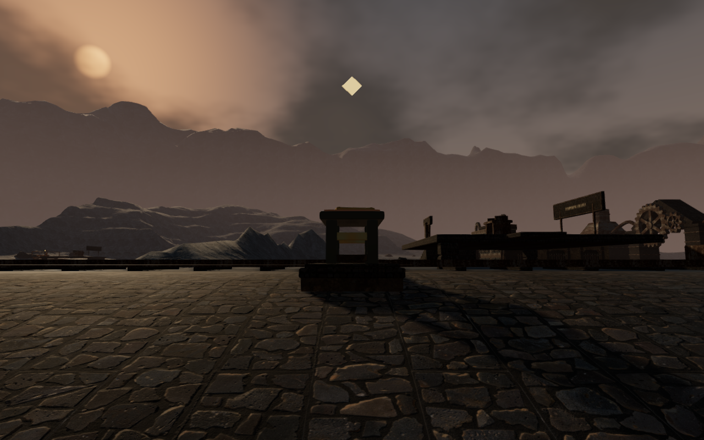
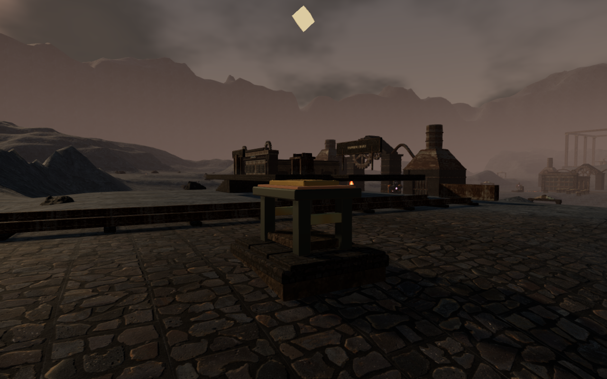
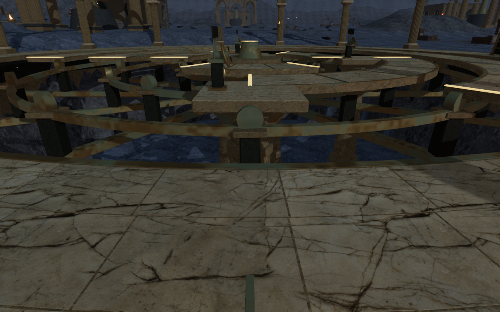

# Graded approaches beside the tempering railway

The raised service railway now meets its surrounding ground through a wider
approach. The old four-metre blend created a steep shoulder beside volcanic
note 2: the recorded eastern bank rose **3.44 m in one 1.75 m terrain interval**.
The largest rise in that same sampled box is now **0.79 m**. This is a local
measurement beside the railway, not a maximum for the whole volcanic chapter.

The [terrain weight](../src/tempering-terrain.js) extends the railway approach
to 20 m while retaining its authored floor and original foundation weight.
Neighboring main and field working pads, the other discoveries and complete
water footprints keep priority. Volcanic crest relief fades outside the graded
area. The two comparison views use the same world x/z coordinates; their eye
heights follow the terrain beneath them.

Volcanic note 2's original map position now lies at an elevation of 20.48 m,
instead of 16.40 m. Its existing clearance search selects a foundation at
**(159.25, 343)**, 1.75 m west of its map position and 5.25 m west of the
previous milestone's constructed stand. The stand elevation is 20.74 m. Its
ID, text, reward and save fields remain unchanged.

All other 17 volcanic discovery-centre elevations and every other feature
centre retain their recorded heights. All **2,673 sampled main/field working
floor points**, the railway floor elevation and every water-site record remain
exact. The other seven chapters' height arrays are unchanged. The volcanic
field changes 2,406 height samples within the railway vicinity. Terrain chunks
keep their existing grid and triangle count. No external assets or
dependencies were added.

## Verification

All **681 automated tests pass**, including three new
[railway terrain regressions](../tests/tempering-terrain.test.js). These check
the recorded slope, shipped working-floor and lava records, railway supports
and overlapping instrument/water priorities. The earlier discovery regression
retains the other 17 volcanic elevations while allowing note 2's intentional
bank repair. The production build succeeds with the existing bundle-size
advisory.

Six isolated character-physics crossings traverse the eastern apron in both
directions at z = 334.25, 350 and 378. They cover 73.2 m over 2,196 frames,
arrive with health 100 and use the normal follow camera. Enemy and hazard
updates are excluded from these local terrain checks. Their 18 movement views
were reviewed.

All eighteen volcanic discoveries pass occupied-centre collision, clear
collection stances, sight and nearest-item selection. Direct interactions on
disposable development progress record every note and reward each cache with
one medical item. Found construction remains visible and solid. Rebuilding
found progress and fully open sanctuary gates retains all eighteen placements
and clear stances. All 21 discovery views were reviewed, including the repaired
note from both sides, with no blocked views or shader-link failures.

The railway mission check completes loading, both rides, inspection, table
turning, delivery and exit. Pausing stops the cart and its moving sound source;
three emitter buffers have nonzero loaded voices and the expected offline
distance attenuation: halfway through their linear range, RMS is half the near
value, and beyond the range it is zero. These are playback measurements, not a
listening assessment. Six mission renders include High, Medium and Low views.
The route takes the same 20-point health loss before inspection as the earlier
baseline and ends at health 80.

Native production keyboard/High at 1280×800 and touch/Low at 540×900 both
approach and collect note 2, open its reading panel and preserve the complete
save on reload apart from play timestamps. Both retain health 100. A save
occupying the new stand recovers to a clear position 1.5 m away and stays exact
on a second reload. Two separate pre-grading saves retain their positions and
progress on arrival, then pass native movement and exact reloads on the new
ground. Those older-save movement cases cover 3.63 m with keyboard input and
10.49 m with touch input, with health 100 and no horizontal overflow. Enemy
combat is suppressed in these disposable collection and terrain fixtures.

Seven further production cases verify keyboard loading and travel, interrupted
travel recovery, interrupted and completed table turns, portrait touch delivery,
a returned cart after mission completion and recovery of a legacy completed
save. Every reload preserves the full save apart from play timestamps, and
health retains the fixture's value of 100 or 80. The twelve production cases
load the final build's four JavaScript/CSS assets without a development hook,
with no browser errors or warnings. Their collection, arrival, movement and
railway captures were reviewed.

## Orrery well and continuing review

The eclipse survey's largest nearby rise belongs to the orrery's deliberately
deep well. Its [terrain rule](../src/terrain.js) cuts a 10 m depression inside
the outer landing. The [vault construction](../src/orbit-vault.js) supplies
the drum, retaining masonry, fixed bearings and moving platforms. Six new rim
views inspect those surfaces and the western approach. This milestone makes
no eclipse terrain change and does not classify every outer vault edge as
finished.

VA-15 remains open for broader terrain and continuous route coverage. Sparse
discovery surroundings, repeated court arrangements and the complete-world
review also remain open in the [visual audit](visual-audit.md). These bounded
checks do not establish human playthrough duration, consumer hardware
performance, subjective audio quality or AAA graphics. Raw captures, logs,
profiles and disposable saves remain in ignored workspace staging.
