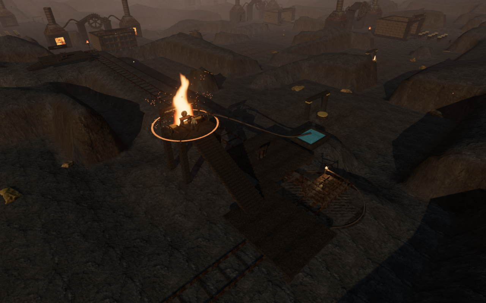
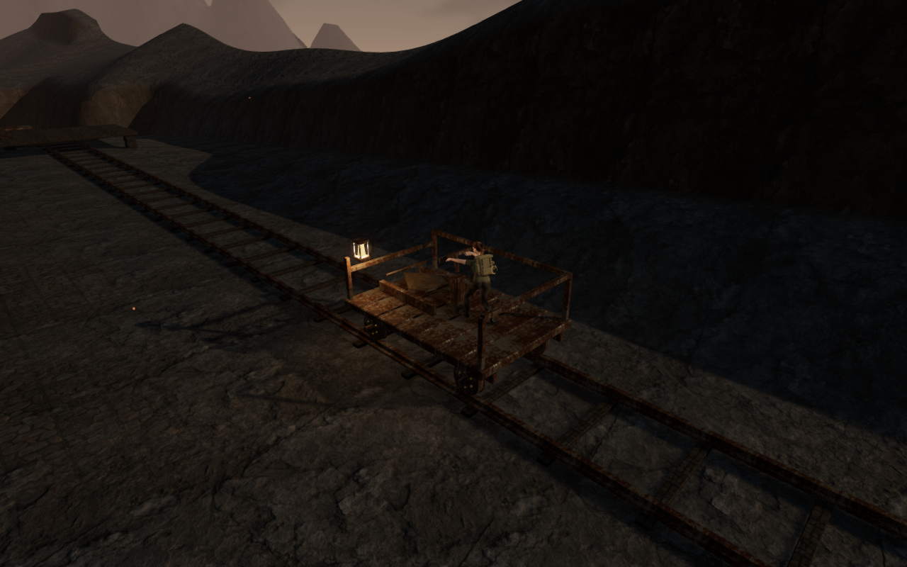
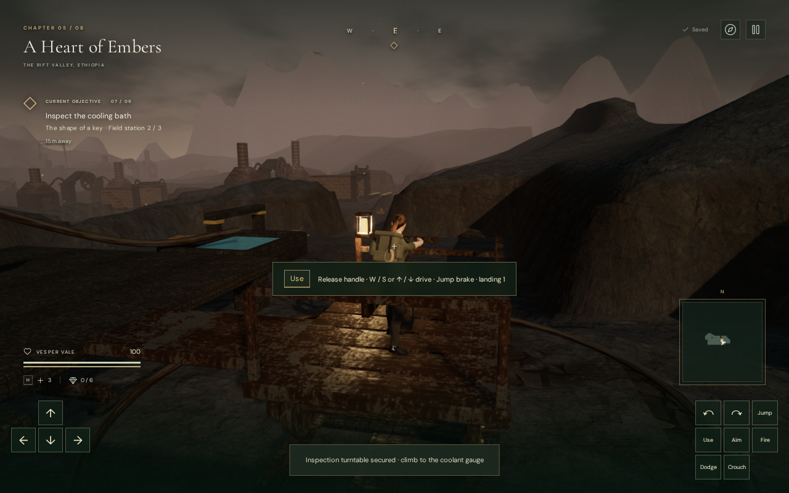
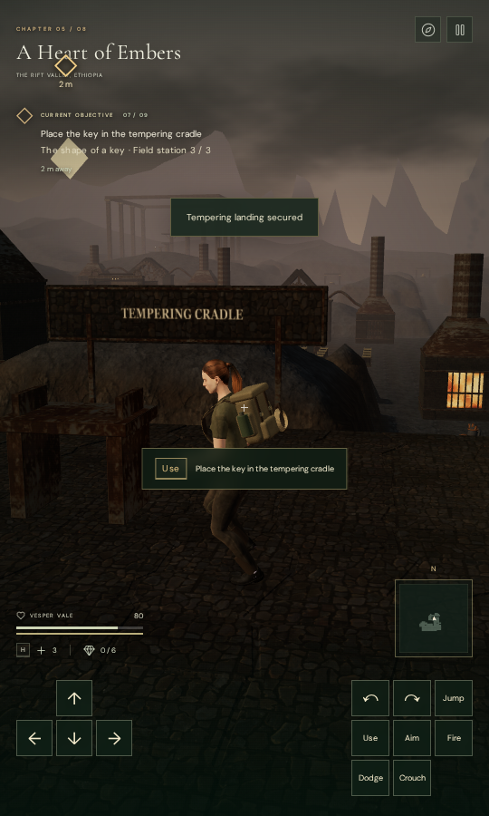

# The obsidian tempering railway

The seventh field mission in **A Heart of Embers** now transports its key blank
on a working rail cart. Two 70 m runs meet at a quarter-turn table: the first
heads east from the loading bench; the second heads north to the tempering
cradle. The existing mission identifiers and three ordered field actions are
preserved.

## Playing the route

1. Lift the obsidian blank at the loading bench. Board the cart through its open
   side and press **E / Use** to secure the cargo and take the pump handle.
2. Hold **W / Up** to travel forward, or **S / Down** to reverse. Releasing movement
   applies the brake; **Space** also brakes. **E / Use** releases the handle.
   Steering follows the rails, independently of camera direction.
3. Stop at the inspection turntable. Leave by its boarding bridge, follow the
   connected service walkway and climb the 28 treads to the coolant gauge.
   Watch the furnace vent's warning cycle. Inspect the bath, then use the
   gallery handwheel to turn the rails toward the tempering cradle.
4. Descend the stair and board from the west platform. Ride north, dismount onto
   the cradle platform and deliver the key. The west stair returns to the
   surrounding route.

The cart can reverse along either run. To change runs, return it to the table
and operate the gallery handwheel. Each landing also has an empty-cart retrieval
control. Its winch moves the cart along the rails and, after inspection, turns
it through the junction as necessary.

## Construction and sound

The route uses fitted stone platforms, rail heads and webs, sleepers, a rotating
track segment, a raised inspection gallery, a piped cooling bath, mounted
instructions and an illuminated cargo cart. Moving wheels and a pumping handle
follow cart travel. Passenger support, the cargo basket, guardrails, camera
obstruction and sight occlusion follow the cart's position and orientation.
Decorative rock footprints are excluded from the track and working platforms.

Three positional emitters supply rolling machinery, turntable gearing and
coolant steam. Their near/range distances are 1.5–24 m, 2–24 m and 2–20 m.
Movement controls the wheel sound, rotation controls the turntable sound, and
inspection increases the bath's gentle steam. Pausing silences these emitters.
The chapter's existing quiet bronze score uses its lifting arrangement while
operating the cart or turntable. The existing mix sliders and 12-voice budget
continue to apply.

All new geometry and writing are original project work. Existing forge textures,
water/steam effects and original synthesized audio are reused; attribution is
retained in [asset credits](asset-credits.md).

## Persistence

The volcanic chapter saves cargo loading, the last secured landing and the
seated table orientation in browser local storage. A save during travel restores
the cart to its last landing and the passenger to a supported platform there.
An interrupted turn restores the previous seated alignment. Completed missions
retain later return journeys. Older progress that already records inspection or
delivery recovers the appropriate cargo and landing state.

## Verification and limits

- All **515 automated tests** pass, including mission ordering, acceleration and
  braking, both rail runs, retrieval, stairs and bridges, safe landing anchors,
  rock exclusions, moving occlusion and save normalization.
- The production build passes. Vite retains its advisory about large JavaScript
  chunks.
- A continuous assisted browser route used normal character movement with live
  hazards and enemies. It completed loading, inspection, turning, delivery and
  the exit stair. The vent caused 20 damage during that run; the route finished
  with 80 health. This is a functional check, not a blind human playthrough.
- High, Medium and Low renders compiled without shader errors. The sampled High
  inspection view submitted 1,155 calls and 980,781 triangles; the sampled Low
  view submitted 597 calls and 413,598 triangles. These are whole-scene counts,
  not measurements of the cart's incremental cost or consumer frame rate.
- Browser audio checks found the moving and rotating emitters in the active mix
  and their absence during pause. Offline HRTF rendering measured half the near
  amplitude at the midpoint of each falloff interval and silence beyond range.
  That verifies attenuation behavior, not subjective sound quality.
- Seven production save/reload cases pass with the development hook absent:
  keyboard loading and the eastbound ride, interrupted travel, interrupted and
  seated table turns, muted portrait touch travel and delivery, a completed
  mission's returned cart, and legacy completed progress. Entire saves match
  across reloads apart from their last-played timestamp; loaded bundle names
  match the build output. The portrait page has no horizontal overflow.
- Changing chapters disposed all 73 owned geometries and 13 materials observed
  for the railway and removed its three sound sources. The browser reported no
  failed assets, page errors or console warnings.

| Production keyboard view                                                                                 | Production touch view                                                                                  |
| -------------------------------------------------------------------------------------------------------- | ------------------------------------------------------------------------------------------------------ |
|  |  |

This adds a distinct transport and traversal sequence to an existing chapter.
It does not establish one-hour level pacing. Modern AAA graphics remain unmet;
the surrounding terrain and several older structures are still visibly
prototypical. Blind human playthroughs, listening review and broader browser and
device testing remain necessary. The original requirements are retained in
[production status](production-status.md).
