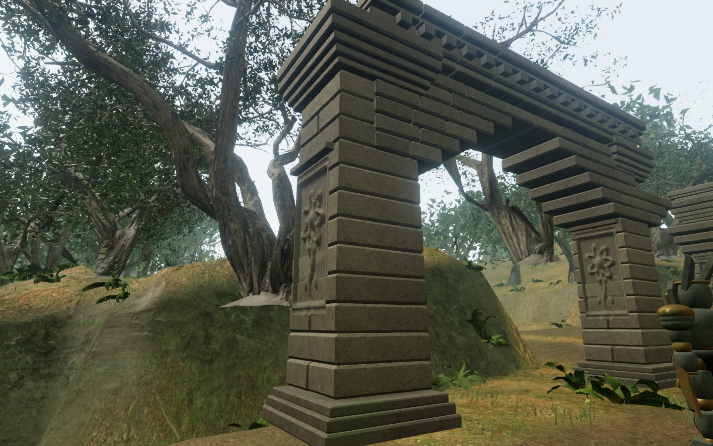
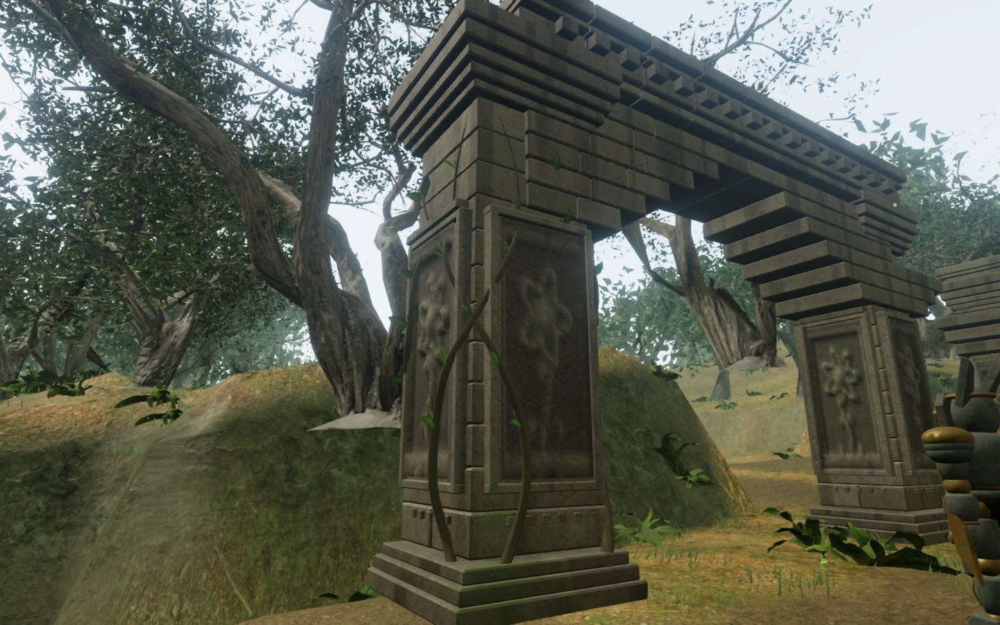
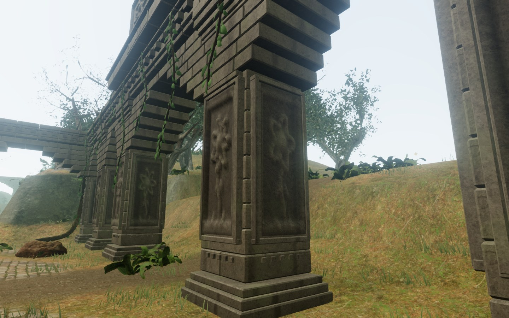

# Jungle temple facings and climbing growth

The jungle's nine sanctuary structures now have **392 carved faces across 98 piers**. The reliefs face all four approaches, with backing slabs, narrow borders and a low decorative belt. The original single-sided reliefs partly entered the tapered structural blocks near their lower courses; the new recesses sit ahead of their backing. Alternating split-course directions and narrower bevels reduce the repeated appearance of the masonry.

The shared jungle stone material adds vertical rain staining, patchy surface deposits and roughness variation. Fifteen selected piers carry original tapered woody climbers and folded leaves. The growth curves around their stone surfaces and ends in fine tips. Leaf tips move subtly in the breeze; their shadow material uses the same displacement and clock.

Before:

After:

The geometry fits inside the existing solid pier envelope. Leaves begin above walking height. Structure, pier footprints, rubble placement, bird-perch heights and camera collision records retain their previous values. Decoration uses its own random sequence so the added pieces do not move the existing rubble. Fine detail still retires by distance; the structural silhouette remains present. Added surfaces batch by material, including the climbers and leaves.

## Rendered comparison

Four fixed observer views were captured in High and Performance settings at 1440 × 900. Camera position, camera quaternion and all temple collision records matched the baseline exactly. All observed shader programs linked, including the moving leaf shadows. No console errors, warnings or failed assets were captured.

| Setting / view | Before triangles | After triangles | Before draws | After draws |
| --- | ---: | ---: | ---: | ---: |
| Performance / pier | 718,558 | 789,918 | 235 | 235 |
| Performance / arcade | 1,593,251 | 1,668,931 | 829 | 831 |
| Performance / rooted pier | 753,410 | 829,090 | 391 | 393 |
| Performance / entrance court | 372,531 | 466,803 | 100 | 102 |
| High / pier | 1,886,539 | 2,029,259 | 629 | 629 |
| High / arcade | 3,881,247 | 4,032,607 | 1,877 | 1,881 |
| High / rooted pier | 1,987,654 | 2,139,014 | 970 | 974 |
| High / entrance court | 2,647,686 | 3,024,774 | 594 | 602 |

These are renderer submission counts across the active passes, not frame-rate measurements. The artwork **increases rendering work**. It has not established performance on a broad set of consumer devices or graphics comparable to a modern AAA game.

## Verification

- All **354 automated tests passed**. Four new checks cover ray visibility of recesses and raised petals on every face, finite geometry inside the existing pier envelope, preservation of surfaces through batching, and matching leaf/shadow motion with independent detail culling.
- Both assisted torch relays reached all five braziers with their carried flame and 100 health. All twenty checked shrine approaches remained clear; their fire-emitter positions matched the visible flames. The native-input, assisted 6.6 m stealth approach beside the new facings remained undetected with live guardians and 100 health.
- Pause retained the exact leaf-animation clock. Changing chapters disposed all 36 observed temple geometries and all five observed materials, including the leaf shadow material, and cleared the temple patches and wind reference. The route and cleanup checks captured no console errors, warnings or failed assets.
- The final production build had no development hook. Native B, camera-turn and movement input traveled 3.095 m beside the temple; pause and reload restored the exact saved position and 100 health. Crouch reset on reload, B re-entered it, and V transitioned to shoulder aim. The release check captured no console errors, warnings or failed assets.
- The production build passed with the existing large-chunk advisory. Final bundles: `index-ZgTw6ykH.js`, `game-vLHqfaiA.js`, `three-DaA8tNZx.js` and `index-DYq9hjRy.css`.

This is an environmental detail milestone. The facings reuse the project's botanical relief generator; they are not scans of historical inscriptions. The woody growth and leaf silhouettes are procedural artwork. Existing local stone textures and all existing audio recordings retain their [asset attribution](asset-credits.md); no new external assets were downloaded. The sound-emitting objects keep their existing positions and falloff behavior.

The fixed observer screenshots and assisted route checks do not prove unassisted campaign pacing, full encounter balance, subjective mix quality or AAA graphics. Approximately one-hour chapters, broader device coverage and the original visual target remain open. Temporary captures, saves, profiles and logs stay under ignored `local/staging/`; the reusable comparison helper is [inspect-temple-browser.js](../scripts/inspect-temple-browser.js).
