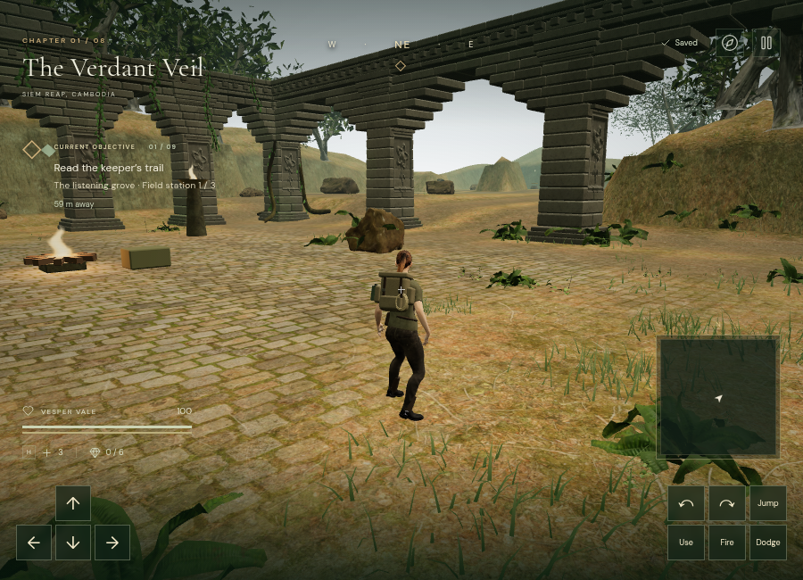
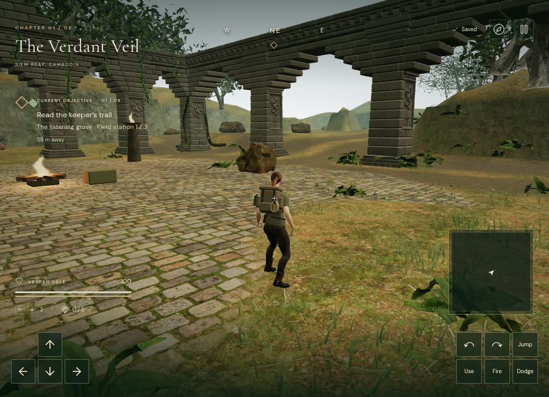
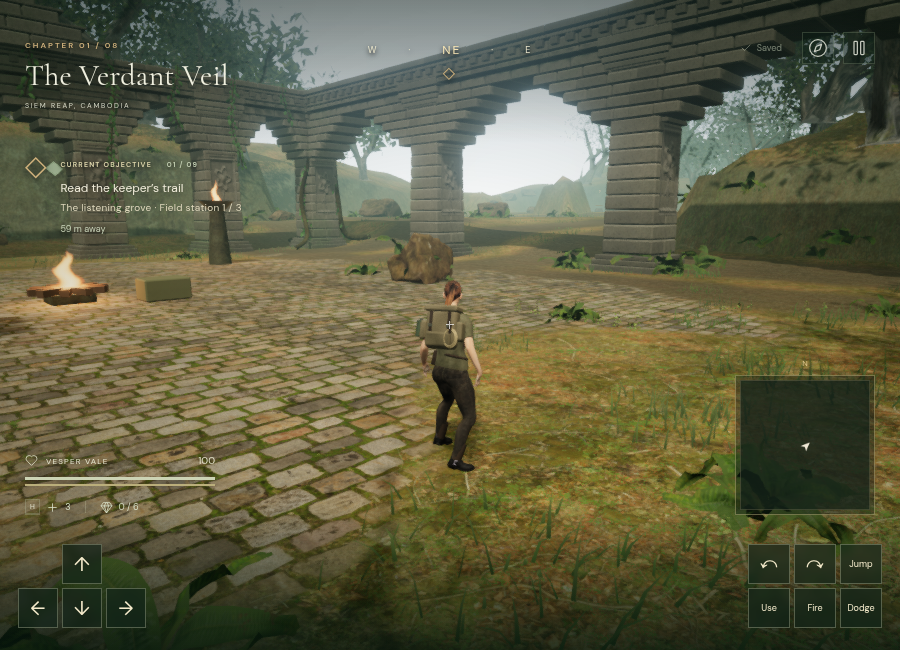
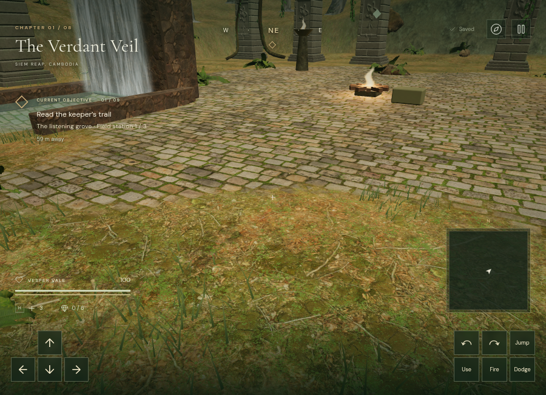

# Layered terrain materials and shadow settings

The terrain previously blended several color maps while retaining mismatched normal and roughness responses. `src/terrain-material.js` now gives natural ground, paving, and cliffs shared blend weights across those channels. Rotated ground samples and the three cliff projections derive their surface-normal frames from their own texture coordinates.

The jungle adds irregular moss coverage, subdued damp variation, and height-guided paving transitions. Raised stones survive at worn edges while soil and moss enter lower joints. Leaf litter remains visible between moss fronds and patches, and the trail mask retains compacted soil along routes. Soft moss and compacted soil use fixed matte roughness values; they are approximations, while natural ground, paving, and cliffs use their supplied roughness maps. The height map controls blending only; it does not displace terrain or change collision heights.

The surface geometry, walkable map, field-station foundations, water basins, and existing vegetation placement are unchanged. `game.terrainTexturesReady` joins `visualsReady`, making full terrain texture readiness available to loading and review code.

## Assets and budget

Two unmodified 2K maps from [ambientCG Ground 037](https://ambientcg.com/view?id=Ground037) provide moss color and OpenGL normals. Its [CC0 license](https://docs.ambientcg.com/license/) permits including the files in the game. A 1K displacement map from [Poly Haven Mossy Cobblestone](https://polyhaven.com/a/mossy_cobblestone), also CC0, follows the existing paving maps. The maps are bundled locally; play does not request either external asset service.

`scripts/download-terrain-detail.py` reproduces the downloads. The original moss archive, paving download metadata, source URLs, and SHA-256 records are retained under `asset-sources/terrain-detail/`. Delivered assets match those recorded hashes. The three new files total approximately 19.4 MB.

The jungle uses 14 terrain textures, plus environment lighting and a directional shadow map in High quality. Other chapters use nine terrain textures. Additional texture sampling and memory are real costs; unchanged triangle counts do not imply unchanged GPU frame time. Texture compression and consumer-device profiling remain production work.

## Quality-setting correction

Switching from Performance to a higher setting could enable shadow rendering without recompiling existing receivers to use those shadows. `Adventure.applySettings()` now marks each unique scene material for an update when the shadow toggle changes, including hidden distance tiers and shared materials. Reapplying the same shadow state, or moving between Balanced and High, avoids that unnecessary invalidation. Chapter loading also applies the current renderer settings.

The regression test covers both toggle directions, shared/multiple materials, invisible meshes, resolution changes, and repeated settings application. The browser audit checks the active terrain program, rather than relying on the selected quality label or renderer flag alone.

Earlier development checks sometimes assigned settings directly without applying them to the renderer. Earlier High submission counts are historical diagnostics and do not prove that every surface was receiving shadows. Current verification checks the directional-shadow sampler in the active shader as well as the renderer setting.

## Rendered views

These matching Performance views use the same diagnostic camera and initial lighting state:




This High view updates the scene's daylight position and has verified shadow reception:





These are real-time browser screenshots. They remain below the requested AAA visual standard.

## Verification

The full suite passes 105 tests and the production build passes, retaining the existing Three.js chunk-size advisory. All three new assets match the recorded source hashes. All 14 jungle terrain textures and all nine textures in each other chapter loaded in Chromium.

After the shadow-setting correction, all eight actual chapter worlds rendered without console warnings/errors or shader-link messages. Active terrain programs reported shadow reception on High in the jungle and Balanced in the other seven chapters. Texture counts were 16 for the jungle, 11 for the cloud city, and 10 for the other chapters, including lighting/shadow textures. Switching the jungle to Performance reported both renderer shadows and shader shadow reception disabled, with 15 texture samplers; switching back to High restored both and used 16.

The corrected High jungle view submitted about 4.11 million triangles across 794 calls, including rendering passes. These are workload counts on ANGLE/SwiftShader, not consumer-GPU frame-rate measurements. Screenshot capture once timed out after the quality sequence had finished; inspecting the active shader confirmed the completed state, and retrying only the capture succeeded.

Inspect a rendered development expedition's current terrain program with:

```js
(await import('/scripts/profile-render-browser.js')).inspectTerrainProgram(__vesper.game)
```

The helper is excluded from the production bundle. Full-duration playtests, supported-device benchmarking, and further environment/character art remain necessary for the original goal.

The final production build opened the jungle briefing in High quality at a 640 × 420 viewport. All three new terrain files returned HTTP 200 from the local app with their expected byte sizes; the initial save recorded `(56, 70, height 0)`, and the development hook was absent. The production tab reported no console warnings or errors. This was an asset-loading/render smoke check, not a new movement or full-level playthrough test. Development and preview test progress was cleared afterward, restoring High quality.
