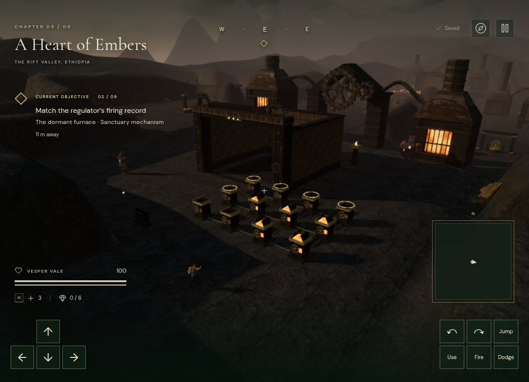
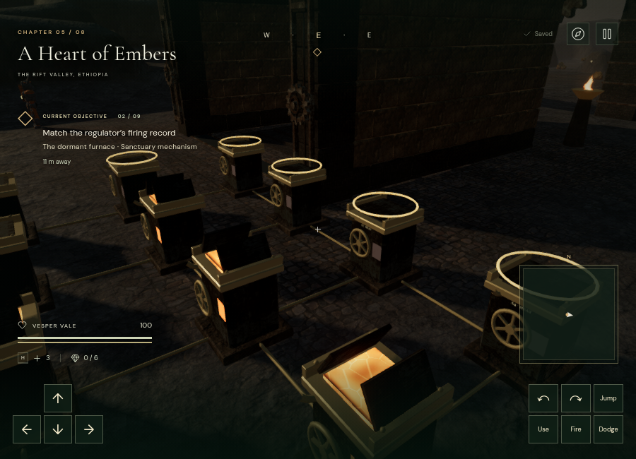
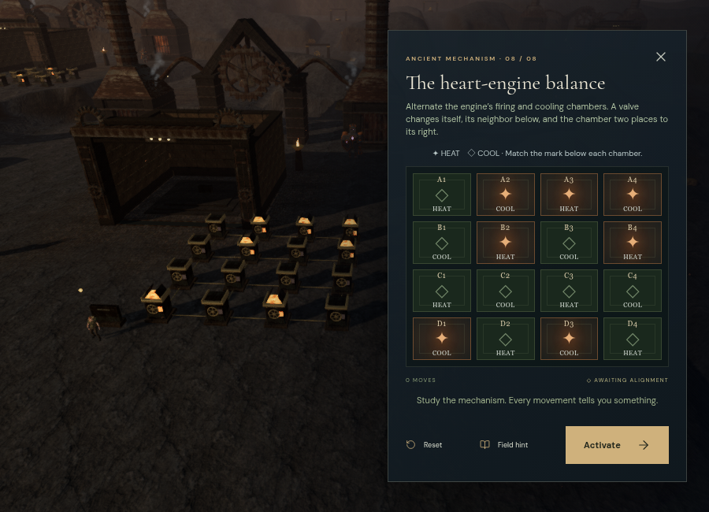

# Thermal regulators

The volcanic chapter now puts its eight main mechanisms into physical forecourts. Players turn handwheels on 102 chambers, observe linked shutters, and match engraved HEAT / COOL marks. Each court has a record tablet that explains the rule, resets its regulator, opens optional focused controls, and activates the completed firing pattern. Every turn saves immediately. This replaces eight variations of a dialog-only, all-cold vent puzzle.

## Eight circuits

Targets below run from row A at the back to the last row nearest the approach. `1` means HEAT; `0` means COOL. Coupling never wraps across an edge.

| Regulator | Grid | A valve changes | Target rows | Shortest initial solution |
| --- | --- | --- | --- | --- |
| The cold-air manifold | 3 × 3 | Itself and orthogonal neighbors | 000 / 000 / 000 | 5 turns |
| The ignition galleries | 4 × 3 | Its row and the chamber directly below | 1111 / 0000 / 1111 | 6 |
| The diagonal relief | 3 × 3 | Itself and diagonal neighbors | 010 / 000 / 010 | 6 |
| The gear jacket | 4 × 3 | Itself, the chamber above and the chamber to its right | 1001 / 0110 / 1001 | 7 |
| The smelting feeds | 3 × 4 | Its column and the chamber directly to its right | 101 / 101 / 101 / 101 | 6 |
| The eternal pilot | 4 × 4 | Itself and diagonal neighbors | 0000 / 0110 / 0110 / 0000 | 8 |
| The tempering cradle | 4 × 4 | Itself, the chamber above and the chamber to its right | 1001 / 0110 / 0110 / 1001 | 10 |
| The heart-engine balance | 4 × 4 | Itself, the chamber below and the chamber two places to its right | 1010 / 0101 / 1010 / 0101 | 11 |

Turning the same valve twice reverses its effect. Hints recompute a shortest route from the current pattern, including after an unplanned move. Saves validate both the bit range and reachability within the authored circuit, rebuild canonical targets and effects, and preserve only the current pattern, move count and last valve. Only the Embers chapter accepts thermal state. Older completed objectives retain completion and display their target pattern.

## World and presentation

All arrays sit to the right of their furnace halls, beyond the lava pools and first counterweight chamber. The eight tablets and 102 valves have ground-level approaches. Field work and the first counterweight puzzle gate access. Each command also checks the player's actual horizontal reach and height. Collision bodies protect the machinery, while camera bounds survive static-geometry batching.

Corroded bodies, brass trim and handwheels reuse existing local materials. Twin hinged leaves open upward over an animated molten interior. The same smoothed heat value drives shutter angle, chamber glow, wheel movement and rumble. Short coolant plumes and their sound emitters share the visible front outlet. Nearest-valve highlighting identifies its linked chambers; plaques provide row, column and target text. A brief hand pose follows retained wheel anchors and releases when the player moves or pauses.

The focused view keeps the physical court beside or above its controls. Paused presentation can animate a command without advancing expedition time, guardians, health or field physics. Pausing or rebuilding settles the saved heat pattern without replaying steam.

The final 4 × 4 interface was checked at 900 × 650, 390 × 844 and 844 × 390. All controls and actions fit without panel scrolling. Portrait cells retain a 44-pixel touch height. The full rule remains in the record tablet; the short landscape diagram retains target labels and field hints.

[Portrait view](images/thermal-focus-portrait.png) · [Short landscape view](images/thermal-focus-landscape.png)

## Sound

Each chamber has two positioned sources, sharing the existing 12-voice selection budget with the rest of the chapter. Hot chambers have a restrained mechanical rumble; a changed shutter briefly releases steam proportional to its remaining movement. Cold and locked chambers stay quiet. Fixed obstruction filters muffle sources behind masonry. The volcanic chapter retains its original sparse 62 BPM bronze score; active thermal motion selects the existing valve-working accent.

The actual `Soundscape.createVoice()` path was rendered in Chromium `OfflineAudioContext`, using the same decoded buffer and playback offset at every distance. Each stereo render ran for four seconds at 48 kHz; RMS was measured over seconds 1–3 with a 0.18 measurement bus gain. These are digital signal measurements, not calibrated acoustic loudness or a listening review.

| Source | Near radius / outer radius | Near RMS | Midpoint RMS | Midpoint ratio | Beyond outer radius |
| --- | --- | --- | --- | --- | --- |
| Hot chamber rumble | 1.2 / 16 m | 0.0005934483 | 0.0002967241 at 8.6 m | 0.49999996 | Zero at 17 m |
| Peak coolant release | 1.2 / 20 m | 0.0020017183 | 0.0010008591 at 10.6 m | 0.49999996 | Zero at 21 m |

Both used HRTF panning and linear distance attenuation. Intermediate distances also fell monotonically. All samples were finite, with peak amplitude below 0.009 in these individual-source measurements. A live valve command retained at most 12 selected voices. Broader headphone/speaker listening remains necessary to judge the subjective mix.

## Verification and limits

Ten thermal tests cover all reachable circuit patterns, exact shortest solutions, invalid and reversible commands, canonical saves, all chamber bodies and control approaches, camera clearance, sound outlet alignment, field/counterweight/reach gates, heat animation, paused presentation, reload settling, focus framing and chapter cleanup.

Browser inspection found all 110 controls clear across nine nearby samples, all 204 sound paths clear from their control fronts, retained hand anchors and linked shaders. Assisted local routes used actual character physics to reach all 110 successive valve/tablet destinations across the eight courts. All 54 original non-guardian feature approaches retained clearance.

An assisted browser completion supplied the prerequisite field stations and a valid counterweight arrangement, then executed 59 shortest-route turns through the physical interaction handler. Each regulator's real Activate button advanced to the next stage; the eighth opened the relic stage. These checks are not a full unassisted campaign playthrough and do not establish one-hour chapter duration.

A trusted E keypress at the first valve of the second regulator changed its mask from 3327 to 3296, saved one move and last valve 0, and animated five linked shutters with five corresponding steam plumes. Focused controls rejected an incorrect activation, provided a current-state hint, persisted a move and reset to the original pattern.

All 219 tests passed in 126.87 seconds. The release build succeeded with the existing Three.js chunk-size advisory. Its assets were `index-BX3g5Ujr.js`, `game-DlEieVU1.js` and `three-PZs8Wf7J.js`.

The High production build loaded a seeded partial second regulator. After the actual interaction prompt appeared, a trusted E keypress reversed valve A1 from mask 3296 to 3327 and saved move 2, last valve 0. Native W input moved from `(109, 325)` to `(109.29186094823535, 325.06940595720226)`. Pausing saved that exact position, stage 1, all three field IDs and 192.00810000002386 accumulated active seconds. A reload held a required texture until the tab lost focus, so startup finished paused. The restored position, time, stage, field IDs and all eight thermal records matched exactly. Production had no `__vesper` hook, no failed asset requests, and no console warnings or errors. Development and preview test saves were cleared afterward, with High quality restored as the default.

At the inspected 900 × 650 second-court view, Low submitted 310 calls and 332,398 triangles; High submitted 1,404 calls and 1,533,561 triangles across its passes. Both linked their shaders. These observations used ANGLE/SwiftShader software rendering and do not establish consumer-GPU frame rates or AAA visual quality. The chambers remain procedural environment assets; broader art direction, hardware testing and blind pacing playtests remain open work.
