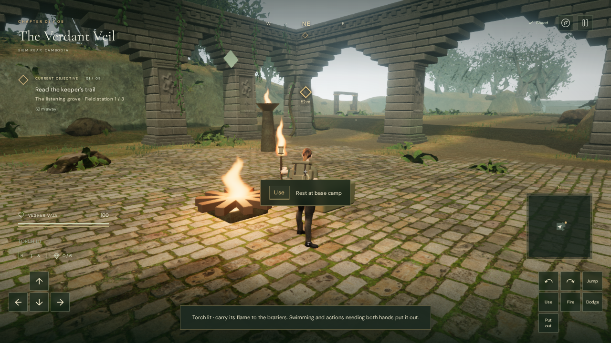

# Carrying the jungle's flame

The Verdant Veil's two beacon missions now require a carried flame. Vesper lights
a resin torch from a campfire or an already burning field brazier, then brings it
to each unlit beacon. The previous interaction lit these stations without a fire
source. Completed beacons remain lit and can supply the torch again, so progress
through a relay also creates recovery points.

Press **T** near a fire to light the torch and **E** at a current brazier to pass
the flame. On touch, use **Torch**, then **Use**; **Put out** extinguishes it.
The initial mission briefing, contextual hints and field guide explain the rules.
The torch button retains a 40-pixel-high target in its additional action row,
with the vitals moved above the expanded controls.

Swimming puts the torch out. Climbing, rope/cable travel, moving a stone,
transporting a component, dodging and aiming the sidearm also extinguish it to
free both hands. Walking and ordinary jumps retain it. There is no fuel timer or
required waiting. A nearby fire must be lit, within three-dimensional reach and
unobstructed before ignition is accepted.

The torch and its flame follow the left-hand grip, while the right arm retains
its base animation. A carved wooden shaft, wrapped head and metal bindings are
original code-authored geometry. The shaft uses the existing 38 mm grip
calibration. The shared fire shader and one of the existing four nearby fire
lights illuminate it, with reduced intensity and a seven-metre light range.

## Sound and persistence

A quiet moving emitter reuses the existing credited fire recording. Its full
near level ends at 0.5 m and fades linearly to zero at 9 m. It shares the twelve
spatial voice budget with the environment and disappears from the mix when put
out or paused. The existing jungle score continues to use its brazier-objective
arrangement. No external images, models or recordings were added.

The jungle's strictly typed `torch` boolean saves with chapter progress. Lit
field stations still use their existing field-completion entries. Reload retains
the carried flame on dry ground; wet or occupied-hand states extinguish it.
Older saves keep all completed stations and start with an unlit torch. Other
chapters do not enable this mechanic or instantiate a torch emitter.

## Verification

- All 312 automated tests passed. New checks cover flame requirements, task order,
  cold/distant/occluded fires, relighting at saved beacons, pause, swimming,
  occupied hands and save normalization. Delivered-character checks inspect
  the actual skinned hand against the shaft at three headings in idle and walk
  poses, preserving the right arm and bone translations. The existing wheel
  and cable grip checks remain green.
- Both relay chains passed assisted browser movement checks through the actual
  jungle collision and water geometry. Five dry legs reached and lit all five
  braziers with the flame retained and 100 health. The initial two legs started
  at `camp-1`; the inner chain started at `camp-2`. Fixtures supplied earlier
  mission progress; these checks did not exercise the whole campaign or combat.
- Native T lit the torch. Entering an actual reservoir through the movement
  update extinguished the mesh and sound while preserving completed beacons.
  Native multi-touch lit the torch from a restored beacon and retained a held
  Forward finger when the Torch finger was released.
- In the production build, native T and E lit the torch and a beacon. Reload
  retained the carried flame, completed beacon, chapter state and settings;
  putting the torch out retained beacon progress. The isolated fixture's health
  stayed at 93. The development inspection hook was absent, and the browser
  reported no JavaScript errors or warnings. These checks used prepared starting
  positions, not a continuous unassisted playthrough.
- The live mix selected the torch at 0.606 m with positive gain and removed its
  voice on pause. Same-buffer offline renders measured RMS 0.005272911 at 0.5 m,
  0.002636456 at 4.75 m and zero at 9.5 m: exactly half amplitude at the midpoint.
  These are signal measurements, not a subjective listening-quality claim.
- Leaving the jungle disposed all seven inspected torch geometries and four
  materials, removed its source, and set the next chapter's torch reference to
  null. The completed browser checks had no JavaScript errors, warnings or failed
  asset responses.

The release build succeeds with the existing Three.js chunk-size advisory.
The checked production bundles were `index-CPHETchX.css`, `index-CKC5YSlo.js`,
`game-B9xqrJ25.js` and `three-DSdd5dJ3.js`.
This adds a route constraint and a recoverable environmental interaction.
Approximately one-hour chapter pacing still needs human playtesting, and modern
AAA visual quality remains unmet.
