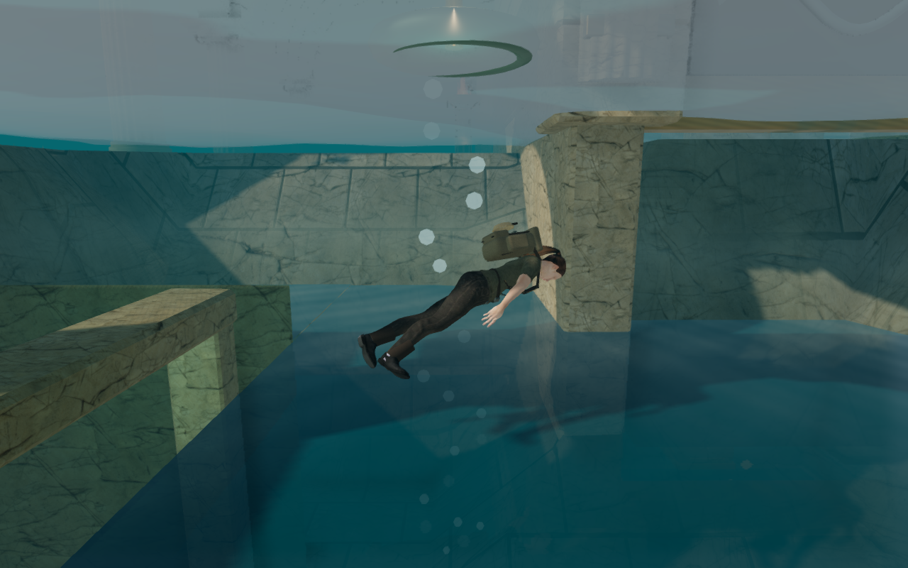
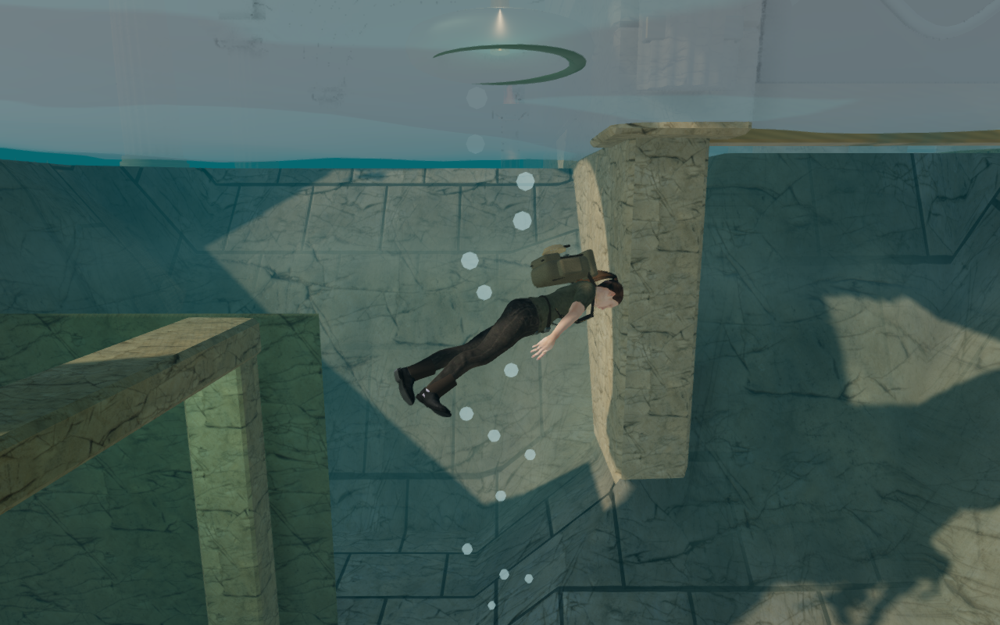

# Consistent underwater surfaces

The five coastal sounding wells now have a single visible water boundary.
Previously, the global ocean plane passed through their deeper interiors and
created a second rippled sheet below the reservoir surface. It obscured the
well walls, floor and submerged archive cases. The ocean mesh is now cut out
of higher reservoirs' footprints, alongside its existing gallery exclusions.

The renderer also skips exterior planar reflection captures while the camera
is immersed in a water body. Reflections become eligible again when the camera
leaves that body or rises above its surface. The existing water-level lookup
handles the gallery and its air bells as well as outdoor reservoirs.

## Rendered comparison

These are actual 1280 × 800 High-quality game canvases. The before version uses
the sea geometry and reflection selection from published commit `07cd30b`;
the revised version uses the corrected geometry and selection in the same
scene, with the same camera, actor pose and water time. The HTML HUD and CSS
vignette are omitted. Lossless WebP conversion preserves the captured pixels.

| Before | Revised |
| --- | --- |
|  |  |

Twenty underwater pairs cover all five wells, before and after drainage, on
High and Low. All inspected diver positions retained movement clearance, and
the corrected immersed cameras selected no exterior reflection. Three matched
exterior shoreline pairs had zero differing RGBA values on High, Balanced and
Low. These selected comparisons verify the reproduced defect and exterior view;
they do not establish every possible view or device.

## Geometry and water levels

Geometry tests independently measure the union of the excluded rectangles and
check that the remaining sea has the expected area. Forty-five downward rays
across the five wells find no ocean triangles inside them. Rays outside the
excluded regions still hit the ocean. Existing gallery cuts and all position,
normal, UV and bed-height attributes remain intact.

All five reservoirs remain higher than the ocean after their full 1.8-metre
drain. A separate case checks that a lower basin leaves the ocean above it,
consistent with the physical water lookup. Reflection tests cover immersion,
leaving the higher pool and resurfacing. The sea uses 14,274 vertices after
cutting, compared with 14,052 before; extra edges need a small number of
additional triangles even though the rendered area is smaller.

## Playable and audio checks

All 490 automated tests passed in 91.1 seconds, and the production build passed
in 5.33 seconds with Vite's existing large-chunk advisory. Ten assisted archive
dives recovered all five records before and after drainage, then surfaced at
full health. The assisted memorial route crossed both air bells, opened the
emergency gates, recovered the roll and returned to the surface at full health.
These checks use the game's movement and collision rules, with assisted entry
positions; they do not establish blind exploration time.

The final production bundles passed native keyboard and portrait touch checks
from disposable local saves near the harbor float. Both swam, turned the camera,
dived and recovered the harbor sounding. Keyboard reloaded while submerged;
touch rose before reloading. Both returned at the surface with the record and
full health, then swam another 1.46 and 1.61 metres respectively. Saved data was
compared in full except the last-played timestamp and the arrival position,
which was checked separately. An earlier run exercised an existing 0.75-metre
collision-recovery adjustment; the final pair retained their exact horizontal
positions. The check allows at most that first recovery ring and verifies
subsequent movement. The touch run was muted, and neither layout overflowed
horizontally. No release test hooks, browser errors, warnings or failed assets
were present.

Rendered water, ice and lava views across all eight chapters compiled. Seven
chapter transitions released all 38 water geometries and seven reflection
targets counted by the check. The route, audio and chapter checks reported no
browser errors, warnings or failed assets.

The immersion audio check attenuated a 4 kHz signal at both 22,050 and 48,000 Hz
sample rates and restored it after surfacing. The bubble emitter's measured RMS
was 0.01416 at 1 metre, 0.00708 at 8.5 metres and zero at 17 metres, verifying its
linear distance falloff. These measurements check signal behavior; listening
quality and music balance still need subjective review.

## Measured rendering cost

A Radeon 780M run held the harbor underwater camera at 1280 × 800, pixel ratio
1, on High while the actual game loop continued. Four three-second samples
used before/after/after/before ordering. Averaging the two sample means per
version gave:

| Measurement | Before | Revised |
| --- | ---: | ---: |
| GPU time | 15.351 ms | 14.222 ms |
| Frame interval | 33.582 ms | 30.600 ms |
| Draw calls per frame | 619.67 | 558 |

Mean GPU time fell by 7.4% in this view. This combines removal of the interior
sheet with suppression of unused reflection captures; it does not isolate
those two contributions. All four samples used valid GPU queries with zero
disjoint events and no browser errors or warnings. These short samples describe
this camera and device, not general frame-rate guarantees.

## Remaining scope

This corrects overlapping water surfaces. The well architecture, materials,
lighting and physical swimming model still have visible limitations; the
clearer view exposed abruptly ending masonry supports, subsequently corrected
by the [sluice foundation update](sluice-foundations.md). The broader
requirements for modern AAA graphics, approximately one hour of human play
per chapter, subjective sound/music review and wider browser/device acceptance
remain open. See [production status](production-status.md) and
[asset credits](asset-credits.md).
