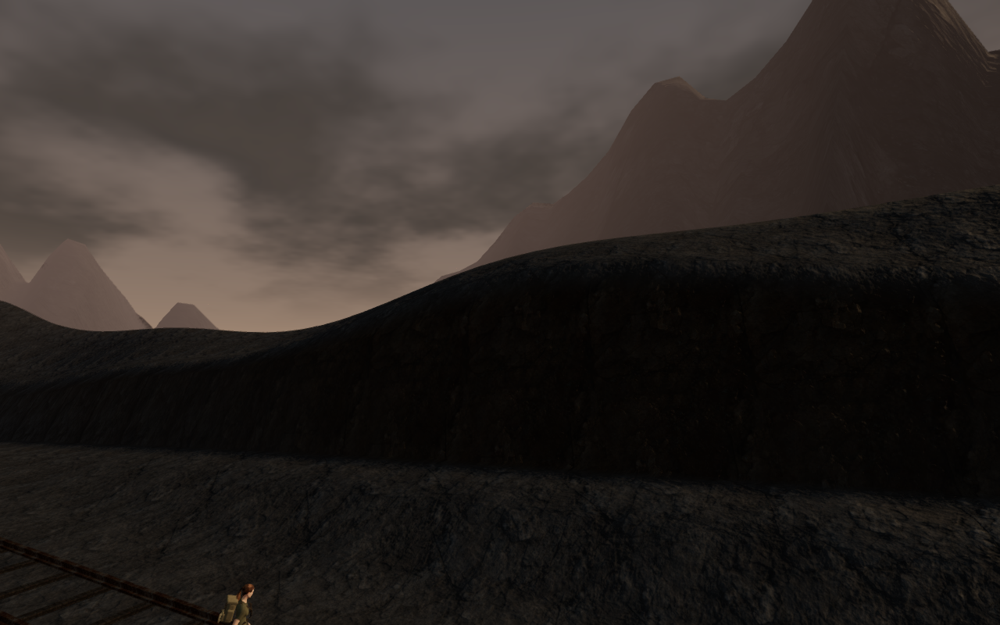
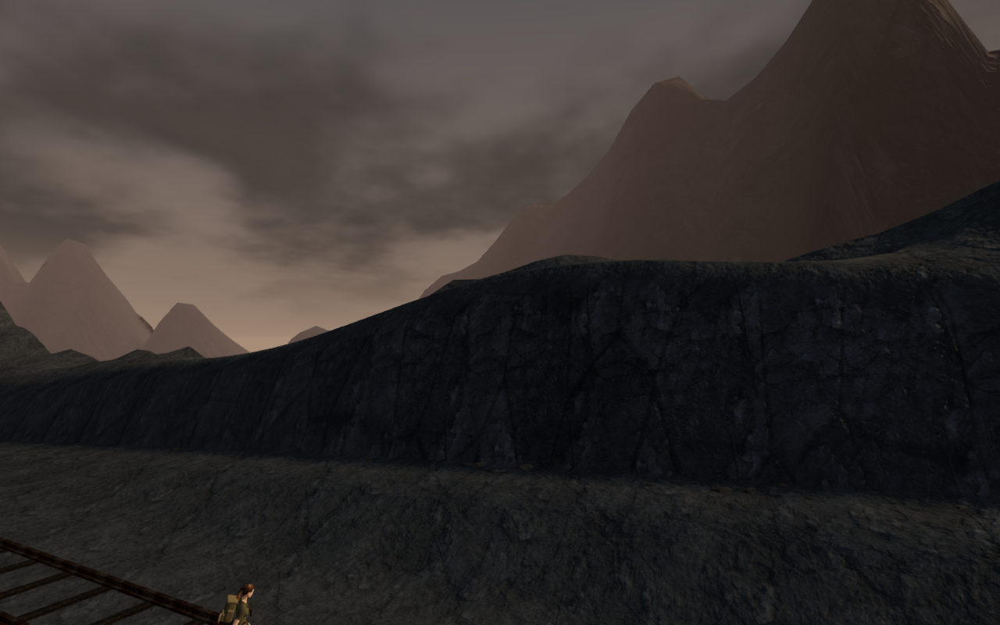
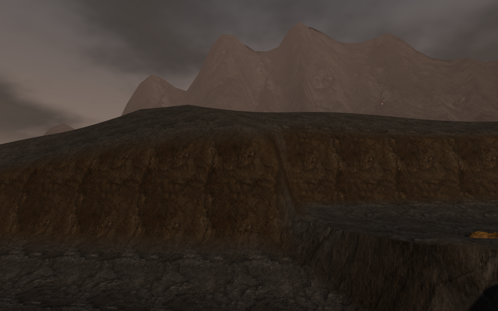
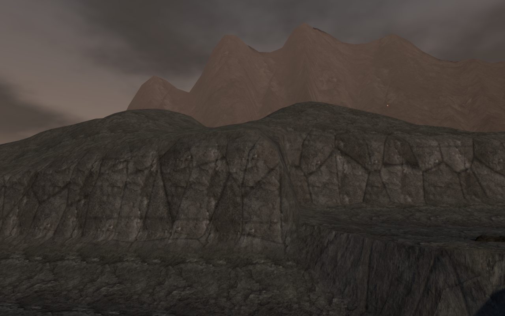
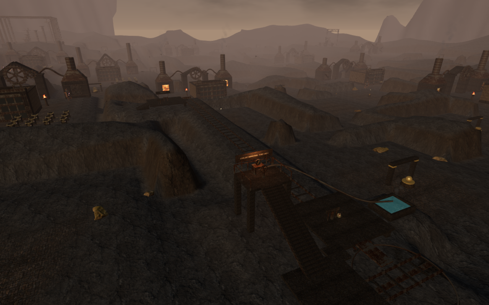
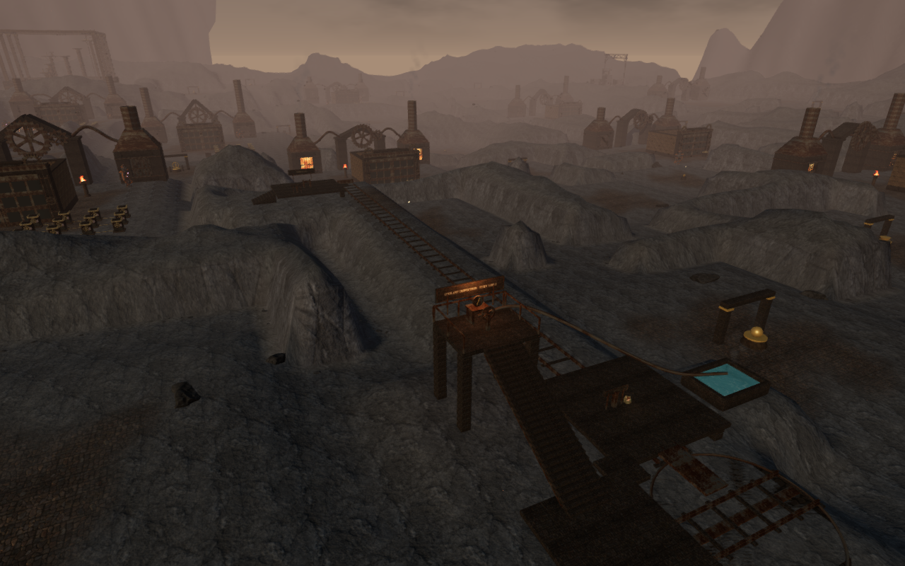

# Fractured banks in A Heart of Embers

The volcanic chapter's enclosing banks now have uneven crests, irregular cooling
joints and matte ash deposits. The scattered boulders retain their scanned
surface detail with a charcoal tint, and small angular fragments collect along
the bases of the banks. This reduces the smooth brown appearance of the earlier
terrain while preserving the chapter's working routes.

| Previous railway bank | Revised railway bank |
| --- | --- |
|  |  |

## Terrain and surface construction

Original noise-based relief changes 19,339 height samples outside the protected
walking areas. The terrain retains its 1.75 m sample spacing, 81 mesh chunks and
119,072 triangles. The shader adds warped vertical joints, occasional horizontal
breaks, varied rock tones and rougher ash on upward-facing surfaces. Fine seams
fade with their screen footprint to limit distant aliasing.

Walking cells, water basins, discoveries and the tempering railway's foundations
keep their previous heights. Matched browser snapshots preserve all 164 item
positions, four water definitions and 236 obstacle definitions exactly. The
automated checks also sample passage boundaries, water edges and shared mesh
edges, and verify finite, deterministic terrain heights and matching normals.

The fragment placement pass accepts 3,561 of 16,398 candidates in the live
chapter. It rejects pieces that would bridge uneven ground or intrude on working
areas. Three original 20-triangle shapes use three instanced mesh groups, with
per-fragment range filtering and the existing 0.3-second visibility transition.
High, Medium and Low use 48, 38 and 28 m range thresholds. These fragments are
under 20 cm tall in the sampled placements and remain decorative.

The shader and geometry are original project work. Existing credited forge
stone, paving and scanned boulder textures are reused; no new downloaded assets,
textures or dependencies are added. See [asset credits](asset-credits.md).

| Previous entry bank | Revised entry bank |
| --- | --- |
|  |  |

## Measured rendering cost

Five matched High-quality captures use a 1280 × 800 viewport, the same player and
camera positions, and a fixed scene time. Whole-scene submitted work is:

| View | Calls before → after | Triangles before → after |
| --- | ---: | ---: |
| Railway bank | 157 → 166 | 309,747 → 319,767 |
| Southern ridges | 1,822 → 1,831 | 1,983,479 → 1,993,559 |
| Entry bank | 200 → 206 | 382,755 → 387,195 |
| Forge court | 1,644 → 1,653 | 1,795,689 → 1,812,249 |
| Western cut | 719 → 728 | 769,745 → 778,985 |

The extra submitted triangles come from the fragments and rendering passes;
the terrain triangle count is unchanged. All sampled shaders linked, with no
failed asset requests, page errors or console warnings.

A separate GPU experiment at the railway bank alternated the previous terrain
material with hidden fragments against the revised material with visible
fragments. Both configurations used the revised bank geometry and recolored
boulders. It therefore measures that material/fragment combination, not the full
old scene against the full new scene.

The experiment used Chromium, ANGLE/Vulkan and an AMD Radeon 780M at 1280 × 800,
pixel ratio 1. Each quality setting used an old/new/new/old sequence, 1.3 seconds
of settling and approximately 4.2 seconds of measurement per case. GPU timer
queries reported no disjoint events.

| Quality | Previous material, mean GPU ms | Revised material + fragments, mean GPU ms | Mean frame intervals across the four cases |
| --- | ---: | ---: | ---: |
| High | 11.069, 11.215 | 10.419, 10.348 | 16.666–16.936 ms |
| Low | 5.515, 5.559 | 4.363, 4.311 | 16.666–16.667 ms |

The revised material replaces some texture-driven roughness work with procedural
values, which may account for part of the measured GPU reduction. These short
samples do not establish sustained performance across the chapter or on other
devices. The wider views still submit substantial scene geometry.

| Previous southern ridges | Revised southern ridges |
| --- | --- |
|  |  |

## Verification and remaining work

All **519 automated tests** and the production build pass. Vite retains its
advisory about large JavaScript chunks.

A continuous assisted browser route completed loading, the inspection climb,
turntable operation, delivery and the exit stair using normal character
movement after its starting position was set. Hazards and enemies remained
active; the vent caused 20 damage, leaving 80 health. High, Medium and Low
renders linked successfully. This checks route function, not blind playthrough
duration.

The rolling and rotating sound sources entered the active mix during operation
and stopped during pause. Offline HRTF rendering measured half the near-source
amplitude at each emitter's falloff midpoint and silence beyond range. The
existing objective score retained its lifting arrangement during operation.

Changing from the volcanic chapter to the desert disposed all 171 observed
terrain/nature geometries, 98 materials (including shadow materials) and 90
instance buffers. No volcanic fragment groups remained in the next chapter.
The browser reported no page errors, console warnings or failed assets.

Seven production cases pass with the development hook absent: keyboard loading
and the eastbound ride, interrupted travel, interrupted and seated table turns,
muted portrait touch travel and delivery, a completed mission's returned cart,
and legacy completed progress. Entire saves match across reloads apart from
their last-played timestamp; loaded bundle names match the final build output.
The 540 × 900 portrait page has no horizontal overflow.

Modern AAA graphics remain unmet: distant mountains, repeated older structures
and several ground transitions still show the procedural prototype's limits.
This visual pass does not establish one-hour chapter pacing or subjective audio
quality. Blind human playthroughs, listening review and broader browser/device
testing remain part of the [production requirements](production-status.md).

The comparison images are unretouched captures from the running game, stored as
lossless WebP files.
