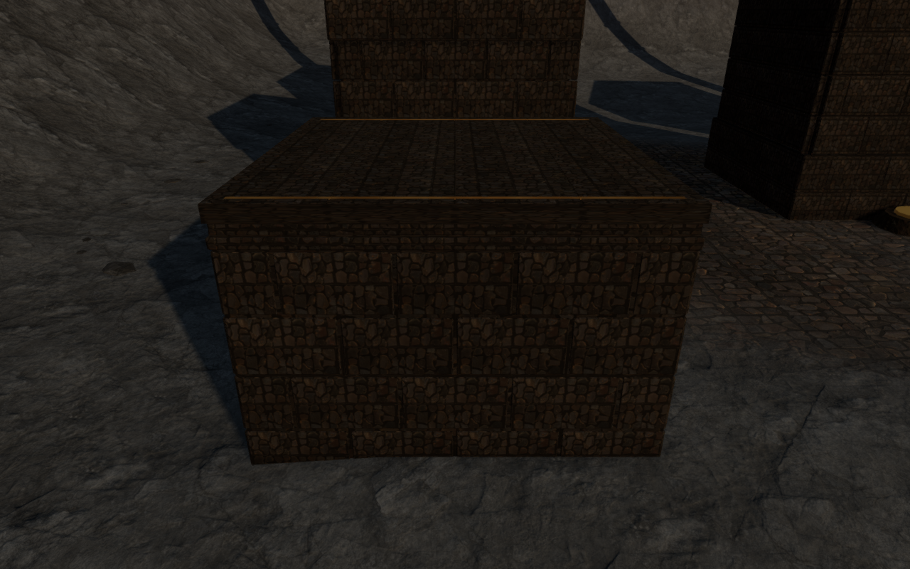
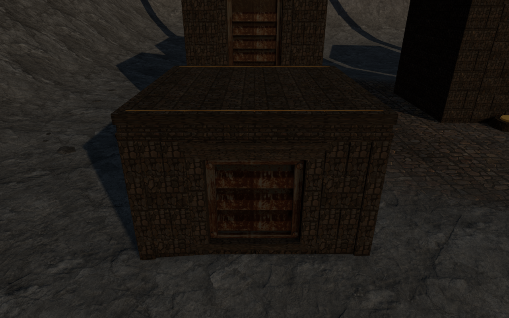
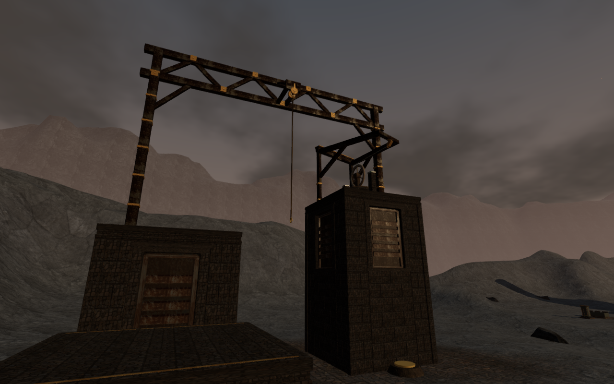
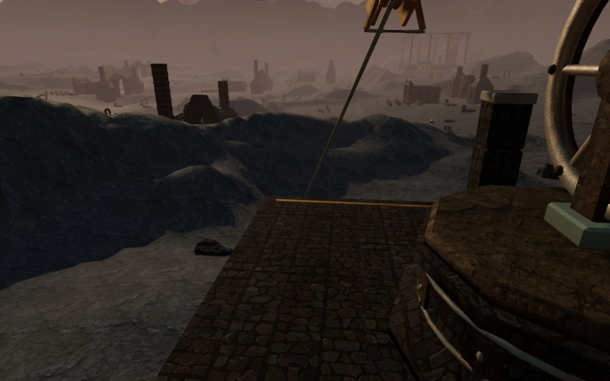
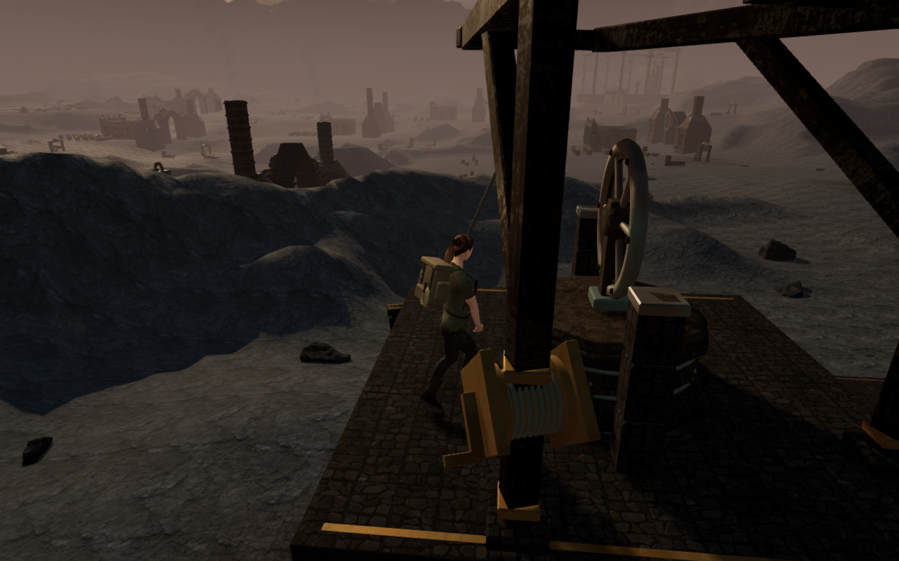

# Volcanic climbing piers

The volcanic course's five climbing piers now have twenty riveted forge
shutters. Closed chamfered steel backs carry folded heat baffles, edge straps
and seated hexagonal fasteners. Fitted basalt wings, dressed jambs and stepped
lintels replace the plain wall grid and generic tablets, connecting the course
with the surrounding ironworks.

Masonry joints have continuous backing over a buried full bearing bed. Every
baffle, strap and fastener intersects its bearing surface; the dark intervals
between baffles reveal the closed shutter back. The artwork stays within the
existing movement and camera solids. Standing roofs, coping, landing markers,
hoist frames, terminals, cables and later construction seeds retain their
geometry and positions. Original project geometry reuses the credited forge
rock and metal maps and existing bronze shader; [asset attribution](asset-credits.md)
is preserved.

Exact vertex indexing reduces fixed/detail records from 82,788 to 57,898
without discarding facing detail. Expanding every indexed triangle verifies
all 933,324 position, normal, UV, color and material components byte for byte
against the same unindexed artwork. All four mountain and both coastal courses
retain their preceding attribute hashes and counts. The complete volcanic
course uses 81,008 vertex records within the existing 180,000 limit; these
counts do not establish a hardware frame rate.

All 803 campaign checks across 122 files pass without failures, cancellations
or skips, including the new mantle-camera regression. The production build
passes with its existing bundle-size advisory. Verification now uses a shared
CPU affinity cap within 60% of available CPUs and two test workers;
temporary browsers and preview servers are closed after their checks.

Browser rays verify 2,205 roof points, 605 underside points and 180 shutter
centers. Every sample meets construction. The largest roof difference is
5.001 mm at a paving joint; the highest sampled underside is 209.999 mm below
queried ground. Another 2,420 points cover the chamfered shutter faces without
gaps. Sampled surfaces sit 29.987–300.006 mm behind the outer pier face.
All 21 High construction views, two Low views and nine comparison views are
reviewed. Eight matched external face observers retain exact camera positions
and targets. Some have foreground construction; they do not establish every
possible walking view.

The continuous baseline also exposed one fully faded frame during the summit
mantle, with a 1.224 m camera arm. Camera recovery now considers a safe nearby
view during a mantle when the ordinary view enters the body's fade range.
Ordinary mantle views with at least 2.2 m of room retain their existing follow;
aimed, swimming, diving and rope views retain their existing handling. The
regression builds the delivered course and summit machinery, reproduces the
short ordinary view and verifies safe, visible recovery without changing the
climb, feet or chosen look.

The final assisted loop completes its walking approach, mantles, jump, swinging
rope, summit, animated cable descent and ground return across 1,378 updates.
Health stays 100 and camera opacity remains full, with a 3.958 m minimum arm.
Recorded movement, chosen look, traversal and progress states match the
baseline exactly. Five captured camera positions change with the recovery;
rendering counts change with the new artwork. All 24 final route images,
24 baseline images and the baseline hidden frame are reviewed. The loop uses
one supported start and a completed-expedition fixture without advancing enemy
AI or combat.

An additional replay captures the previously hidden update 794 in the revised
scene. The explorer is visible with full opacity and a 4.475 m arm at the same
controller pose. Both before/revised frame images are reviewed. Wider body
contact and scene composition coverage remain open.

Keyboard/High and portrait touch/Low production cases climb the first 2.8 m
roof, crouch and look, then descend to ground through native input. Health,
progress, explored cells and complete-store reloads remain stable apart from
chapter timestamps and two departure-camera corrections. Keyboard and touch
reloads adjust yaw by 30° and 15° respectively, retaining pitch and position.
An independent terrain and arrival-algorithm check reproduces both selections:
the preferred arms are clipped to 4.546 m and 5.143 m, while both revised arms
have their full 5.372 m clearance. Subsequent complete-store reloads are stable.
Loaded bundles match the final build, with no development hook, browser errors,
warnings, failed resources or horizontal overflow. All fourteen native captures
are reviewed.

These lossless High images preserve the captured pixels. The first pair shares
its camera position and target; the course image is a separate construction
observer. The mantle pair shares the controller frame while its camera changes.
The five-pier arrangement still repeats, and broader volcanic landscape and
lighting composition need further review. Wider campaign visual
coverage, discovery composition, subjective sound/music review and
browser/device acceptance remain open. Positioned hoist sources and the quiet
climbing arrangement retain their existing movement and distance behavior.
