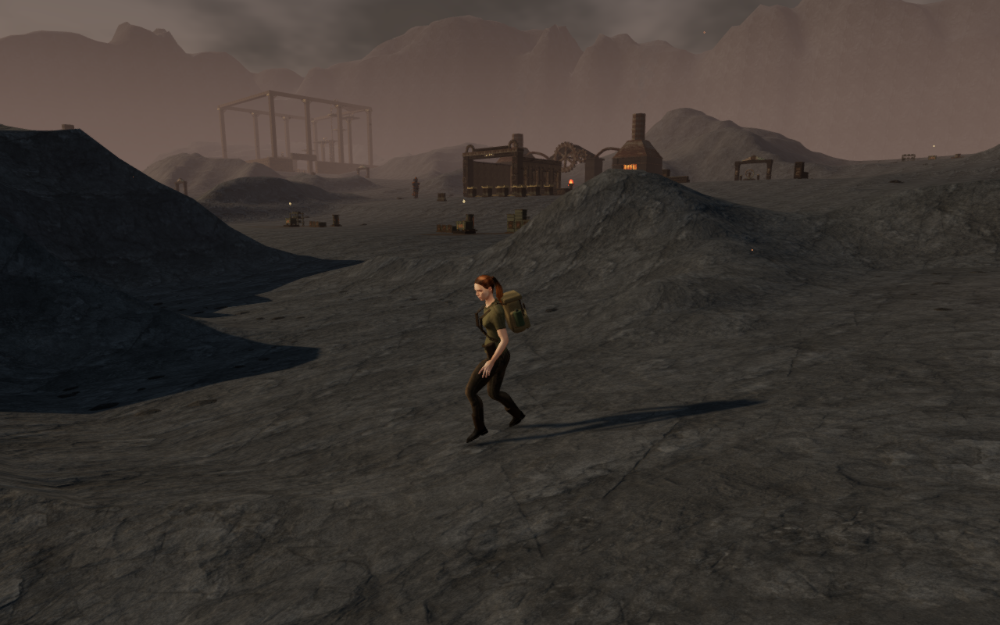
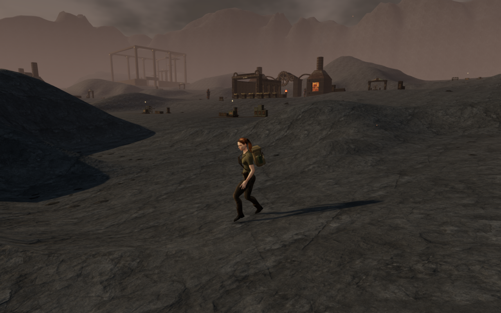
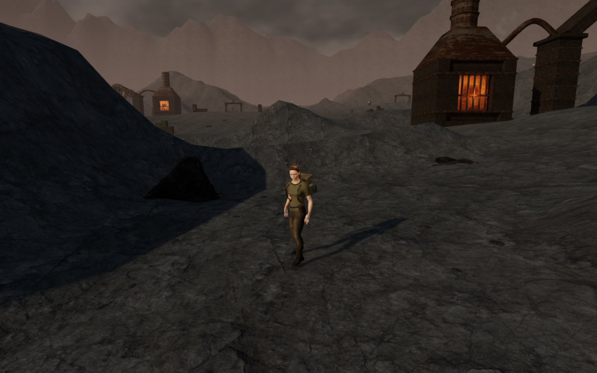
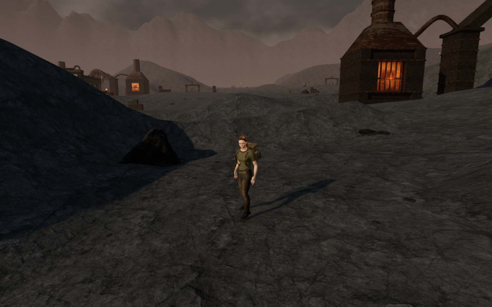
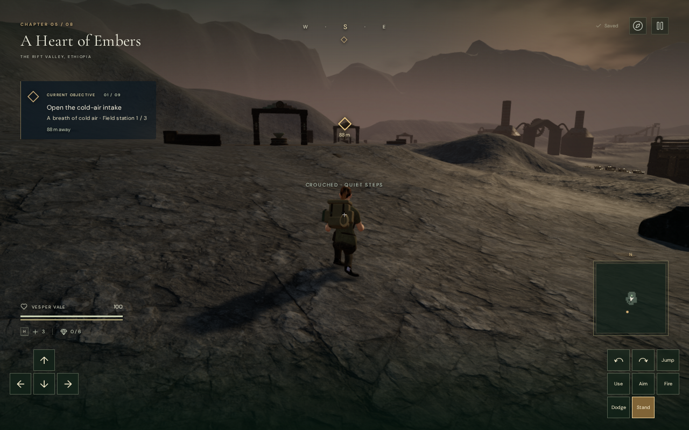
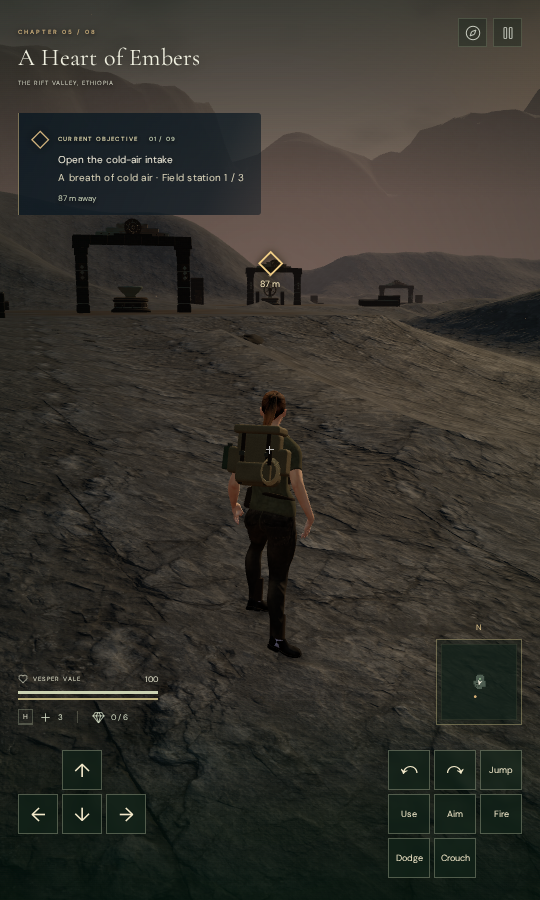

# Volcanic bank shoulders and scan footing

**A Heart of Embers** now has rounder crests where its route banks meet.
The volcanic refinement uses smaller coarse bumps and six masked grading
passes, replacing the sharp medial ridges visible in the central court
approaches. The existing cooling-joint material supplies the finer detail.

The matched images keep the current rocks, props, camera and scene time fixed
while switching terrain heights and normals. They isolate the terrain change;
they do not compare the complete old and new application scenes.

## Terrain shape and protected floors

The grading changes **18,330 of 60,025 height samples**, with a maximum
**2.892-metre** difference from the preceding volcanic refinement. It retains
the existing **1.75-metre** sampling grid. Walking cells and a **3.5-metre
surrounding collar** keep their previous heights, as do the protected railway
approaches, working cores and lava margins. Recorded railway-floor and lava
digests continue to pass.

In the recorded central ridge box, from x = 245–315 m and z = 140–205 m,
382 exposed samples provide the following measure of abrupt bending. At each
sample, the measure combines the two second height differences:
`left - 2 * centre + right` and `front - 2 * centre + back`. The values below
are the magnitude of that pair, in metres on the fixed grid; they are not
slope angles.

| Central ridge measure | Previous | Graded |
| --- | ---: | ---: |
| Mean | 0.831 m | 0.340 m |
| 95th percentile | 2.235 m | 0.628 m |
| Maximum | 4.177 m | 1.240 m |

Across 18,075 exposed samples throughout the map, the same 95th-percentile
measure falls from **1.655 m to 0.476 m**. The regression also checks that
the measured central area retains more than five metres of elevation range.
Shared chunk positions and normals remain finite and continuous.

## Rock footing

An independent browser check found exposed edges beneath the coarse fitted
scans. The largest measured gap was **81.003 cm** beside the railway. The
volcanic loader now uses the same full-underside fitting already applied to
cloud cliffs: projected vertices and downward-face centres supplement the
original grid rays. Placement uses the lower of the sampled floor and visible
terrain triangles. Scans that would be almost submerged are omitted.

Of **350 candidates**, the final scene retains **229 scans**, with 22 reserved
and 99 unsupported placements. The first, coarse-fitted candidate scene had
320 scans; the fuller check therefore omits 91 additional placements. The
remaining **4,406 small bank fragments** occupy three existing instance groups.
This change reduces scan density while correcting the exposed roots.

All **96,777 independent underside rays** on the retained scans pass against
the actual rendered terrain and Float32 instance transforms. The highest
root remains **36.69 mm below** the ground, exceeding the required 7 mm
margin. The public browser helper exports `inspectVolcanicStones` alongside
the existing `inspectCloudStones`; neither reuses the fitting samples.

## Playable route and rendering

The final assisted circuit reaches the early, middle and final courts, then
returns to camp: **1,052.469 metres and 15,739 controller updates**. All four
legs arrive at full health. All **50 captures** have finite half-float input
before bloom, linked shaders, legal player positions and no GL errors; every
capture has been reviewed. The grounded and omitted rocks change some route
choices, so controller and camera states are not claimed to be identical to
the preceding circuit.

The route opens the gates by marking field work complete and does not advance
combat or enemy AI. It establishes sampled traversal behavior, not an
unassisted chapter playthrough or complete body-contact acceptance.

High, Medium and Low graphics checks pass. High and Medium inspect the full
input before bloom. Low, whose normal pipeline bypasses bloom, uses a separate
direct-scene half-float target. All three captures and eight matched terrain
observer captures have been reviewed.

Terrain geometry retains **81 chunks, 64,009 vertices and 119,072
triangles**. Three matched observers retain their whole-scene call and triangle
counts. In the fourth, a revised bounding sphere culls one additional terrain
chunk, reducing the count from 679 to 678 calls and from 1,224,769 to 1,223,201
triangles. These are submissions, rather than frame-rate measurements. No
consumer-device performance claim is made.

All **76 selected regression tests** and the production build pass. On chapter
change, all **264 tracked terrain and nature geometry resources** dispose
exactly once. The grading allocates a temporary exposure array and separate
fields for its six passes during level construction. Full scan fitting adds
loading work; it does not introduce per-frame fitting or new texture maps.

## Production controls

The final production build passes keyboard/High at **1280 × 800** and actual
browser touch/Low at **540 × 900**. Both cases exercise movement, crouching,
jumping, landing, map use and two whole-store reload comparisons. Health
remains 100, saved ground height remains zero and neither viewport has
horizontal overflow. All **12 native captures** have been reviewed.

The development hook is absent. The browser loads the exact final assets:
`index-CA6qltni.js`, `game-DO26Isa2.js`, `three-CHpU4owG.js` and
`index-DQyIEWDa.css`. No application errors, other console warnings or failed
HTTP responses occur. Three ReadPixels driver performance diagnostics are
recorded separately. Vite retains its existing large-chunk advisory.

Verification runs serially under the shared **nine-of-sixteen CPU** affinity
limit and lower scheduling priority. A host inspection after the browser and
preview close confirms no remaining verification processes and closed ports
5174 and 5180. Temporary files remain in the ignored workspace staging folder.

## Scope and provenance

This is original project terrain refinement and placement code. It reuses the
existing credited forge stone and paving maps, **Rock Moss Set 01** scans and
volcanic material.
No external assets, dependencies or recordings were added. Documentation
images are lossless conversions of actual game captures, preserving their
dimensions and RGBA values.

The recorded volcanic crests and scan roots are improved. Broad empty spaces,
repeated courts and installations, other bank shapes, mountain faceting and
snow boundaries still need work. Wider contact, landscape, listening and device
acceptance remain open; the complete graphics and soundscape are unfinished.
