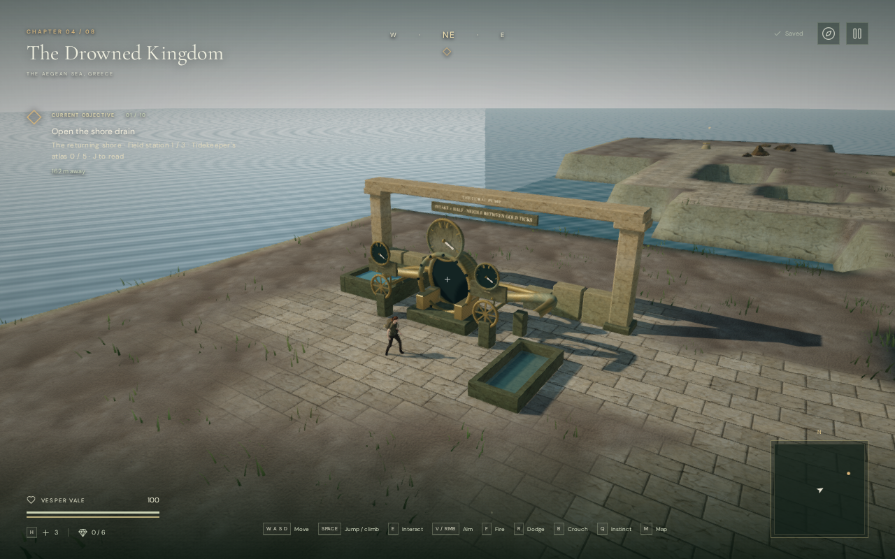
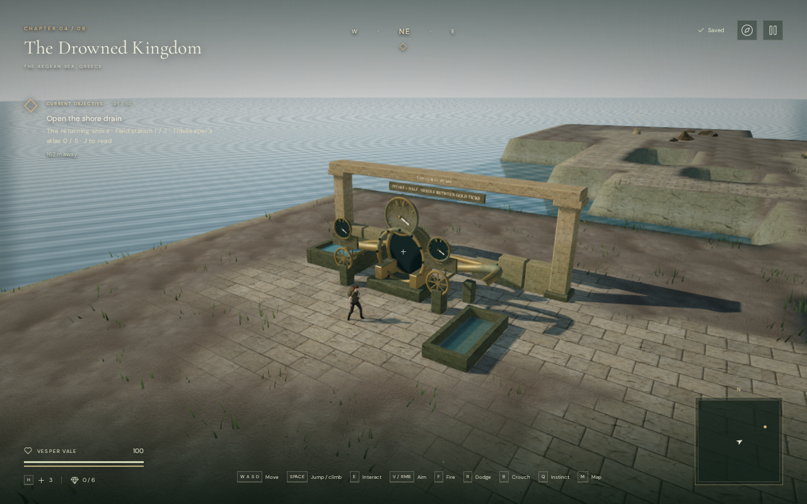

# Water reflection continuity

High-quality water now refreshes its reflection after a quick camera turn or
camera recovery. The sea no longer retains a hard boundary from an image
captured at the previous viewpoint in the reproduced case. Reflection edges
blend gradually into the existing sky-color approximation.

The reflection pass now updates the camera's world transform before selecting
a surface or capturing the scene. Previously it could read the preceding
frame's rotation because it runs before the main renderer updates the camera.
Stable views retain the every-third-active-frame capture cadence. Movement of
more than 25 cm, rotation of more than two degrees, a projection change, or
surface movement of more than 1.5 cm triggers an immediate capture. Switching
the selected surface also refreshes it. Failed captures do not mark a new
viewpoint as reusable.

## Rendered comparison

These are actual 1280 × 800 browser screenshots of the coastal coral pump,
using the same camera, surface time and 0.65-radian (37.2-degree) turn. The
before image uses published commit `93fc087`; the after image uses the revised
renderer. Both show the first frame after returning to the displayed view.
The old cadence skipped that frame and reused the rotated capture. The new
version refreshes immediately, removing the vertical color boundary near the
middle of the sea. The screenshots are stored as lossless WebP files.

| Before | Revised |
| --- | --- |
|  |  |

Separate turns of 0.12, 0.65 and 1.6 radians all refreshed on the frame that the
previous cadence would skip. A swimming view in the harbor reservoir retained
its reflection, and resizing it from landscape to portrait refreshed the
capture when the camera projection changed.

## Verification and rendering cost

All 488 automated tests passed in 130.6 seconds. The release build passed in
7.24 seconds with the existing large-chunk advisory; source formatting passed.
The regression test covers small reusable camera changes, accumulated movement,
turns, projection changes, draining water, quality switches and capture failure.

All eight chapters rendered their inspected water, ice or lava surface in the
browser without shader-link failures, errors, warnings or failed assets.
Seven chapter transitions released all seven inspected reflection targets.
The coastal view also passed on all three graphics settings, and the portrait
swimming view fit its viewport. These are assisted checks on the available
Chromium/GPU setup, not a full playthrough or cross-device certification.

Release checks used native keyboard movement and camera controls, followed by
portrait touch movement and a camera drag, from a prepared harbor swimming
save. They moved 1.67 m and 2.02 m respectively, stayed in swimming mode and
finished at 100 health. Both complete local saves matched after reloading,
apart from the play timestamp; the portrait case retained its muted setting.
The release exposed no development hook, loaded the expected build bundles,
and reported no browser errors, warnings or failed assets. These checks verify
input and recovery in a prepared save.

The coastal overview submitted the following work in the inspected frame:

| Setting | Draw calls | Triangles |
| --- | ---: | ---: |
| High, including a reflection capture | 392 | 951,356 |
| Balanced | 227 | 564,720 |
| Low | 101 | 235,160 |

Fast camera motion can now require a capture every frame, increasing rendering
work during those movements. The target remains 512 × 512 and only one nearby
surface is captured; this change adds no render target, geometry, texture asset
or dependency. The counts above describe selected frames, not average frame
time or a measured performance improvement.

## Scope and remaining work

The shader fades the outer 3.5% of reflection texture coverage and rejects
projected samples behind the reflection camera. High-quality reflections still
cover only one selected surface; other surfaces and quality settings use the
existing sky-color approximation. This is a limited planar reflection system.
The ocean's regular wave pattern and schematic coastal banks remain visible.

This milestone addresses the reproduced reflection discontinuity. It does not
establish AAA graphics, approximately one hour of human play per chapter,
subjective music or soundscape quality, or broader browser/device acceptance.
See [production status](production-status.md) and [asset credits](asset-credits.md).
The comparison images are in-engine captures of the project's existing assets.
