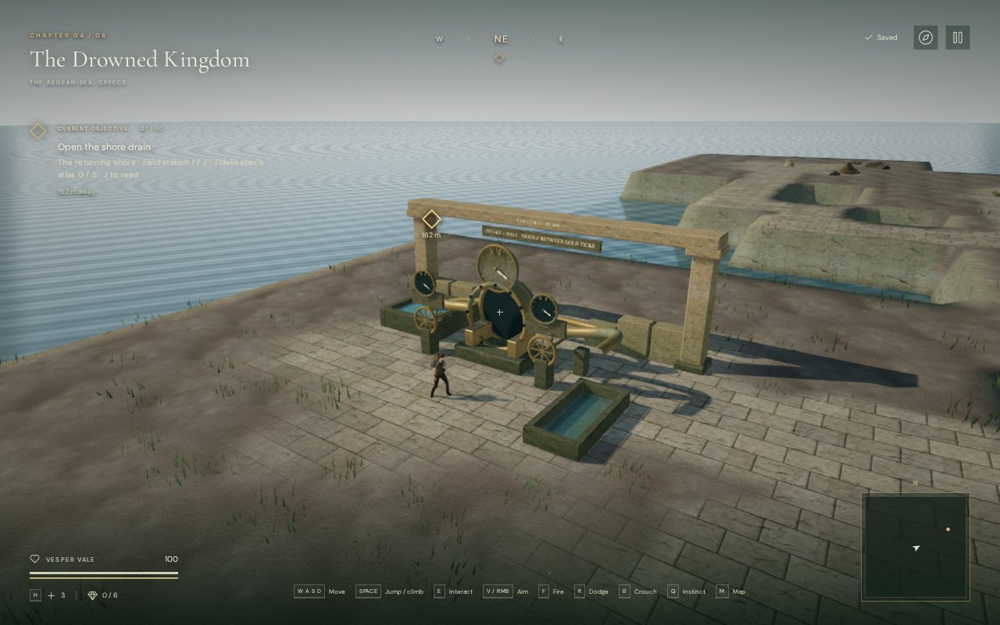

# Water ripple detail

Water now has eight differently directed ripple bands with curved crests,
reducing the long parallel stripes across the sea. The open sea has stronger
ripples; reservoirs and cisterns use half that strength, and the enclosed
crystal pools use one quarter. Reflections remain visible through the quieter
pool surfaces.

Small details fade according to their footprint in screen pixels. The same
filter applies to swimming rings, waterfall impact ripples and the oscillating
shoreline foam. Foam retains its average brightness as its individual bands
become too small to resolve. The existing small vertex displacement, water
levels, drainage, transparency and swimming rules remain in use.

## Actual game comparison

The following 1280 × 800 High-quality captures use the same scene, camera and
water time. The before material comes from published commit `740ebc1`; the
revised material is switched into the same scene. Six pairs cover the shore,
a low ocean view and the harbor reservoir on High and Low.

| Before | Revised |
| --- | --- |
|  |  |

These are in-engine screenshots with the existing HUD and asset attribution.
The public WebP files preserve the decoded capture pixels exactly. The shader
adds no texture download, geometry, render target or dependency.

## Filtering measurement

The reusable [GPU fixture](../scripts/verify-water-ripples-browser.js) compares
the actual eight-band shader with the same pattern rendered without filtering.
Its reference averages 16 × 16 samples for every output pixel. It measures two
linear slope channels without lighting, reflections or tone mapping; it is a
spatial-filtering check rather than a score for overall graphics quality.
Each row below averages two animation times at a different sampling scale.

| Metres per pixel | Error without filtering | Error with filtering | Reduction |
| ---: | ---: | ---: | ---: |
| 0.25 | 0.006668 | 0.001167 | 82.5% |
| 1 | 0.026615 | 0.001985 | 92.5% |
| 2 | 0.041164 | 0.002972 | 92.8% |

Error is normalized root-mean-square error against the supersampled reference.
All six cases passed the check requiring at least a 75% reduction. The filter
uses an approximation to averaging across a pixel and progressively removes
unresolvable frequencies. The curved wavefronts are procedural shading, not a
fluid simulation.

## Rendering cost

A Radeon 780M browser run held the coastal overview at 1280 × 800, pixel ratio
1, while the actual game loop continued. Each setting used four-second
before/after/after/before samples. The table averages the two sample means per
material version.

| Setting | Mean GPU time before | Mean GPU time revised | Change |
| --- | ---: | ---: | ---: |
| High | 17.700 ms | 18.620 ms | +5.2% |
| Low | 7.725 ms | 8.000 ms | +3.5% |

The extra wave and filtering calculations add GPU work. Mean frame intervals
in these samples were 46.04 → 52.62 ms on High and 18.54 → 18.77 ms on Low.
These short samples have substantial frame-time variation and describe this
view and device. They do not establish performance on other hardware or a
performance improvement. All eight samples used valid GPU queries with zero
disjoint events and no browser errors or warnings.

## Playable verification

All 488 automated tests passed in 106.2 seconds. The release build passed in
3.26 seconds with the existing large-chunk advisory, and source formatting
passed. The six GPU filtering cases and twelve matching game views also passed.

Inspected surfaces in all eight chapters compiled and rendered. The coastal
view passed on High, Balanced and Low; the crystal pool used its quieter ripple
strength. The frozen-water comparison had zero differing RGBA values. Seven
inspected chapter transitions released their reflection targets. The ice
comparison's two synchronous pixel reads produced two driver performance
messages about GPU stalls; the checks reported no application or shader errors.

Release keyboard and portrait touch cases swam 1.70 m and 1.93 m from a prepared
harbor save, turned the camera, dived until the air indicator reached 31 seconds,
and surfaced successfully. Both finished at 100 health. Their complete local
saves matched after reload except for the play timestamp, and the portrait case
retained its muted setting. The release loaded the expected bundles, exposed
no development hook and reported no browser errors, warnings or failed assets.
These short prepared checks verify controls and recovery, not chapter pacing.

## Remaining scope

The coastline still has schematic banks, and the water retains a flat physical
swimming surface beneath small visual height changes. The existing reflection
system captures one nearby surface on High; other surfaces and quality settings
use the sky-color approximation. See [reflection continuity](water-reflections.md).

Modern AAA graphics, approximately one hour of human play per chapter,
subjective sound and music review, and broader device/browser acceptance remain
open. [Production status](production-status.md) records the full target, and
[asset credits](asset-credits.md) preserve the sources of the existing artwork.
