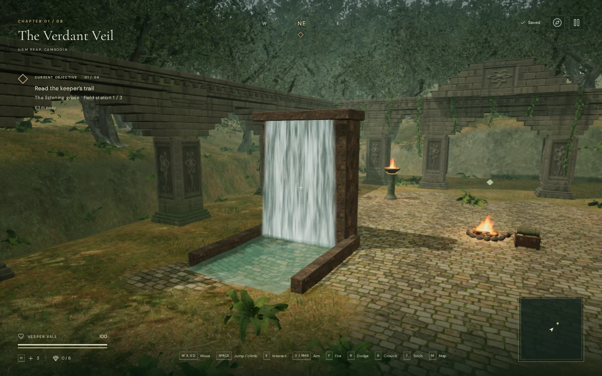
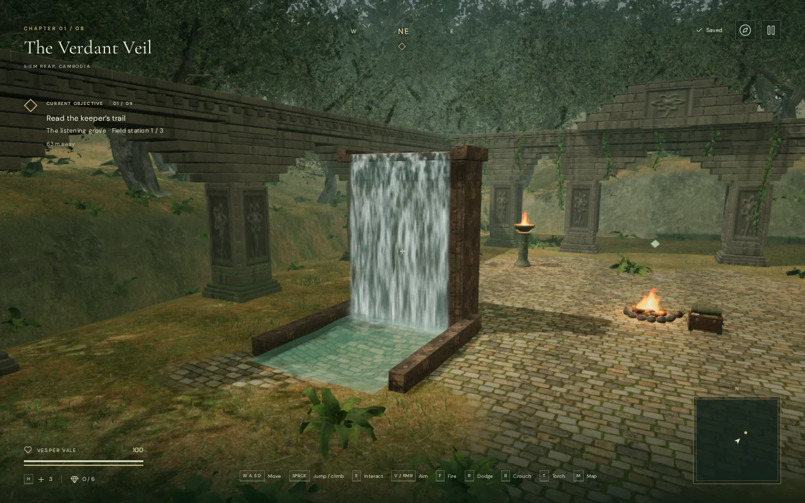
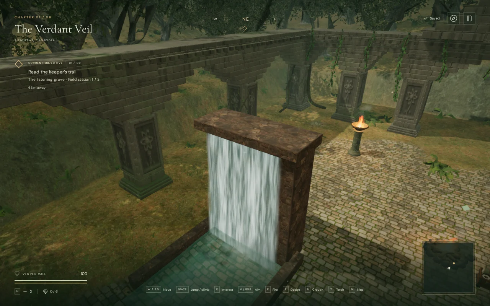
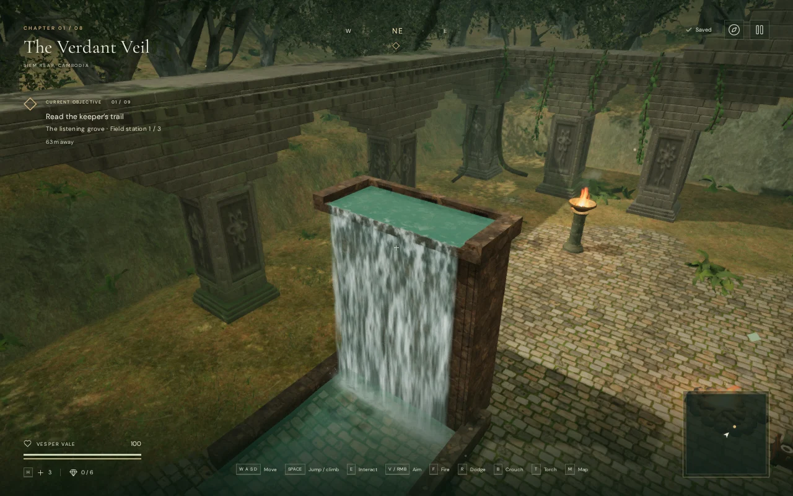

# Waterfall spillways

The jungle, coastal and sky chapters each have three waterfalls. Their water
previously started beneath a solid cap on a plain stone block. The structures
now have bonded stone courses, recessed jambs, wet staining, three feed mouths
and an open upper channel. The lower overflow sill meets the falling sheet.
Jointed coping defines the low basin banks. Stone foundations now reach the
sampled pool floor beneath each existing solid, including the deep coastal
reservoirs. Previously, two coastal backings ended about seven and nine metres
above the ground; draining or diving beneath them exposed unsupported masonry.

Water streaks follow a travel-time field based on gravitational acceleration,
so they stretch during the drop. Two irregular translucent layers form the
sheet, with separate impact foam, ballistic droplets and softer mist. Foam and
surface ripples extend across the impact line. The upper channel has its own
moving surface and remains at the original feed height when a reservoir drains.
Animated shader fields approximate the water flow.

## Matching browser views

These comparisons use the same entry waterfall, player position, diagnostic
camera, quality setting and animation clock. The explorer is hidden and an
unrelated toast is suppressed in both captures to keep the structure visible.
They are actual browser renders.

Jungle front, before:



Jungle front, after:



Upper channel, before:



Upper channel, after:



The silhouettes and material detail remain procedural. The small inlet mouths
suggest a supply inside the structure; the level does not simulate a connected
upstream water network. The environment still falls short of the requested AAA
visual standard.

## Play and sound

The original three movement obstacles and four camera collision bounds are
retained for each waterfall. The new masonry replaces their rendered geometry.
The banks keep their original climbable top height, and the upper channel has
an unobstructed path at the waterline. All original waterfall source coordinates
and the basin's gameplay surface are retained.

As a coastal reservoir drains, the curtain stretches to its new surface while
spray, impact foam, surface ripples and the positioned waterfall sound follow
it. The upper feed stays fixed. The source retains the existing locally bundled
waterfall recording and linear falloff: full configured gain within 6 metres,
falling toward silence at 70 metres. Music and audio assets are unchanged.
The work does not establish subjective soundscape or music quality.

## Rendering work

Each old structure used four rounded boxes totaling 432 triangles. The new
upper stonework has 126 fitted pieces and 13,608 triangles. With its supporting
foundation courses, each complete structure has 127–150 pieces and
13,716–16,200 triangles, merged into one mesh. Two
curtains retain 2,304 triangles in total; the upper channel and impact sheet add
four. Droplets and mist use 216 points per waterfall, up from 172. No new image,
model download or dependency is required. Stone materials reuse the chapter's
existing credited textures.

Transparent curtains now render in one pass each. Spray diameter uses the
active viewport height and camera projection, including the smaller reflection
target. These changes do not add another water reflection capture.

At 1280 × 800 and pixel ratio 1, the matching views submitted the following
whole-scene work, including rendering passes:

| View | Triangles before → after | Draw calls before → after |
| --- | ---: | ---: |
| Jungle front · High | 4,270,782 → 4,324,790 | 842 → 834 |
| Jungle side · High | 4,062,403 → 4,116,409 | 729 → 720 |
| Jungle crown · High | 4,149,232 → 4,203,240 | 797 → 789 |
| Jungle front · Performance | 915,358 → 928,862 | 191 → 190 |
| Coastal front · High | 844,397 → 898,511 | 328 → 320 |
| Sky front · High | 1,596,946 → 1,650,522 | 466 → 458 |

The browser reported ANGLE Vulkan on an AMD Radeon 780M. These figures count rendering submissions. GPU timings and supported frame
rates remain unmeasured for this change. The stonework raises
geometry cost; the selected views used fewer draw calls. Broader hardware
profiling remains necessary.

## Verification

Three new tests cast rays through the actual stone geometry to check the open
channel, its bed, the lower spill lip and the standing surfaces of both banks.
They also cover finite geometry, bounded triangle count, retained camera and
movement bounds, coordinated curtain/spray/impact heights at three drain
levels, and solid foundation faces below a drained surface. All nine focused
spillway and existing water checks passed.

Six final High/Performance captures linked shaders. Their saved camera,
player, site, obstacle and sound records match the baseline exactly. Advancing
only the entry waterfall's clock by 0.45 seconds changed 59,582 pixels in a
controlled upper-channel view, confirming that the flow is animated.

The browser rendered all eight chapters. All nine waterfalls retained their
feed/impact/sound alignment. Prepared keyboard wading covered 3.41 metres in
the jungle and coastal basins and 3.66 metres in the sky basin, each at 100
health. Controlled simulation steps with real key events exercised those
routes; human playthrough duration remains unmeasured. A coastal reservoir dropped 1.767 metres over ten simulated
seconds; the lower effects and sound followed it while the feed height stayed
fixed. Leaving each affected chapter released all 42 watched geometry and
material resources exactly once.

A live audio voice measured gain 1.05 at 6 metres and 0.525 at 38 metres, and
was released at 71 metres. Its panner retained linear attenuation with the
6/70 metre limits. The completed chapter, wading, drainage and audio checks
reported no console warnings, errors or failed assets.

All 459 tests passed in the final full-suite run (150.5 seconds). The production
build passed in 3.29 seconds with the existing large-chunk advisory.

The final release accepted native keyboard movement/crouch over 1.24 metres
and muted two-finger movement/crouch over 1.13 metres at a 540 × 900 portrait
viewport. Both cases retained 100 health and restored the complete local save
exactly apart from its `lastPlayed` timestamp. The production development hook
was absent, and loaded bundles matched the final build. The release checks
reported no console warnings, errors, failed assets or portrait overflow.

Development diagnostics, with an expedition loaded:

```js
(await import('/scripts/inspect-spillways-browser.js')).inspectSpillways(__vesper.game)
```

The helper also provides a prepared entry-basin wading fixture. It is excluded
from the production bundle. Temporary scripts, profiles, screenshots and saves
stay in ignored `local/staging/`. Full campaign pacing, human listening review,
broader device performance and the remaining visual work remain open.
