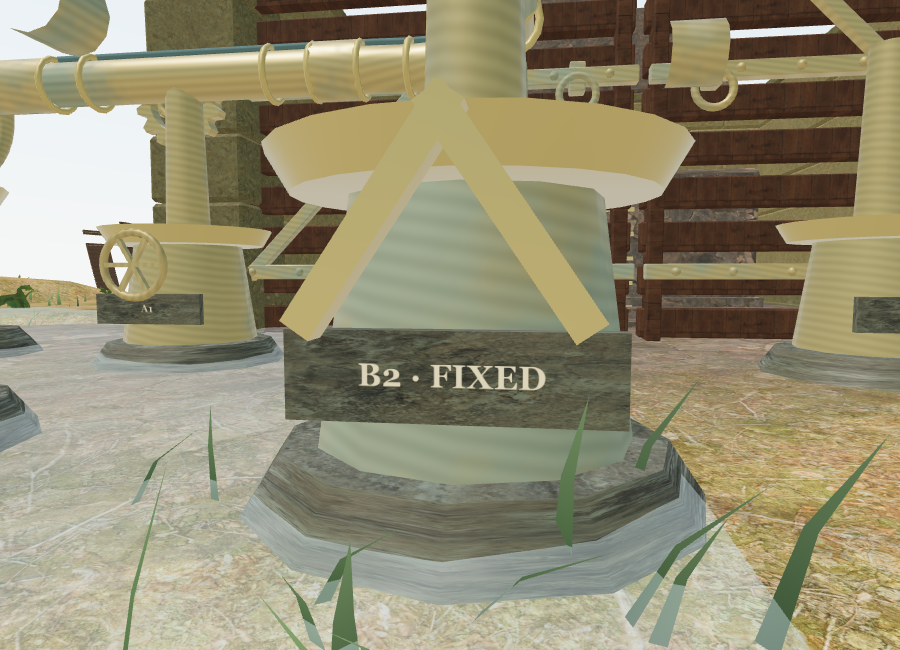
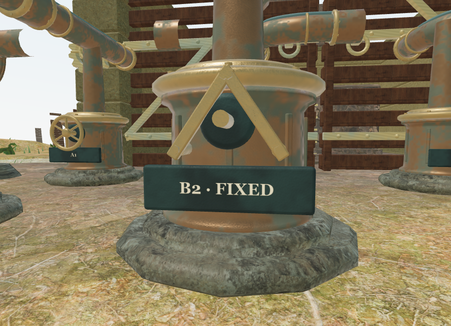
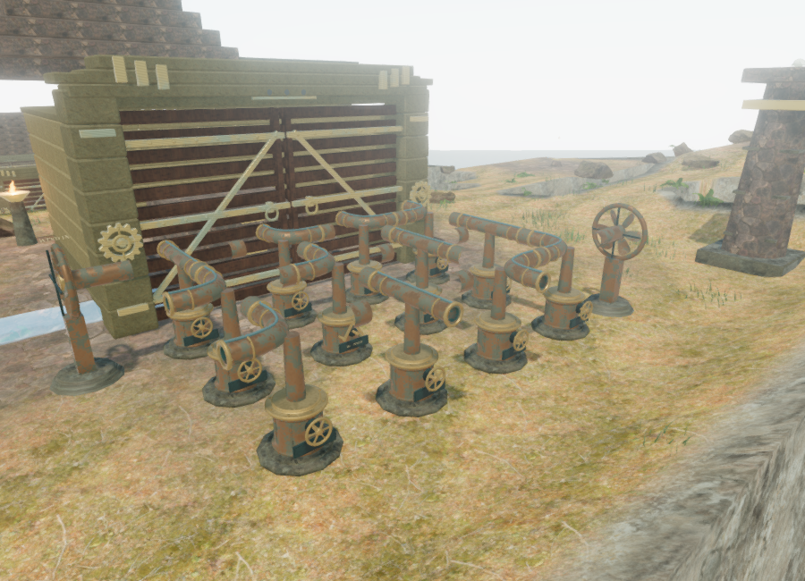

# Wind engine material and geometry pass

The cloud-city engines now have a dedicated bronze material and a more detailed mechanical kit. This follows the instance-batching and working-ground work in [wind rendering notes](wind-rendering.md).

## Surfaces and construction

Cast bronze, worn bronze and dark bearing metal share a shader with mottled oxidation, varying roughness and metalness, and fine casting grain. Screen derivatives fade the smallest grain at a distance. The old observatory material's regular stripe pattern is no longer used on these engines. Per-vertex casting coordinates survive static merging and instancing, so the patina stays attached to a wheel or duct as it turns. This shader is specific to the wind machinery.

The new original geometry includes:

- Stepped stone foundations, profiled bearing housings with vertical ribs, rounded crowns and fasteners.
- Rounded six-spoke handwheels, shaped hubs, bearing sockets and spindles. Fixed bearings retain their bracing and have no rendered handwheel.
- Hollow straight and elbow ducts with 24 radial segments, an outer radius of 0.24 m and an inner radius of 0.185 m. Their annular lips copy the tube's transported edge vertices exactly, avoiding cracks at curved mouths. Inward bore normals and additional cavity oxidation distinguish the inner surface.
- Bolted mouth flanges and smaller raised intermediate bands.
- Six curved, pitched turbine vanes per fan, shaped hubs, a bolted outer frame and rear supports.
- Bevelled dark nameplates using the existing full-resolution inscription atlas. The shallow stone foundations now use face projections at one texture repeat per metre instead of stretching a lathe UV strip.

The changes retain the existing casting connections, control positions, hand anchors, camera collision, positional emitters and saved wind states. Moving parts still use per-court instance batches. Static parts merge by material. Custom part keys distinguish different merged geometries when forming body batches.

Sky reservoirs now sit 0.08 m below their undepressed terrace surfaces, replacing the previous 0.12 m above-terrace level. Their excavated parts retain water, while the protected machinery courts remain dry. Terrain heights and bridge foundations are unchanged. Grass is excluded from wind working lanes after consuming its original random samples, preserving surrounding plant positions. These changes remove the shallow rectangular water overlay and plants passing through the machinery foundations.

All shapes and the metal shader are original to this repository in `src/wind-art.js`. The foundations reuse the existing credited rock maps. No new external image, model or sound assets were downloaded.

## Rendered views

The two close views below use Low quality, the same camera and the same fixed bearing. The earlier image is the preceding milestone's inscription close-up.

The current full court in High quality:

A [High-quality close-up](images/wind-art-bearing-high.png) shows the same fixed bearing with the additional rendering passes enabled.

`scripts/inspect-wind-art-browser.js` reproduces these camera positions at 900 × 650. The checked Low close-up submitted 415 calls and 806,810 triangles; the checked High full-court view submitted 1,422 calls and 4,839,352 triangles across rendering passes. Both linked their shaders. These are different views and quality settings, not a performance comparison. Workload also depends on the current reflection, shadow and detail-transition state. The browser uses ANGLE/SwiftShader software rendering, so these counts do not establish hardware frame rates.

## Verification and limits

All 247 automated tests pass. New tests check closed duct walls, inward bore normals, open air passages, finite geometry, rounded working parts, pitched vanes that clear the frame throughout rotation, existing wheel/fan envelopes, stable casting coordinates through static merging, and clearing court grass without moving surrounding plants. The existing wind checks additionally compare every geometry attribute through instancing and retain physical input, dry control positions, fixed-bearing rules, saved rotations, camera bounds, airflow and sound-source coverage.

The final browser world retains all 119 clear and dry control approaches and all 260 clear sound fronts. All 119 assisted local routes pass with both walking and swimming updates. The existing 54 bank approach legs and 36 bidirectional bridge crossings also pass. Native E turns and saves the second engine's first casting, starts its matching hand-grip state and leaves the explorer standing. These checks are assisted integration checks, not an unassisted chapter playthrough.

The High release accepted native E and W input. Its second A1 casting changed from mask 3 to mask 6 and from one saved move to two. The saved position is (79.04505247147667, 122.96574100005053, height 0), with health 100, stage 1, its three field actions, both engine records and 168.17539999997615 accumulated active seconds. The tool's 300-second observation window expired during this check; re-reading the same paused page recovered the completed result without restarting the game. No requests failed, and the page had no development hook. Checked bundles: `index-icpr9uMI.js`, `game-DutS2iib.js`, `three-DbOndYXn.js` and `index-EpzmVKat.css`.

A paused release reload restored that exact position, health, elapsed time, stage, three field actions and both wind records. No asset requests failed and the production console reported no warnings or errors.

A live sound check selected eight environmental voices, including the nearby wind collector, within the shared twelve-voice budget. Switching from sky to crystal released all 3,095 expected instance buffers and all three dedicated metal materials. No wind courts, wind sources or wind voices remained. The development console also reported no warnings or errors. Both temporary verification saves were cleared and High quality restored afterward.

The production build succeeds with the existing large Three.js chunk advisory. These additions increase the geometry budget and add surface-detail shading; the earlier batching milestone's workload figures do not describe the current art. Consumer-hardware performance and subjective audio evaluation still need broader testing. The game remains below the requested AAA visual standard, and an hour of unassisted play per chapter remains unverified in [production status](production-status.md).
