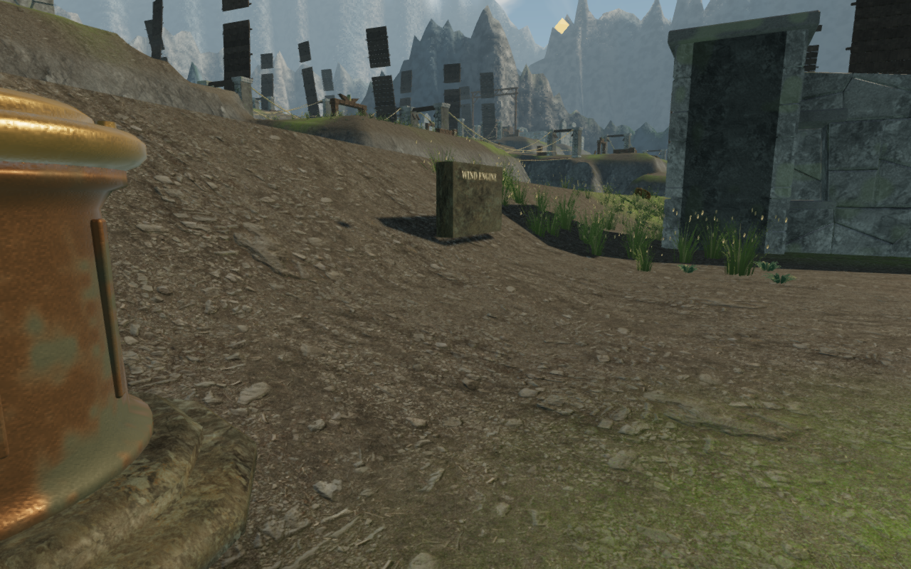
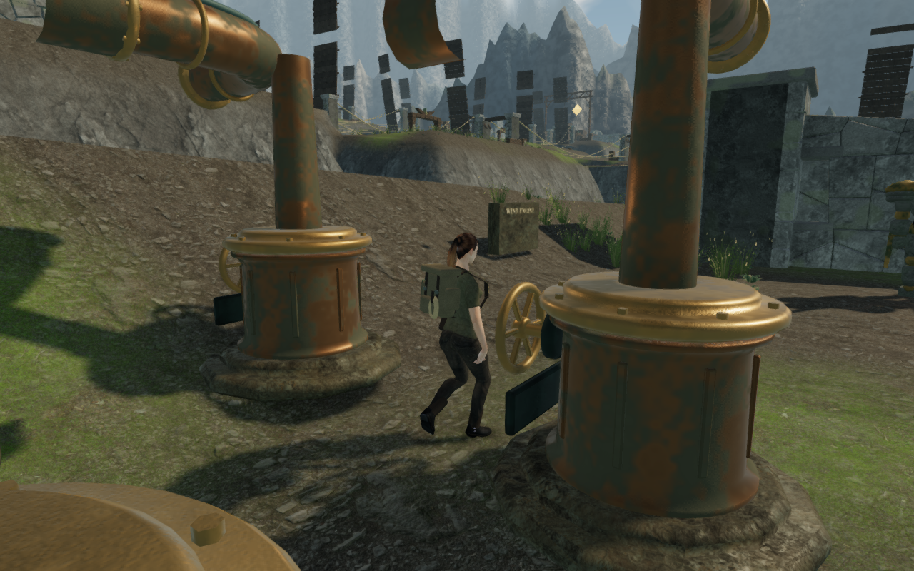
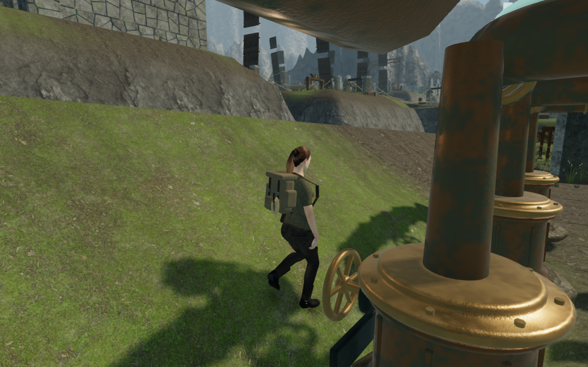

# Wind machinery camera clearance

Following the [counterweight and carrying route](sky-counterweights.md), the
third wind engine exposed three working views that retracted the camera to about
60 cm and faded the explorer. The camera remained above the terrain. A single
1.9 m wide box around each pedestal blocked the empty corners beside its round
casting, forcing the view toward the nearby bank.

## Collision surfaces

The wind engines now register separate camera surfaces for their foundations,
housings, crowns, stems, wheels, bearings, spindles, nameplate backing, braces,
couplers, fan supports and lead ducts. Round parts use capped circular cylinders
with a spherical 28 cm clearance margin. Empty box corners and the diagonal space
beside a cylinder's cap remain available. A near-tangent fallback retains shallow
contacts that would converge too slowly in the distance march.

The fan's circular envelope includes the frame, rear support, hub and every vane
through a complete rotation. Its radius comes from the actual vertices. The
spinning envelope stays solid to the camera, including the openings between
blades. The nine small wind-engine tablets also explicitly register their solid
backing: an independent mesh-ray sweep found five previously unguarded tablet
views after the pedestal correction.

Captured surfaces survive static merging and instancing. Moving duct parents
retain their transforms; detail visibility continues to govern the corresponding
camera surfaces. This changes camera clearance without changing walking solids,
controls, hand targets, terrain, wind rules, save format or rendered machinery.

The repeated assisted route reaches exactly the same recorded player positions
at these three controls. Distances below are from the player's camera target,
1.3 m above the controller position, to the actual follow camera.

| Third-engine control | Previous camera distance | Corrected camera distance |
| --- | ---: | ---: |
| C1, node 6 | 0.602 m | 4.102 m |
| D1, node 9 | 0.601 m | 3.809 m |
| D3, node 11 | 0.591 m | 3.330 m |

## Verification

All **710 tests pass**. New regressions cover rounded cap margins, clear diagonal
corners, margin escape versus looking through a solid, long grazing contacts,
merged/rotated/scaled parent transforms, the three working views, receiver blades,
clear space outside the fan and all nine inscription backings. The production
build succeeds with the existing bundle-size advisory.

`scripts/inspect-wind-camera-browser.js` checks eight orbits at every one of the
119 wind controls: **952 stationary samples**. Each constrained camera stays in
valid space, its unpadded segment clears the captured surfaces, and an independent
ray against the visible rendered wind meshes finds no intervening opaque solid.
Those centre rays complement the clearance-margin regressions; they do not test
every pixel of the camera's near plane. Some requested angles legitimately face
nearby machinery or steep ground and still retract and fade the explorer. The
sweep contains 312 camera distances below 2.2 m, with a minimum of 0.216 m.
Twenty-four High/Low observer images at the three affected wheels are reviewed.
These observers reposition the explorer and establish camera coverage, not
traversal or progress.

The continuous route starts from the earned second-sector completion save. It
walks to all three next-sector field stations, operates their winches, crosses
both damaged crosswind bridges, turns the third engine's physical handwheels
16 times, then uses its record and the normal Activate button to open the next
sector. It covers **330.345 m in 4,969 simulated frames**, with health 100,
no movement step over 1 m and a largest step of 0.2775 m. All 60 final captures
are reviewed; shaders link and the browser reports no errors or warnings. The
route uses the delivered controller and follow camera with assisted navigation.
Player position and progress are not assigned after setup. Enemy AI and combat
are not advanced; this is not an unassisted playthrough or a pacing measurement.

Four production cases use native E and keyboard movement or touch Use and touch
movement at C1 and D3. Desktop uses High at 1280 × 800; touch uses Low at 540 × 900
with sound muted. Every case adds one legal saved turn, moves 1.15–1.57 m and
retains health 100. Full-store reload comparisons retain all fields apart from
the normal play timestamp. The two C1 cases also receive a 15-degree arrival
camera correction; a second reload preserves each corrected view exactly. The
two D3 cases retain their angles. All eight before/turn screenshots are reviewed.
The cases load the current production bundles, expose no development handle,
have no horizontal page overflow and report no errors, warnings or failed assets.

## Remaining review

The native D3 turning views prompted the subsequent
[foot-contact investigation](wind-foot-contact.md). That pass reproduces and
fixes a first-frame facing/grounding mismatch as VA-32, and records a separate
hand-reach problem as VA-33 in the [visual audit](visual-audit.md). Later sky
sectors and the broader court, field and discovery compositions remain open.
The evidence does not establish consumer hardware performance or the overall
visual target.

Audio code, emitters and music are unchanged; no new listening or distance-gain
measurement is claimed in this pass. The earlier [sky route audio checks](sky-first-route.md)
remain a reference for that unchanged implementation. The three documentation
images are actual game captures converted losslessly to WebP, with decoded RGBA
identity verified. Existing [asset attribution](asset-credits.md) is retained;
no external assets or dependencies were introduced.
