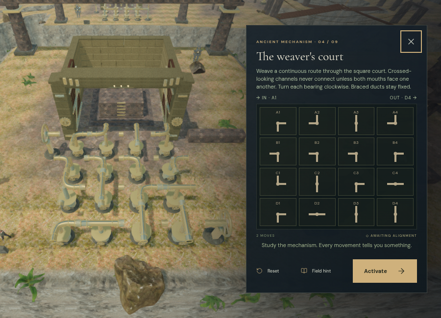
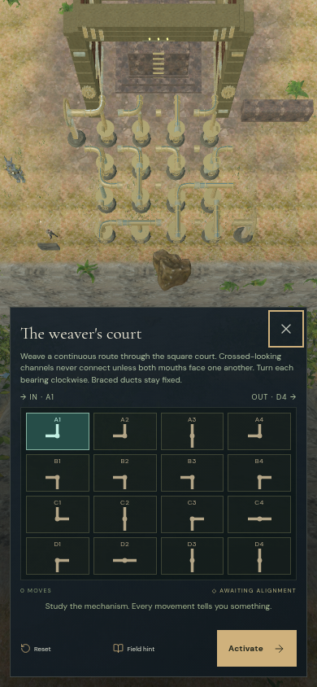
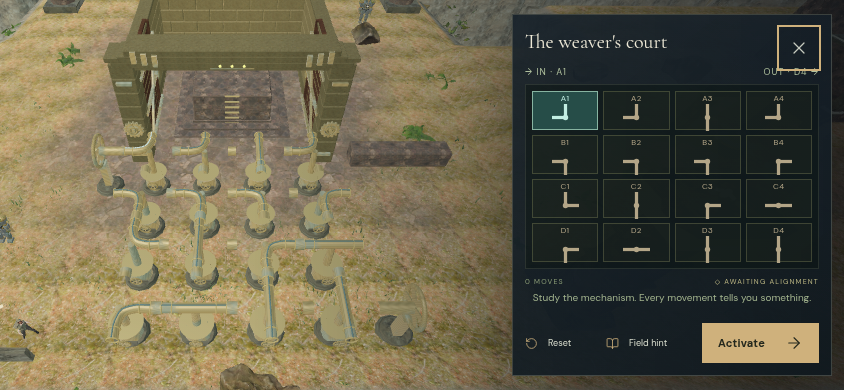

# The wind engines of Where Eagles Sleep

Nine physical wind courts replace the cloud city's two repeated channel-board routes. There are 121 castings: 110 turning ducts and 11 fixed bearings. Nine record tablets bring the total to 119 world controls. The chapter's eighteen suspension bridges, field stations, discoveries and relic retain their existing progression.

Each engine admits air at A1 on its western edge. Straight ducts retain two opposing mouths; elbows retain their right angle. Turning a handwheel rotates its casting clockwise. Both mouths at a boundary must face each other before air passes. A silver line and moving motes trace the fed route, and the eastern receiver spins when that route reaches it. Crossed braces identify fixed bearings in the world and in the focused controls.

| Engine | Grid | Fixed bearings | Receiver | Turns in the verified assisted route |
| --- | --- | --- | --- | --- |
| The first breath | 3 × 3 | None | C3 | 12 |
| The pilgrim's return | 4 × 3 | None | C4 | 15 |
| The hanging garden | 3 × 4 | None | D3 | 16 |
| The weaver's court | 4 × 4 | None | D4 | 26 |
| The immovable bearings | 4 × 3 | B2, B3 | C4 | 14 |
| The reversed stair | 3 × 4 | B2, C2 | D3 | 16 |
| The high receiver | 4 × 4 | C2 | A4 | 18 |
| The eagle's labyrinth | 4 × 4 | C1, B4, C3 | C4 | 24 |
| The city's last breath | 4 × 4 | C2, B3, D3 | D4 | 14 |

These are reproducible solution routes, not claims of minimum turns, blind difficulty or chapter duration. An alternative connected route is accepted without requiring every unused duct to match the authored record.

## Controls and persistence

Press **E / Use** at a handwheel. The brief hand pose follows its rotating grips; moving away releases the pose. The current sector's three field actions and its first counterweight chamber must be complete before its controls become available. Reach and height are checked again when interacting.

The record tablet explains the court, activates a connected receiver, resets the original arrangement, and opens focused controls for the same machinery. Fixed cells are disabled and labeled. Current port directions and airflow have accessible names. Visual flow supports play with sound muted.

Every rotation writes `levels.sky.wind[stage]` in the existing localStorage save. Values, move count and last operated wheel survive reload. Normalization rejects changed casting shapes, changed fixed bearings, invalid lengths and non-integer values. Existing chapter saves preserve their progress and begin unfinished engines in their deterministic initial arrangement.

## Construction and presentation

The latest [wind art pass](wind-art.md) adds hollow duct walls, bolted flanges, profiled housings, supported fixed braces, rounded handwheels and curved turbine vanes. Dedicated bronze surfaces replace the former shared striped material. The working courts now remain dry and clear of grass intersecting their foundations. The notes include final Low/High views and the latest integration evidence.

Original bronze castings, raised ribs, stationary sleeves, driven columns, handwheels, bracing and six-bladed turbines use the existing project materials. The overhead channels share a level plane while support heights follow the ground. Their lowest surfaces stand at least 2.7 metres above the sampled support ground. Rotating camera bounds follow the ducts; character collision retains the pillars and clear walking lanes.

Fine machinery is retained within 85–95 metres with hysteresis. Static supports and repeated ribs batch by material. Rotors, wheels and fans now render through per-court instance batches while retaining their independent animation and hand anchors. Each court packs its airflow particles into one object; inscriptions share one atlas at their original text resolution. A focused camera places the court beside the desktop controls or above the portrait controls. Returning to play restores the normal camera lens. [Rendering and working-ground notes](wind-rendering.md) contain the latest workload comparison, swimming correction and regression results.

The High desktop view keeps the engine beside its controls:

The phone views below use Low quality. The portrait panel measures 453 px with no overflow. The final landscape panel measures 360 px with no overflow; the close button clears the receiver label. Its cells are 46 px and 39 px tall respectively.

## Sound

Each casting has a positioned air source and bearing source. Collectors add soft wind; connected receivers add restrained mechanical sound. Movement drives bearing activity, and connected flow drives air activity. Completed engines settle to a reduced ambience. These 260 potential emitters share the existing twelve-voice environmental limit, distance attenuation and obstruction filtering.

A live turning check selected the collector and moving bearing among seven voices, below the shared twelve-voice limit. The existing quiet cloud-city score uses its working arrangement during a turn. All music and sound controls retain their saved settings. No external audio or visual assets were added for these engines.

Offline Web Audio renders exercised the actual HRTF voice graph at 48 kHz stereo. Each comparison used the same source buffer and loop offset, 70% activity and a 0.18 measurement bus. RMS was measured over seconds 1–3 of four-second renders.

| Source | Near / outer radius | Near RMS | Midpoint RMS | Beyond range |
| --- | --- | --- | --- | --- |
| Duct air | 1.2 / 11 m | 0.00156649 | 0.000783246 | 0 |
| Turning bearing | 1.2 / 12 m | 0.00157777 | 0.000788885 | 0 |
| Collector | 1.2 / 24 m | 0.00229900 | 0.00114950 | 0 |
| Receiver | 1.2 / 20 m | 0.00214829 | 0.00107414 | 0 |

The midpoint ratios were 0.49999996–0.5. Samples remained finite; the largest measured peak was 0.009631. This confirms spatial behavior for the new source configurations, not subjective listening quality.

## Verification and limits

Browser checks traversed all 119 local control routes through the actual character physics and retained clear approaches for every wheel and tablet. All 260 duct and fan sound fronts had clear sight paths toward their operating positions. Existing routes remained usable: all 54 bank legs and all 36 bidirectional bridge crossings passed. An assisted 155-turn run operated the world controls and activated all nine engines through the real record buttons. Invalid activation, focused changes, hints, reset and partial saves also passed.

All 237 automated tests pass, including new checks for port connectivity, casting invariants, fixed bearings, independent save normalization, world-space mouth orientation, input reach/height, retained hand anchors, source activity, camera framing and paused presentation. The production build succeeds; its only warning is the existing large Three.js chunk advisory. The checked High focused scene linked its shaders and submitted 2,081 calls and 3,542,722 triangles across rendering passes. The browser uses ANGLE/SwiftShader software rendering; these counts are workload observations, not a supported frame rate.

The High production build accepted native E and W input. The turn advanced the second engine's A1 casting from mask 3 to mask 6 and its move count from one to two. Movement changed the position to x = 79.04505247147667, z = 122.96574100005053, height = 0. A paused reload restored that exact position, 215.64380000001196 accumulated active seconds, health 100, stage 1, its three field actions, the completed first-engine record and the unfinished second-engine record. No assets failed and no development hook was present. Development and production console checks reported no warnings or errors. The final layout build (`index-N7N60B8y.js`, `game-CbJtBOVb.js`, `three-DlFk-V_4.js`, `index-EpzmVKat.css`) repeated the exact paused-reload check with no failed assets. Both temporary verification saves were then cleared and High quality restored.

These assisted checks do not establish an unassisted play time, approximately one hour per chapter, supported hardware performance, subjective audio quality or AAA graphics. Those requirements remain open in [production status](production-status.md).
