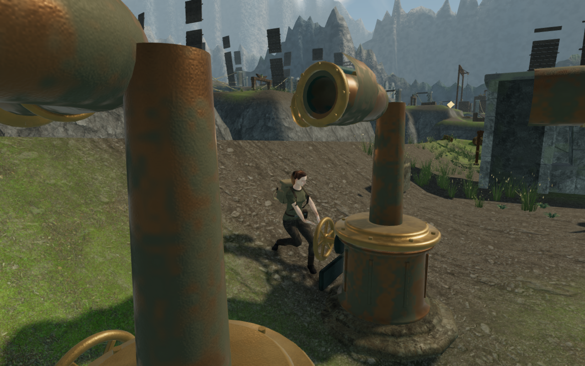
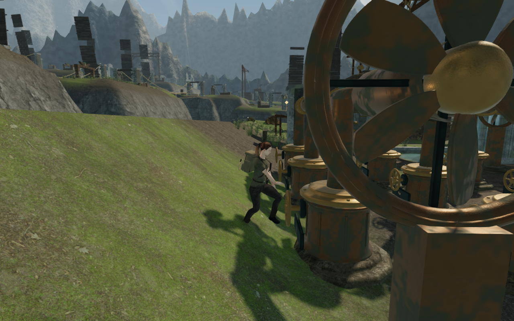
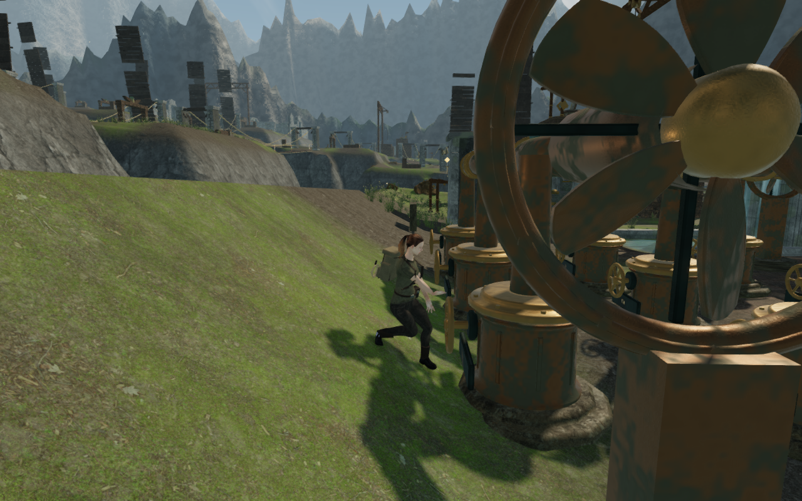

# Wind handwheel foot contact

The [wind camera review](wind-camera-clearance.md) exposed a stance change beside
the third engine's sloped working ground. Frame-by-frame inspection found a
specific ordering defect on the first turning frame: the character animator
fitted the boots to the terrain, then the wind presentation turned the entire
avatar toward the wheel. The fitted feet moved away from their support points.
The controller remained grounded, with zero jump height and an unchanged
position. Later frames fitted the feet in the new facing and recovered contact.

The character animator now selects the working facing before fitting its feet.
The animator and wind presentation share the same active-grip predicate in
`src/wind-pose.js`. Pausing, expiry, leaving the control, swimming, climbing,
rope travel, dodging and gripping a counterweight still interrupt this pose.
The hands continue to update after the physical wheel and its handles move.
Controller position, walking surfaces, machinery geometry, wheel operation,
camera collision, persistence and audio are unchanged.

The measurements below are the least vertical clearances between each delivered
boot's sampled outsole vertices and their support surfaces on the first turning
frame. Negative values indicate penetration. Left and right refer to the
character's feet. These are terrain-contact measurements, not a claim that every
part of a sole lies flat against uneven ground.

| Third-engine control | Previous left / right clearance | Corrected left / right clearance |
| --- | ---: | ---: |
| D1, node 9 | +34.684 / −27.031 cm | +1.146 / +0.614 cm |
| D3, node 11 | +28.044 / −22.157 cm | +1.139 / +0.584 cm |

## Verification

All **712 tests pass**, and the production build succeeds with its existing
bundle-size advisory. The new boot regression loads the delivered explorer and
checks all **110 working handwheels** across the nine actual terrain courts.
Three initial facings and six turning frames per control give 1,980 checked
turning frames, following 330 idle poses. Each boot's least outsole clearance
stays within the test's −1.2 to +4.5 cm tolerance, and the controller position
does not move. A separate regression checks interruption and release guards.

[inspect-wind-pose-browser.js](../scripts/inspect-wind-pose-browser.js) provides
independent skinned-outsole measurements and controlled captures using the
delivered controller, animator, machinery and camera. Load an earned wheel-side
sky save, call `prepareWindPoseInspection(game)`, settle it with `stepWindPose`,
then use the normal interaction and step through the turn. The helper updates
the HUD from the current state and captures the rendered canvas. It does not
advance enemy AI or combat.

The controlled comparison uses earned third-engine saves at C1, D1 and D3 in
High and Low quality. Each case requires the legal saved move count to increase
by one and the correct active grip to exist on the first frame. The preceding
milestone's animator and wind update reproduce the original mismatch; the
corrected implementation is checked for 54 frames through turning and release.
There are 324 corrected frames and 36 reviewed comparison captures at
1280 × 800. Every corrected frame remains grounded, with zero jump height and
an unchanged controller position. Shader links succeed, with no browser errors
or warnings. This is assisted frame inspection, not a continuous playthrough.

Four production cases separately exercise native E and keyboard movement or
touch Use and touch movement at C1 and D3. Desktop uses High at 1280 × 800;
touch uses Low at 540 × 900 with sound muted. Each case saves one legal turn,
moves 1.17–1.42 m and retains health 100. Reload comparisons preserve the full
store apart from the normal play timestamp and two independently checked C1
arrival-camera corrections of 15 degrees; a second reload preserves each
corrected view. D3 retains its camera angles. All eight production captures are
reviewed. The current bundles load without a development handle, horizontal
page overflow, console errors, warnings or failed assets.

## Remaining review

The first-frame ordering defect is fixed as [VA-32](visual-audit.md). The same
measurements expose a separate hand-reach problem: some posed wrists remain
about 0.6 m from their assigned moving handwheel anchors. This is recorded as
VA-33 for a construction and stance investigation. Fitted feet alone do not
establish a convincing complete wheel pose. Wider court composition, later sky
routes and the other chamber interiors remain under review.

The earlier [330.345 m third-sector route](wind-camera-clearance.md) remains a
reference for unchanged controller, machinery and camera geometry. This pass
does not establish pacing, consumer hardware frame rates or the overall visual
target. Audio, positioned sources and music are unchanged; no new listening
claim is made. The four documentation images are actual game captures converted
losslessly to WebP, with decoded RGBA identity checked. No external assets or
dependencies were added; existing [asset attribution](asset-credits.md) is
retained.
