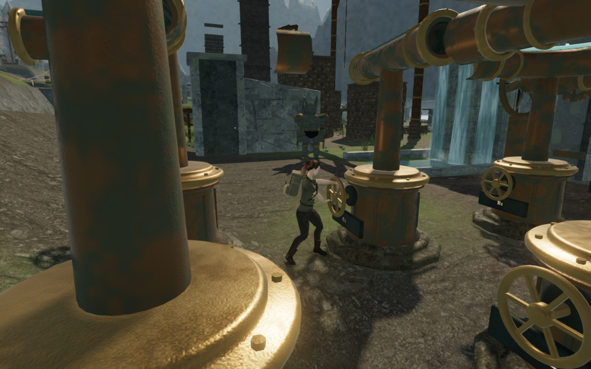
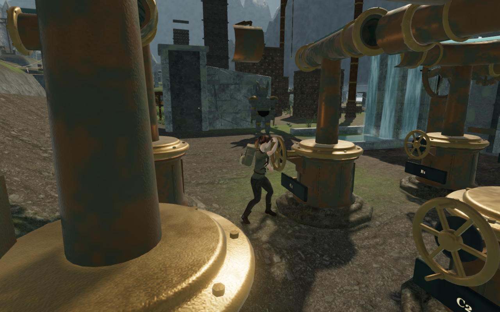
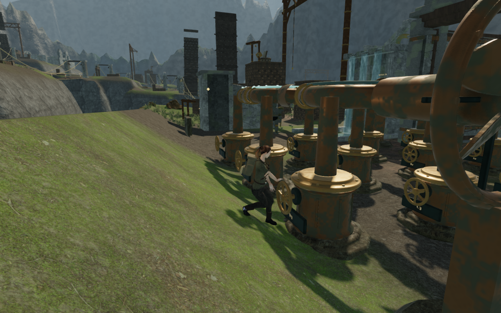
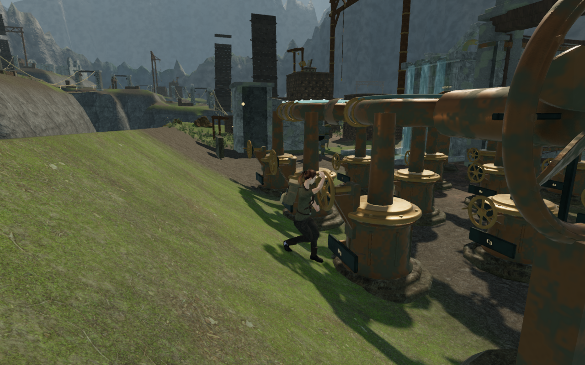

# Wind handwheel construction and grip contact

The [foot-contact repair](wind-foot-contact.md) exposed a second problem at the
wind engines: some posed wrists were about 0.6 m from their assigned moving
anchors. The old wheels had point targets on a flat rim. Their mounts followed
the casting's ground height, even where the working stance stood higher on the
court bank. Inspecting the delivered character showed that the pose could not
reach those targets without changing its arm lengths.

All 110 working wheels now have two visible sleeved grips, 38 mm in diameter and
16 cm long. Their bearing height follows the ground under the planted stance.
A front plate, paired gussets and extended shaft seat the raised bearing in the
casting. Small backing tabs also attach each nameplate to its housing. Fixed
ducts retain their bracing and have no rendered handwheel.

The existing cylindrical grip solver fits the delivered palms and fingers to
these physical sleeves. It chooses the left and right material grips from their
positions halfway through each quarter-turn, including turns starting with a
vertical pair. Bone lengths and scales remain unchanged. Working facing is
still selected before fitting the boots, and the hands follow the wheel after
its geometry moves.

## Approaching and turning

The normal E / touch Use range remains 1.6 m. An interaction outside the working
stance starts a short approach at walking speed. This uses the delivered player
controller, ground support and collision checks; it cannot carry the explorer
through a casting or across a gap. The turn starts and saves only after arriving
and settling into the standing pose. Earned arrivals within 2 cm of the stance
retain their controller position.

Movement, jumping, crouching, occupied hands, swimming, death, a stage change or
pausing interrupt the approach. An approach is transient and does not save an
unperformed turn. A lit torch is put out to free both hands. Repeated Use input
keeps the current hand assignment and cannot overlap a second turn; the wheel
must settle before it can be taken again. Moving away releases the grip.

These guards address two independently reproduced cases in the earlier
implementation: using C1 from 0.8 m behind its stance left fingers over 0.6 m
from the grips; pressing Use twice six frames apart replaced the active hand
assignment during the first turn. Fitting only the mounts would have left both
input defects in place.

## Verification

All **717 tests pass**, and the production build succeeds with its existing
bundle-size advisory. The delivered-rig regression exercises all **110 working
wheels**, four legal saved turns per wheel and five samples per turn: **2,200
poses**. Each finger's least surface distance to its assigned finite grip stays
between −2 and +4 mm. The palm has a separate +11 mm tolerance because only part
of its surface contacts the cylinder. Arm and hand bone positions, every bone's
scale, finite rotations, controller position, boot contact and release are
checked. Wrist-to-grip-centre distance is an anatomical offset and is no longer
treated as the contact measurement.

A separate test walks into every working wheel from 0.8 m behind its stance and
requires exactly one saved turn after arrival. Delivered-hand checks also cover
approaches from both sides, a retained 2 cm arrival, and repeated input throughout
the active grip. Solid obstruction, movement and action interruptions, pause,
occupied hands and save boundaries have their own regression.

The High and Low browser comparison uses earned third-engine saves at C1, D1
and D3. Archived wind art, courts and game methods from `c94f512` reproduce the
previous construction; each case builds its own world with the delivered rig.
Both worlds use the current camera recovery and surrounding rock placement,
so this is a comparison of the wind construction and pose, rather than a full
checkout comparison.
The paired first frames retain identical player and camera positions. Each
normal keyboard interaction must add one legal saved move and select the
intended wheel. The current implementation is checked for 54 frames through
turning and release: **324 current frames and 36 reviewed comparison captures**
at 1280 × 800. Every frame remains grounded with zero jump height and an
unchanged controller position. The six current camera arms remain 5.339 m.
Captured finger and palm minima span −0.454 to +2.468 mm. Shader links succeed,
with no browser errors or warnings.

Four native production checks use desktop keyboard controls at 1280 × 800 in
High quality and touch controls at 540 × 900 in muted Low quality, at C1 and D3.
Each turns once, walks away, pauses and reloads with full health and unchanged
progress. The saved store matches apart from timestamps and two independently
recorded C1 arrival-camera corrections; a second reload confirms each corrected
camera is stable. These checks load the actual production bundles without the
inspection hook, report no overflow or failed resources, and produce eight
reviewed before/after captures.

Four additional High/Low browser cases take eight real walking frames away from
C1 or D3, then press E from about 0.8 m behind the stance. Across **384 frames**,
the normal controller approaches before saving, the skinned fingers and planted
boots retain their contact tolerances, and another E six grip frames later
cannot add a second turn. All 16 approach, grasp, repeated-input and release
captures are reviewed.

## Keeping the working view clear

The raised wheel also exposed a camera problem. An upper grip could pass inside
the camera's 28 cm safety margin at the old look point, retracting the view to
zero distance. Separate bounds now follow the rim, shaft, collars and moving
pegs. At the working stance, the look point sits 14 cm toward the clear ground
in front of the wheel. This offset fades smoothly away from the control and
does not move the player. The camera also retains a clear ray to the explorer's
body; a clear ray to the offset look point alone is insufficient.

An independent ray inspection then found a scanned mossy rock only 13 cm ahead
of the D3 camera, hiding the explorer despite a full camera arm. Those scenery
instances load after the registered camera bounds. Rock placement now reserves
7.3 m plus each rock's full footprint radius around all 119 working pads and
tablets, allowing room for the camera and Use approach. Scans still dress the
landscape away from these controls. The six delivered rock variants are checked
around every pad in eight directions: **5,712 footprint cases**, including the
observed obstruction.

The camera regression checks all 110 working controls through four turns,
three wheel phases and eight headings: **10,560 samples**. None collapses to
the look point or crosses the registered geometry along the look or body ray.
The minimum constrained arm is 0.0899 m. An independent browser inspection
checks **952 stationary samples** at all 119 controls and reviews 24 High/Low
orbit captures at C1, D1 and D3. Reverse headings toward close castings can
still become first-person views; these checks do not establish a full
third-person composition from every heading.

The final continuous assisted route walks **330.352 m in 5,667 controller
frames**, operates three field winches, crosses two repaired bridge spans and
completes 16 legal turns before activating the third engine. It reaches the
next sector's objective with full health, no stuck frames and no controller
step over 1 m. All 60 route captures are reviewed. Some approach views still
place nearby castings in front of the explorer; the working-view repair does
not finish the wider camera composition review.

[inspect-wind-pose-browser.js](../scripts/inspect-wind-pose-browser.js) measures
the skinned hands and outsoles after the normal controller, animator, machinery
and camera updates. The route helper
[inspect-sky-route-browser.js](../scripts/inspect-sky-route-browser.js) now waits
through the ordinary approach and completed turn instead of advancing only
scenery. These are assisted inspections and do not advance enemy AI or combat.

## Remaining review

This repairs the construction, reach and overlapping-input problems recorded
as VA-33 and the working-view collapse and rock obstruction recorded as VA-34
in the [visual audit](visual-audit.md). Wider court composition, camera views
beside close machinery, later sky routes and the other chamber interiors
remain under review. The milestone does not establish the overall visual target,
human playthrough duration or consumer hardware frame rates.

The bearing's positioned sound source follows the fitted mount; its gain and
range, the other procedural sources and the sky score retain their existing
behavior. No new listening claim is made. No external assets or dependencies
were added. The four documentation images are actual game captures converted
losslessly to WebP with decoded RGBA identity checked. Existing
[asset attribution](asset-credits.md) is retained.
