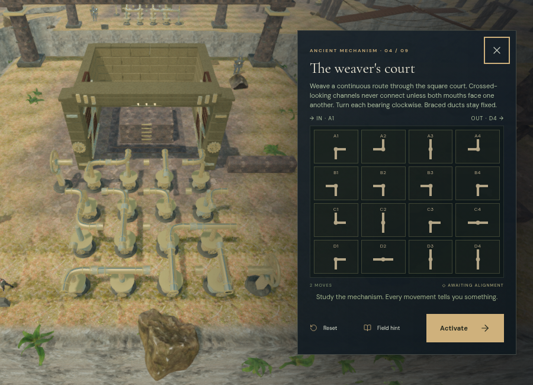

# Wind machinery rendering and working ground

The cloud city's wind engines now render their repeated moving parts in per-court instance batches. Casting geometry, collars, working wheels, support details, fan blades, materials and shadow flags remain intact. Hidden original objects drive the same animation, hand anchors and moving camera surfaces. The two airflow material states use separate instance buckets, and each court packs its moving air into one particle object.

The 148 inscriptions share a 1536 × 1664 canvas atlas containing 26 unique labels. Each label retains its original 768 × 128 text cell, font, world dimensions and orientation. The text planes merge into one mesh per court. This reduces the base RGBA texture allocation from 55.5 MiB to 9.75 MiB, excluding mipmaps, without reducing text resolution. No external assets were added.

Scene cleanup now explicitly disposes each `InstancedMesh` before releasing shared geometry and materials. This releases Three.js's per-instance GPU buffers as well as the regular mesh resources when changing chapters.

A browser transition from the cloud city to the crystal caverns emitted all 3,068 expected instance-disposal events and one atlas-disposal event. The new scene retained no wind courts or wind sources; the fresh development console reported no warnings or errors.

## Matched workload comparison

`scripts/profile-wind-browser.js` prepares the fourth court with two initial A1 turns, elapsed animation time 10, a stationary player at the record tablet and the focused camera. These measurements use High quality at 900 × 650. Camera position is (84, 41.32516746520996, 210), FOV 70, film offset 15.269910544804054. Counts include the renderer's additional passes.

| Measurement | Before | Batched machinery and atlas |
| --- | ---: | ---: |
| Draw calls | 2,113 | 1,537 |
| Submitted triangles | 3,554,944 | 3,621,780 |
| Submitted points | 1,212 | 1,212 |
| Inscription textures | 148 | 1 |

Draw calls fell 27.26%. Submitted triangles rose 1.88% because per-court bounds perform coarser culling than individual meshes. The source geometry is unchanged; this is a tradeoff between draw submission and culling. Both views linked their shaders. The comparison isolates the renderer change and predates the working-ground correction below.

A close view in Low quality checks the fixed-bearing inscription after the ground correction:

## Working-ground correction

A close inspection found ten handwheel positions inside excavated reservoirs at depths of 1.55–1.77 m. Swimming raised the explorer beyond the interaction height limit. Earlier local route checks used walking physics alone and missed this condition.

Sky mechanism forecourts now preserve their original terrace ground during basin excavation, blending back into the reservoir over two metres outside the working lanes. Reservoir surfaces and waterfall positions stay at their existing elevations. The change applies only to the sky biome.

The actual browser world has at most 0.12 m of water at any of its 119 wind controls. All 119 assisted local routes pass with both character and swimming updates, arriving outside swimming mode and within 0.021 m of the target ground height. All 260 sound fronts remain clear, as do all 54 bank routes and 36 bidirectional bridge crossings. Native E at the formerly submerged first A1 wheel changes and saves its casting while the explorer remains standing.

## Verification and limits

All 243 automated tests pass. New coverage checks exact source geometry and shadow preservation, animated and restored instance transforms, rotating bounds, active/inactive flow and particle placement, atlas cells and world quads, instance-buffer disposal, and all 119 controls through water arrival, swimming and successful wheel/tablet interaction. The release build succeeds with the existing large Three.js chunk advisory.

The High release build accepted native E and W input. The second engine's A1 casting advanced from mask 3 to mask 6, and its saved move count advanced from one to two. A paused reload restored the exact position (79.04505247147667, 122.96574100005053, height 0), 110.72139999997616 accumulated active seconds, health 100, stage 1, its three field actions, the completed first-engine record and the unfinished second-engine record. No asset requests failed, no development hook was present, and the production console reported no warnings or errors. Checked bundles: `index-C9uSh4u3.js`, `game-CF0b-OZ2.js`, `three-CqjJLQ-s.js` and `index-EpzmVKat.css`. Both temporary verification saves were cleared afterward, and High quality was restored.

These measurements use ANGLE/SwiftShader software rendering. They establish workload changes and functional behavior, not a consumer-GPU frame rate, AAA graphics, subjective sound quality or an hour of unassisted play per chapter. The broader acceptance requirements remain tracked in [production status](production-status.md).
