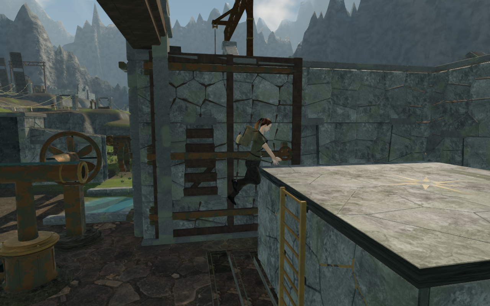
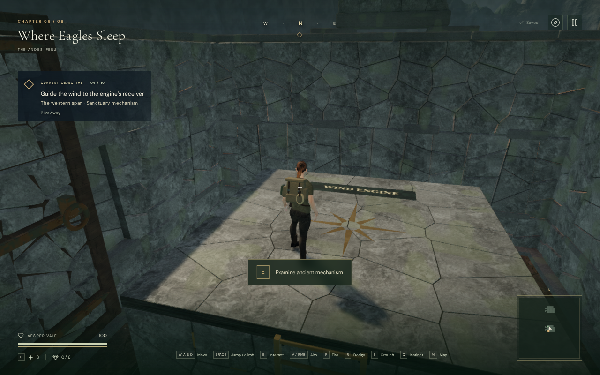
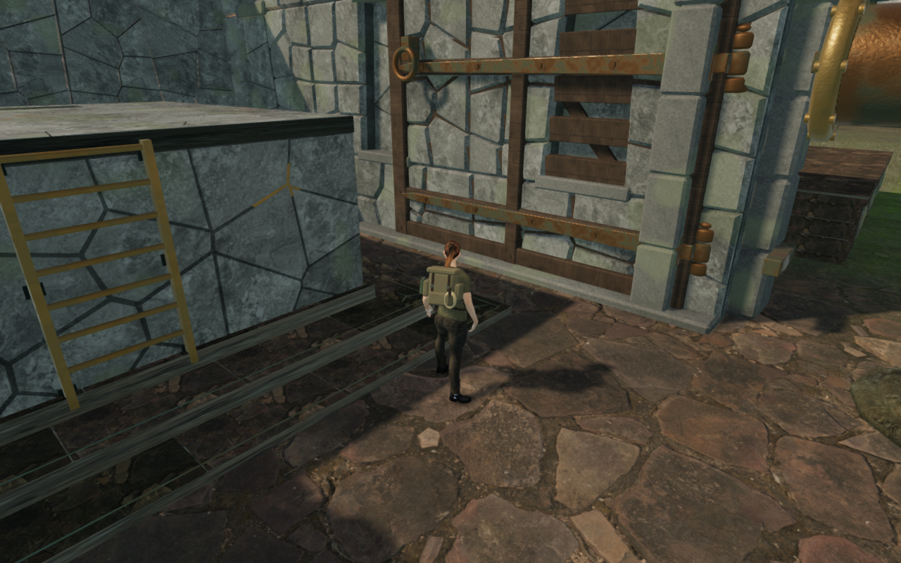
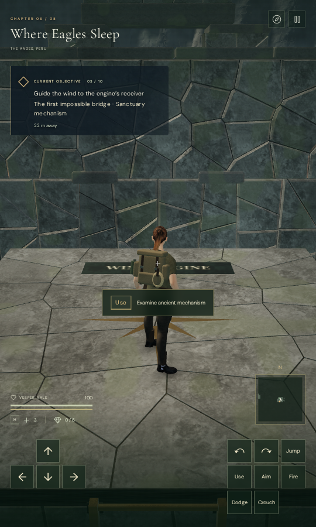

# Wind-engine record terraces and clear ledge mantles

The eight raised wind-engine record platforms used rounded 6 m boxes while
walking support covered their full square footprints. Across the actual eight
browser platforms, 384 of 1,352 roof probes differed from the standing surface
by more than 1.5 cm. The largest difference was 2.885 m at an empty corner.

The platforms now use cloud-city granite faces, fitted foundations and individual
flat paving stones over a continuous bed. Recessed joints differ from the
standing surface by at most 5 mm. A restrained eight-point bronze bearing motif
and a flush WIND ENGINE inscription describe the purpose of the overlook.
Stage-dependent tessellation and original cast-feather reliefs vary the surfaces.
The eight original positions, 6 m footprints and 2.8–3.4 m roof heights remain.

Each ladder now has bronze stiles, cylindrical rungs and six iron anchors seated
into the stone. Rung spacing is bounded to 36 cm. The finite ladder body prevents
walking into the rungs below the roof and contributes no standing surface.
Climbing clears it; saved positions on the roof retain their original support.
The terrace inscriptions share the existing engine-sign atlas.

A separate animation check found the explorer's boots inside the original stone
during the mantle. Two tall platforms contained embedded soles in 31 of 102
rendered frames, with penetration reaching 1.142 m. The common mantle now lifts
outside the ledge before crossing its edge. Character motion and the furnished
landing clearance check share that path. Hands target the actual first roof
boundary; the feet tuck outside the ledge before crossing. The 0.85 second
duration, accepted landing positions and normal controls remain.

Native touch verification exposed another issue at a close approach: a legal
standing position could be rejected because the climb check used an extra 5 cm
body margin. Climb clearance now uses each solid's actual movement margin.
Twenty-four close approaches across the eight terraces retain clearance through
the complete accepted climb.

Eight new regressions check 3,528 delivered roof rays, foundations, anchored
ladders, finite movement collision, camera collision after batching, 48 older roof
positions, eight obstructed ladder arrivals, shared inscription text cells,
continuous movement, hand-edge targets and those legal close approaches.
A delivered-character check follows 1,664 frames of 32 climbs from four
directions across cover, tower, bell and wind
platform sizes, with no embedded soles deeper than the 15 mm test tolerance.
The existing campaign suite covers the furnished course landings and coastal
lock climbing.

Observed construction checks use disposable progress to remove guardians and
open the field gates. Eight active record fixtures retain their real engine
interaction. Geometry rays and assisted character poses establish these scoped
clearance results. They do not establish full human route playthroughs, consumer
hardware performance, subjective sound quality, or AAA graphics.

The actual browser worlds repeat the 1,352 roof probes: every point now matches
standing support within 5.001 mm. Eight active record fixtures reach their correct
engine guides. The eight useful rooftop, eight engine-view and eight guide
captures are reviewed. Eight lower front observer views are obstructed by the
neighboring chamber walls and do not establish terrace elevation visibility.

Eight actual browser climbs follow 408 delivered-character frames, with no
embedded soles deeper than the 15 mm test tolerance. Their 40 pose captures are
reviewed. The focused traversal, furnished-landing, coastal-lock, cover and new
terrace regressions pass all 46 checks after the close-approach fix. All 778
campaign checks pass with the subsequent elbow camera repair. The final
production build passes in 26.89 seconds with the existing bundle-size advisory.

Review of the first production captures found two persistent obscured views,
including a camera looking through a wind duct. The elbow castings have bounds
under the ordinary 2 m camera-capture threshold and were omitted from collision.
They now register explicitly as small surfaces. The new regression traverses
every visible elbow with a camera ray; an isolated negative control fails when
the old size filter is restored.

Two ordinary saved-position replays verify the repair against actual rendered
geometry. Before the repair, the first visible duct lies 0.306 and 0.782 m from
the camera. After it, the first environmental surfaces are 8.685 and 6.489 m away,
beyond the explorer. Sampled body sightlines and opacity are clear at frames
0, 3, 12 and 40. The existing arrival policy selects the new clear views.

The final production rerun covers all eight terraces, with four keyboard/High
cases at 1280 × 800 and four touch/Low cases at 540 × 900. Native movement and
jump input reach each roof. Roof reloads retain support; native Use opens the
correct engine record. Unsolved activation is rejected, one legitimate duct
turn increments the move count, and reset clears it. Lateral departure, manual
camera turns, descent and a second reload preserve the complete stored progress
apart from timestamps, with health 100 and revealed maps retained. The delivered
bundles match the final build, with no development hook, failed resources,
browser errors, warnings or page overflow. All 56 captures are reviewed; some
menu captures record the normal opening transition.

A separate actual-geometry audit follows the six recorded ordinary views at
each terrace for 12 frames: 48 views and 576 frames have full explorer opacity
and clear camera-to-body sightlines against rendered opaque environmental
meshes, including instances. All 48 captures are reviewed. Six expected
arrival-camera adjustments are independently proved to select the exact saved
angles through the existing policy. Their previously obstructed camera arms
range from 0.852 to 4.161 m and become clear 5.372 m arms. This is scoped to the
recorded positions and sightline samples.

The second terrace during an assisted character-pose check: fitted granite,
attached ladder and the rising phase of the shared mantle.

The fifth terrace after native keyboard climbing in the production build.

The third terrace's ordinary saved arrival, 40 frames after restoring the view.
Explicit small-duct camera bounds clear the previously obscured camera.

The second terrace after native touch climbing in the Low production build.
These four captures are converted losslessly to WebP; decoded RGBA pixels and
dimensions are verified identical to the originals.

Wider [visual acceptance](visual-audit.md), repeated chamber composition, the
continuous eight-chapter playthrough, and listening/device review remain open.
